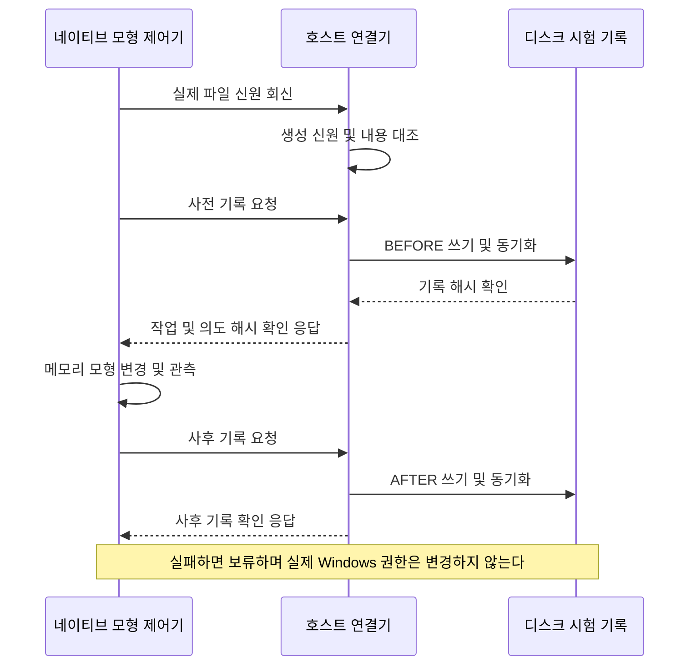

# 네이티브 모형 제어기와 디스크 기록 연결

새 시험 파일의 실제 Windows 신원을 확인하고, 기존 네이티브 제어기의 사전·사후 기록을 디스크 저널에 연결하는 개발용 CLI입니다. **파일 관측과 기록 저장은 실제, 권한 변경 효과는 모형**입니다. 웹 매매·실제 Codex·계좌·주문에는 연결하지 않습니다.

후속 [초기 권한 관측·시험 자식 종료 확인](ANALYSIS_READINESS_INSPECTION.md)은 별도 새 파일의 기본 권한을 실제로 읽고 조회 불가·프로필 소유 미증명을 보존합니다. 아래 모형 연결기의 동작을 바꾸거나 실제 OS 적용을 허용하지 않습니다.

## 📋 현재 범위

| 구성 | 현재 제공 | 제외·미검증 |
| --- | --- | --- |
| 새 시험 묶음 | 독점 생성한 16대상, 생성 당시 Node 파일 신원, 고정 더미 내용·목록 검사 | 기존 사용자 파일 인수·정리, 임의 실행 파일 실행 |
| 네이티브 관측 | 현재 실행자와 파일 소유자 일치, 64비트 파일 인덱스 대조, 볼륨/128비트 ID 결합, 핸들 유지 | 전체 초기 DACL/SACL 수집·효력 검사 |
| 제어기 연결 | 기존 `permission_mutation::run`과 실제 디스크 BEFORE/AFTER 확인 응답, 32건 모형 적용/역순 복원 | Win32 변경 포트 실행, 실제 권한 원복 |
| 종료·재확인 | 완료 기록·외부 해시 대조, 중단/남은 잠금/불확실 기록 보류 | 자동 재실행·잠금 해제, 독립 프로세스 종료 증명, 정전 복구 |

실제 Win32 포트를 선택하면 기존 제어기는 첫 관측 전에 `Locked`를 반환합니다. 새 실행기도 이 잠금을 확인합니다. 권한 상승, 프로필 생성/삭제, `SetSecurityInfo`, LPAC/Job, 실주문을 활성화하는 인자·환경변수는 없습니다. `profile` 폴더도 더미 디렉터리이며 Windows 프로필이 아닙니다.

## 🚀 빠른 시작

프로젝트 루트의 PowerShell에서 실행합니다. [기존 설치 환경](../README.md#실행-환경)과 [권한 검토 명세 생성](ANALYSIS_PERMISSION_PREPARATION.md#실행-환경과-빠른-시작)을 먼저 따라 `$provisionReview`를 준비하세요. Windows x64, Node **24.20.0**, MSVC **14.39.33519**, SDK **10.0.22621.0**의 고정 설치 도구를 사용합니다. 새 패키지·유료 서비스·API 키는 필요 없습니다.

**검토 명세와 시험 실행의 Windows 사용자가 같아야 합니다.** Codex 제한 실행 계정에서 만든 명세를 일반 사용자 실행에 재사용하면 소유자 해시가 달라 거절됩니다. 제한 환경에서 상위 폴더 조회가 거부되어도 검사를 생략하거나 관리자 권한으로 우회하지 마세요. 같은 실행 환경에서 기존 `prepare`로 새 읽기 전용 검토 묶음을 만들고, 필요한 접근 범위만 확인합니다. 기존 명세는 수정하지 않습니다.

```powershell
npm run build:engine
if ($LASTEXITCODE -ne 0) { throw '엔진 빌드 실패' }

$bridgeBuild = node scripts/build-analysis-permission-bridge.mjs | ConvertFrom-Json
if ($LASTEXITCODE -ne 0) { throw '연결기 빌드 실패' }

$bridgeSample = node dist/runtime/src/server/analysis-permission-bridge-cli.js sample $provisionReview.runId $provisionReview.manifestSha256 $bridgeBuild.buildId $bridgeBuild.buildSha256 | ConvertFrom-Json
if ($LASTEXITCODE -ne 0) { throw '연결 시험 보류' }

node dist/runtime/src/server/analysis-permission-bridge-cli.js check $bridgeSample.labId $bridgeSample.createdSha256 $bridgeSample.head
if ($LASTEXITCODE -ne 0) { throw '기록 재확인 보류' }
```

정상은 종료 0, `NATIVE_MODEL_JOURNAL_VERIFIED`, `records=64`입니다. `executionAllowed`, `osChangesApplied`, `osRecoveryVerified`는 **모두 false**입니다. 오류/보류는 종료 2이며 잘못된 입력은 `BRIDGE_HOLD`, 읽을 수 있지만 미완료인 묶음은 `RECOVERY_HOLD`입니다. 실패한 시험을 삭제·수정해 성공으로 바꾸지 않습니다.

`labId`, `createdSha256`, 최신 `head`를 기록 파일과 별도로 보관하세요. PowerShell 변수는 창을 닫으면 사라집니다. `check`는 읽기 전용이며, 성공해도 재실행하지 않습니다. `sample`을 다시 호출하면 새 시험 묶음을 만듭니다. 기존 묶음의 resume/apply/restore/approve 명령은 없습니다.

## 🔐 연결 순서와 보류 조건



1. 호스트는 새 `lab-UUID` 아래에만 시험 파일을 만들고 생성 파일 ID·빌드·검토 명세·호스트 코드 해시를 저장합니다. `bin/analysis-file-probe.exe`도 고정 짧은 **텍스트**이고 실행하지 않습니다.
2. 네이티브는 상위 경로·대상 핸들을 열어 reparse/경로 이탈/다중 링크/소유자/파일 종류·내용을 검사합니다. 파일 핸들은 쓰기·삭제 공유를 허용하지 않습니다. Node 생성 신원과 네이티브 신원이 일치해야 다음 단계로 갑니다.
3. 네이티브의 UTF-16 경로 기반 의도 해시를 호스트가 독립 계산합니다. 저널의 JSON 레코드 해시는 별개이며 두 해시를 혼동하지 않습니다. 동기 쓰기·`fsyncSync`·재확인이 성공한 뒤에만 ACK를 보냅니다.
4. 16대상을 순서대로 모형 적용한 뒤 같은 파일 ID로 역순 복원합니다. 사후 기록까지 확인하면 64행과 최종 head를 묶습니다. 중간 오류, EOF, 중복/예상 밖 응답, 5초 네이티브 입력 기한 또는 45초 호스트 전체 기한 초과는 보류합니다.

소유자 조회는 `READ_CONTROL`을 사용하며 SACL 조회·권한 변경 권리를 요청하지 않습니다. 파일 식별에는 볼륨 일련번호와 파일 ID를 함께 사용합니다. [Microsoft GetSecurityInfo](https://learn.microsoft.com/en-us/windows/win32/api/aclapi/nf-aclapi-getsecurityinfo), [FILE_ID_INFO](https://learn.microsoft.com/en-us/windows/win32/api/winbase/ns-winbase-file_id_info).

기존 명세의 `proposedRunRoot`는 **여전히 생성하지 않는 예정 OS 경로**입니다. 새 실파일은 별도 bridge-lab 아래에 있습니다. 모형 의도의 예정 경로와 관측한 시험 경로를 같다고 표시하거나 이 시험을 실제 ACL 적용 승인으로 사용할 수 없습니다.

## 💾 저장 자료와 재확인

- `work/analysis-permission-bridge-lab/lab-<UUID>/`: 더미 `fixture/`, 생성 증거 `created.json`, 1회 시작 `started.json`, 신원 `identity.json`, 성공할 때만 `result.json`.
- `work/analysis-recovery-lab/lab-<UUID>/`: 기존 계약의 binding·BEFORE/AFTER 저널. 실제 로그 위치는 `created.json`의 `journalId`로 결합합니다.
- `work/analysis-permission-bridge-build/` 및 `analysis-permission-bridge-build-temp/`: 설치 도구로 만든 별도 실행 파일과 빌드 근거. 기존 네이티브 빌드를 덮어쓰지 않습니다.

`check`는 코드/빌드·시험 신원/내용·정확한 목록·시작 작업 ID·신원 영수증·32건 기록의 연결·외부 head를 확인합니다. 현재 파일의 소유자를 네이티브로 다시 조회하는 독립 OS 복구 도구는 아닙니다. 중단 후 남은 잠금은 자동 삭제하지 않습니다. 정상 종료 시 기존 writer가 자신이 만든 일시 잠금만 제거합니다.

자료에는 로컬 경로·파일 ID 해시와 Windows SID가 포함된 기존 검토 명세 연결이 있습니다. 그대로 외부 공유하지 마세요. 해시는 서명이나 신뢰할 수 없는 동일 사용자에 대한 보안 경계가 아닙니다.

## 🧪 검사와 한계

```powershell
node scripts/test-analysis-permission-bridge.mjs $provisionReview.runId $provisionReview.manifestSha256 $bridgeBuild.buildId $bridgeBuild.buildSha256
node --test --test-concurrency=1 dist/runtime/tests/analysis-permission-journal.test.js
```

새 통합 시험은 새로 만든 시험 파일을 일부 교체/변조하고 직접 생성한 시험 부모 프로세스만 종료합니다. 정상 묶음·실패 증거는 보존하며 사용자 서버/장부는 사용하지 않습니다. 빌드 거절 시험의 추가 파일 1개만 검사 뒤 제거합니다. 테스트를 실사용 데이터에 연결하지 마세요.

2026-09-16 이 PC의 실제 통합 검사 **50개 통과**: 32건 정상 모형 연결, 외부 해시/영수증/작업 대조, 핸들 유지 중 쓰기·이름 변경 거절, 교체·hardlink·내용/목록 변조, 기록 쓰기/동기화 오류 주입, 중복/EOF/시간 초과, 4지점 부모 강제 종료 후 보류, CLI와 빌드 거절을 확인했습니다. `fsync` 오류는 시험 중 API 예외를 주입한 것이며 실제 디스크 고장·정전 시험이 아닙니다.

남은 사항:

- 실제 초기 DACL/SACL 관측과 권한 부족 처리, 프로필 저장소/소유/잔류 정리, 실제 ACL 적용·독립 재관측·원복 수용.
- LPAC/Job·네트워크/자식 차단, 부모 강제 종료 후 자식/핸들의 독립 종료 증명. 이번 시험은 부모 종료 후 기록 보류를 검증합니다.
- 악성 동일 사용자 경합·실행 중 코드/바이너리 교체, 디스크/파일 시스템 장애·정전, 도구 종속 DLL·SDK 전체 무결성, 다른 PC/OS.
- 실제 Codex·모델 분석 품질, 실자료 성과·수익성, 실거래 준비도, 전체 웹 UI/E2E.

웹 거래 루프와 분리된 최대 32건의 실험이므로 동기 기록과 반복 신원 검사를 유지합니다. 응답 속도를 이유로 사전 동기화를 생략하지 않으며, 실운용 지연·처리량은 측정하지 않았습니다.

구현: [계약](../src/core/analysis-permission-bridge.ts), [새 파일·재확인](../src/server/analysis-permission-bridge-files.ts), [연결기](../src/server/analysis-permission-bridge-runner.ts), [네이티브](../src/native/analysis-permission-bridge.cpp), [CLI](../src/server/analysis-permission-bridge-cli.ts). 이전 도구는 [영속 기록 안내](ANALYSIS_PERMISSION_JOURNAL.md)를 참고하세요.
