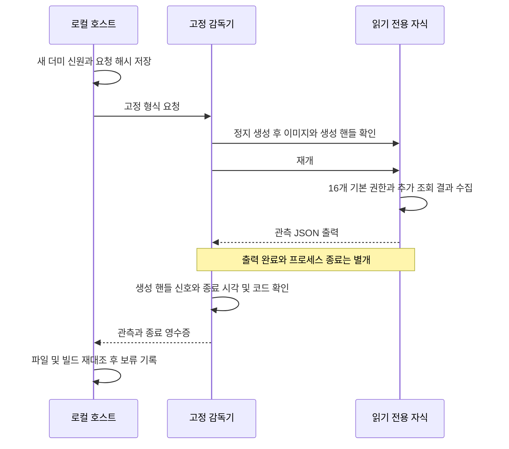

# 초기 파일 권한 관측과 시험 자식 종료 확인

새 더미 파일 16개의 **현재 보안 설명자를 읽고**, 직접 생성한 고정 검사 자식의 종료를 Windows 핸들로 확인하는 개발용 CLI입니다. [이전 모형–디스크 연결](ANALYSIS_PERMISSION_BRIDGE.md)과 별도이며, 실제 ACL 적용·프로필 생성·Codex 연결·매매를 활성화하지 않습니다. 기본 웹 앱의 필수 구성요소도 아닙니다.

## 📋 제공 범위와 현재 결과

| 확인 항목 | 현재 제공 | 2026-09-16 이 PC의 관측·한계 |
| --- | --- | --- |
| 기본 보안 설명자 | 고정 16대상의 소유자·그룹·DACL·무결성 레이블 요청 결과, 원시 바이트·해시·제어 플래그 기록 | 16/16 수집. 실제 유효 접근 권한·격리 성공 판정은 아님 |
| 추가 SACL | 감사 권한 조회 성공 여부와 Win32 오류를 별도 기록 | 0/16 수집, 모두 `1314`(필요 특권 없음). 완전한 초기 상태·원복 근거로 사용할 수 없음 |
| 프로필 폴더 | 예정 SID의 폴더 API 결과·반환 경로 해시·파일 속성만 관측 | API `0x80070002`, 폴더 상태 `UNKNOWN`. 등록 전체 부재를 뜻하지 않음 |
| 프로필 소유 | 등록 `NOT_VERIFIED`, 소유 `NOT_PROVEN`, 생성 영수증 null 고정 | 저장소·레지스트리 등록·이 실행의 소유 증명은 미검증 |
| 시험 자식 종료 | 생성 핸들, PID, 생성/종료 시각, 고정 실행 이미지, 대기 신호와 종료 코드 확인 | 정상 0·오류 7·조기 종료 주장 후 시간 초과 124 검사. 일반 사용자 프로세스나 전체 자식 트리 증명은 아님 |

정상 수집도 `READ_ONLY_RECORDED_HOLD`입니다. `executionAllowed`, `osChangesApplied`, `osIsolationVerified`는 항상 false입니다. 여기서 `osChangesApplied=false`는 ACL·프로필·격리 설정을 적용하지 않았다는 뜻입니다. 새 로컬 파일 생성과 자기검사 자식 생성/종료까지 없었다는 뜻은 아닙니다.

## 🚀 실행 방법

프로젝트 루트의 PowerShell에서 실행합니다. [README 설치 조건](../README.md#실행-환경), [기존 권한 검토 명세 생성](ANALYSIS_PERMISSION_PREPARATION.md#실행-환경과-빠른-시작)을 먼저 따라 `$provisionReview`를 준비하세요. 검증 환경은 Windows x64, Node 24.20.0, MSVC 14.39.33519, SDK 10.0.22621.0입니다. 검사기와 검토 명세의 Windows 사용자가 같아야 합니다. 별도 관리자 실행·특권 활성화·키·로그인은 필요하지 않습니다.

```powershell
npm run build:engine
if ($LASTEXITCODE -ne 0) { throw '엔진 빌드 실패' }

$bridgeBuild = node scripts/build-analysis-permission-bridge.mjs | ConvertFrom-Json
if ($LASTEXITCODE -ne 0) { throw '더미 자료용 빌드 실패' }

$readinessBuild = node scripts/build-analysis-readiness-inspect.mjs | ConvertFrom-Json
if ($LASTEXITCODE -ne 0) { throw '읽기 전용 검사기 빌드 실패' }

$readinessSample = node dist/runtime/src/server/analysis-readiness-cli.js sample $provisionReview.runId $provisionReview.manifestSha256 $bridgeBuild.buildId $bridgeBuild.buildSha256 $readinessBuild.buildId $readinessBuild.buildSha256 | ConvertFrom-Json
if ($LASTEXITCODE -ne 2 -or $readinessSample.status -ne 'READ_ONLY_RECORDED_HOLD') { throw '관측 기록을 완성하지 못함' }

$readinessCheck = node dist/runtime/src/server/analysis-readiness-cli.js check $readinessSample.reportId $readinessSample.bindingSha256 $readinessSample.observationSha256 | ConvertFrom-Json
if ($LASTEXITCODE -ne 2 -or $readinessCheck.status -ne 'READ_ONLY_RECORDED_HOLD') { throw '관측 기록 대조 실패' }
```

**종료 코드 2만으로 성공/실패를 판단하지 마세요.** 완성된 읽기 전용 관측은 stdout에 `READ_ONLY_RECORDED_HOLD`, 불완전·오류는 stderr에 `READINESS_OBSERVATION_HOLD`를 반환하며 둘 다 종료 2입니다. 의도적으로 승인/실행 성공 코드 0을 제공하지 않습니다. 빌드·시험 스크립트의 정상 종료는 0입니다.

`reportId`, `bindingSha256`, `observationSha256`는 보고서와 별도로 보관하세요. `check`는 저장한 과거 관측의 결합·파일/코드 일관성을 검사합니다. 현재 ACL·프로필·프로세스를 다시 조회하는 명령이 아니며 실제 적용 직전 재관측을 대신하지 않습니다. 새 `sample`은 매번 새 더미 묶음과 보고서를 만듭니다. 기존 보고서 재실행·승인·원복·삭제 명령은 없습니다.

조회 권한이 부족하면 그 결과를 유지합니다. 관리자 권한으로 자동 재실행하거나 `AdjustTokenPrivileges`로 권한을 켜지 않습니다. 전체 SACL 조회에는 `ACCESS_SYSTEM_SECURITY`와 필요한 활성 특권이 요구됩니다. [Microsoft GetSecurityInfo](https://learn.microsoft.com/en-us/windows/win32/api/aclapi/nf-aclapi-getsecurityinfo), [SACL 접근 권리](https://learn.microsoft.com/en-us/windows/win32/secauthz/sacl-access-right).

## 🔐 수집과 종료 확인



- 요청은 새 시험 UUID·검토 run·소유자 해시·루트 파일 ID·nonce에 결합합니다. 임의 경로·PID·실행 파일·권한 변경 명령은 받지 않습니다.
- 파일 핸들·경로·reparse·종류·링크 수·고정 내용을 검사합니다. 소유 SID를 현재 실행자와 대조하고, 기본 설명자를 같은 핸들에서 다시 읽어 중간 차이를 거절합니다. 이는 원자적 보안 스냅샷이나 악성 동일 사용자에 대한 완전한 방어가 아닙니다.
- 감독기는 자기 실행 파일만 정지 생성하고 이미지 경로와 생성 핸들을 확인한 뒤 재개합니다. 명시한 입출력 핸들 두 개만 상속 목록에 넣습니다. 출력은 262,144바이트, 조회 자식은 10초, 호스트 대기는 20초로 제한합니다.
- `WaitForSingleObject`가 신호 상태인 뒤 남은 출력을 다시 비우고 생성/종료 시각·종료 코드를 확인합니다. 시간 초과 시 종료 대상은 **직접 생성한 자식의 핸들**뿐입니다. 프로세스 이름/PID로 다른 프로그램을 찾아 종료하지 않습니다. [Microsoft 대기 API](https://learn.microsoft.com/en-us/windows/win32/api/synchapi/nf-synchapi-waitforsingleobject).
- 폴더 API가 경로를 돌려주고 그 경로가 없어도 `PATH_ABSENT`는 그 경로 관측일 뿐입니다. 프로필 등록·생성 소유·삭제 권한을 증명하지 않습니다. 현재 레지스트리 조회·프로필 정리는 하지 않습니다. [Microsoft 프로필 폴더 API](https://learn.microsoft.com/en-us/windows/win32/api/userenv/nf-userenv-getappcontainerfolderpath).

## 💾 저장 자료와 보안 한계

- `work/analysis-readiness-inspect-build/`와 `analysis-readiness-inspect-build-temp/`: 별도 빌드·도구/소스/실행 파일 해시·import 근거.
- `work/analysis-readiness-lab/report-<UUID>/`: 최초 `binding.json`, 완성 시 `observation.json`·`result.json`. 실행 오류는 가능한 경우 `failure.json`을 남기며, 부분 묶음은 `check`가 거절합니다.
- `work/analysis-permission-bridge-lab/lab-<UUID>/`: 이번 관측용 새 16대상·생성 증거. 기존 생성 도구가 만든 연결 저널은 비어 있어야 하며 모형 변경도 실행하지 않습니다.

기본/추가 보안 설명자의 hex는 암호화가 아니며 **Windows 사용자·그룹 SID를 복원할 수 있는 로컬 환경 정보**입니다. 원시 보고서를 외부 AI나 공개 저장소에 그대로 올리지 마세요. 터미널에는 요약만 출력합니다. 해시도 서명·독립 인증·동일 사용자 공격 방어를 뜻하지 않습니다.

빌드 검사에서 알려진 권한/프로필 변경 API import를 거절하지만, 정적 import 확인은 런타임 샌드박스가 아닙니다. 기존 Win32 변경 어댑터의 실행 잠금, 원본 정책, 계좌·AI·주문 상태를 변경하지 않습니다.

## 🧪 재현 검사와 미검증

```powershell
node scripts/test-analysis-readiness-inspect.mjs $provisionReview.runId $provisionReview.manifestSha256 $bridgeBuild.buildId $bridgeBuild.buildSha256 $readinessBuild.buildId $readinessBuild.buildSha256
```

새 통합 검사 **54개 통과**: 실제 16개 관측·해시 재확인, 정상/오류/조기 종료 주장·시간 초과, 반복 관측, 요청/파일 ID/설명자 구조·소유자/프로필 상태 변조, 잘못된 명령·CLI 인자, 부분 보고서·보고서 변조 거절을 확인했습니다. 시험은 새 더미 일부를 변경하고 직접 만든 시간 초과 자식만 종료하며 증거를 보존합니다. 보고서 변조 시험은 자신이 만든 보고서 바이트만 복원합니다.

미검증·후속 조건:

- 완전한 SACL 수집, 실제 유효 접근 권한, 초기 제한 템플릿 수용·원복 가능성.
- 프로필 저장소/등록/생성 소유 증명, 충돌·잔류 정리와 삭제 수용.
- 실제 ACL·LPAC·Job·네트워크/자식 차단, 감독기 자체 강제 종료 시 전체 자식/핸들 정리. 이번 핸들 영수증을 그 증거로 대체하지 않습니다.
- 정전·파일 시스템 장애·악성 동일 사용자 경합, 다른 PC/OS, 전체 웹 E2E, 실제 Codex 분석·투자 성과·실거래 준비도.

추가 권한을 켜거나 실제 OS 변경을 시험하려면 별도 범위·복구 조건·승인이 필요합니다. 현재 보류를 없애기 위해 기준을 완화하지 않습니다.

구현: [계약/결과 검사](../src/core/analysis-readiness-inspect.ts), [수집/재확인](../src/server/analysis-readiness-files.ts), [CLI](../src/server/analysis-readiness-cli.ts), [네이티브 진입점](../src/native/analysis-readiness-inspect.cpp), [관측](../src/native/readiness-inspection.hpp), [생성 핸들 감독](../src/native/readiness-process.hpp).

16개로 제한한 개발 점검이므로 동기 검증을 유지하고 웹 거래 루프에 붙이지 않습니다. 성능 수치·실운용 처리량은 측정하지 않았습니다.
