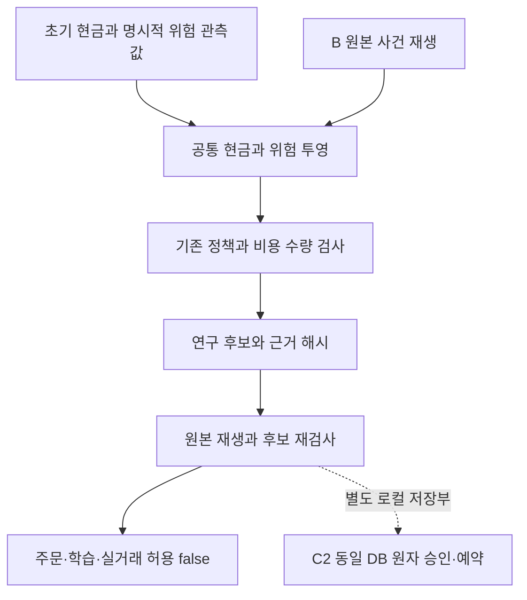

# 다종목 비용 위험과 연구 후보 재검사 — C1

2026-09-24 · DEV-D03 내부 C1. **합성 자료의 읽기 전용 연구 계산이며 주문 승인 기능이 아니다.** B의 원본 사건을 다시 계산해 공통 현금·위험을 합산한다. `orderSubmissionAllowed`, `learningAllowed`, `liveEnabled`는 항상 `false`다. 웹 앱·실제 계좌·시세·유료 AI 연결은 없다.

## 구현 범위와 다음 경계

| 구분 | 현재 동작 |
| --- | --- |
| C1 | 통화별 초기 자본을 한 번만 반영하고, 종목별 실제 비용·미수/미지급·예약·보유 위험을 합산한다. 기존 정책의 수량·경제성 검사를 재사용하고 후보 근거 변경을 재검사한다. |
| C2 — 로컬 저장부 구현 | [미전송 승인·예약](COST_RESERVATION_STORE.md)을 동일 Repository의 버전·epoch·lease와 단일 COMMIT으로 확정한다. 공용 접수·체결 인계는 미구현이다. |
| D — 미구현 | 공통 비용 근거의 보고·학습 연결 및 전체 통합 인수. 미결정 운영비는 승인 없이 자동 확정하지 않는다. |

B는 DB당 단일 종목 실행이다. C1이 여러 원본 사건을 읽는다고 여러 DB의 COMMIT이 하나로 합쳐지지는 않는다. C1 후보 두 개를 동시에 계산해도 그중 하나의 현금이 예약되지 않는다. **C1의 `RESEARCH_MATCH`를 주문 권한으로 사용하면 안 된다.**



## 입력 계약

구현은 [위험 투영](../src/core/cost-risk-context.ts), [연구 후보와 재검사](../src/core/cost-admission.ts), [기존 수량 검사](../src/core/cost-aware-sizing.ts), [공유 비용 커널](../src/core/cost-kernel.ts)에 있다.

`buildCostExposure(seed, book)`의 `seed`는 신뢰하는 내부 `State` 형식의 **명시적 합성 위험 관측값**이다. 외부 JSON 전체를 검증하는 계좌 API가 아니다. 다음을 구분한다.

- 지갑에는 실행 시작의 KRW/USD 현금만 둔다. 보유/주문·미수/미지급·운영비/예약이 이미 든 seed는 거절한다. 초기 KRW + 초기 USD × `openingFx`가 설정 자본과 정확히 같아야 한다.
- `clock`, 현재 환율/시각, 손실 기간 시작값·입출금·고점·위험 축소/중지·쿨다운·진입 횟수는 해당 관측시점의 명시적 시험 근거다. 원본 사건만으로 과거 고점·모든 손실 사건을 추론해 채우지 않는다.
- `config.forecast`는 `TEST_ONLY`여야 한다. 시작과 관측시점의 위험 일/주/월 키가 다르면 보류한다. 현재 평가액의 중지·축소 계산은 기존 `mark()`를 재사용하지만 연속 과거 위험 이력을 재구축하지는 않는다.

`book`은 엄격한 `SYNTHETIC_COST_RISK_BOOK_V1` 계약이다. 원본 정책 해시·seed 전체 해시·시작 시각·초기 환율 및 `EXPLICIT_SYNTHETIC_SNAPSHOT_NOT_CONTINUOUS_HISTORY` 표시가 필요하다.

각 `sources` 항목은 [B 계약](COST_JOURNAL.md)의 원본 설정·사건과 현재 bid/stop·관측시각·보호 상태/수량이다. 같은 공급자·계좌·체결 ID 범위여야 하며 종목과 실행 ID는 중복할 수 없다. 원본 B의 초기 현금은 해당 통화 seed 현금과 같아야 한다. 계좌/환율/호가 신선도는 원본 정책을 그대로 적용한다. 정밀도 위반·미래 사건·만료 근거·잘못된 보호 수량을 보정하지 않고 보류한다.

한 book은 최대 10개 원본, 각 최대 500사건을 받는다. 이는 입력 제한이며 최대 부하 검증 결과가 아니다. book이 **실제 계좌의 모든 종목을 빠짐없이 담았는지** 인증하는 장치는 없다. 종목별 한 매수 체인이라는 B 범위를 유지하며 동일 종목 추가 진입은 지원하지 않는다. `WATCHING` 등 보호 상태는 호출자가 합성 관측값으로 명시하며 제품이 자동 정상화하지 않는다.

## 현금·위험의 계산 의미

통화별 계산은 다음과 같다. USD를 부족한 KRW로 자동 환전하거나 그 반대로 대체하지 않는다.

```text
공통 cash = 초기 현금 + Σ(각 B cash − 해당 B 초기 현금)
주문 가능 현금 = 공통 cash − payable − unpaidFees − 모든 잔여 현금 예약
미결제 receivable은 주문 가능 현금에 더하지 않음
```

각 원장이 개별적으로 살 수 있는 주문이어도 합산 현금이 음수면 `SHARED_CASH_OVERRESERVED`로 보류한다. 음수를 0으로 잘라 오류를 숨기지 않는다. 실제 지급한 매수 비용은 이미 현금/평가액에 들어 있으므로 보유 위험에서 다시 차감하지 않는다.

| 대상 | 비용 포함 위험 |
| --- | --- |
| 보유 수량 | `max(0, bid − stop) × 수량` + 미래 매도비용 상계 + 기존 불리한 청산가 여유. 이후 통화별 FX 적용 |
| 미종료 BUY 잔량 | `(limit − stop) × 잔량` + 아직 청구되지 않은 잔여 매수비용 예약 + 미래 매도비용 상계 + 기존 불리한 청산가 여유. 이후 FX 적용 |
| 신규 후보 | 공통 잔여 위험·현금·노출 한도 안에서 정수 수량을 탐색. 경제성 문턱에는 기존 가격 위험 R0를 그대로 사용 |

미래 매도비용 상계에는 원본 정책의 최대 2회 대체, 즉 최대 3개 주문에 다시 붙을 수 있는 ORDER 최소요금을 포함한다. FILL 비용은 정수 체결 분할의 반올림/최소요금을 보수적으로 합산한다. 구체적인 상계는 `estimateFeeBound()`를 따른다. 이는 명시 가격 이하·정수 수량·지원 과금 계약의 상계이지 실제 비용·가격 갭·손절 체결 보장이 아니다. 예상 수익/분위수의 단일 주문 비용 시나리오와 보수적 위험 상계는 별도 필드다.

예약한 미래 수수료를 이미 지급한 것처럼 외화 순자산에서 빼서 외화 상한 통과에 사용하지 않는다. 위험 예산에는 보수적 비용을 반영하되 자산 감소를 미리 인정하지 않는 방식이다. SELL 부족분 예약은 B 값을 보존하며 미지급액과 함께 가용 현금에서 차감한다.

`UNKNOWN`/`CANCEL_UNKNOWN`은 노출·예약을 유지한 채 신규 후보를 보류한다. SELL 이력이 있고 수량이 남았으면 `EXIT_CHAIN_REQUIRES_RECONCILIATION`으로 보류한다. 보호 상태가 `WATCHING`이라고 입력되었어도 이를 우회하지 못한다. 전량 미보호·보호 수량 부족도 기존 정책 검사 대상이다.

## 후보 근거와 재검사

`issueCostAdmissionReview()`는 원본 book과 seed·새 비용 프로필·요청을 묶고 `RESEARCH_CANDIDATE` 또는 `HOLD`를 반환한다. 요청의 state 해시는 **파생 투영 상태**와 맞아야 하며 잘못된 해시를 제품이 자동 교체하지 않는다.

`recheckCostAdmission()`은 같은 입력을 다시 재생한다. 비용 ID·반올림·과금 단위·사건·호가/환율 시각·epoch·상태 등이 달라지면 `REAPPROVAL_REQUIRED`다. 발급받은 원본 객체를 수정하거나 JSON으로 복제한 경우도 재발급이 필요하다. 전체 book 및 실행/비용 상계 모델의 근거 해시를 포함한다.

프로세스 내부 `WeakMap`은 계산기가 만든 미변경 문맥/영수증을 구별하기 위한 장치다. 영구 승인·암호학적 인증·브로커 진실성·관리자 변조 방지·C2의 TOCTOU 방지 수단은 아니다.

파생 `context.state`는 기존 계산 함수 재사용을 위한 **연구용 State 모양의 투영**이다. 일부 target/deadline/ID 등은 계산용 자리값이며 실행 가능한 구형 State 불변식/승인 스냅샷을 인증하지 않는다. 이를 Repository·`approveEvaluation()`·실행 엔진에 넣지 않는다. 이 모듈은 그런 경로를 호출하지 않는다.

## 로컬 개발 검사와 예제

프로젝트 루트에서 기존 의존성 설치 상태의 Node 24.20.0/npm 11.19.0으로 실행했다. 새 설치나 다른 환경 검증은 아니다.

```powershell
npm run build:engine
node --test dist/runtime/tests/cost-admission.test.js
```

다음 JavaScript는 빌드된 시험 fixture를 쓰는 개발 예제다. 사용자 계좌 자료가 아니며 DB를 열지 않는다. 루트에서 `node --input-type=module --eval`로 실행할 수 있다.

```javascript
import { fixture, source, observe, request } from './dist/runtime/tests/cost-admission-helpers.js';
import { issueCostAdmissionReview, recheckCostAdmission } from './dist/runtime/src/core/cost-admission.js';

const f = fixture();
f.book.sources = [source(f.seed)];
observe(f.seed, f.book);
const r = request(f);
const review = issueCostAdmissionReview(f.seed, f.book, f.p, r);
const checked = recheckCostAdmission(review, f.seed, f.book, f.p, r);
console.log(review.status, checked.status, review.orderSubmissionAllowed);
// RESEARCH_CANDIDATE RESEARCH_MATCH false
```

전용 시험은 [cost-admission.test.ts](../tests/cost-admission.test.ts)에 있다. KR/US 부분 체결, 공통 자본 중복·과예약, 결제 전 매도대금, 미확정/매도 진행 상태, 보호 수량, FX/근거 변경, 분할/대체 최소요금, 원본 R0 문턱을 확인한다. 실제 실행 결과·중간 실패/수정·독립 읽기 검토·문서 표시와 보존 검사는 [PROGRESS · 공개 요약](PROJECT_STATUS.md)에 기록한다. 전용 검사가 실전 수익성이나 전체 정책 인수를 뜻하지 않는다.

## 남은 검증과 다음 한 작업

C2의 같은 DB 버전 내 미전송 승인/예약은 [로컬 저장부](COST_RESERVATION_STORE.md)에서 구현했다. 공용 접수·체결 인계, 연속 과거 위험 이력/기간 전환, 보고·학습 및 미결정 운영비 계약은 남아 있다. 실제 API·시세·브로커 요율/결제·실주문·장기 부하·OS 격리·전원 장애·앱 UI는 C1 검증 범위가 아니다.

다음은 **C2의 합성 접수·체결 인계**다. 기존 B 멱등성/COMMIT 경계와 구형 데이터 보존을 유지하면서 미전송 예약을 접수/체결 장부에 한 번만 인계하는 계약이 필요하다. 아직 API 키는 필요 없다. D03 2/4, 개발 가이드 10/40, 누적 등록 작업 158/167은 그대로 두며 내부 부분 인수가 남은 통합 항목의 완료를 대신하지 않는다.
