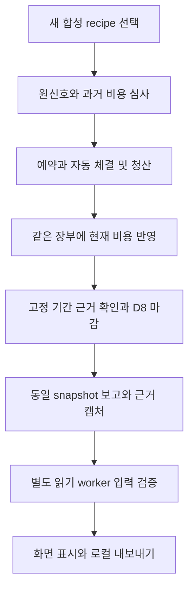

# 비용·마감·학습 입력의 앱 연결 설계 — S11-A

_2026-10-01 · 로컬 합성 단일 KRW 실행 · 후속 구현과 앱 인수의 범위 확정_

후속 구현/실행 기록: [S11-B 앱 연결](COST_APP_INTEGRATION.md), [최신 PROGRESS · 공개 요약](PROJECT_STATUS.md). 아래 ‘미구현/다음’과 S11-A 실패 기록은 설계 당시 상태로 보존한다. 새 구현을 기존 설계의 당시 통과 결과로 소급 합산하지 않는다.

---

## 🎯 결정과 완료 경계

기존 **비용 코어 시험** 화면의 서비스·인증·요청 보존을 재사용하고, 새 고정 합성 recipe를 명시 선택하는 경로를 추가한다. 새 경로에서 신호 → 과거 운영비 추정 → 예약/접수 → 자동 체결·청산 → 현재 운영비 → D8 → 보고 → S10-B 입력 검증을 한 실행으로 연결한다. 기존 V3 recipe와 DB는 그대로 연다.

이 문서는 연결 설계다. 아래 recipe 이름·새 UI·HTTP 확장·CA-01~12는 **후속 구현 계약**이며 현재 제공 기능/통과 결과가 아니다. S11-A에서 제품 코드를 수정하지 않았다. 실제 검사·진행률은 [PROGRESS · 공개 요약](PROJECT_STATUS.md)를 따른다.

다음 한 작업은 **DEV-D03-S11-B: 명시 V4 합성 경로의 앱 연결 및 인수**다. 아래 4개 구현 단위와 CA-01~12를 완료 조건으로 삼는다. 단, 이번 기존 경계 검사에서 CW-03 실패가 발생했으므로 S11-B의 첫 작업은 그 원인 확인과 필요한 최소 보완이다. 이 검증 공백을 남긴 채 새 연결을 완료 처리하지 않는다. 별도 장부·새 투자 전략·AI 학습을 선행 작업으로 추가하지 않는다. S11-B가 통과해도 원래 D03-04의 통화/기간/정정 계약까지 완료되는 것은 아니다.

## 🔍 현재 코드와 연결 공백

| 경계 | 확인한 현재 구현 | S11-B에서 연결할 부분 |
| --- | --- | --- |
| 화면/HTTP | [PortfolioApp](../src/web/PortfolioApp.tsx) → [CostLabPanel](../src/web/CostLabPanel.tsx) / [useCostLab](../src/web/useCostLab.ts) → [HTTP](../src/server/http.ts)의 `/api/cost-lab` | 기존 메뉴 안에 새 recipe 선택·V4 표시·검증/로컬 내보내기 경로 |
| 앱 수명 | [portfolio-web-main](../src/server/portfolio-web-main.ts) → [CostWebService](../src/server/cost-web-service.ts) → [worker](../src/server/cost-web-worker.ts) | 같은 실행 목록/상한/단일 금융 worker 아래 recipe별 실행 구현 선택 |
| 실행/보고 | [CostWebRun](../src/server/cost-web-run.ts)은 `program.config()`·V3 `buildCostOutcomeReport` 사용 | V3 클래스 동작 보존, 새 V4 실행 조립부에서 `operatingLoop`/V4 보고 사용 |
| 고정 자료 | [기존 웹 fixture](../src/server/cost-web-fixture.ts)는 V3·합성 120세션·B 신호 | 별도 버전의 KRW 월초 B recipe, 원자료/설정/선택/기간 사건 목록 보존 |
| 승인/접수 | [CostSignalProgram](../src/server/cost-signal-bridge.ts)의 `operatingLoop({finalization:true,historyAdmission:true})`와 [Store](../src/server/cost-reservation-store.ts) 존재 | `prepareEntry(store, history)` → `reserve` → 현재 history로 `prepareHandoff` → `handoff` |
| 체결/감시/마감 | [CostLoopRuntime](../src/server/cost-loop-runtime.ts)·Store의 `tick/pulse/operating/finalizeOperating` 존재 | 동일 Store와 고정 합성 사건 흐름 연결. 마감 전에 runtime 정지/재검증 |
| V4 보고/근거 | Store `operatingReport/exportOperatingEvidence`, [독립 재생](../src/core/cost-operating-evidence.ts) 존재 | 같은 snapshot의 보고·기준 해시·로컬 자료 캡처 |
| 학습 입력 | [S10-B 검증기](../src/server/cost-learning-input.ts)는 읽기 전용 동기 전체 재생 | 금융 worker 밖에서 고정 입력/anchor 검증, 상태·라벨·근거 표시. 모델 실행 없음 |

현재 V3 화면의 `finished`는 수량0·주문 종결·미결제0 검사다. V4의 기간 마감이나 학습 입력 적격을 뜻하지 않는다. V3의 `safeToLeave`는 HOLD도 검사하므로 V4 보고에 그대로 대입하거나, 적격 입력을 근거로 기존 HOLD를 삭제해서는 안 된다.

## ⚙️ 선택한 연결 구조

검토한 선택은 ① V3를 V4로 일괄 교체, ② 별도 웹 서버/실험실 복제, ③ 기존 비용 서비스의 명시 recipe 분기다. **③을 선택**한다. ①은 저장된 V3 기록의 의미가 바뀌고, ②는 인증·요청 보존·미해결 실행 차단을 이중 관리해야 한다. ③은 금융 버전별 실행/보고를 구별하면서 기존 앱의 수명 관리와 제한을 재사용한다.

아래는 후속 구현에서 연결할 한 경로다. 각 실패는 기존 거절/HOLD/FAULT 근거를 표시하며 자동으로 다음 단계로 넘어가지 않는다.



그림의 비용 단계는 설명상 묶음이다. 실제 사건 순서는 다음 절처럼 첫 부분 매수 뒤 의무를 인식하고, 신규 진입 HOLD 중 남은 체결·청산을 계속 처리한다.

### 버전·HTTP·저장

- 새 recipe의 제안 식별자는 `COST_WEB_OPERATING_KRW_V1`이다. 기존 `COST_WEB_SYNTHETIC_KRW_V1`과 구별하고 `create`에서 recipe를 생략하면 기존 의미를 유지한다. 새 선택은 명시적이어야 한다. 금융 V4 config/계약 이름은 변경하지 않는다.
- [요청/저장 스키마](../src/core/cost-web-schema.ts)를 최소 확장한다. `request.json`에 recipe를 최초 저장하고 같은 UUID의 다른 recipe 요청은 충돌로 거절한다. 현재 서비스의 `activeId===id` 빠른 반환보다 recipe 동일성 검사를 먼저 해야 한다. `open`은 클라이언트 recipe가 아닌 저장된 recipe를 사용한다.
- 새 recipe도 기존 `cost-runs/<UUID>` 실행 목록과 금융 작업기 제한을 공유한다. 기존 V3 미해결 실행이 있는데 새 recipe를 골라 자금/중지 검사를 우회할 수 없다.20실행·100제어·마지막 STOP 슬롯·8대기·32합성 호가 한도 및 미해결 실행 차단을 보존한다.
- 새 내부 실행 조립부/fixture/입력 검증 worker는 필요할 때 별도 파일로 나누되, 기존 원장/Repository/비용 산식을 복제하지 않는다. 제품 코드는 `tests/` helper를 import하지 않는다. 고정 recipe는 작성 시점의 원자료와 일정 내용을 버전으로 고정한다.
- 초기 원자료·설정·selection·history·합성 사건 일정의 본문/해시와 adapter config를 실행 생성 시 보존한다. 저장 후 생성 함수를 최신 버전으로 다시 돌려 원자료를 대체하지 않는다. 기존 V3 파일에는 필드를 소급 주입하지 않는다.
- 브라우저 POST는 recipe/실행 ID/명령 ID/expected revision 등 작은 요청만 보낸다. 임의 파일 경로·금액·호가·manifest·anchor를 사용자 입력으로 받지 않는다. 기존 인증/Origin/CSRF·8KB 본문·발송 전 전체 요청 보존을 유지한다. 새 응답은 명시적 recipe 분기로 V4 DTO를 구분하고 V3 응답 필드를 새 의미로 덮지 않는다.

### 시계·기간·동기 검증

새 recipe는 **고정 사건 시각의 합성 재생**이다. 기존 V3의 실제 경과시간 매핑은 보존한다. 새 실행은 합성 시계/사건 커서를 명시하고, 한 worker 처리 단위에 한 사건을 전달한 뒤 제어 요청에 실행 기회를 준다. 합성 호가 시각·runtime 처리 시각·pulse 순서를 일치시킨다. wall clock 경과만으로 자료 가용시각을 만들거나 실제 지연 성능을 측정했다고 표시하지 않는다.

모든 거래/결제 사건을 마친 뒤 runtime을 정지한다. 이후 선언된 위험일 끝까지 새 금융 사건이 없다는 **고정 recipe 작성자의 합성 완전성 근거**를 검사하고, 해당 종료 시각에서 D8을 호출한다. 전체기간 manifest는 서버가 현재 DB 행 수만 보고 자동 발급하지 않는다. 고정 사건 목록의 누락/상충·열린 수량/예약/UNKNOWN·비정상 중단이면 이 정상 마감 경로를 거절한다. 고정 일정 완료 확인과 현재 config/state/records 해시 결합을 모두 요구한다.

S10-B는 전체 replay를 읽는 동기 작업이다. HTTP 핸들러나 금융 worker의 tick/pulse/heartbeat 안에서 호출하지 않는다. 제한된 **읽기 전용 worker 1개**에 이미 캡처한 입력과 pin만 전달한다. writer/Repository·DB 경로·키는 전달하지 않는다. 금융 실행/lease와 검증 작업의 진행 상태를 별도로 표시하고 기존 금융 worker 5초 stale 기준/20초 제어 타임아웃을 검증 완료까지 늘려 숨기지 않는다. 검증 요청은 비동기 접수 후 상태 조회, 중복은 같은 작업/근거를 조회한다. 실패·취소·timeout은 금융 결과를 변경하지 않는다. 구체 timeout은 S11-B의 대표 입력 측정을 기록한 뒤 유한값으로 정하며 처리 속도를 보장하지 않는다.

## 📊 최소 정상 경로와 독립 기대값

새 단일 KRW 가상 자금5,000,000원,2026-09-01 월초의 `REPLAY-KR-B` 신호와 기존 위험 설정을 사용한다. 지원 기간은 KST09:00~다음 날09:00의 한 위험일이다. [S9-B 이력](COST_HISTORY_ADMISSION.md)·[S10-B 원자료](COST_LEARNING_INPUT.md)의 계약을 재사용한다. B만 첫 화면 정상 경로로 선택하며 P와 미국 상품의 기존 지원을 삭제하지 않는다.

1. 원래 replay/120세션과 현재 RVOL 비교315봉을 보존한다. 테스트의 축약 세션을 제품 자료로 바꿀 경우 이를 새 합성 자료로 명시해야 하며, 기존 full-session recipe를 조용히 축약하지 않는다.
2. 직전 완료20위험일의 합성 O=10원,N=3을 제공한다. 후보 추정은 `ceil(10/3)=4원`이며 과거10원이나 추정4원을 현재 현금에서 차감하지 않는다. 승인 수량4주는 고정 주문이 아니라 코어 계산 결과를 확인하는 독립 기대값이다.
3. 동일 history binding 아래 승인·예약·접수한다. 현재 recipe는 주문당1bp·최소10원·원 단위 올림,세금/거래소 비용0인 명시 합성 과금이다. 실제 증권사 요율로 표기하지 않는다.
4.21,400원에서 첫 부분 매수 후 현재 운영비50원의 의무를 한 번 인식한다. 같은 장부의 채무/가용 현금·HOLD를 확인하고 나머지 매수·22,000원 목표 청산·명시 합성 결제를 처리한다. 현재 비용 지급50원은 채무/현금 이동이며 두 번째 비용이 아니다.
5. 미청산/미결제/예약이 없고 고정 사건 일정이 온전할 때 runtime 정지→기간 근거→D8을 수행한다. 마감 전 최종 배분 손익은 null이다. 단순 STOP 버튼으로 D8을 호출하지 않는다.
6. 동일 snapshot의 금융 export를 캡처한 후 원래 replay/settings/selection과 asOf를 묶는다. 별도 pin 아래 S10-B 검증을 실행하고 화면/파일/재열기 결과를 대조한다.

| 검산 항목 | 기대값과 의미 |
| --- | --- |
| 총매매 손익 | `4 × (22000 − 21400) = 2400`원 |
| 확정 거래비 | 매수10 + 매도10 =20원. 부분 체결마다 최소 비용 반복 부과 없음 |
| 현재 발생/지급/배분 | 각각50원, 같은 비용의 서로 다른 관점 |
| 거래비 후 손익 |2380원 |
| D8 최종 손익/입력 라벨 | `2400 − 20 − 50 = 2330`원 |
| 모든 지급·결제 후 현금 |5,002,330원, 미수/미지급/예약0. 초기 현금 한 번만 계산 |
| 권한 | 학습/등록/승격/주문/새 지출/자동 재개 false |

이는 후속 앱 정상 인수의 기대값이다. S10-B 모듈에서 확인된2330원을 새 웹 경로의 이미 실행된 결과로 보고하지 않는다. 신호/수량이 달라지면 숫자를 맞추기 위해 정책을 수정하지 말고 원자료 차이를 확인한다. 손실/미지급/미확정 사례도 CA 조건에 포함해 양수 결과만 통과시키지 않는다.

## 💾 보고·내보내기·재시작 계약

### 한 근거의 표시

V4 화면은 `exportOperatingEvidence()`가 반환한 검증 snapshot의 report를 사용한다. 별도로 두 번 읽은 report/export의 revision이 다른데 같은 자료로 조합하지 않는다. 현재 현금·가용금·채무는 `financialEvidence.currentAccounts`, 발생/지급/예약은 `operating.current`, 거래비 후 손익/배분 후 손익은 `trades`의 해당 필드, 마감은 `finalization.checkpointHash`로 구별한다. UI는 금액 문자열을 표시하며 합산·Number 변환을 하지 않는다. 원래 null NAV/최종 미확정 값은0으로 표시하지 않는다.

화면에는 실행/자료 공급 상태, 청산·결제 상태, 기간 마감 상태, 입력 검증 상태를 따로 표시한다. `SYNTHETIC_INPUT_ELIGIBLE`와 원래 금융 보고 `HOLD`는 함께 존재할 수 있다. 적격 판정은 운용 가능/학습 실행/새 시험 가능을 뜻하지 않으며 기존 `canCreate` 차단을 풀지 않는다. V4 고정 보고 진단도 삭제하지 않는다.

### 고정 자료와 요청 복구

마감 버튼의 작은 명령과 내부 전체 D8 요청을 구별한다. 내부 `commandId/closeId/request/expectedState`와 버전/hash는 금융 dispatch **전에** 보존한다. cold restart에서 원래 영수증/명령을 대조해 COMMIT 여부를 표시한다. 미커밋 의도는 자동 실행하지 않고 검사 전용으로 남긴다. 같은 ID의 다른 내용은 충돌이다. 의도 파일/테이블의 원자적 저장은 기존 프로젝트의 보존 패턴을 사용하고 금융 DB COMMIT과 파일 rename을 하나의 트랜잭션이라고 부르지 않는다.

학습 입력의 `inputHash`와 금융 `config/exportHash`는 신뢰하는 로컬 생성 경로에서 캡처하여 입력 본문과 별도로 보존한다. 검증 요청이 가져온 파일에 맞춰 pin을 재생성하지 않는다. 출력 resultHash·financialBasisHash·checkpointHash와 입력 pin을 연결한다. 같은 앱이 생성한 자료/핀은 로컬 합성 재현의 신뢰 범위이며 외부 공급자 진실성이나 임의 파일 인증을 증명하지 않는다.

내보내기는 인증된 실행 ID와 고정 snapshot ID에만 대응하는 로컬 다운로드다. 금융 JSON,원래 학습 입력 JSON,검증 결과/참고 pin을 제공하되 사용자 경로를 받거나 기존 파일을 덮지 않는다. 폴링 GET은 작은 캐시 상태/요약만 반환하고64MiB 입력을 매초 보내지 않는다. 다운로드 자료에 동봉된 pin만으로 외부 파일을 인증하는 import 기능은 이번에 없다. 미완성 캡처는 검증 완료로 노출하지 않으며 같은 snapshot 재요청은 동일 내용을 반환한다.

서버/worker 다시 열기는 기존처럼 **기록 검사 전용**이다. 저장된 recipe와 원자료/config를 재검증하고 V4 Store에서 보고를 재생한다. 열린 주문·불명확 마감 의도·검증 작업 중단을 보존한다. START 자동 실행·예약 반환·미지급 상계·HOLD 해제·다음 위험일 신규 운용을 하지 않는다. 정상 마감 후 원래 checkpoint와 검증 입력/결과를 다시 확인할 수 있어야 한다. lease 메타데이터 갱신이 있으면 금융 원장 불변 검사와 구분한다.

## ✅ 후속 인수 조건

### 이번에 확인한 검사와 열린 문제

기존 엔진/시험 TypeScript 빌드와 원본37개 일치는 통과했다. 기존3개 시험 파일에서 이름으로 선택한7개를 실행한 결과 **6통과/1실패**, 취소/건너뜀0이었다. LI-01 B·LI-02·LC-07·CW-01/05/07이 통과했고, CW-03 정상 왕복거래는 `view.error`가 null이어야 하는 지점에서 `FENCED_WRITER`를 반환했다. 실행 로그 (로컬 비공개 기록: `work/cost-app-integration-design/boundary-1790834548572.log`)에 최초 실패를 보존했다. 현재 제품 파일은 수정 전과 동일하다.

[Repository](../src/server/repository.ts)는 owner/epoch 또는10초 lease가 유효하지 않으면 같은 오류를 낸다. 실패한 최초 실행에는 그 시점의 owner/epoch·구간 시간이 없으므로 **정확한 원인은 미확정**이다. 지연/lease 만료는 조사 가설이지 환경 탓으로 확정한 결론이 아니다.

실제 시계·lease·제품 함수를 그대로 둔 별도 진단 (로컬 비공개 기록: `work/cost-app-integration-design/lease-probe.mjs`)은 임시 DB에서 메서드 전후 시간과 lease를 기록했다. 이 분리 실행은11번째 step에서 CLOSED/STOPPED·현금5,002,380원으로 끝났다.16개 writer transaction의 최대 시간은 약1.26초, 마지막 step은 약4.71초였고 기록된 writer 오류는 없었다. 진단 로그 (로컬 비공개 기록: `work/cost-app-integration-design/lease-probe-1790835009790.log`)는 첫 실패 해결이나 기존 CW-03 전체 통과 증거로 합산하지 않는다. 한 번 성공한 수치가 상한 성능 보장도 아니다.

S11-A는 **설계 작성 완료·검증 마감 보류(2/3)**다. S11-B 시작 시 해당 경로의 재생/보고/트랜잭션 구간과 실제 lease 잔여 시간을 계측해 원인을 좁히고, 필요한 최소 변경과 원래 CW-03 및 영향 회귀를 인수한다. lease를 무조건 늘리거나 fencing/검사를 삭제해서 통과시키지 않는다. 미해결이면 새 앱 경로 인수 완료도 보류한다.

### S11-B 인수 목록

CA-01~12는 **S11-B에서 실행할 인수 그룹**이다. S11-A의 기존 회귀와 중복 합산하지 않는다. UI 정상 흐름을 mock 응답만으로 대체하지 않으며 장애 주입 시험과 실제 연결 시험을 구분한다.

| ID | 관찰 가능한 통과 조건 |
| --- | --- |
| CA-01 명시 선택/호환 | 기존 create/open/구형 V3 기록·보고·해시 동일. 새 recipe만 V4 생성. 같은 UUID의 다른 recipe·임의 금액/경로/권한은 거절, 활성 실행 빠른 반환으로 우회 불가 |
| CA-02 신호/이력 | 원자료→기존 B 평가→4원 추정→수량/예약→접수 binding 일치. 같은4원의 다른 O/N,누락/미래/epoch 변경은 무금융쓰기 거절 |
| CA-03 전체 정상 흐름 | 실제 임시 HTTP/worker/화면에서 부분 체결·현재 비용 인식/지급·청산·D8·입력 검증까지 완료. 화면/export/입력 라벨의2330원과 계정 항등식을 독립 BigInt 검산 |
| CA-04 실패 결과 보존 | 비용이 있는 손실 경로·미지급·미수·부분 매도·UNKNOWN·미마감을 검사. 손실 삭제/가상 결제/미확정0원 라벨 없음. 공개 정상 recipe 외 변형은 내부 시험 입력으로 제한 |
| CA-05 시계/기간 | START 후만 사건 진행. STOP은 커서/노출/예약 보존. 공급 단절 시 명시 합성 pulse와 HOLD 유지. 마지막 체결만으로 기간 완료 선언 불가. 중단·누락/상충 일정·미래/오래된 manifest 마감 거절 |
| CA-06 비용/마감 멱등성 | 같은 체결·비용·지급·closeId 재전송 시1회만 반영. 같은 ID 다른 내용 거절. 마감/늦은 콜백·쓰기 실패 시 기존 단일 COMMIT/CAS/epoch와 checkpoint 불변 |
| CA-07 요청/콜드 복구 | 응답 유실+브라우저 새로고침은 저장된 같은 요청. 마감 dispatch 전/COMMIT 후 임시 자식 프로세스 종료·재열기로 원래 요청과 영수증/무커밋을 대조. 자동 금융 재개 없음 |
| CA-08 작업 분리/부하 | 검증 worker를 지연/실패/종료해도 금융 heartbeat·STOP·상태 조회가 검증 결과를 기다리지 않음. 한 검증 작업 상한·중복 조회·낡은 snapshot 결과 구분. 대표 입력의 실제 처리시간/크기 기록 |
| CA-09 snapshot/내보내기 | report/input/output의 run/config/export/financialBasis/checkpoint 해시 일치. 자료/핀 변조·누락은 거절. 응답 유실/재다운로드·저장 실패/부분 파일은 오인 완료 없음. 원본 금융 원장 무변경 |
| CA-10 인증/상한 | 기존 Host/Origin/세션/CSRF/8KB 제한·20실행·100제어/STOP 슬롯·8대기 유지. 기존 미해결 V3/V4를 두고 다른 recipe로 새 실행 불가. 다운로드도 인증/실행 ID 검증 |
| CA-11 화면/권한 | 로딩·HOLD·오류·stale·검사 전용·적격을 구분. 키보드/좁은 화면 확인. 금액 문자열/null 표시, 새 학습/주문/Codex 연결 없음. 표시된 자료 시점과 실행 상태 분리 |
| CA-12 회귀/보존 | 기존 V3 웹/브라우저·S9-B·S8-C·S10-B 영향 시험,타입/lint/빌드/원본37개/변경 범위 확인. 기존 기록/정책/상위 완료 체크 보존,검사 명령·실패·미검증 보고 |

## 📋 D03의 남은 범위

원래 [D03-03/04](DEVELOPMENT_EXECUTION_GUIDE_v1.md)의 문구와 [U08-A/U06-A](OPERATING_COST_INTEGRATION_DECISIONS.md) 승인을 유지한다. S11-B가 닫을 것은 단일 KRW 합성 실행의 앱–동일 비용–보고–입력 연결이다.

| 구분 | S11-B 완료로 인정할 범위 | 계속 남는 조건 |
| --- | --- | --- |
| D03-03 비용 근거 | 지원 과금 단위·부분 체결/예약·재전송/검사 복구와 같은 표본 비용의 앱 대조 | 상위 체크 전 기존 과금 단위/취소·대체 인수 근거 목록 재평가. 실요율/실브로커 대조는 별도 |
| D03-04 발생/지급/배분 | 같은 KRW 장부의 한 위험일과 최종 입력 적격 | 다일/월 전환·미결제 이관/연속 실행의 정상 인수 |
| USD/혼합 | 기존 구형 미국 합성 기능 및 거래비 코어 보존 | OC-U03 외화 운영비 환율·시점·반올림·차이 정책과 통합 인수 |
| 늦은 자료/환불 | 기존 거절/HOLD/원문 보존·불변 마감 유지 | OC-U05/U07의 현재 위험/귀속/정정 손익/라벨 판본 정상 처리 계약 |
| 비용 이력/실제 지출 | 완료20위험일 고정 합성,미래 증가0 | OC-U01 부분 이력,OC-U02 공유 구독 귀속,OC-U04 D/증가분 중복 |
| 학습/투자 효과 | S10-B 합성 입력 검증 | 실제 학습/모델 등록·전략 성과·AI 추가 효과·실자료 완전성 검증 |

기간/외화/정정을 이번 연결에 끼워 넣거나 모두 HOLD라는 이유로 전체 완료하지 않는다. S11-B 뒤에는 이 표와 실제 결과로 D03 잔여 완료 조건을 한 번 대조한다. 필요한 정책 선택이 생기면 해당 선택의 구체 영향만 제시한다. 새로운 장부 기능을 자동으로 연속 추가하지 않는다.

## ▶️ 다음 한 작업의 실행 지시

S11-B 내부4단위: ① 고정 recipe·버전/자료 보존·요청 경계, ② 같은 Store의 실행/비용/마감·검사 복구, ③ 비동기 읽기 검증·동일 근거 UI/다운로드, ④ CA-01~12 및 영향 회귀/문서 인수. 필요한 검증이 남은 단위는 완료 처리하지 않는다.

```text
최신 PROGRESS와 docs/COST_APP_INTEGRATION_DESIGN.md를 읽고 DEV-D03-S11-B만 구현·검증해라.
먼저 이번 CW-03 FENCED_WRITER 실패의 원인을 계측/재현하고 필요한 최소 보완을 검증해라.
원래 검사나 fencing을 완화하지 말고 최초 실패·진단 성공·수정 후 회귀를 구분해라.
기존 비용 코어 화면/서비스에 명시 새 COST_WEB_OPERATING_KRW_V1 recipe를 연결해라.
V3 recipe/DB/응답 의미·기존 다종목 기능과 원본 정책은 보존하고 사용자 DB를 이관하지 마라.
S9-B 원자료/완료20위험일 이력 → 동일 Store 예약/접수 → 자동 체결·청산/현재 비용 →
고정 합성 전체기간 증거와 D8 → 동일 snapshot 보고/export → S10-B 검증을 연결해라.
기존 코어를 재사용하고 제품 코드가 tests helper를 import하거나 금융 산식을 복제하지 마라.
학습 입력 검증은 금융 worker/HTTP에서 분리하고, 고정 자료/pin·원래 마감 요청을 보존해라.
같은 UUID 다른 recipe·응답 유실/재시도·마감 중단·콜드 검사·미확정/HOLD를 인수해라.
CA-01~12를 실제로 시험하고 정상 합성2330원은 독립 검산으로 확인해라.
학습/모델/실주문/자동 재개 권한은 false다. API/계좌/유료 AI/외부 전송은 하지 마라.
기간/외화/혼합/정정·환불 정책을 임의 확정하거나 D03 전체를 자동 완료하지 마라.
완료 기능·실제 실행 검사·실패/보완·미검증·4단위 진행률과 다음 작업을 구분해 보고해라.
```

S11-B 권장 모델은 GPT-6.1 SOL Extra High다. 이번에 확정한 계약에 따른 구현·회귀 작업이라는 판단이며 모델 간 실측 성능 주장이나 설정 변경은 아니다. 경계 해석을 바꿔야 하는 쟁점이 나타나면 구현 전에 계약과 근거부터 재검토한다.
