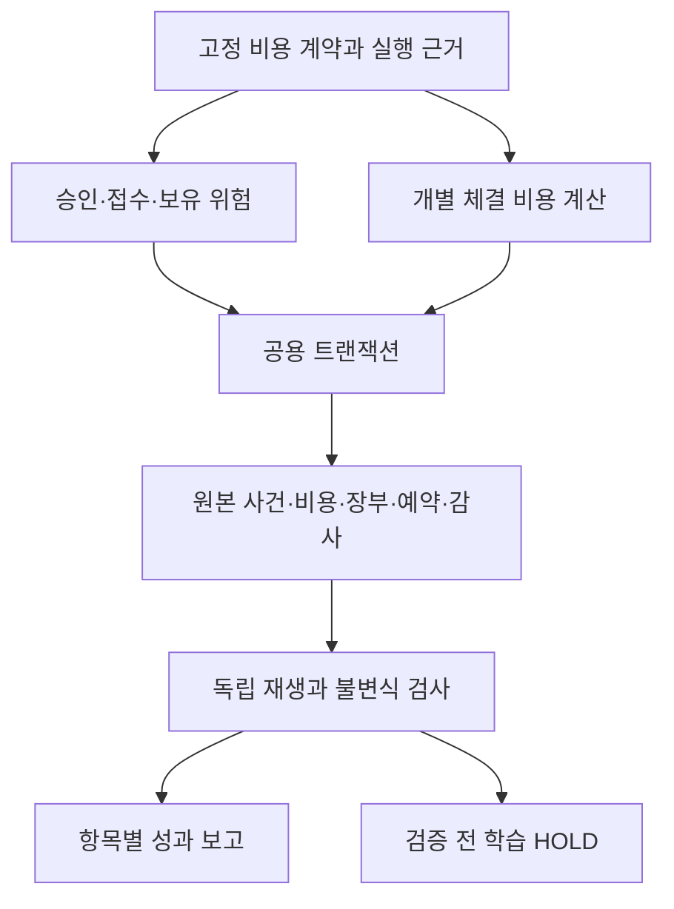

# 공용 엔진 비용 통합 설계와 경계 검증

2026-09-23 · DEV-D03-03 연결 설계. **공용 엔진의 전체 통합은 미완료다.** 최초 소스·구조 그래프와 경계 시험에서 독립 수량 계산기의 R0 오류를 원본 기준으로 수정했고, 이후 A/B를 아래 범위로 구현했다. 실제 요율·자료·키·계좌·유료 AI·주문 연결은 없다.

후속 A 단계에서 [공유 순수 비용 커널](COST_EXECUTION_LAB.md#공유-순수-비용-커널--a-단계)을 추출했다. B의 [명시 합성 비용 장부](COST_JOURNAL.md)는 기존 Repository에 동일 writer/epoch·단일 트랜잭션·체결 ID 멱등성과 미수/미지급을 추가한다. 구형 실행/DB는 자동 변환하지 않는다. 2026-09-24의 [C1](COST_ADMISSION_REVIEW.md)은 다종목 원본 사건의 읽기 전용 위험 합산/후보 재검사다. [C2 로컬 저장부](COST_RESERVATION_STORE.md) 뒤 [V2 합성 인계](COST_HANDOFF.md)에서 승인·예약과 B 사건·장부를 같은 COMMIT으로 연결했다. 후속 [V3 종료 결과](COST_OUTCOMES.md)는 닫힌 매매의 손익·손실 횟수·쿨다운·과다손실 중지를 원자 기록한다. V1/V2 계약은 보존한다. 연속 이력 복구, D 보고/학습·앱 연결은 남아 있다. 실제 검사/한계는 [PROGRESS · 공개 요약](PROJECT_STATUS.md)를 따른다.

[D1 확정 원장 보고·학습 보류 자료](COST_OUTCOME_REPORT.md)는 기존 V3 Store의 재검증 스냅샷에서 항목별 비용·현금·미완료/종료 결과를 같은 근거로 보고한다. 학습 실행·운영비 배분·UI는 연결하지 않으며 앞 문단의 D 잔여 범위 중 읽기 전용 보고만 부분 구현한 것이다.

[D2 근거 내보내기·독립 재생 검증](COST_OUTCOME_EXPORT.md)은 초기 설정·전체 명령/영수증·D1 보고를 로컬 JSON으로 보존하고 별도 신뢰 설정/해시와 대조한다. 검증 통과는 HOLD 자료의 일관성 확인이며 학습 입력 수용/서명 인증이 아니다.

[D3 학습 입력 사전 계약](COST_LEARNING_INPUT_CONTRACT.md)은 V3 금융 근거와 구형 학습/운영비 계약의 공백, 필드·분모·가용시각·표본 중복 경계, OC-U01~08의 승인 시점을 정리한다. 명세 작성이며 다음 읽기 전용 준비도 진단기의 구현과 구분한다.

[D4 읽기 전용 준비도 진단기](COST_LEARNING_READINESS.md)는 D2 재생을 필수 입구로 금융 사실·승인 전체·원래 HOLD를 보존하고 특징/운영비/학습 계약/모집단 공백을 고정 진단한다. 라벨·학습 입력은 null, 주문/학습/LIVE 허용은 false다. DB·구형 학습·정책·화면 연결은 변경하지 않는다.

[D5 운영비 첫 통합 선택안](OPERATING_COST_INTEGRATION_DECISIONS.md)은 작성 당시 OC-U08/U06의 대안·미실행 인수 시험을 분리한 결정 자료다. 후속 U08-A/U06-A 승인으로 [D6 공통 KRW 장부](COST_OPERATING_LEDGER.md)를 새 V4에 부분 연결했다. 단일 초기 현금·의무/예약/지급·원자 재생·입력 격리/HOLD를 제공하고, 기간 마감/확정 배분·최종 손실·학습은 남아 있다. 기존 정책과 V1/V2/V3는 자동 변경하지 않는다.

## 1. 판단과 선택

기존 엔진의 `fee()`만 새 계산기로 바꾸면 안 된다. 공용 엔진은 누적 체결 증분·비례 수수료·미결제 장부를 사용하지만, [비용 체결 실험실](COST_EXECUTION_LAB.md)은 개별 체결별/주문별 요금·보수적 예약·즉시 합성 결제를 사용한다. 같은 수량과 총대금만으로는 두 기록을 동치로 변환할 수 없다.

| 선택지 | 판단 |
| --- | --- |
| 전역 `fee()` 함수만 교체 | 제외. 승인·잔여 예약·보유 위험·검증·학습의 구형 계산과 충돌한다. |
| 비용 DB를 별도로 쓰고 기존 DB에 나중에 반영 | 확정 장부 용도로 제외. 두 저장소의 별도 COMMIT 사이에서 끊기면 체결/비용이 분리된다. 읽기 전용 대조에는 사용 가능하다. |
| 명시적 새 합성 실행 계약 + 공용 저장소의 한 트랜잭션 | 채택할 구현 방향. 순수 비용 함수를 공유하고 원본 사건·항목별 비용·장부·예약·감사를 함께 확정한다. 구형 실행은 기존 의미로 보존한다. |

이는 엔지니어링 변경 계획이지 새 거래 기준이나 실거래 승인 아니다. [원본 v2.3](../outputs/AI_TRADING_GUIDE_v2.3.md), 손실 한도·보호 거리·경제성 문턱·미확정 주문 규칙을 바꾸지 않는다. 임의로 제2의 포트폴리오 엔진을 복제하지 않고 현재 저장/승인 경로를 명시적으로 확장한다.

## 2. 현재 근거와 필요한 공동 변경

| 경계 | 현재 소스에서 확인한 동작 | 통합에 필요한 계약 |
| --- | --- | --- |
| 승인·접수 | [approval](../src/core/approval.ts)과 [submission](../src/core/submission.ts)은 구형 비용/프로필과 현재 수량을 재검사 | 같은 금액이어도 비용 프로필·과금 단위·반올림·체결 모형 근거가 바뀌면 새 승인 필요 |
| 위험·수량 | [risk](../src/core/risk.ts)의 `costFor`, `openRisk`, `remainingRisk`, `size`가 비례 비용에 연결 | 신규 수량뿐 아니라 보유 위험·미체결 위험·환율 변경 후 예약까지 동일 모델 사용 |
| 개별 체결 | [simulator](../src/core/simulator.ts)는 누적 수량/대금의 차액을 한 사건으로 처리 | 입력된 개별 체결의 ID·수량·가격·시각·순번 보존; 누적 증분을 실제 단일 체결로 추정 금지 |
| 비용·현금 | [ledger](../src/core/ledger.ts)는 미수/미지급을 분리하고 주문 가능 현금에서 BUY 예약만 차감 | 결제 전 SELL 대금 재사용 금지, 매도 비용 부족분 예약·지급 계약 추가 |
| 상태·불변식 | [types](../src/core/types.ts)의 State v1과 [불변식](../src/core/portfolio-invariants.ts)은 구형 비용 등식을 사용 | 버전별 명시 검사; 새 항목별 비용의 독립 재생 검증. 기존 검사를 삭제해 통과시키지 않음 |
| 저장·재시작 | [Repository](../src/server/repository.ts)의 writer lease/fencing·트랜잭션을 [공용 엔진](../src/server/portfolio-engine.ts)이 사용 | 동일 writer/epoch·COMMIT에 비용 사건까지 포함; 별도 실험실 저장소로 우회하지 않음 |
| 학습 기록 | [capture](../src/core/paper-learning-capture.ts)는 체결 증분 비용을 구형 `fee()`로 재계산하고 한 새 사건 ID를 요구 | 확정된 비용 항목을 기록하고 다중 개별 체결/동시각 순번을 보존하는 새 계약 필요 |
| 학습 검증·변환 | [verify](../src/core/paper-learning-verify.ts)는 엄격한 체결 시각 증가·구형 요금을 검사; [convert](../src/core/paper-learning-convert.ts)는 거래비를 commission으로 분류 | 구형 형식은 유지. 새 수수료/세금/거래소 비용을 분리하고 지원되지 않는 배분/의미는 HOLD |

Graphify 0.9.63의 code-only 추출은 292개 코드 파일에서 2,639개 노드·7,886개 연결을 찾았다. `fee`와 `costFor`의 호출 관계에서 위 후보 경계를 찾고 해당 함수를 직접 읽어 확인했다. 그래프는 정적 탐색 근거이며 런타임 도달성·누락 없음·트랜잭션 원자성의 증명이 아니다. 그래프의 방향 없는 연결을 실행 순서로 해석하지 않는다.

새 그래프는 `work/dev-d03-integration-verification/`에만 저장했다. 기존 `graphify-out`은 보존했다. 경로 대조에서는 Node 내장 모듈3개와 시험 문자열에서 추출된 실재하지 않는 `tests/leaf.js`1개를 별도로 식별했다. 이런 참조를 실제 파일이나 제품 의존성의 증명으로 사용하지 않는다. 이 스냅샷은 새 경계 시험 및 R0 수정 전 추출이며, 변경된 계산식은 최종 소스와 실행 시험으로 별도 확인했다. 외부 LLM 분석·패키지 설치·키 접근은 없었다.

## 3. 새 통합 계약의 필수 내용

아래는 **전체 통합에 필요한 계약**이다. A/B의 실제 제공 범위는 연결한 전용 안내를 따른다. 나머지 필드/API가 이미 존재한다는 뜻이 아니다.

### 실행 버전과 비용 근거

새 실행은 상태/실행/비용 계약 버전, 원본 정책 해시, 비용 프로필 해시, 체결 모형, 결제 방식, 운영비 근거를 명시해야 한다. 프로필 누락을 구형 또는 0원 요율로 자동 처리하지 않는다. 기존 DB·학습 V1을 자동 마이그레이션하거나 과거 체결을 새 비용으로 덮어쓰지 않는다.

첫 통합 검증은 새 합성 실행만 대상으로 하고, 전체 합성 시나리오 기간의 프로필 유효성을 시작 전에 검사한다. DAY 누계·자동 환전·실제 요율·기간 중 프로필 전환은 지원 전까지 보류한다. 실환경의 프로필 만료나 미확정 비용 때문에 이미 발생한 체결/노출을 지우거나 청산 감시를 포기하는 구현은 금지다. 해당 환경을 지원하려면 원시 사건 보존·노출 대조·손익/학습 확정 보류 계약을 별도로 구현해야 한다.

### 개별 체결·과금 단위

주문 ID, 원천 개별 체결 ID, 원통화 수량/가격/대금, 발생 시각, 수신·가용 시각, 안정된 순번을 함께 보존한다. 같은 시각의 두 체결은 서로 다른 체결일 수 있다. 시각을 임의로 1ms씩 늘리거나 합쳐서 최소 수수료 횟수를 바꾸지 않는다.

공용 ID는 콜론을 허용하지만 실험실 ID는 허용하지 않으며, 소수 정밀도 한도도 다르다. 원본을 잃지 않는 명시적 매핑과 충돌 검사를 정하거나 입력을 보류한다. 문자열 자르기·부호 삭제·가격 반올림으로 스키마에 끼워 맞추지 않는다.

ORDER 비용은 주문별 누계 계산의 증가분, FILL 비용은 실제 개별 체결별 청구다. 기청구 항목을 저장해 재시작 후에도 같은 증가분을 계산한다. 동일 ID/같은 내용은 중복 청구하지 않고, 동일 ID/다른 내용은 보류한다. 취소·대체 주문의 계보와 기존 대체 상한을 유지한다. 취소증거의 원천 누계를 로컬 예상 누계로 대신하지 않는다. UNKNOWN 상태에서 늦은 부분 체결을 받았다는 이유만으로 나머지 미확정 상태를 해제하지 않는다.

### 가격 위험·예약·경제성

원본의 `R0 = 수량 × (진입가 − 보호가) × 환율`과 `reservationRisk = R0 + 손절 거래비용`은 다른 값이다. 경제성의 최소 순기대값/R 문턱에는 **가격 위험 R0**, 위험 한도 검사에는 비용 포함 위험을 사용한다. 고정 운영비는 손절 위험에 재가산하지 않는다.

이번 CINT-11에서 독립 수량 계산기가 비용 포함 위험을 경제성 R로 전달하던 차이를 재현했다. 합성 1주에서 R0=50, 비용 포함 위험=52, 왕복 기대비용=3, 기대이익=13이면 원본 순기대값 10의 문턱을 통과해야 한다. 수정 전에는 보류했고, [계산기](../src/core/cost-aware-sizing.ts)의 인자 한 곳을 원본 R0로 고쳤다. 문턱 바로 아래는 계속 보류된다. 실제 주문 경로는 변경하지 않았다.

예약 상계는 실제 청구액이 아니다. ORDER 기청구액 상계와 FILL 분할 상계를 구분하고 실제 체결 후 잔여 예약을 다시 계산한다. 수량 실험실의 고정 1주 분할 시나리오를 임의 체결 분할의 상계로 사용하지 않는다. 승인 이후 프로필 해시·범위·효력 시각 또는 체결/환율 근거가 바뀌면 금액이 같더라도 접수 직전 재검사한다.

### 결제·보고·학습

비교용 원통화 경제적 순현금은 `cash + receivable − payable − unpaidFees`다. 실험실의 즉시 `cash`와 일치할 수 있지만 **주문 가능 현금과는 다르다.** 특히 매도 후 미결제 `receivable`은 기존 공용 엔진의 재매수 예산에 들어가지 않는다. 실험실 `cash`/`availableCash`를 공용 장부에 복사하지 않는다. 현재 합성 다음 단계 결제를 유지하고 실제 T+ 결제일을 검증했다고 표현하지 않는다.

매도 비용이 체결대금보다 큰 경우 부족분을 비음수 미지급 항목으로 인식하고 예약 해제·실제 비용 전환을 한 번만 반영해야 한다. 미수금을 음수로 만들어 이를 숨기거나 비용을 지급/보고 양쪽에서 재차 차감하지 않는다. 정확한 인식 시각과 항목별 장부 대조는 다음 통합 시험의 인수 조건이다.

확정 원장의 원통화 비용 항목과 환산 근거를 성과 보고·학습 양쪽에서 재사용한다. 거래 순손익과 운영비 후 손익을 구분한다. 새 학습 형식·배분 검증이 준비되지 않았으면 비용 근거가 일치해도 **학습 HOLD**이며 학습 연결 완료가 아니다. 구형 V1에 필드를 몰래 추가하거나 모든 거래비를 수수료로 변환하지 않는다.

## 4. 계획한 데이터 흐름

아래는 향후 연결 구조다. 이번에는 이 경로를 활성화하지 않았다.



현재 비용 체결 실험실 전체를 포트폴리오 장부로 사용하지 않는다. 재사용 후보는 순수 비용 계산과 잔여 비용 상계 계산이며, 공개 함수로 추출할 때 기존 실험실의 결과가 유지되는지 검사한다. 포트폴리오·학습·저장 생명주기는 공용 경로에서 다룬다.

## 5. 실제 실행한 경계 검사

[cost-integration-boundary.test.ts](../tests/cost-integration-boundary.test.ts)는 정상 합성 fixture의 제한적 대조와 현재 공용 엔진의 메모리 시험이다. `common()` 도우미는 승인을 건너뛰며 취소 누계를 합성한다. **실제 어댑터·취소 대조·미확정 상태 호환성 시험이 아니다.**

| 시험 | 실제로 확인한 범위 |
| --- | --- |
| CINT-01 KR/US | 같은 비례 비용에서 취소/대체 후 거래비·경제적 순현금·환산 손익 일치 |
| CINT-02 KR/US | 매수 미지급 상태의 현금/예약 비교, 합성 결제 후 경제적 가치 보존 |
| CINT-02S KR/US | 매도 미수 상태는 주문 가능 현금 불일치, 결제 후 일치 |
| CINT-03/04 | 같은 누계라도 분할 체결 최소액이 다름; ORDER 차액과 구형 비례 비용의 차이 |
| CINT-05 | 부분 체결 후 잔여 예약이 구형 값과 달라야 함 |
| CINT-06/07/08 | 구형 학습 재계산·개별 체결 식별 부족·ID/정밀도 차이 |
| CINT-09/10 | 공용 엔진의 복제 상태에서 수수료만 변경하거나 SELL 예약만 추가하면 기존 불변식과 충돌 |
| CINT-11 | 원본 R0 경제성의 양성/음성 경계와 비용 포함 예약 위험의 분리; 수정 전 실패/수정 후 통과 |

프로젝트 루트 PowerShell에서 기존 의존성으로 재현한다.

```powershell
npm run build:engine
node --test --test-concurrency=1 dist/runtime/tests/cost-integration-boundary.test.js dist/runtime/tests/cost-aware-sizing.test.js
```

최종 집중 검사는 **53/53**(새 경계 15 + 기존 수량 38), 실패·취소·건너뜀 0이다. 별도로 기존 관련 6개 파일 162개를 실행했고, R0 수정의 영향을 받는 수량 38개를 최종 집중 검사에 포함해 재실행했다. 중복을 빼면 이번 새/기존 시험은 177개다. 상세 빌드·정적 검사·실패 로그·파일 보존 결과는 [PROGRESS · 공개 요약](PROJECT_STATUS.md)를 따른다. 전체 `npm test`, 웹 E2E, 실제 시장 백테스트·계좌 검증으로 확대 해석하지 않는다.

## 6. 다음 구현 순서와 인수 조건

아래 A~D는 기존 D03-03 내부 순서이며 완료 체크나 계획 분모를 새로 추가하지 않는다. 새 경로의 공용 실행 활성화는 연결 대상 전체의 인수 뒤에만 허용한다.

| 순서 | 구현 범위 | 다음으로 넘어갈 조건 |
| --- | --- | --- |
| A: 공유 순수 비용 커널 — 구현 | 기존 실험실의 실제 요금·잔여 예약 계산을 독립 함수로 추출, 명시적 비용 문맥·R0/위험 의미 고정. 공용 실행은 비활성 유지 | 기존 실험실/수량 결과 회귀, ORDER/FILL 경계·보수적 분할 상계·동일 금액 다른 근거·입력 불변 검사. 실제 인수 근거는 PROGRESS 참조 |
| B: 사건·장부·저장 — 명시 합성 경로 구현 | 새 합성 실행 계약, 개별 체결·과금 누계·취소증거·미확정 보존·KRW/USD 미수/미지급·SELL 부족분 예약 | 부분/동시각/중복/상충/취소 경합/대체, 동일 COMMIT·롤백·fencing·재시작 재생, 결제 전후 현금 검사. 실제 인수 근거는 PROGRESS 참조 |
| C1: 연구용 위험·후보 — 구현 | B 원본 사건과 명시 합성 위험 관측값에서 공통 현금·보유/잔여 위험 합산, 기존 수량/경제성 재사용·근거 재검사 | 중복 자본·과예약·미수 재사용·보호 상태·FX/근거 변경·비선형/대체 비용 반례. 원자 승인·예약 인수는 아님 |
| C2: 승인·접수·원자 예약 — V1/V2 및 V3 종료 결과 구현 | 동일 Repository의 버전/epoch/lease에서 승인·인계·체결·예약·비용·미결제·종료 결과 원자 확정. 실행당 신규 예약 시장 하나 | 현금/위험 경쟁·미확정/취소 경합·종결 슬롯·복구·손실 정책 대조. 같은 종목 반복 진입·기간 전환/이력 공백은 별도 인수 |
| D: 보고·학습 계약과 통합 인수 — D1/D2/D4 구현·D3 사전 명세 | 같은 항목별 근거의 보고·HOLD JSON 내보내기·독립 명령 재생·고정 준비도 진단 | 통화/비용 항목/손익 대조, 신뢰 기준·누락/변조 거절, 구형 자료 불변, 관련 회귀. 신형 학습 변환·운영비 통합은 후속 |

D6 다음은 **동일 원자료의 기간 마감·확정 배분과 최종 손익/연속손실 재생 연결**이다. 구현 전 OC-U01/02/03/04/05/07과의 접점을 확인하고 필요한 추가 선택만 요청한다. OI-01~03의 공통 장부 인수가 OI-04~10 전체 완료는 아니다. D1 보고·D2 내보내기·D4 준비도는 V4 학습 연결로 확장하지 않았다. 후보 운영비 추정 경제성 연결 전에는 첫 비용 사건부터 신규 진입을 보류하고, 청산 카운터는 확정 배분 전 적용하지 않는다. V2 종료 HOLD, V3 환율/순서 공백과 기존 중지는 유지한다. 관측 공백 복구·다일 전환·반복 진입·공용 앱 활성화는 별도 인수다. D03 2/4·가이드10/40을 유지하며 실제 API 키는 필요 없다. 자동 학습·앱 모드 노출·계좌 전환·실제 지출은 이번 범위 밖이다.

D7 후속(2026-09-26): 위 마감 작업 중 [읽기 전용 배분·손실 투영](COST_OPERATING_CLOSE_REPORT.md)을 먼저 연결했다. 기존 V4 `UNIMPLEMENTED_HOLD`를 소급 변경하지 않으며 같은 읽기 스냅샷의 전체 재생·신뢰된 합성 기간 manifest 대조만 수행한다. D7 자체는 원장 카운터/마감 기록을 쓰지 않는다. 당시 다음 인수였던 명시 마감 저장은 아래 D8로 분리했다. 실제 공급자 완전성·늦은 비용·다일 인수를 대신하지 않는다.

D8 후속(2026-09-26): [명시 새 실행 확장](COST_FINALIZATION.md)에서만 근거 재검증·마감 체크포인트·손실 카운터를 동일 COMMIT으로 저장한다. closeId 멱등·lease/epoch·재생/재시작 복구를 적용하고 구형 기록은 보존한다. 기존 D6 배분 HOLD/원래 결과는 역사적 사실로 남기며 D8 확정 결과를 별도 체크포인트에 둔다. 마감 후 금융 쓰기는 차단하고 명시 원문 intake만 검토 대기로 남긴다. **다음은 마감 후 검증된 지급·결제의 별도 계약과 원자 반영/멱등/복구**다. 기존 배분·카운터를 다시 적용하거나 미지급을 없애지 않아야 한다. 새로운 비용·정정·늦은 자료는 미결정 OC-U05/U07을 임의 확정하지 않는다.

D9-A 후속(2026-09-27): [마감 후 지급·결제 계약](COST_POST_CLOSE_SETTLEMENT_CONTRACT.md)은 기존 마감 기준점과 현재 공통 잔액을 분리하고, 알려진 원화 의무/체결의 전액 후속 처리·업무/대상 멱등·단일 COMMIT·시각/복구 인수를 정의한다. D9-A 당시 계약 검산과 후속 제품 검증은 구별한다.

D9-B 구현(2026-09-27): [선택 합성 지급·결제 Store](COST_POST_CLOSE_SETTLEMENT.md)는 기준점을 마감 COMMIT에 저장하고 같은 원장 이력으로 후속 전액 처리·현재 잔액을 재생한다. 원래 마감 결과/카운터·원문 HOLD·기본 D8 차단은 보존한다. 별도 정상 실행과 실패 재시도를 대조하고 cold restart·실제 프로세스 경합·포화 원문과 결제 슬롯 분리를 시험한다. 실행 결과/미검증 범위는 PROGRESS를 따른다. 다일 거래·부분/조정·실제 API·학습/UI 연결로 넓히지 않는다. 다음은 조정·부분 결제·기간 밖 이관의 사전 계약이며 1원 오차를 임의 손익으로 처리하지 않는다.

D10-A 설계(2026-09-27): [부분 결제·차액 조정·관찰 이관 계약](COST_SETTLEMENT_ADJUSTMENT_CONTRACT.md)은 잔여액과 비용/환급·순액 근거, 같은 DB의 유한 관찰 연결, 동일 원천 지급 중복 방지·원자 복구/자원 예산을 구분한다. 문서 검산과 미실행 SA 인수를 분리하고 OC-U05/U07을 미결정으로 보존한다. 다음 D10-B는 새 합성 KRW 실행의 부분/잔여 전액 결제만 구현한다. 조정·기간 이관·자동 재개·외부 연결은 포함하지 않는다. 원본/제품 코드는 이번 설계에서 변경하지 않으며 D03 2/4·가이드10/40은 유지한다.

D10-B 구현(2026-09-27): [부분 결제·잔여 추적](COST_PARTIAL_SETTLEMENT.md)을 별도 명시 합성 실행에 연결했다. D9와 불변 마감 기준점 추출만 공유하고, 증거 소비·대상별 누계·공통 잔액을 기존 writer/epoch의 같은 COMMIT에서 저장·재생한다. 중복/초과·동시 지급·저장 실패/재시작과 원본 보존의 실행 근거는 PROGRESS를 따른다. 구형 D9/기존 DB·원래 마감 손익/카운터·HOLD는 보존한다. 다음은 OC-U05/U07의 구체 선택이며 조정/관찰 이관·UI/학습·실자료 인수는 아직 미완료다. 상위 진행률은 그대로다.

운영비 `OC-U01~08`은 [기존 선택지](COST_EXECUTION_LAB.md#운영비-미결정-사항-다음-결정용-초안)를 유지한다. A의 순수 계산 추출에는 미결정 전체의 선행 승인이 필요하지 않다. 이후 운영비가 0이라고 명시한 합성 fixture는 현실의 미확인 비용을 0원으로 인정하는 근거가 아니다. 기간/외화 평가·배분·추정과 실제 비용 상계·환불·마감/래치·늦은 비용·이행 범위가 필요한 통합을 시작하기 전에 해당 계약을 확인한다.

진행률은 **D03 2/4 = 50%, 개발 계획 10/40 = 25%, 누적 등록 작업 158/167 = 94.6%**로 유지한다. 이번 경계 검증과 R0 수정만으로 D03-03/04를 완료 처리하지 않는다. 이 비율은 등록된 인수 조건의 완료 비율이며 실전 안전성·수익성 준비도를 뜻하지 않는다.
