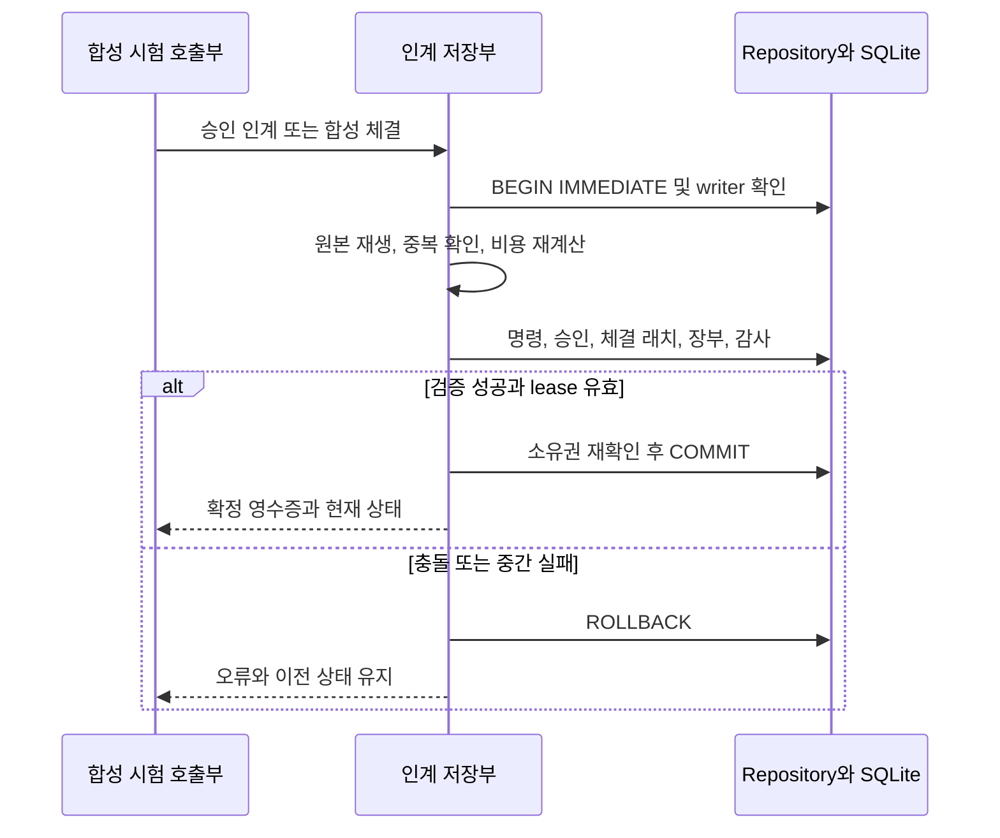

# 합성 승인·예약에서 체결·결제로 인계 — C2 V2

2026-09-24 · **개발자용 오프라인 합성 경로**다. 미전송 승인에서 합성 접수, 개별 체결, 취소 증거, 명시 결제까지 같은 Repository의 writer/epoch/lease와 단일 COMMIT으로 연결한다. 증권사 모의계좌·실계좌에 접속하거나 웹 앱의 거래 경로를 바꾸지 않는다. `orderSubmissionAllowed`, `learningAllowed`, `liveEnabled`는 모두 `false`다.

이번 부분 인수와 DEV-D03 전체 인수는 다르다. 이 문서의 V2는 닫힌 매매의 손실 횟수·재진입 대기시간 미연결을 이유로 다음 진입을 보류하는 원래 계약을 유지한다. 후속 [명시 새 V3](COST_OUTCOMES.md)에서 종료 결과를 연결하며 V2 기록·해시를 소급 변경하지 않는다. 연속 위험 이력, 보고/학습·운영비 연결은 남아 있다. 완성된 자동매매 프로그램이나 투자 성과 검증이 아니다.

## 1. 버전과 입력 경계

| 구분 | V1 로컬 예약 | V2 합성 인계 |
| --- | --- | --- |
| 설정 `kind` | `SYNTHETIC_LOCAL_COST_RESERVATIONS_V1` | `SYNTHETIC_COST_HANDOFF_V2` |
| 신규 시작 | 빈 Repository에서 명시 초기화 | 빈 Repository에서 명시 초기화, 합성 account/namespace와 `horizonEnd` 추가 |
| 지원 사건 | 승인·로컬 해제·좁은 관측 갱신 | V1 사건과 HANDOFF, 관리 source의 B EXECUTION 사건 |
| 예약 상태 | `RESERVED_LOCAL`, `RELEASED_LOCAL` | 두 상태와 `TRANSFERRED_SYNTHETIC` |
| 저장 구조 | 설정/상태·명령·승인 3개 테이블 + 공통 감사 | 같은 구조 + `cost_reservation_fills` 고유 체결 래치 |
| 전환 | 기존 DB/해시 보존 | V1/B/구형 DB 자동 이행·병합 금지 |

신규 진입은 실행 설정의 KR 또는 US 한 시장만 지원한다. 기존 합성 book의 다른 시장 노출을 공용 현금·위험으로 대조하는 것과 한 실행에서 양 시장 신규 진입을 자동 운영하는 것은 다르다. 초기 B source는 고정 원본이며 이번 EXECUTION으로 변경할 수 없다. 새 인계 source만 관리한다.

프로필은 원본 승인과 동일해야 하며 book 초기시각부터 유효해야 한다. 중도 새 요율·영업일/위험기간 전환·horizon 이후·늦은 정정 체결·이미 취소 확정된 주문의 후발 체결은 이 합성 계약의 범위 밖이다. B의 엄격한 시간·수량·체결 제한을 그대로 적용한다. 실제 시장에서 발생 가능한 모든 이벤트를 수용하는 브로커 원장이 아니다.

## 2. 단일 COMMIT



별도 B DB에 먼저 쓰고 예약 DB에서 나중에 해제하지 않는다. B의 순수 재생/비용 커널을 사용하여 이번 V2 상태 내부에 원본 사건, 프로필, 항목별 비용 근거, 통화별 장부와 예약을 함께 확정한다. 같은 트랜잭션을 외부에서 부분적으로 볼 수 없다는 뜻이지 CPU의 모든 연산이 1ms 내에 끝난다는 뜻은 아니다.

실행 코드는 [순수 인계 전이](../src/core/cost-handoff.ts), [저장·재생·고유 래치](../src/server/cost-reservation-store.ts), [기존 B 원장](../src/core/cost-journal.ts)에 있다. 기존 구형 aggregate에는 연구용 State 투영을 주입하지 않는다.

## 3. 준비와 접수

| 메서드 | 동작 | 실패 경계 |
| --- | --- | --- |
| `prepare(proposal)` / `reserve(id, prepared)` | 기존 정책의 수량·경제성·현금·위험으로 미전송 예약 | 변경/복제된 새 준비서, 오래된 상태·epoch, 보호·시세·비용 문제 거절 |
| `prepareHandoff(reservationId, acknowledgement)` | 자기 예약과 이미 센 intent만 제외한 검사 문맥에서 원본 승인을 재계산 | 타 예약은 유지, 원본 가격/호가 시각·프로필·예측을 갱신하지 않음 |
| `handoff(id, prepared)` | 같은 상태에서 다시 검사하고 로컬 예약을 B 예약으로 한 번 인계 | 수량을 몰래 줄이지 않음. 부족한 현금·위험·사건 여유면 로컬 예약을 유지 |
| `execute(id, runId, event, expected)` | 명시 합성 B 사건 또는 SETTLE 저장 | 추가 BUY ORDER 금지. 신규 SELL/대체 ORDER도 공용 가용현금 부족이면 거절 |
| `observe(id, command, expected)` | 모든 source의 완전한 합성 관측 갱신 | 인계 당시 stop·프로필·체결 원본 변경 불가. 보호 확인도 명시 fixture일 뿐 브로커 증명이 아님 |
| `release(id, reservationId, expected)` | 아직 보내지 않은 로컬 예약만 해제 | `TRANSFERRED_SYNTHETIC`은 거절. 취소 증거를 우회하는 해제 금지 |

`CONFIRMED`는 합성 시험이 명시한 접수 확인이다. `UNKNOWN`은 ORDER와 UNKNOWN을 한 COMMIT으로 기록하여 중간 WORKING 상태만 노출하지 않는다. 둘 다 실제 브로커 접수 결과가 아니다. intent는 RESERVE에서 한 번, entry와 symbol entry는 첫 BUY FILL에서 한 번 증가한다. 추가 부분 체결과 중복 수신은 이 횟수를 늘리지 않는다.

## 4. 돈·위험·중복

초기 KRW/USD 현금은 공용 book에서 한 번만 센다. 각 B source가 같은 초기 자본을 참조해도 그 source의 현금 변화만 더한다. 예약은 실제 현금 출금이나 환전이 아니다.

```text
공용 현금 = 초기 통화별 현금 + 각 source의 결제된 현금 증감
가용 현금 = 공용 현금 − 미지급금 − B 주문 예약 − 활성 로컬 예약
미수금 = 결제 전 매도 순대금 (가용 현금에 더하지 않음)
```

FILL 시 개별 체결 비용 증가분, 잔여 예약, 미수/미지급을 함께 인식한다. SETTLE은 나중의 명시 사건으로만 결제한다. 원본 B의 비용 항목/반올림·ORDER/FILL 누계를 재사용하고 비용을 미지급과 현금 양쪽에서 중복 차감하지 않는다. `handoff.accounts`는 원본에서 매번 재생·대조되는 스냅샷이며 이를 직접 수정할 API는 없다.

승인 당시 `tickSize × adverseExitTicks`가 구형 청산 bps 모델로 떨어지지 않도록 잔여 주문과 보유 수량의 위험 하한을 유지한다. 기존 C1 위험과 승인에 결합된 비용/불리한 가격 위험 중 큰 값을 쓰고 현재 환율로 원화 예산을 계산한다. 새 위험 한도나 수익 문턱을 만들지 않는다.

V2 체결 고유 키는 **`sourceScope + fillId`**다. B 단독 모드의 `sourceScope + runId + fillId`보다 엄격하다. 동일 합성 account/namespace 안에서는 다른 종목/run도 fill ID를 공유할 수 없다. 가격·수량·주문·발생시각이 같고 전달 ID/순서/수신시각만 달라진 재전송은 최초 영수증과 현재 상태를 반환한다. 다른 내용 또는 충돌하는 전달 ID면 거절한다. DB PRIMARY KEY와 원본 재생 대조를 같은 writer 트랜잭션 안에서 적용한다.

이미 확정된 명령 ID는 동일 입력일 때만 중복 조회한다. 새 ID의 동일 FILL 재전송도 돈과 감사 행을 추가하지 않는다. 인계 준비서는 최초 적용에 한해 프로세스가 발행한 원본 객체만 인정한다. 재시작 뒤 이미 확정된 동일 인계 요청은 이전 영수증을 반환할 수 있지만 새/미확정 요청은 새 writer에서 재준비한다. EXECUTION 등 호출 시 epoch를 재구성하는 메서드는 명령 ID 충돌과 체결 ID 중복을 구별한다.

## 5. 체결 저장과 신규 진입 보류의 분리

유효한 B 체결은 호가가 오래됐거나 체결 후 보호 수량이 맞지 않는다는 이유만으로 버리지 않는다. 돈의 사실을 기록하고 `RISK_HISTORY_RECONCILIATION_REQUIRED`를 고정하여 신규 진입을 보류한다. 이후 최신 호가가 와도 관측하지 못한 손실 구간이 사라진 것으로 처리하지 않는다. 공용 현금 부족이 발견된 기존 사실 역시 저장하고 `SHARED_CASH_DEFICIT`를 유지한다. 반면 **아직 발생하지 않은 신규 SELL/대체 ORDER는** 공용 현금이 부족하면 저장하지 않는다.

매매가 닫히면 `CLOSED_OUTCOME_RECONCILIATION_REQUIRED`를 유지한다. 아직 연결하지 않은 연속 손실·쿨다운·손실 초과 래치를 0으로 간주하여 다음 매수를 허용하지 않는다. HOLD를 자동 해제하는 기능은 없다. 취소 확인·유효 체결·결제는 진입 HOLD 중에도 지원 계약 안에서 계속 처리한다. 일반 관측에서는 기존 고점/기간 손실 래치를 보존한다.

## 6. 자원 상한과 복구

제어 명령(RESERVE/OBSERVE/HANDOFF)은 100개, 로컬 해제는 예약 수 이내, 원본 source는 최대 10개 × B 사건 500개다. 전체 저장 명령 상한은 5,200개다. 제어 요청은 체결·취소·결제 전용 여유를 소진하지 않는다.

인계 전에는 B의 500사건 안에 남은 양방향 1주 체결·각 체결의 개별 결제·취소/미확정/확인·정책상 최대 SELL 대체 기록을 넣을 공간을 검사한다. 수량 때문에 공간이 부족하면 인계 전체를 거절하고 로컬 해제를 허용한다. 수량을 자동 축소하지 않는다. 이후 반복 UNKNOWN 등 비금융 사건도 종료 여유를 침범하면 거절한다. 이 공간은 허용된 합성 생애주기를 위한 유한 예산이며 실제 네트워크에서 무한 재전송되는 사건의 영구 수집 계약이 아니다.

writer는 BEGIN과 COMMIT 직전에 재검사한다. lease 만료·소유권 교체·명령/승인/체결 래치/상태/감사 중 예외는 전체 롤백한다. 재시작은 원본 명령 전체, 상태/승인 캐시, 체결 인덱스, 공통 감사 체인을 비교한다. 자동 초기화·삭제·모드 전환으로 오류를 숨기지 않는다.

## 7. 개발 검사

프로젝트 루트의 PowerShell, 기존 잠금에 맞춘 Node 24.20.0/npm 11 환경에서 실행한다. 외부 다운로드·계좌·키가 필요 없다.

```powershell
npm run build:engine
node --test --test-concurrency=1 dist/runtime/tests/cost-handoff.test.js
```

정상 결과는 테스트 실패·건너뜀 0과 종료 코드 0이다. [시험](../tests/cost-handoff.test.ts)과 [합성 입력 도우미](../tests/cost-handoff-helpers.ts)는 메모리/새 임시 DB만 사용한다. 소유 시험 자식의 종료/재시작은 사용자 앱·DB나 OS 설정을 변경하지 않는다. 실제 실행한 검사·실패 수정·전체 회귀 근거는 [PROGRESS · 공개 요약](PROJECT_STATUS.md)를 따른다.

500사건 종료 여유는 순수 reducer의 최악 분할 표본으로 검사한다. DB 표본의 실제 시계/lease 시험과 구별하며 **10×500×5,200 재생 상한 성능, 장시간 운용, 전원 차단, OS 격리, 브로커 지연·요율·실제 결제·수익성은 미검증**이다. 관측 사이 시장 경로도 알 수 없다. 새로운 UI/CLI 거래 모드·자동 수신·보고/학습 승격은 제공하지 않는다.

## 8. 다음 작업

후속 [V3 종료 결과](COST_OUTCOMES.md)는 닫힌 합성 매매의 순손익·연속 손실·재진입 대기시간을 기존 정책과 대조하여 같은 트랜잭션에 연결한다. V2 자체와 위험 이력 공백 HOLD는 유지하며 자동 해소나 실계좌 재개 승인은 포함하지 않는다. 다음 D 보고/학습의 동일 비용 근거와 미결정 운영비는 별도 인수한다. API 키는 아직 필요 없다.

등록 진행률은 D03 **2/4 = 50%**, 실행 가이드 **10/40 = 25%**, 누적 작업 **158/167 = 94.6%**로 유지한다. 상세 로드맵은 [통합 설계](COST_ENGINE_INTEGRATION_PLAN.md)를 따른다.
