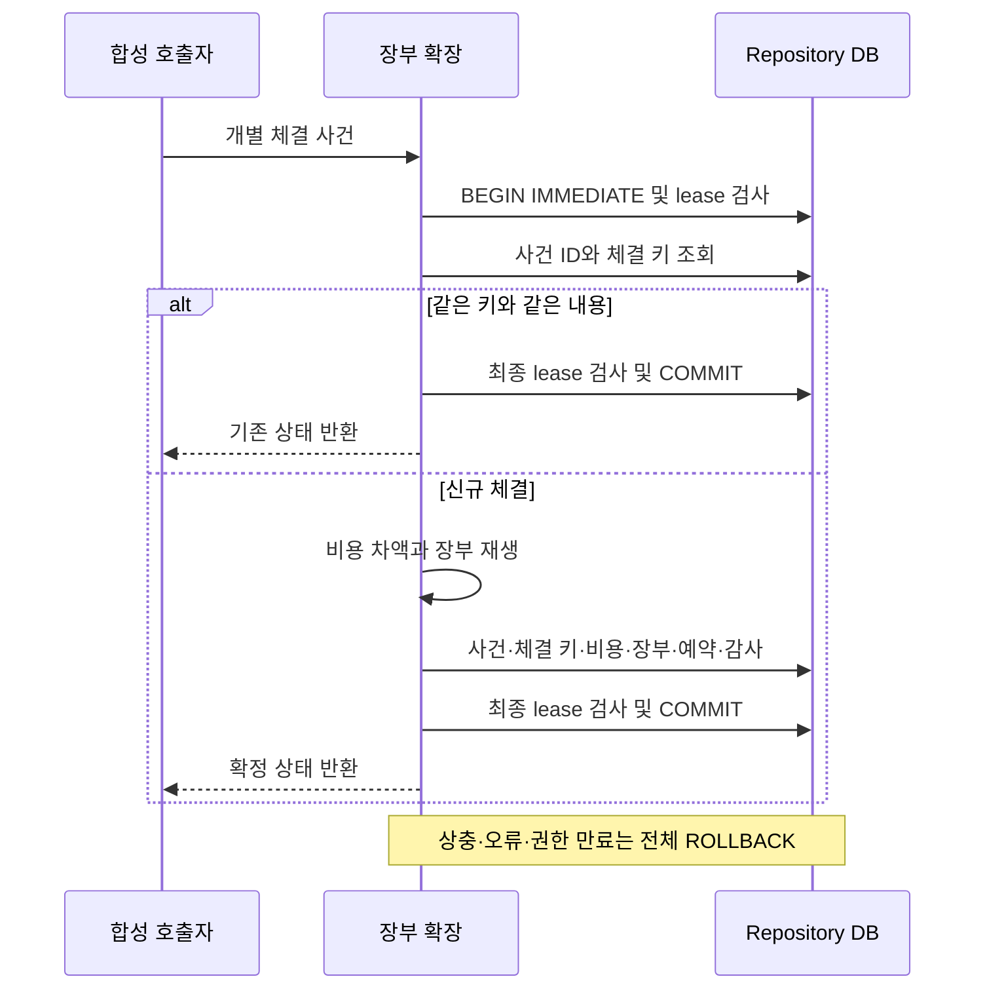

# 합성 비용 장부와 단일 트랜잭션

_DEV-D03-03 내부 B · 개발자용 오프라인 검증 · 2026-09-23_

---

## 📋 제공 범위

[CostJournal](../src/server/cost-journal.ts)은 기존 [Repository](../src/server/repository.ts)의 연결·writer lease·epoch·공통 감사 테이블을 사용한다. 체결, 비용 증가분, 미체결 예약, 보유 수량, 미수/미지급, 멱등성 식별자를 한 트랜잭션에서 확정한다. 별도 비용 DB에 먼저 COMMIT한 뒤 다른 DB로 복사하지 않는다.

명시적 새 합성 실행만 대상으로 한다. 한 실행당 한 종목·한 통화(KRW 또는 USD), 한 매수와 전체 잔량 매도/취소·대체 체인이다. 기존 [체결 상태기계](../src/core/cost-execution.ts)와 [비용 커널](../src/core/cost-kernel.ts)을 재사용하며 별도의 포트폴리오 판단 엔진은 만들지 않는다. 구형 State v1·웹 앱·승인·다종목 위험·학습 연결은 아직 없다. 모든 결과의 주문/학습/LIVE 허용은 false다.

## ⚙️ 실행 계약과 개발 검사

`CostJournalConfig`와 `CostJournalEvent`의 실행 시점 검사는 [순수 장부 모듈](../src/core/cost-journal.ts)에 있다.

| 필드 | 의미 |
| --- | --- |
| kind | `SYNTHETIC_COST_JOURNAL_V1` |
| runId / sourceScope | 고정 실행 ID와 합성 provider·account·namespace. 실제 계좌 입력란 아님 |
| settlement | `SYNTHETIC_EXPLICIT_NEXT_EVENT`만 허용 |
| operatingCosts | `EXPLICIT_ZERO_FIXTURE`만 허용. 현실의 미확인 비용을0원으로 인정하지 않음 |
| execution | 원본 정책 해시·TEST_ONLY 프로필·종목·초기 현금. 내부 즉시결제 설정은 상태기계 재사용/경제적 현금 대조 전용 |
| horizonEnd | 초기 시각 이상, 프로필 만료 이전의 합성 시나리오 종료 시각 |

ORDER/FILL 과금만 지원한다. ID/가격/수량의 기존 엄격한 범위를 유지하며 콜론 삭제·숫자 반올림 등으로 입력을 맞추지 않는다. 프로필 전환·DAY/FX·운영비 배분·실제 체결 정정/취소(bust)는 미지원이다. 최대500사건은 형식/자원 상한이지 그 크기의 부하·응답시간 보장이 아니다.

기존 의존성이 설치된 프로젝트 루트 PowerShell에서 실행한다.

```powershell
npm run build:engine
node --test --test-concurrency=1 dist/runtime/tests/cost-journal.test.js
```

[시험 fixture](../tests/cost-journal-helpers.ts)를 사용한 메모리 DB 개발 예시다. 사용자 DB 경로를 대입하지 않는다.

```javascript
import { Repository } from './dist/runtime/src/server/repository.js';
import { CostJournal } from './dist/runtime/src/server/cost-journal.js';
import { journalConfig, journalEvents } from './dist/runtime/tests/cost-journal-helpers.js';

const repo = new Repository(':memory:');
try {
  repo.acquire();
  const journal = new CostJournal(repo, journalConfig(), { initialize: true });
  for (const event of journalEvents()) journal.append(event);
  console.log(journal.read().projection.wallet);
  // ORDER fixture: cash=100170, 나머지 미수/미지급/미지급비용=0
} finally {
  repo.close();
}
```

새 영속 시험은 직접 만든 임시 경로의 Repository에만 초기화한다. 재개는 같은 설정으로 `initialize` 없이 생성한다. 변경 프로필·원천 범위는 거절한다. 구형 aggregate/commands/audit가 있는 DB를 새 실행으로 바꾸지 않으며, B 테이블이 있는 DB의 구형 `read/transact`도 거절한다. 자동 마이그레이션·UI 모드·별도 CLI는 제공하지 않는다.

## 💾 원자성·멱등성·실행 권한

원자성은 ‘1ms 이내 완료’가 아니라 **부분 반영이 외부에 확정되지 않는 것**이다. 처리 중 lease가 만료되면 갱신으로 되살리지 않고 전체 변경을 롤백한다.



체결 키는 `runId + sourceScope + fillId`의 해시다. 하나의 합성 원천 범위에서 fillId는 주문 간에도 고유해야 한다. 미래 브로커 식별자 범위가 검증됐다는 뜻은 아니다. 내용 해시는 주문 ID·체결 ID·수량·가격·발생 시각을 포함하며 재수신 ID·수신 시각·전달 순번과 분리한다.

| 수신 조건 | 저장 결과 |
| --- | --- |
| 최초 사건/체결 키 | 사건·비용 증가분·예약·장부·감사 함께 COMMIT |
| 같은 사건 ID·같은 전체 내용 | 금전·수량·사건 수 추가 없음 |
| 새 수신 ID·같은 체결 키와 내용 | 최초 체결 유지, 비용/예약 재반영 없음 |
| 같은 사건/체결 키·다른 내용 | 오류로 보류, 기존 상태 불변 |
| 만료/교체된 writer 또는 epoch | 중복 반환 경로도 거부 |

`cost_journal_events`의 ID UNIQUE와 `cost_journal_fills`의 fill_key PRIMARY KEY/event_seq UNIQUE가 영속 래치다. 검사와 INSERT는 동일 트랜잭션에 있다. 무시한 중복의 새 수신 ID·순번을 소비하거나 별도 수신 감사로 남기지는 않는다. 순번은 확정된 고유 사건 기준이며 실제 브로커 시퀀스 매핑은 후속 계약이다.

`writerTransaction`은 동기 내부 코드 전용이다. native async 함수는 호출 전 거절하고 반환 타입에서도 PromiseLike를 제외한다. 임의 콜백의 외부 부작용을 격리하는 보안 경계는 아니다. 새 장부만 이 경계를 사용하며 구형 트랜잭션의 만료 처리 의미까지 바꾸지는 않았다.

## 📊 비용·예약·결제 의미

BUY는 체결대금+비용을 미지급으로, SELL은 대금−비용이 양수이면 미수로, 음수이면 양수 부족분을 미지급으로 인식한다. 비용을 미지급비용에도 중복 계상하지 않는다. `unpaidFees`는 이 계약에서0이고 운영비는 미지원이다.

```text
주문 가능 현금 = cash - payable - unpaidFees - BUY/SELL 잔여 예약
경제적 순현금 = cash + receivable - payable - unpaidFees
```

미수금은 주문 가능 현금에 넣지 않는다. `SETTLE`은 이미 인식된 fillIds를 명시하고 각 최초 수신 시각보다 뒤에서 한 번만 결제한다. 지정하지 않은 체결은 미결제로 남는다. 같은 시각 결제, 없는/중복/이미 결제한 체결은 거절한다. 실제 T+ 결제일·휴장일·환전 모형은 아니다.

ORDER 요금은 주문 누계 증가분, FILL 요금은 개별 체결 요금이다. 항목에는 누계와 이번 증가분을 구분해 보존한다. 기록한 FILL 요금의 변화 없는 복사본을 매 체결마다 쌓지 않으며 처음 발생한0원 항목은 보존한다. 공유 커널 해시는 원래 계산 근거이고 B 장부/예약은 새 projection 해시로 결합한다. 기존 즉시결제 결과/해시를 B 값으로 덮지 않는다.

SELL은 즉시결제 커널 예약을 그대로 쓰지 않는다. 유리한 과거 매도대금도 미수이므로 이후 체결 부족분에 사용할 수 없다. B는 각 체결의 양수 부족분을 독립적으로 덮는다.

- `C`: 첫 체결 전 ORDER 규칙의 `max(최소액, 고정액)` 합. 첫 체결 후0
- `α`: NOTIONAL 규칙별 최대 marginal 요율 합(비율). 1을 넘으면 보류
- `U`: SHARES 최대 요율, 모든 규칙의 반올림 quantum, FILL별 `max(최소액, 고정액)`의 주당 상계
- 종료 주문/잔량0은 예약0. 그 외 `예약 = C + 잔량 × max(0, U + (α−1) × 지정가)`

정수 체결·비음수 marginal 요율·지정가 이상 매도라는 지원 조건에서 미래 체결 횟수를 잔여 주수로 덮는 보수적 상계다. 실제 비용/예상 분할이 아니며 여유 자금을 더 요구할 수 있다. 세 반올림·4주8분할·가격 변화·부분 매도 뒤 양수 부족분 및 유리한 첫 체결 반례를 검사한다.

## 🔍 재생·복구 검증과 한계

공개 읽기는 하나의 읽기 트랜잭션에서 원본 사건을 재생하고 설정/상태 체크섬, 체결 키·내용·비용 항목, 모든 감사 prefix의 projection 해시와 epoch/순번을 대조한다. 기존 상태기계를 한 번 재생한 분리된 prefix frames를 사용하며 매 감사 항목마다 전체 이력을 다시 시작하지 않는다. 해시는 우발적 불일치 검사이지 관리자 권한의 악의적 변조나 브로커 진실성을 인증하지 않는다.

[시험](../tests/cost-journal.test.ts)은 예외 주입과 [직접 만든 자식](../scripts/cost-journal-crash-fixture.mjs)의 EVENT/FILL_INDEX/STATE/AUDIT 쓰기 직후 및 COMMIT 직후 종료를 구분한다. 중간 종료는 직전 확정 상태, COMMIT 후 응답 전 종료는 전체 새 상태로 복구돼야 하고 재전송은 한 번만 반영돼야 한다. 물리 전원 차단·디스크 고장·증권사 접수 후 응답 유실 시험은 아니다.

실행 결과·실패 로그·실제 시계 측정·정적/원본 검사·독립 검토는 [PROGRESS · 공개 요약](PROJECT_STATUS.md)를 따른다. 최대500사건 부하, 실제 결제·브로커 체결 ID 범위, OS 격리, 공용 승인/다종목 위험 및 보고·학습 연결은 미검증이다. 성능 측정은 특정 fixture/환경의 결과이며 실전 처리량이나 응답시간 약속이 아니다.

다음은 [통합 계획 C](COST_ENGINE_INTEGRATION_PLAN.md)의 승인·접수·보유 위험·잔여 예약을 같은 근거에 연결하는 작업이다. B만으로 D03-03/04를 완료 처리하지 않으며 실제 계좌·API 키는 아직 필요 없다.
