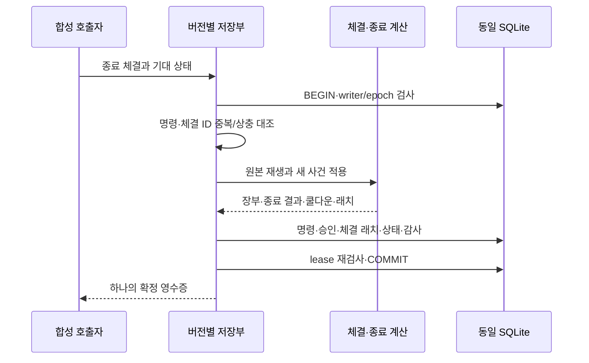

# 합성 매매 종료 손익·손실 중지 — C2 V3

_2026-09-24 · 개발자용 오프라인 합성 계약. 실제 계좌·브로커·UI·학습 연결은 없다._

---

## 📋 제공 범위

명시 새 실행 `SYNTHETIC_COST_OUTCOMES_V3`는 [V2 합성 인계](COST_HANDOFF.md)의 승인·예약·개별 체결·취소·결제 경로에 종료 결과를 연결한다. [같은 Repository](../src/server/repository.ts)의 writer/epoch/lease·단일 COMMIT을 사용한다. 기존 V1/V2 데이터·해시를 자동 변경하거나 기존 앱을 새 모드로 전환하지 않는다.

| 계약 | 매매 종료 처리 | 호환 경계 |
| --- | --- | --- |
| V1 로컬 예약 | 체결 없음 | 기존 의미 유지 |
| V2 합성 인계 | 종료 결과 미연결로 신규 진입 HOLD | 기존 기록·해시 유지 |
| V3 종료 결과 | 비용 차감 손익·쿨다운·손실 래치 원자 저장 | 빈 source의 새 실행만 |

V3에서도 모든 `orderSubmissionAllowed`, `learningAllowed`, `liveEnabled`는 false다. 정상 연구 후보가 생기더라도 실제 주문 권한이 아니다. 초기 seed의 명시 합성 손실횟수·위험 상태는 보존하며 외부 과거 이력을 검증한 것으로 간주하지 않는다. 이미 체결된 source를 초기 book에 넣거나 V2 DB의 kind를 고쳐 V3로 바꾸는 사용법은 지원하지 않는다.

## 📊 종료와 순손익

이번 실행이 인계한 매매만 대상으로, **BUY 체결이 존재하고 보유 수량이 0이며 모든 주문이 FILLED/CANCELLED**일 때 한 번 종료한다. 무체결 취소는 완료 거래가 아니다. 부분 체결 후 보유 수량이나 미확정·미종료 주문이 남아 있으면 종료하지 않는다. 부분 BUY 후 잔여 취소가 확정되고 실제 매수 수량을 모두 매도했다면 완료 거래다.

```text
원통화 순손익 = SELL 체결대금 합계 − BUY 체결대금 합계 − 모든 posting.feeDelta 합계
KRW 정책 판단 손익 = 원통화 순손익 × 종료 근거 수용 시점의 유효 환율
```

원화 거래의 환율은 1이다. 비용은 [B 원장](../src/core/cost-journal.ts)의 확정 증분을 사용하므로 주문별 최소요금·분할 체결·취소/대체·세금·거래소 비용이 반영된다. 순액 미수금에서 다시 비용을 차감하거나 예약 상계·예상 슬리피지를 실제 비용처럼 더하지 않는다. 결제 SETTLE 전에도 거래 결과는 인식하되 미수금은 여전히 재매수 가능한 현금이 아니다.

이 값은 **거래비 차감 거래 손익**이다. USD 전체 현금의 환평가 손익·운영비 배분 후 계좌 수익률이 아니다. B 계약의 `EXPLICIT_ZERO_FIXTURE`는 합성 운영비 0이라는 명시 시험 가정이며 실제 운영비가 없다는 뜻이 아니다. 미결정 운영비와 보고·학습 연결은 별도 작업이다.

종료시각 `closedAt`은 마지막 종료 근거를 수용한 논리 시계다. 과거 체결 `occurredAt`이나 나중 SETTLE 시각으로 바꾸지 않는다. 결과에 원통화 대금/비용/순손익, 종료 환율·근거 시각, 최초 승인 예산, 종료 revision, 근거 해시를 고정한다.

## 🛡️ 원본 위험 규칙

[정책 v2.3](../outputs/AI_TRADING_POLICY_v2.3.json), [기존 종료 처리](../src/core/simulator.ts), [기존 위험 검사](../src/core/risk.ts)를 대조한다. 새로운 한도나 전략 기준을 만들지 않는다.

| 조건 | 결과 |
| --- | --- |
| 확정 순손익 < 0 | 연속 손실 횟수 +1 |
| 확정 순손익 = 0 | 횟수 유지 |
| 확정 순손익 > 0 | 횟수 0으로 초기화 |
| 연속 손실 ≥ 2 | `CONSECUTIVE_LOSSES`, 신규 진입 중지 |
| 손실 > 최초 승인 `budgetKrw` × 2 | `STOP_LOSS_EXCEEDS_2X` |
| 매매 종료 확정 | 해당 종목 `closedAt + 60분`까지 쿨다운 |

정확히 2배는 초과 조건이 아니다. 비용 포함 실제 예약 위험 `riskKrw`, 가격 위험 R0, 현재 남은 예산을 최초 예산 대신 사용하지 않는다. 후속 이익으로 횟수가 0이 되어도 이미 설정된 중지 래치는 자동 해제하지 않는다.

쿨다운은 기록하고 기존 guard와 경계를 대조하지만, **같은 종목의 새 round-trip은 여전히 지원하지 않는다.** V3도 기존 C1의 source당 한 종목/한 진입 계약을 유지한다. 60분 경과만으로 주문이나 자동 재진입을 만들지 않는다.

## ⚠️ 근거 공백 처리

USD 종료의 환율이 기존 TTL을 넘으면 원통화 결과와 종료 사실·쿨다운은 저장하되 `netPnlKrw`, `fx`, `fxAt`은 null, `counterApplied`는 false다. `CLOSE_FX_RECONCILIATION_REQUIRED`를 유지한다. 당시 관측 환율은 원본 명령/seed와 결과 근거 해시로 추적하며, null을 0원 수익이나 0환율로 해석하지 않는다.

앞선 결과가 미확정이면 뒤의 결과가 유효 환율을 갖더라도 연속 손실 카운터를 적용하지 않는다. 해당 결과에 `CLOSE_SEQUENCE_RECONCILIATION_REQUIRED`와 `lossStreakAfter: null`을 남긴다. 후속 이익만 적용하여 공백 이전 손실을 지우지 않는다. 다만 뒤의 **확정된 2배 초과 손실**은 카운터 보류 중에도 안전 중지를 설정한다.

새 환율 관측·중복 통지·재시작·SETTLE은 이전 결과를 소급 확정/재환산하거나 쿨다운을 연장하지 않는다. 보류 해제·과거 환율 보충·기간 전환·손실 이력 복구는 이번 계약에 없다.

호가 노후·보호 수량 불일치·공용 현금 부족 등 기존 V2의 위험 HOLD도 보존한다. 유효한 금융 사건과 원통화 결과를 버리지 않으며, 원화 결과가 확정되어도 별개의 위험 이력 HOLD는 사라지지 않는다.

## 💾 단일 저장 경계



결과는 별도 돈 DB가 아니라 V3 상태의 `outcomes`에 저장한다. 같은 run의 결과가 이미 있으면 재집계하지 않고, 중복 체결은 기존 `(sourceScope, fillId)` 래치에서 차단한다. 이는 provider/account/namespace 범위의 고유 체결 ID로, 서로 다른 run 사이에도 충돌을 검사한다. 매번 전체 명령 재생 결과와 저장 상태/감사를 대조하므로 결과 본문과 checksum만 함께 변조해도 수용되지 않는다. 중간 예외·lease 만료는 금융 원장과 종료 결과 모두 롤백한다. DB 밖 임의 내부 코드에 대한 보안 격리는 아니다.

## 🔧 개발 검사와 한계

기존 설치가 준비된 프로젝트 루트의 PowerShell에서 실행한다. 지원 런타임 범위와 설치 절차는 [README](../README.md)를 따른다.

```powershell
npm run build:engine
node --test --test-concurrency=1 dist/runtime/tests/cost-outcome.test.js
```

[순수 종료 계산](../src/core/cost-outcome.ts)은 [합성 전이](../src/core/cost-handoff.ts) 내부에서만 적용되고 [저장부](../src/server/cost-reservation-store.ts)가 같은 트랜잭션으로 확정한다. 새 V3 config는 V2와 같은 필드에 kind만 명시적으로 선택한다. 기존 DB 변경이나 실제 인증 입력은 필요 없다. 재현 가능한 합성 config/호출 예시는 [시험 도우미](../tests/cost-outcome-helpers.ts), 실패 경계는 [전용 검사](../tests/cost-outcome.test.ts)에 있다. 이 도우미는 제품 CLI/브로커 API가 아니다.

검사는 KR/US, ORDER/FILL 최소요금, 부분·미확정·취소/대체, 손실/0/이익 순서, 같은 종료시각의 사건 순서, 최초 예산 초과 경계, 종료 환율/공백, 중복·재시작·변조, 모든 SQL 단계 롤백, 다른 연결의 중간 관측, 본 시험 소유 자식 종료를 대상으로 한다. 실제 실행 결과·실패 이력·V1/V2 보존·진행률은 [PROGRESS · 공개 요약](PROJECT_STATUS.md)를 따른다.

사용자 DB/서비스·키·계좌·외부 데이터는 사용하지 않는다. 최대 10 source/500사건·제어100개/명령5200개 등 기존 자원 상한은 유지하지만 최대 부하 처리시간이나 장기 운용을 인수한 것은 아니다. 실제 OS 전원 차단·신규 설치·앱 E2E·실제 요율/체결/결제·투자 수익성은 미검증이다.

후속 [D1 읽기 전용 보고·학습 보류 자료](COST_OUTCOME_REPORT.md)는 이 V3 원장을 재검증해 동일 비용 근거로 보고한다. 운영비 미결정·불완전 결과를 표시하며 자동 학습·모델 교체·앱/계좌 활성화는 하지 않는다. 다음은 D2의 신형 학습 보류 자료 내보내기·독립 재검증 계약이다. 같은 종목 반복 진입·양시장 신규 예약·기간 전환·위험 이력 공백 복구는 별도 인수다. D03-03/04 완료 및 실제 거래 준비 완료를 뜻하지 않는다.
