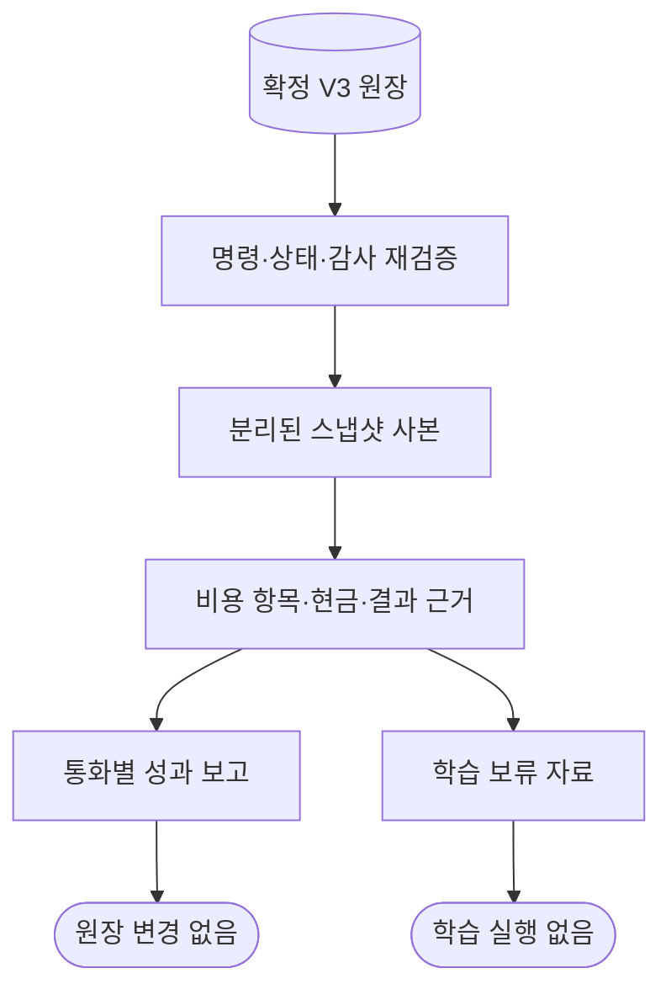

# 확정 비용 원장 보고와 학습 보류 근거 — D1

_2026-09-24 · V3 합성 실행의 개발자용 읽기 전용 보고. 실계좌 성과·학습 실행·UI 기능이 아니다._

---

## 📋 제공 범위

기존 [CostReservationStore](../src/server/cost-reservation-store.ts)의 `report()`를 호출하면 [V3 합성 종료 결과](COST_OUTCOMES.md)와 같은 확정 원장에서 항목별 보고와 학습 HOLD 자료를 함께 만든다. 반환 형식은 `SYNTHETIC_COST_REPORT_V1`이다. V1/V2 원장은 자동 변환하지 않고 이 메서드의 보고 요청만 거절한다. 기존 읽기·쓰기 의미는 유지한다.

대상은 이미 생성한 명시 합성 Store다. D1 자체는 파일 내보내기·HTTP API·화면 버튼을 제공하지 않는다. 후속 [D2 내보내기·독립 재생 검증](COST_OUTCOME_EXPORT.md)은 별도의 신뢰 설정/기준 해시를 요구하는 개발자 API다. 주문·학습·LIVE 허용은 항상 false다. 결과를 기존 학습기에 넣거나 모델을 교체하지 않는다.

## 🔍 한 스냅샷에서 얻는 근거

`report()`는 원본 정책 파일을 검증하고 기존 `read()`를 한 번 호출한다. 그 읽기 트랜잭션 안에서 설정·전체 명령 재생·영수증·상태·승인·체결 인덱스·감사를 대조한다. 반환된 분리 사본에서만 보고를 계산하므로 뒤에 다른 COMMIT이 발생해도 보고 내 자료의 시점은 섞이지 않는다.



`source`는 계약·config/policy/state 해시와 확정 `revision`, `epoch`, `asOf`를 담는다. 현재 컴퓨터 시각이나 새 연결의 epoch로 바꾸지 않는다. `financialBasisHash`는 이 source와 전체 `financialEvidence`를 묶으며 보고와 모든 학습 보류 행이 동일 해시를 참조한다. `reportHash`는 전체 반환 본문을 묶는다.

이는 로컬 스냅샷의 재생 일치·변경 탐지 근거다. 해시 자체가 발급자 서명, 외부 JSON 인증, 브로커 원본 전체의 완전성 증명은 아니다. [순수 집계 함수](../src/core/cost-outcome-report.ts)는 이미 재검증된 내부 사본을 받는 도우미이지 임의 외부 입력 검증기가 아니다. 파일 저장 후 재생 검증은 D2의 제한 JSON·별도 신뢰 기준 경계를 거쳐야 하며 학습 입력 변환은 아직 지원하지 않는다.

> **읽기 전용 경계:** 기존 Store의 `report()`가 쓰기·lease 갱신을 하지 않는다는 뜻이다. `Repository` 생성자는 스키마 준비를, 종료 함수는 소유 lease 해제를 수행한다. 임의 사용자 DB를 열고 닫는 전체 과정까지 무변경이라고 주장하지 않는다.

## 📊 금액과 상태의 의미

| 항목 | 보고 의미 | 혼동하면 안 되는 값 |
| --- | --- | --- |
| `components` | 체결별 `amountDelta`의 COMMISSION/TAX/EXCHANGE 합 | ORDER 누계 `amount`, 미래 비용 예약 |
| `allFillFees` | 미완료 거래까지 포함한 모든 체결 비용 | 닫힌 거래만의 비용 |
| `closedTradingFees` | 닫힌 거래의 비용 | 순손익에서 다시 차감할 값 |
| `closedTradingNetPnlNative` | 닫힌 거래의 비용 차감 원통화 손익 합 | 평가손익·계좌 전체 수익률 |
| `closedNetPnlKrw` | 모든 닫힌 결과의 환산이 알려졌을 때 합계 | 미확정 환율의 0원 대체 |
| `closedNetPnlKrwKnownSubtotal` | 환산이 알려진 닫힌 결과만의 부분합 | 완전한 원화 합계 |
| `netPnlAfterOperatingCosts` | 항상 null | 실제 운영비가 0원이라는 뜻 |

금액은 Decimal 계산 결과의 문자열로 유지한다. KRW와 USD를 합쳐 하나의 계좌 수익률을 만들지 않는다. V3 종료 시점에 고정한 환율·손익·쿨다운·횟수를 그대로 사용하며, 나중 환율이나 SETTLE로 종료 결과를 다시 쓰지 않는다. 환산 미확정은 null, 알려진 부분합은 별도 필드와 `knownKrwCount`/`pendingKrwCount`로 표시한다. 빈 집합의 합계는 "0"이지만 `closedCount=0`이며 무수익 거래 표본이 아니다.

`financialEvidence.accounts`는 공통 원장의 통화별 cash/receivable/payable/unpaidFees/reservedCash/availableCash를 사용한다. source별 초기 현금을 반복 합산하지 않는다. 비교용 `economicCash = cash + receivable − payable − unpaidFees`는 보유 종목 가치가 빠진 순현금이며 전체 순자산이 아니다. 미수 매도대금은 주문 가능 현금이 아니고, 매도대금보다 비용이 클 때 부족분은 미지급으로 남는다. 비용을 별도로 한 번 더 빼지 않는다.

각 trade는 원천 범위, 설정/프로필/사건 해시, 주문 계보·상태, 체결별 ID/발생·수신시각/순번/금액/항목 증분/결제 상태를 보존한다. 같은 시각의 체결을 합치거나 1ms씩 바꾸지 않는다. 환전 비용·DAY 과금·자동 환전은 현재 실행 계약에서 미지원이며 0원 실비로 추정하지 않는다.

## 🔒 학습 보류와 누락 방지

모든 확정 승인과 인계된 run을 포함한다. 예약만 하고 인계하지 않은 승인, 해제 승인, 무체결 취소, 손실 거래, 보유 중 거래, 환율 미확정 결과를 성공 거래만 남기는 방식으로 필터링하지 않는다. 단, 승인 전에 거절된 후보의 전체 판단 이력은 이 원장에 없으므로 포함했다고 주장하지 않는다.

trade의 `phase`는 CLOSED / INCOMPLETE_TRADE / NO_FILLS다. 보유 수량이 0이어도 주문이 미확정이면 완료가 아니다. 미완료·무체결 거래의 개별 손익 값은 null이다. `orders`의 세부 상태와 실제 비용은 그대로 보인다. 초기 실행·0개 거래도 허용하되 학습 가능한 표본을 만들지 않는다.

`learningEvidence`는 `SYNTHETIC_COST_LEARNING_HOLD_V1`, status는 HOLD이며 모든 `trainingLabel`은 null이다. 같은 원장의 비용·확정 거래 손익은 대조용 사실일 뿐 학습 허용이 아니다. 항상 다음 사유를 포함한다.

- `OPERATING_COST_ALLOCATION_UNSUPPORTED`: 실제 운영비 발생/지급/배분 계약이 아직 연결되지 않음
- `V3_TRAINING_CONTRACT_NOT_INTEGRATED`: 검증 가능한 새 학습 입력·변환 계약이 아직 연결되지 않음

각 행에는 예약/거래 상태, 종료 FX/순서 보류, 기존 신규 진입 HOLD·위험 중지도 함께 표시한다. 보류가 있다고 확정된 체결 사실이나 음수 현금을 삭제하지 않는다. 운영비는 합성 `EXPLICIT_ZERO_FIXTURE`와 `actualCosts=UNVERIFIED`, `allocation=UNSUPPORTED`를 구분한다. 미확정 `OC-U01`~`OC-U08`은 변경하지 않는다. 구형 `PAPER_LEARNING_EXPORT_V1`과 호환되는 자료가 아니며 기존 검증기는 거절한다.

## 🔧 개발자 사용과 검사

프로젝트 루트 PowerShell, 기존 설치된 의존성 기준이다. 설치·런타임 조건은 [README](../README.md)를 따른다.

```powershell
npm run build:engine
node --test --test-concurrency=1 dist/runtime/tests/cost-outcome-report.test.js
```

아래 예제는 시험 도우미로 새 메모리 전용 합성 Store를 생성한다. 기존 앱이나 사용자 DB에 연결하지 않는다. 빌드 후 프로젝트 루트에서 `node --input-type=module`의 표준 입력으로 실행할 JavaScript다.

```javascript
import { openedOutcome, beginTrade, fillTrade, closeTrade } from "./dist/runtime/tests/cost-outcome-helpers.js";

const { repo, store } = openedOutcome();
try {
  const run = beginTrade(store);
  fillTrade(store, run);
  closeTrade(store, run, "10100");
  const result = store.report();
  const krw = result.report.currencies.find((v) => v.currency === "KRW");
  console.log(krw.closedTradingNetPnlNative, krw.allFillFees,
    result.learningEvidence.status, result.learningAllowed);
} finally {
  repo.close();
}
```

기대 출력은 `80 20 HOLD false`다. 가상의 매수 10,000원, 매도 10,100원, 왕복 비용 20원의 결과이며 실제 기대 수익이 아니다.

`COST_REPORT_REQUIRES_OUTCOME_V3`는 지원 버전이 아닌 요청이다. LOCAL/HANDOFF/AUDIT 불일치는 기존 원장 대조 실패이고 COST_REPORT 비용 불일치는 집계 교차 대조 실패다. 실패하면 보고를 반환하거나 원장을 자동 복구하지 않는다. 원장 kind/checksum을 수동 수정하여 통과시키지 않는다.

[전용 시험](../tests/cost-outcome-report.test.ts)과 [실행 기록 · 공개 요약](PROJECT_STATUS.md)은 항목별 비용, 결제/중복/동시각/미확정/변조/읽기 중 COMMIT·비변경 검사를 구분한다. 최대 기록량·장기 부하·새 설치·물리 전원 차단·실계좌 요율/자료/체결/수익성·UI E2E는 미검증이다.

후속 D2는 원본 근거의 로컬 파일 저장·재생 검증을 제공한다. [D3 사전 계약](COST_LEARNING_INPUT_CONTRACT.md)은 금융 근거 수용과 학습 적격을 구별한다. 다음은 DEV-D03 내부 D4 읽기 전용 학습 준비도 진단기다. 자동 학습·모델 교체는 활성화하지 않으며 D1/D2와 D3 명세만으로 D03-03/04 전체 통합을 완료 처리하지 않는다.
