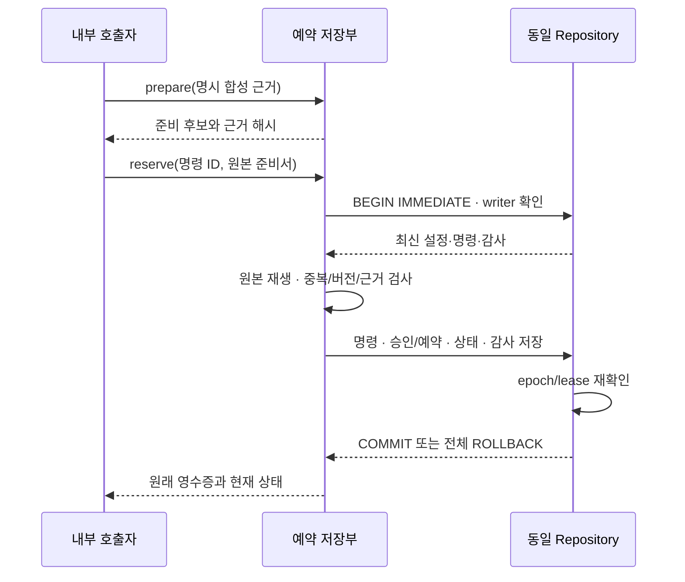

# 로컬 승인·현금/위험 예약 저장 — C2 로컬 저장부

2026-09-24 · DEV-D03 내부 C2의 **V1 미전송 예약 저장 부분**이다. 기존 Repository의 동일 연결·writer·epoch·lease 안에서 최신 근거를 재계산하고 승인·예약·명령·감사를 한 COMMIT으로 저장한다. **모의/실제 브로커 접수나 체결 연결은 없다.** 후속 오프라인 연결은 별도 [V2 합성 인계](COST_HANDOFF.md)를 따르며 기존 V1 DB를 자동 전환하지 않는다. `orderSubmissionAllowed`, `learningAllowed`, `liveEnabled`는 모두 `false`다.

## 현재 지원 범위

| 구분 | 동작과 경계 |
| --- | --- |
| 입력 | 신뢰하는 내부 합성 `State`와 [C1 원본 book](COST_ADMISSION_REVIEW.md), 명시 비용 프로필/호가/시나리오. 외부 계좌 JSON 인증 API가 아니다. |
| 신규 예약 | 실행당 설정된 KR 또는 US 한 시장. 기존 book의 양 시장 노출 합산과 같은 실행의 양 시장 신규 예약은 다르다. |
| 상태 | `RESERVED_LOCAL`은 주문을 보내지 않은 현금/위험 예약이다. `RELEASED_LOCAL`은 명시적으로 해제한 기록이며 브로커 취소 성공을 의미하지 않는다. |
| 원본 사건 | 초기 B 설정·사건은 고정한다. 이 저장부에 새 B 주문/체결/결제 사건을 추가하는 기능은 없다. |
| 보존 | 초기 현금·원본 사건·의도 횟수·고점/위험 중지 이력을 임의 초기화하지 않는다. 해제해도 사용한 의도 횟수는 되돌리지 않는다. |
| 활성화 | 서버 엔드포인트·UI·공용 Engine·실제 API·계좌·유료 AI 연결 없음. 구형 실행의 자동 전환/마이그레이션 없음. |

구현은 [순수 상태 전이](../src/core/cost-reservation.ts), [동일 Repository 저장](../src/server/cost-reservation-store.ts), [현금·위험 투영](../src/core/cost-risk-context.ts)에 있다. B와 C2를 서로 다른 DB에 먼저 확정한 뒤 동기화하는 방식이 아니다. 이번 C2 실행의 고정 B 원본은 C2 초기 설정 안에 있으며, 기존 B DB를 병합하거나 두 writer를 동시에 운용하지 않는다.

## 원자 경계와 근거 검증



단일 COMMIT은 중간 상태가 다른 읽기에 보이지 않는 원자성을 뜻하며 **1ms 처리나 손실 한도 보장**을 뜻하지 않는다. SQLite WAL/FULL 및 기존 Repository writer 계약을 재사용한다. 트랜잭션 중 lease가 만료되면 마지막 검사에서 전체 롤백한다. 중복 응답도 현재 writer 검사를 건너뛰지 않는다.

새 DB 모드는 `SYNTHETIC_LOCAL_COST_RESERVATIONS_V1`이다. 비어 있는 Repository에서 명시 초기화하며 설정/상태, 명령, 승인 기록용 세 테이블과 공통 audit를 사용한다. 구형 aggregate/commands와 B 테이블이 있는 DB는 거절하고, 구형/B reader도 C2 DB를 거절한다. 일부 테이블만 남은 경우 자동 복구·덮어쓰지 않는다.

`read()`와 쓰기 직전에는 초기 설정부터 저장된 원본 명령을 재생한다. 순번·예상 상태/버전·epoch·입력 해시·영수증·감사·저장 캐시를 비교한다. 캐시와 그 checksum만 바꿔도 원본 재생 결과와 다르면 거절한다. 해시는 인증 서명이 아니므로 관리자 권한으로 모든 원본과 해시를 함께 조작하는 공격이나 실제 자료의 진실성을 보장하지 않는다.

## 명령 계약

| 메서드 | 허용 동작 | 실패 시 처리 |
| --- | --- | --- |
| `prepare(proposal)` | 현재 투영 상태의 정확한 해시와 프로필/시나리오로 후보 재계산. 새 예약은 하지 않음 | 현금·위험·보호·경제성·신선도 문제는 HOLD 오류 |
| `reserve(commandId, prepared)` | 같은 저장부에서 발급한 미변경 준비서만 최초 확정. COMMIT 안에서 최신 상태로 다시 검사 | 다른 후보가 먼저 확정됐거나 OBSERVE/epoch가 바뀌면 재준비 필요 |
| `release(commandId, reservationId, expected)` | 예상 버전/해시가 같은 활성 미전송 예약만 명시 해제 | 체결·브로커 취소를 추정하지 않음. 오류/중간 실패 시 전체 롤백 |
| `observe(commandId, observation, expected)` | 단조 증가하는 합성 시각·현재 FX/계좌 시각 및 모든 기존 source의 명시 위험 관측값 갱신 | 누락/중복 source, 시간 역행, 일/주/월 경계 전환, 임의 seed 교체 거절 |

`proposal`은 `reservationId`, 비용 `profile`, 비용 수량 `request`다. 요청 state 해시는 `store.context()`가 돌려주는 파생 상태의 해시여야 하며 저장부가 잘못된 해시를 자동 교체하지 않는다. `WeakMap`은 최초 준비서의 프로세스 내 출처/수정 여부를 구별할 뿐 영구 인증이나 접근 제어가 아니다.

같은 명령 ID와 동일 정규화 입력의 재수신은 원래 `receipt`와 지금의 `current`를 함께 반환하며 다시 예약하지 않는다. 이미 해제된 예약의 예전 승인 요청을 재전송해도 부활하지 않는다. 동일 ID에 다른 입력을 붙이면 충돌이다. 예약 ID도 해제 후 재사용하지 않는다.

재시작 후 이미 확정된 `reserve`는 저장해 둔 원래 준비서 입력으로 중복 조회할 수 있다. 미확정/새 예약은 현재 writer에서 다시 준비한다. `release`/`observe`는 호출 당시 writer epoch로 입력을 구성하므로, **이전 COMMIT에 저장된 ID를 writer 교체 후 재구성하면 입력 충돌**이다. 이전 시도가 롤백되어 ID가 없다면 같은 ID가 새 입력으로 처음 확정될 수도 있다.

`release` 재대조는 현재 상태를 먼저 읽는다. 해제된 상태면 새 해제 요청을 만들지 않고, 활성 상태라면 최신 상태를 기준으로 새 명령 ID를 쓴다. `observe`는 현재 관측·버전과 필요한 최신 관측을 대조해 새 유효 관측을 준비한다. 현재 스냅샷만으로 과거 OBSERVE 명령의 확정 여부 전부를 증명하는 API는 아니다. 무조건 재전송하거나 명령 실패를 예약 해제 성공으로 해석하지 않는다.

## 현금·위험·관측의 의미

기존 C1/B 노출에 활성 로컬 예약을 덧붙인다. 원통화 현금 예약에는 진입 대금과 보수적 진입 비용이 들어간다. 원통화 위험 예약에는 가격 위험, 진입비용, 최대 대체 주문을 포함한 미래 청산비용 상계와 불리한 청산 여유가 들어간다. 현재 FX로 원화 위험을 다시 평가하고 기존 전체/상관군/기간 손실 한도와 종목 수를 그대로 적용한다. 원본 R0 경제성 문턱은 변경하지 않는다.

예약은 실제 현금 지급/환전이 아니다. 초기 지갑은 유지하며 가용 현금에서 예약만 차감한다. 두 후보가 각각 가능했더라도 하나가 먼저 확정되면 두 번째는 감소한 현금·위험으로 다시 계산해야 한다. 같은 종목의 추가 예약은 거절한다. 미래 수수료 예약을 이미 지급한 외화 자산 감소로 인정하지 않는다.

`withLocalCostReservations()`는 **신뢰하는 reducer 전용 내부 계산 도우미**다. 표현 형식은 검사하지만 호출자가 준 `riskNative`를 원본 프로필로 다시 검증하지 않는다. 저장부는 프로필/요청의 원본 명령을 재생해 해당 값을 산출한다. 외부 입력용 위험 인증 API로 노출하지 않는다. 파생 `INTENT_SAVED` 주문 모양은 기존 위험 계산 재사용용이며 B `WORKING` 사건이나 실행 가능한 구형 aggregate로 저장하지 않는다.

OBSERVE는 명시 합성 관측만 받는다. 논리적 시장 시각은 자동으로 실제 시계에 맞춰 흐르지 않는다. 실제 시계는 writer lease에만 사용한다. 외부 공급원 인증·연속 수신·호가 자동 갱신이 아니며 비용 근거 만료/불완전 관측은 신규 준비를 보류한다. 이미 예약한 금액은 만료됐다고 자동 해제하지 않는다. 고점과 손실 중지 래치는 정상으로 되돌리는 관측을 받아도 임의 삭제하지 않는다.

## 자원 제한과 개발 검사

원본 book은 최대 10개 source × 각 500사건, 로컬 실행은 최대 100개 확정 명령이다. 활성 예약마다 해제 명령 슬롯 하나를 남기므로 OBSERVE/새 RESERVE가 이 여유를 소진할 수 없다. 슬롯은 CPU 시간이나 lease 여유를 보장하지 않는다. 상한에 도달하면 새 작업을 멈추고 기록을 보존하며 초기화/삭제/자동 새 실행으로 제한을 우회하지 않는다.

프로젝트 루트 PowerShell, 기존 설치 의존성의 Node 24.20.0/npm 11.19.0 기준이다.

```powershell
npm run build:engine
node --test dist/runtime/tests/cost-reservation.test.js
```

아래 JavaScript는 빌드된 **시험 fixture**를 사용하는 메모리 DB 예제다. 사용자 DB·계좌·키에 접근하지 않는다. 루트에서 `node --input-type=module --eval`로 실행할 수 있다.

```javascript
import { Repository } from './dist/runtime/src/server/repository.js';
import { CostReservationStore } from './dist/runtime/src/server/cost-reservation-store.js';
import { reservationConfig, proposal } from './dist/runtime/tests/cost-reservation-helpers.js';

const repo = new Repository(':memory:');
repo.acquire();
try {
  const store = new CostReservationStore(repo, reservationConfig(), { initialize: true });
  const prepared = store.prepare(proposal(store));
  const accepted = store.reserve('reserve-1', prepared);
  const released = store.release('release-1', 'r-FIRST', accepted.current);
  const retry = store.reserve('reserve-1', prepared);
  console.log(accepted.current.approvals[0].status, released.current.approvals[0].status,
    retry.duplicate, retry.current.orderSubmissionAllowed);
  // RESERVED_LOCAL RELEASED_LOCAL true false
} finally {
  repo.close();
}
```

[전용 시험](../tests/cost-reservation.test.ts)은 KR/US 각각의 예약, 현금·상관 위험 경쟁, 중복/상충, 취소 뒤 오래된 승인 재전송, FX/근거 만료, 관측 제한/손실 래치, 예외·lease 만료·두 writer 인계, 중간 읽기, 변조·모드 격리, 소유 시험 자식 종료를 검사한다. 실제 시계의 제한된 표본은 원본 2사건·보유 1종목·신규 예약 1개·32 OBSERVE 후 마지막 해제다. **10×500×100 상한 부하·장시간 실행·성능 SLA는 검증하지 않았다.** 전체 회귀와 정확한 결과/실패 로그는 [PROGRESS · 공개 요약](PROJECT_STATUS.md)를 따른다.

## 남은 단계

후속 **C2의 합성 접수·체결 인계**는 [명시 V2 계약](COST_HANDOFF.md)으로 구현했다. 같은 COMMIT에서 로컬 예약을 B 사건·장부로 한 번 인계하고, 미확정·부분 체결·취소 경합의 체결/비용/미결제를 재생한다. 이 문서의 V1 모드에는 그 기능을 소급 추가하지 않는다. V2에서도 인계된 예약에 로컬 해제를 재사용하지 않는다. 다음은 닫힌 합성 매매의 손실 횟수·쿨다운 대조이며 기존 B DB와 혼합하거나 구형 Engine에 투영을 주입하지 않는다.

공용 실행·보고/학습·미결정 운영비·위험 기간 전환은 남아 있다. 실제 요율·시세·계좌·브로커 접수·정산·수익성·OS 격리/전원 차단·새 설치·웹 UI도 이번 범위 밖이다. API 키는 아직 필요 없다. 내부 로컬 저장 인수가 C2 전체/D03-03 인수는 아니므로 D03 2/4, 가이드 10/40, 누적 등록 작업 158/167을 유지한다.
