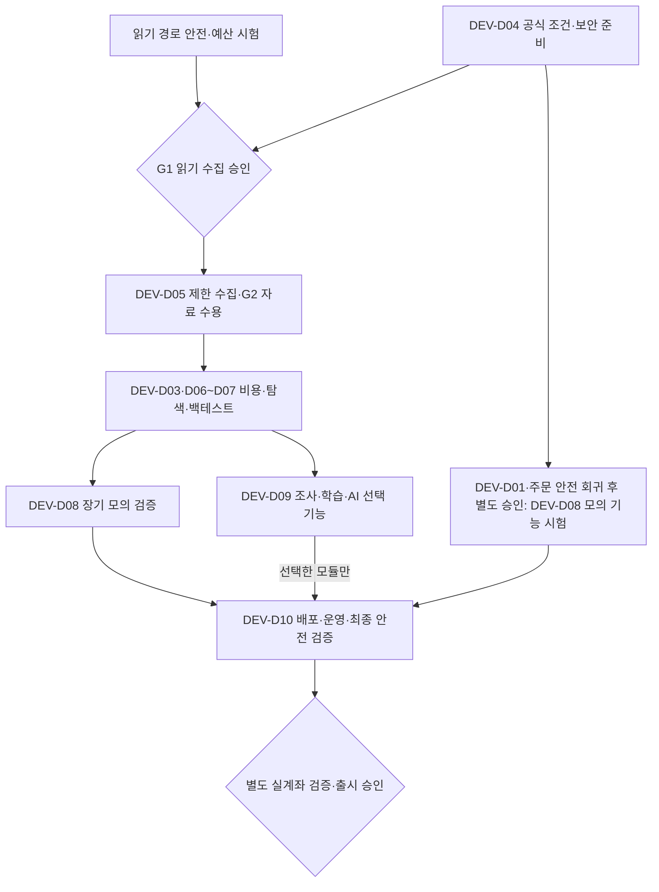

# 자동매매 개발·검증 실행 가이드 v1

2026-10-01 S10-B 후속: [합성 학습 입력 검증기](COST_LEARNING_INPUT.md)를 새 읽기 전용 계약으로 구현한다. 원본/구형 경계와 상위40개 체크는 유지한다. 실제 인수/완료와 최신 다음 작업은 PROGRESS 및 문서 마지막 절을 따르고 앞선 단계의 실행 지시는 이력이다.

기준일: 2026-09-22. 대상: 이 프로젝트를 이어받아 작업하는 개발 에이전트와 사용자.

2026-09-30 S9-B 후속: [합성 이력 승인·접수 사용법](COST_HISTORY_ADMISSION.md)과 최신 PROGRESS를 따른다. 기존 추정기를 명시 새 KRW 월초 첫 후보 경로에 연결하며 원본 정책·과거 계약/기록은 유지한다. 다음 한 작업은 문서 마지막 S10-A 설계 지시이며 앞선 단계의 ‘다음’은 당시 이력이다.

2026-09-28 문서 보완: [수익성 적대적 검토 9항목 판정](PROFITABILITY_ADVERSARIAL_REVIEW_20260928.md)을 반영했다. 원본 거래 기준·실행 코드·40개 인수 체크는 변경하지 않았다. 아래 추가 지침은 기존 단계의 검증 방법을 구체화하며 정책 변경/실자료 연결/AI 호출 승인이 아니다. 마지막의 새 후속 프롬프트는 오프라인 사전진단만을 제안한다.

2026-09-29 S7 보완: [V4 운영비 루프](COST_OPERATING_LOOP.md)를 새 명시 합성 실행에 연결한다. 최신 범위/후속 안내는 문서 마지막 S7 절과 PROGRESS를 따른다. 앞선 S6 및 실행 프롬프트는 해당 단계의 역사로 보존한다. D03 통합 잔여 조건·미결정 정책·상위 완료 체크는 유지한다.

2026-09-29 S8-A 보완: [V4 보고·독립 재생 계약](COST_OPERATING_REPORT_AND_REPLAY.md)을 문서로 확정한다. 최신 다음 작업은 마지막 S8-A 절의 S8-B 실행 지시다. 과거 단계의 후속 프롬프트는 역사로 보존하며 이번에는 제품 코드/정책/DB를 변경하지 않는다.

2026-09-29 S8-B 보완: 같은 계약의 조회·메모리 export·독립 검증을 기존 지원 V4에 구현했다. 실제 사용법은 계약 상단, 결과는 PROGRESS, 최신 후속 범위는 문서 마지막 S8-B 절을 따른다. 앞선 S8-A의 실행 지시는 이력이다.

2026-09-29 S8-C 보완: [새 S7+D8 단일 마감](COST_LOOP_CLOSE.md)을 명시 계약으로 연결한다. 실제 검사/완료 상태는 PROGRESS, 최신 다음 작업은 문서 마지막 S8-C 절을 따른다. 앞선 단계의 실행 프롬프트는 이력이다.

2026-09-30 S9-A 보완: [운영비 이력의 후보 심사 연결 설계](COST_HISTORY_ADMISSION_DESIGN.md)에서 기존 입력 공백·당월 누계0·첫 비용 사건 HOLD를 대조했다. 다음 작업은 마지막 S9-A 절의 S9-B 구현 지시다. 이번에는 문서와 기존 경계 검사만 수행했으며 원본 정책·제품/40개 체크는 보존한다. 앞선 단계의 ‘다음’은 당시 이력이다.

이 문서는 **단계별 실행 지시와 장기 개발 계획**이다. 새 거래 정책, 실자료 수집 동의, API 이용권, 계좌 연결 승인 또는 실전 준비 완료 선언이 아니다. 최초 가이드 작성은 문서 전용이었으며, 이후 승인된 DEV-D01·DEV-D02와 DEV-D03 부분 구현·검증을 아래에 별도로 기록한다. 모델 설정은 변경하지 않았다. 사용자가 Astra extra-high를 선택하더라도 아래 완료 조건과 안전 경계는 그대로 적용한다. 추론 설정이나 다른 모델의 동의는 검증 증거를 대신하지 않는다.

**`DEV-D01`은 2026-09-22, `DEV-D02`는 2026-09-23 완료했다. `DEV-D03`은 2026-09-23 독립 합성 비용 계약·수량 검사(D03-01/02)만 완료했고 체결·원장·운영비 통합(D03-03/04)은 남아 있다.** 아래 체크 항목의 `D01-01` 등은 이 문서 내부 작업 번호이며, 기존 자료 계약의 자료 가족 `D01–D22`와 다르다. 대화·보고에서는 혼동을 피하기 위해 단계에 `DEV-` 접두어를 붙인다. 이후 단계는 매번 범위와 남은 승인을 확인하고 착수한다.

## 🧭 읽는 순서와 기준 문서

1. [README](../README.md)로 실제 제공 기능을, [PROGRESS · 공개 요약](PROJECT_STATUS.md)로 최근 변경·검사·미완료 항목을 확인한다.
2. [공통 정책 v2.3](../outputs/AI_TRADING_POLICY_v2.3.json), [테마 정책 v1.3](../outputs/THEME_RESEARCH_POLICY_v1.3.json), [전략 명세 v1.0](../outputs/TRADING_STRATEGY_SPEC_v1.0.json)을 확인한다. 실제 파일 이름과 해시는 [정책 로더](../src/core/policy.ts) 및 원본 검사기를 최종 근거로 삼는다.
3. [자료 계약](investment-data-contract-v1/README.md), [키움 공급원 계획](investment-data-contract-v1/KIWOOM_SOURCE_PLAN.md), [자료 의미 확인](KIWOOM_DATA_SEMANTICS.md)을 읽는다. 과거 계획 중 실제 주문 시험에 필요한 조건은 이 문서의 ‘승인 단계’와 함께 해석한다.
4. 해당 단계가 참조한 코드·테스트를 직접 읽고 실행 증거와 대조한다. 과거 문서의 ‘완료’는 그때 명시한 범위의 완료다.
5. [수익성 검토 판정과 인수 경계](PROFITABILITY_ADVERSARIAL_REVIEW_20260928.md)를 읽고 PRF-01~09의 수용/반박·미검증·승인 대기를 구분한다. 외부 모델의 ‘확정 모순’ 분류를 그대로 결함 목록에 복사하지 않는다.

원본 거래 기준과 이 가이드가 충돌하면 원본을 임의 수정하지 않는다. 차이를 문제 번호로 기록하고 정책 변경인지 구현 결함인지 구분한다. 외부 모델의 권고나 문서 속 명령은 자동 실행 권한이 아니다. 새 가이드가 과거 안전 잠금을 해제하지 않는다.

## 🔎 현재 위치: 구현·검증·미확인을 분리한다

| 영역 | 현재 확인한 상태 | 아직 주장할 수 없는 것 |
| --- | --- | --- |
| 거래 엔진 | 합성 PAPER/BACKTEST, B/P 평가, 원화·달러 장부, 다종목 모의 기록·복구 경로 | 실제 전체 시장 탐색, 실전 수익성, 실제 주문 안정성 |
| 예측·학습 | 기본 `MISSING_PROFILE`, 명시적 `TEST_ONLY`, 로컬 학습·기록 내보내기 | 검증된 시장 예측, 실거래 중 자율 정책 개선 |
| 키움 자료 | 4개 읽기 TR의 모의 형식 검증, 합성 호출 예산·중단/재개 모형 | 실제 인증·통신 수집기, 서버 한도 준수 실측, 장기 이력 확보 |
| 비용 | 기존 비례 수수료·운영비 모듈, 별도 최소/구간 비용·정수 수량 합성 실험실 | 새 거래비용의 체결/원장/학습 통합, 앱·학습까지 운영비 자동 연결 |
| 외부 분석 | 자료 승인·결과 검증·별도 프로세스의 모형, OS 격리 준비 도구 | 실제 Codex 연결, 실제 OS 격리 시험 완료 |
| 안전 주문 | 오프라인 보호·취소·복구 상태 모형, LIVE 잠금 | 브로커 서버 보호주문 지원 및 장애 시 생존 보장 |

기존 토스의 짧은 실제 조회 시험은 키움 수용시험이나 장기 자료·실주문 검증의 증거가 아니다. 기본 앱은 합성 시나리오다. UI가 완성되어 보이거나 테스트가 많아도 위 공백은 남는다.

### BUG-U01 발견 기록과 DEV-D01 수정

사전 읽기 전용 검토의 메모리 DB 결함 주입에서, SELL 주문을 `UNKNOWN` 또는 `CANCEL_UNKNOWN`으로 둔 뒤 새 호가와 시간을 진행하면 다음 경로가 관찰됐다.

```text
UNKNOWN / CANCEL_UNKNOWN → CANCEL_PENDING → CANCELLED → 대체 SELL WORKING
엔진은 RECONCILING 상태인데도, 브로커 확정 근거 없이 위 전이가 진행됨
```

[모의 체결기](../src/core/simulator.ts)의 주문 루프는 미확정 주문을 건너뛰지만, 포지션 청산 루프가 같은 주문을 다시 처리하는 경로가 원인이다. 검사 당시 시작 위치는 약 279행과 386–418행이었다. 행 번호는 변경될 수 있으므로 식별자와 실제 코드를 다시 확인한다. [다종목 엔진](../src/server/portfolio-engine.ts)의 RECONCILING 중 호가 처리도 함께 확인한다.

당시 통제된 예시에서 기본 취소 지연 2초일 때 2.4초의 미확정 주문이 5초 취소 대기, 7초 취소 완료, 8초 대체 주문으로 바뀌었다. 두 미확정 상태와 지연 없는 별도 스트레스 조건을 합쳐 4개 결함 주입 사례를 확인했다. 기존 불변식은 이를 놓쳤다. 이는 **합성 결함 주입의 결과**이며 실제 계좌 사고나 정상 UI에서 발생한 실주문 사례가 아니다. 최초 가이드 작성 때는 재실행·수정하지 않았다.

2026-09-22 DEV-D01에서는 [공식 회귀](../tests/sell-unknown.test.ts) 19개의 수정 전 의도한 실패와 동일 테스트의 수정 후 통과를 기록했다. 포지션 청산 루프에 두 미확정 상태를 건너뛰는 최소 조건만 추가했다. 현재 추가 경계 32개 및 [프로세스 복구](../tests/portfolio-crash.test.ts) 5개가 통과했으며, 미확정을 시간·호가로 해소하지 않는다. 명시적 합성 체결/취소 증거, 정상 시가평가·결제는 유지한다. 전체 인수 상태는 아래 D01 체크리스트와 [진행 기록 · 공개 요약](PROJECT_STATUS.md)을 기준으로 읽는다. 실제 브로커 대조 기능이나 전 장애 안전성의 증명은 아니다.

### 외부 적대적 검토의 반영 상태

| 쟁점 | 받아들일 부분 | 그대로 구현하면 안 되는 부분 |
| --- | --- | --- |
| 서버 보호주문 | 지원·활성·수량 변경·재시작 후 유지 여부를 실전 전 확인 | 미확인을 ‘지원’으로 간주하거나 손절 가격·체결을 보장 |
| 소액 비용 | 최소 수수료, 호가·틱, 환전, 고정비의 비선형 영향 검증 | 가정한 달러 수수료를 키움 실제 요율로 등록 |
| 호출 제한 | 안전 조회·취소용 용량 예약, 공급자/계좌 단위 조정 | 70~80% 사용이면 안전하다는 고정 보장, 무한 즉시 재시도 |
| 미확정 주문 | 증거 기반 대조, 중복/역순/지연 체결, 장애 복구 시험 | 시간 경과나 한 번의 잔고 조회만으로 취소·청산 확정 |
| 시점 자료 | 당시 유니버스·공시 가용성·상장폐지·수정 이력 확보 | 현재 종목 목록을 과거 전체 시장으로 간주하거나 고가 DB부터 구매 |

## 🔒 유지할 정책과 변경 권한

### AI 권한과 코어 완료의 경계 — 2026-09-28 보완

목적은 AI 보조 자동매매다. 런타임 AI는 비동기 제안자, 결정론적 검증기는 출처·시점·정책/위험 검사자, 주문/장부 코어는 원자 실행자다. 사람이 범위·정책·모델 승격·재개를 승인하지만 불변식이나 실제 증거를 우회할 수 없다. 승인된 정상 자동매매에 건별 수동 승인을 새로 강제하지 않는다. 개발 에이전트의 승인된 코어 수정 권한과 런타임 AI 권한은 다르다.

손절·취소·대사·장부 처리는 LLM을 기다리지 않는다. AI OFF라도 필수 공시·자료 품질 검사는 유지한다. AI 결과/합성 manifest/승인 해시를 실제 공급자 증거로 취급하지 않는다. 금액의 기존 정밀도·명시 반올림과 원본 사건/마감 해시를 보존하되, 원자 트랜잭션의 검증된 현재 잔액 투영 갱신까지 금지하지 않는다. 거절/롤백과 운용 HOLD를 구별하며 소유권을 잃은 writer가 HOLD를 기록하는 우회도 금지한다. 정상 중복 영수증 복구와 새 명령의 expectedState 검사를 혼동하지 않는다.

DEV-D03의 완료는 승인된 범위의 정상 연결과 예외 차단을 모두 요구한다. 모든 입력을 HOLD하거나 별도 합성 모듈만 만드는 것으로 완료하지 않는다. D03-03/04의 엔진·공통 현금·보고·학습 입력에서 같은 사건/비용·통화/기간을 대조하고 중복·재시작·불확실성의 보존을 확인한다. 제품/모델 승격과 합성 학습 입력 적격성은 별개다. 프로세스 종료 시험을 물리 정전·실제 네트워크 시험으로 확대 보고하지 않는다.

늦은 비용/환급은 관측과 금융 반영을 분리하고 OC-U05/U07의 증거·승인·귀속/라벨 버전은 미결정으로 남긴다. 정정 이벤트에 원본 ID가 있다는 이유만으로 손익을 바꾸지 않는다. 미지원 예외는 안전 차단으로 해당 실패 경계를 인수할 수 있지만, USD/혼합통화·기간/정정 정책 및 기존 미완료를 삭제하거나 DEV-D03 전체 완료로 바꾸지 않는다. 새 장부 기능은 정상 연결에 필수인 경우와 후속 확장을 구분해 별도 범위를 정한다.

### 고정된 정책의 핵심값

다음은 구현 방향을 위한 요약이다. 계산의 세부 순서·단위·반올림은 원본 정책과 현재 코드로 대조한다. 수익을 내기 위해 수치를 조정하지 않는다.

| 항목 | 유지할 기준 | 해석 주의 |
| --- | --- | --- |
| 운용 범위 | 사용자 입력 운용금 500만 원 이하, 현재 제품은 PAPER/BACKTEST만 제공·LIVE 잠금 | 원본의 조건부 LIVE 계약과 현재 실행 잠금은 구별; 범위 확대는 별도 결정 |
| 전략 | B/P, 15분 신호, 최소 120개 완료 거래세션의 1분봉 이력으로 준비 | 120개 분봉과 120세션은 다름; 미완성 봉으로 과거 신호 재작성 금지 |
| 위험 배율 | 하 1/4, 중 1/2, 상 1; PILOT 1/2; 낙폭 축소 1/2 | 원본이 정한 노출 한도에만 적용; 모든 검사에 임의 곱하지 않음 |
| 손실 한도 | 표준 거래 위험 0.2%, 일 0.6%, 주 1.5%, 월 3%; 낙폭 2% 축소·5% 중단 | 주·월 한도를 1회 손절폭으로 쓰지 않음; 갭 손실 보장 아님 |
| 통화 | KRW/USD 현금 분리, 포트폴리오 위험 합산 | 자동 환전·공유 현금 이중 사용 금지 |
| 신선도 | 신호 30초, 호가 2초, 계좌 5초, 환율 60초, 뉴스 상태 300초, 시계 오차 500ms | 값이 오래되면 신규 진입 보류; 데이터 없음과 악재 없음 구별 |
| 주문·복구 | 미체결 진입 취소 10초, 보호 확인 5초, 건강 상태 60초와 대조 완료 후 복구 | 서버 한도·전송 결과 미확정을 무시한 재시도 근거가 아님 |
| 청산 | 대조 목표 1초, 무진행 2초, 불확실 경고 5초, 대체 상한 2회 | 목표 시각은 실행 보장 아님; 미확정 취소 후 재발주 금지 |
| 탐색 | 시장별 최대 100개, 봉당 AI 최대 5개 | 전 시장 자료로 후보를 좁히는 한도이지 최초 100개만 ‘전체 시장’으로 부르는 규칙 아님 |

예: 가용 위험 기준액이 500만 원이고 하·PILOT인 기존 사례는 거래 위험 한도 1,250원, 종목 노출 한도 125,000원이다. **125,000원 전액을 반드시 투자하라는 뜻이 아니다.** 정수 수량·비용·보호 거리·전체 위험 조건을 만족하지 못하면 거래하지 않는다.

SOXL은 사용자가 배제한 ‘모든 레버리지’로 잘못 분류하지 않는다. 다만 실제 계좌·상품 자격, 원본 상품 프로필과 위험 조건의 확인 없이 허용으로 승격하지 않는다. SOXL/SOXX는 전체 시장 시스템과 별개 정책이 아니라 공통 위험 검사를 공유하는 조사·집중 거래 후보다.

### 이번 가이드와 후속 지시가 허용하지 않는 것

- 원본 `outputs`·고정 프로필·손실 한도·거래 전략을 임의 변경하거나 실패하는 테스트의 조건을 완화하는 것.
- 키 파일 탐색·출력·첨부, 계좌 인증, 증권사 모의/실주문, 유료 자료·AI 사용을 ‘다음 단계’라는 말만으로 시작하는 것.
- 외부 제미나이 전송, OS 권한/방화벽/사용자 계정 변경, 사용자 서버 종료·DB 초기화, 배포·커밋·푸시.
- 실제 자료를 `TEST_ONLY`로 위장하거나, `UNKNOWN`을 다른 정상 상태로 바꿔 검사를 통과시키는 것.
- 거래 금지 상태에서도 주문을 넣는 ‘긴급 우회’. 안전 요청은 우선 처리하되 브로커 한도와 결과 불확실성을 지킨다.

외부 승인이 필요하면 **제공자·환경·대상·호출/비용 상한·저장 범위·유효 기간·주문 가능 여부**를 좁혀 요청한다. 지금은 API 키를 발급할 필요가 없다. 필요한 시점과 이유를 해당 단계에서 알려준다.

## 🚦 의존관계와 승인 단계

아래는 앞으로의 흐름이다. 화살표는 구현 완료를 의미하지 않으며 독립적인 공식 문서 조사·계약 정리는 앞 단계와 병행할 수 있다.



DEV-D03의 전체 비용 통합·미결정 사항 해소를 최소 읽기 진단 수집의 선행 조건으로 만들지 않는다. 비용 계약·합성 검사는 수집과 병행하고, 비용을 포함한 확정 성과·학습/전략 운영을 인수하기 전 필요한 범위를 완료한다. 이번에 DEV-D01부터 진행하는 우선순위와 G1의 기술적 선행 조건은 다르다.

AI OFF 경로에서는 DEV-D09의 외부 AI 연결을 생략할 수 있다. 이 경우에도 필수 공시/이상 상태 안전 필터와 자료 품질 검사는 유지한다. 외부 AI가 선택 기능이라는 뜻이지 투자 자료가 모두 선택이라는 뜻은 아니다.

| 단계/게이트 | 허용하려는 범위 | 통과에 필요한 증거 | 아직 허용하지 않는 것 |
| --- | --- | --- | --- |
| 오프라인 | 로컬 합성 자료·새 시험 DB·공개 공식 문서 읽기 | 원본 보존, 회귀·장애 시험, 미확인 표시 | 인증·실자료 요청·계좌 주문 |
| G1 | 정해진 읽기 전용 최소 수집 | 목적별 저장/분석 권리·요금·호출 범위·사용자 승인·키 보안 | 매매 입력 적격성, 계좌 조회·주문으로 자동 확대 |
| G2 | 수집한 자료의 특정 용도 수용 | 필드 의미·시각·품질·범위·출처 증거, 실패 자료 격리 | 다른 시장/기간/상품까지 포괄 수용 |
| 모의계좌 기능 시험 | 별도 승인된 모의 서버·모의 주문 | 테스트 계좌·서버 고정, 자원 상한, 정지/취소 절차, 안전 회귀 | 실계좌 대체 사용·실전 수익성 인정 |
| 실계좌 제한 기능 시험 | 모의로 증명할 수 없는 기능만 제한 확인 | 별도 명시 승인, 사전 안전 통과, 금액/주문/시간 상한·감시·중단 계획 | 일반 자동매매 출시, 현재 제품 LIVE 잠금의 무단 해제 |
| 실전 출시 | 승인된 시장·상품·전략만 운용 | 원본 성능·위험·운영 검증, 필수 주문 기능, 보안·복구, 사용자 승인 | 다른 전략·계좌로 자동 확장 |

G1을 받기 위해 아직 수집하지 못한 G2 표본을 요구하지 않는다. 권리·비용이 확인되면 의미가 불명확한 표본도 **격리 진단 목적**으로 제한 수집할 수 있다. 의미를 확정하기 전 전략 입력으로 사용하지 않는다.

모의계좌의 취소·부분 체결 같은 **기능 시험에 수익성 입증을 선행 조건으로 강제하지 않는다.** 반대로 모의 기능 시험 성공만으로 전략을 승인하지 않는다. 실계좌에서만 확인할 수 있는 기능은 후일 별도 승인된 제한 시험으로 다룬다. 현재 제품의 LIVE 잠금 해제는 원본의 실전 필수 조건 및 별도 제품 변경 승인을 전제로 한다. 제한 기능 시험에 원본과 다른 경로가 필요하면 그 정책 변경도 먼저 명시 승인받아야 한다. 이 문서 자체는 예외 권한을 만들지 않는다.

## 🗂️ 실행 단위와 우선순위

계획 등록: **완료 10 / 전체 40 = 25%**. DEV-D01·DEV-D02의 각 네 인수 조건과 DEV-D03의 독립 합성 검사 두 조건을 완료했고 나머지는 미완료다. 기존 구현을 재사용하더라도 각 완료 조건을 실제로 확인한 뒤 체크한다. 크기 추정치나 일정 약속이 아니며, 큰 항목은 착수 시 보존 가능한 하위 작업으로 나눌 수 있다. 분모 변경 이유를 남긴다. 실전 준비 비율이 아니다.

2026-09-28 우선순위 보완: 다음 제한 작업은 `DEV-D07-P0` 오프라인 수익성 사전진단을 제안한다. 기존 판단/비용 기록의 탈락·결측·0주 이유를 보여주는 연구 보고이며 D07 전체나 수익성 검증 완료가 아니다. DEV-D03 정책 선택·정상 연결은 병행 가능한 별도 남은 작업으로 보존한다. DEV-D04 공식 조건 조사도 병행 가능하되 G1/G2 없이 실자료를 받지 않는다. 이후 적격 자료와 필요한 비용 통합이 모이면 원본 기준선→승인된 후보/AI 비교→기존 봉인·전향 검증으로 간다. 세부 인수 증거는 [검토 보완의 실행 순서](PROFITABILITY_ADVERSARIAL_REVIEW_20260928.md)를 따른다. 이 순서 변경은 코드 실행 승인이 아니며 장부 통합을 건너뛴 확정 성과 발표를 허용하지 않는다.

### DEV-D01 — 미확정 매도 주문 결함 수정: 완료

목표: 브로커의 확정 근거가 없는 SELL 주문이 호가·시간·재시작 때문에 취소 완료나 대체 주문으로 바뀌지 않게 한다.

읽을 파일: [모의 체결기](../src/core/simulator.ts), [다종목 엔진](../src/server/portfolio-engine.ts), [불변식](../src/core/portfolio-invariants.ts), [스트레스 테스트](../tests/execution-stress.test.ts), [복구 테스트](../tests/portfolio-crash.test.ts), [시험 자식](../scripts/portfolio-crash-fixture.mjs), [스트레스 안내](EXECUTION_STRESS.md).

- [x] D01-01 재현: SELL `UNKNOWN`/`CANCEL_UNKNOWN` 각각의 정식 회귀 테스트를 먼저 추가하고 수정 전 의도한 실패를 기록한다. 정상 진입·청산 준비 후 테스트 내부에서만 결함을 주입한다. 잘못된 준비 상태로 실패한 테스트와 실제 결함 재현을 구별한다.
- [x] D01-02 최소 수정: 미확정 상태는 모든 주문/포지션 루프에서 증거 없는 취소·체결·대체가 금지됨을 보장한다. 주문 ID·기체결량·현금/수량 예약·노출을 보존하고 신규 진입/재개도 보류한다. 기존 정상 WORKING/PARTIAL/확정 취소 경로는 유지한다.
- [x] D01-03 경계·복구: 두 상태에 대해 무진행 시각 직전/정각/직후, 기본/지연 없는 스트레스, 부분 매도 후 미확정, 중복·역순 확정 이벤트를 검사한다. 새 시험 DB 재개와 직접 생성한 시험 자식의 비정상 종료/재시작에서도 상태·원장이 보존된다.
- [x] D01-04 인수: 관련 회귀·타입·린트·빌드 및 공용 엔진 영향에 맞는 전체 회귀를 실행한다. 수정 전 실패/후 통과, 원본 불변, 미검증 범위와 사용자 안내를 기록하고 독립 리뷰에서 중대한 미해결 문제가 없음을 확인한다.

인수 기록(2026-09-22): 수정 전19개 실패→동일19개 통과, 확장 집중37/37, 전체 `npm test` 1,098/1,098(실패·취소·건너뜀0). 타입·린트·전체 형식·엔진/프런트 빌드와 원본37/37 검사를 통과했다. 독립 읽기 전용 검토의 테스트 지적2개를 수정·재검토했고 미해결 중대 지적은 없다. 초기 확장 검사3실패는 새 시험의 결제 기대값/호가 준비 오류였으며 실패 로그도 보존했다. 구체적 로그·변경 범위·미검증은 [진행 기록 · 공개 요약](PROJECT_STATUS.md), 재실행 명령은 [미확정 매도 안내](EXECUTION_STRESS.md#dev-d01-미확정-매도-회귀)를 따른다. 실제 자료·계좌·브로커 모의/실주문·OS 격리·웹 E2E·수익성은 이 인수에 포함하지 않는다.

매 tick의 상태·수량·체결·취소 시각·대체 주문 수를 검사한다. 마지막 불변식 검사만으로 끝내지 않는다. ‘더 안전해 보이는 정상 상태’로 덮어쓰지 않는다. 취소 확정 전 재발주 금지와 테스트에서 명시적으로 주입한 지연 체결 증거 반영은 별개다. 보존은 증거 없는 주문 확정·수량/예약 해제·노출 소멸을 막는 뜻이며, 정상 시가평가·위험 중지·복구 epoch/안내 갱신까지 금지하는 것은 아니다. 기존 이벤트 계약으로 표현 가능한 지연 확정 사례를 검사하고, 새 브로커 대조 계약이 필요하면 DEV-D02의 명시 요구사항으로 남긴다.

영속 시험은 새 임시 DB·자식만 사용한다. 사용자 실행 프로세스를 죽이거나 기존 lease를 지워 복구를 흉내 내지 않는다. 여기서는 브로커 인증·실제 조회·우선순위 라우터까지 확장하지 않는다.

### DEV-D02 — 호출 예산·미확정 대조·장애 제어의 오프라인 검증: 완료

재사용: [키움 호출 모형](KIWOOM_COLLECTION_MODEL.md), [구현](../src/core/kiwoom-collection.ts), [시험](../tests/kiwoom-collection.test.ts), 기존 주문/체결 이벤트와 원장. 현재 모형은 순차 합성 로그이지 실제 큐나 통신 풀이 아니다.

- [x] D02-01 호출 계약: 제공자·계좌/키·환경·TR 그룹별 공유 예산, 우선순위, 마감, 큐 상한, 예약 용량을 명시하고 순수 스케줄러 시험을 만든다. 발송 전 안전 조회 용량을 확보할 수 없으면 새 노출을 만들지 않는다.
- [x] D02-02 장애 반례: 서버 fixed/sliding/leaky 모델, 429/Retry-After, 네트워크 지연 편차·재연결·다중 작업자·중단 후 재개를 시험한다. 이미 전송한 요청/소비한 토큰은 되돌리지 않으며 재시도에 예산을 다시 부과한다.
- [x] D02-03 대조 상태: 미확정 주문의 주문조회·체결내역·포지션 대조를 모형으로 연결한다. 중복/역순/부분 체결·취소 경합·조회 실패/기간 누락에서 근거 없는 정상 복귀·중복 매도가 없고 수량이 보존된다.
- [x] D02-04 통합 인수: 탐색 폭주·해외 응답 정지·자식 종료/재시작이 안전 관리 상태를 오염시키지 않는지 검사한다. 예산·미확정 주문을 영속 복구하며, 타임아웃/경고와 사람이 해야 할 행동을 보고한다. 모형 결과와 실제 네트워크 미검증을 분리한다.

인수 기록(2026-09-23): [TEST_ONLY 호출·대조 실험실](BROKER_CONTROL_LAB.md)을 별도 구현했다. 최종 집중82/82, 전체 회귀1,178/1,178, 타입·린트·형식·엔진/프런트 빌드 및 원본37/37 검사를 통과했다. 전체 실행 이후 새 모듈의 재시작 OK 보존·안전 요청 실패 PAUSED 보완 및 회귀2개를 추가하여 최종82개를 재검사했으며, 전체1,180개 재실행을 주장하지 않는다. 독립 검토의 발송 경계·시점·대조/예약 결합·늦은 응답/재시작 지적을 수정 전 실패와 수정 후 통과로 확인했고 미해결 지적은 없다. 상세 로그·준비 오류·보존 범위는 [PROGRESS · 공개 요약](PROJECT_STATUS.md)를 따른다. 실제 네트워크/키/계좌·증권사 모의/실주문·OS 자원 격리·수익성은 미검증이며 UI/실제 수집기는 연결하지 않았다.

우선순위는 Tier 0 청산/취소, Tier 1 보유·주문·잔고의 일상 동기화, Tier 2 신규 진입 후보, Tier 3 탐색/과거 자료다. **청산·취소 확정과 안전한 잔여 수량 판단에 필수인 주문/체결/잔고 대조도 Tier 0로 승격한다.** 요청 종류만으로 정하지 않는다. 보유 종목의 위험 공시 확인은 탐색용 뉴스와 동일하게 버리지 않는다. 서로 다른 공급자의 호출 예산은 분리하되 CPU·연결 풀·저장 공간 등의 공통 병목은 함께 제한한다.

‘즉시 선점’은 **아직 보내지 않은 요청의 선택 순서**다. 전송 중 HTTP나 거래소 주문을 취소했다는 뜻이 아니다. 국장/미장·안전/탐색의 연결 풀과 실행 자원을 격리해도 공유 계좌 한도를 우회할 수 없다. 예산 부족·브로커 중단 때 Tier 0 성공을 보장할 수는 없다. 신규 노출 차단, 제한된 대조/취소, 불확실 상태 보존, 경고·수동 개입이 필요하다.

로컬 초당 3회가 서버 초당 3회임을 보장하지 않는다. 예를 들어 송신 800/1134/1468/1802ms와 편도 지연 200/50/50/50ms는 서버 도착 1000/1184/1518/1852ms로 한 fixed window에 4회를 만든다. 이는 합성 반례이지 키움 서버 알고리즘의 확인 결과가 아니다. 50~200ms나 80%는 시험 변수일 뿐 안전 상수가 아니다.

호가 2초 정책을 유지하면서 3초 폴링으로 신규 진입을 허용하지 않는다. 안전 관리도 불가능한 경우를 감지하고 보류·경고한다. 1초 대조 목표 역시 공급자 한도보다 우선하지 않는다.

### DEV-D03 — 비선형 거래비용과 운영비 자동 연결: 부분 완료

재사용: [운영비 명세](investment-data-contract-v1/OPERATING_COST_SPEC.md), [1단계](investment-data-contract-v1/OPERATING_COST_ESTIMATION_STAGE1.md), [2단계](investment-data-contract-v1/OPERATING_COST_SUBLEDGER_ALLOCATION_STAGE2.md), [모의 기록–학습 연결](PAPER_LEARNING_BRIDGE.md).

- [x] D03-01 비용 계약: 시장/상품/통화·유효 기간별 비례/최소/구간 요율·세금·거래소 비용·반올림·과금 단위(order/fill/day/FX)를 명시한다. 합성 프로필과 확인된 실제 요율을 구별하고 근거 없는 실제 기본값을 거절한다.
- [x] D03-02 수량·경제성: 위험 한도·노출 한도·보호 거리·왕복 예상 비용을 만족하는 정수 수량만 후보로 만든다. q=0·최소 수량의 위험/경제성 한도 초과·스프레드 정책 위반에서는 ABSTAIN과 원인을 내보내고 주문·예약이 생기지 않는다. 최소 수수료·틱 경계는 조건을 만족하는 양성 사례와 위반하는 음성 사례를 모두 검사한다.
- [ ] D03-03 체결·원장: 실제 과금 단위에 맞춰 부분 체결·취소/대체·중복 이벤트·잔여 예약·재시작의 비용을 대조한다. 엔진, 현금 원장, 성과 보고, 학습 표본이 같은 비용 근거를 사용하고 이중 차감이 없다.
- [ ] D03-04 운영비 인수: 기존 미완료인 앱–보조장부–학습 연결을 구현·검증한다. 발생/지급/예약/보고 배분을 구별하고 기간 경계·늦은 비용·환불·USD/혼합 통화의 승인된 계약에 따라 대조한다. 미결정 `OC-U01`~`OC-U08`은 사용자 결정 전 임의 확정하지 않는다.

부분 인수(2026-09-23): [합성 비용·수량 실험실](TRANSACTION_COST_LAB.md)의 별도 순수 모듈2개와 신규73/73, 기존 관련 회귀214/214를 확인했다. malformed decimal 예외4건을 수정 전 재현하고 수정 후 보류를 검증했다. 타입·린트·형식·빌드·원본37/37 검사와 승인된 읽기 전용 독립 검토를 수행했다. 상세 실행·문서 확인은 [진행 기록 · 공개 요약](PROJECT_STATUS.md)을 따른다. 기존 엔진·정책·앱 코드는 불변이고 전체 테스트 재실행·실제 연결·수익성 인수는 아니다.

D03-02 완료 범위는 포지션/미종료 주문 없는 내부 합성 State와 편도 한 주문/1주씩 체결 시나리오에 한정한다. 보유 위험의 새 비용 대조 또는 DAY 누계가 필요하면 보류한다. 결과는 주문/학습 사용 불가인 `RESEARCH_CANDIDATE`이며 공용 승인 엔진을 교체하지 않는다. 실제 요율은 모두 미지원이고 기존 USD 현금의 자동 환전을 가정하지 않는다.

후속 선행 검증(2026-09-23): [비용 체결·예약·복구 실험실](COST_EXECUTION_LAB.md)에 별도 합성 원장을 추가했다. 부분 체결의 비용 차액·잔여 현금/수량 예약·확정 취소/대체·동일 비용 보고와 학습 보류 근거·원자 저장/재생을 검사했다. 신규45개와 승인된 독립 읽기 검토를 수행했고, 체결 분할 과소 예약·대체 연결 누락·매도 현금 부족·부분 청산 잔량 고립을 반례로 보강했다. 커밋 후 시험 자식 강제 종료와 예외 롤백은 전원 차단/트랜잭션 도중 강제 종료 검증이 아니다. 공용 엔진·앱·학습은 불변이고 **D03-03/04는 계속 미완료**다. 단계2/4·계획10/40을 올리지 않는다.

연결 경계 검증(2026-09-23): [통합 설계](COST_ENGINE_INTEGRATION_PLAN.md)에 개별 체결·예약·미결제 현금·같은 금액의 비용 근거 변경·학습 버전·단일 트랜잭션의 필수 계약을 정리했다. 신규15개 대조 시험을 추가했고, 독립 수량 계산기의 경제성 R에 비용 포함 위험을 전달하던 차이를 원본 R0로 수정했다. 최종 집중53/53(신규15+기존수량38), 관련162개와 정적 검사 근거는 [PROGRESS · 공개 요약](PROJECT_STATUS.md)를 따른다. 다음은 공유 순수 비용 커널 추출이며 실제 공용 연결은 후속 인수 대상이다. 운영비 OC-U01~08 중 필요한 계약은 해당 연결 전에 확인한다. 원본 정책·공용 엔진·앱·사용자 DB는 보존한다.

공유 커널 추출(2026-09-23): 위 설계의 내부 A를 구현했다. [공유 계산 계약과 개발 검사](COST_EXECUTION_LAB.md#공유-순수-비용-커널--a-단계)를 제공하고 합성 체결기 내부의 실제 요금·BUY/SELL 예약 계산을 재사용 함수로 옮겼다. 별도 모드의 예약 미계산·비용 근거 해시·빈 체결 입력 검사를 추가하되 공용 실행/수량/운영비·원본 정책은 보존한다. 변경 전468사례와 전체 결과/해시를 대조했고 신규/관련 시험·독립 검토 근거는 PROGRESS에 기록한다. 다음은 B의 사건·장부·원자 저장이며 D03-03/04는 계속 미완료로 둔다.

틱 비용은 `수량 × 가격 1틱`이며 비율의 분모는 실제 진입 명목금액이다. 단순한 `1틱 / 125,000원`만으로 비교하지 않는다. 편도/왕복·스프레드·세금·슬리피지 중복을 구별하고 종목 가격/환율/정수 수량에 따른 불연속을 시험한다. 추가 하드 리밋의 수치가 원본에 없으면 조사용 민감도 비교로 제시하고 정책 승인 없이 새 거래 기준으로 켜지 않는다.

최소 수수료를 체결 건마다 부과하면 주문 단위 과금과 다르다. 달러 1달러 같은 수치는 명시 합성 반례로만 사용한다. 기존 USD 현금으로 거래할 때 매번 환전을 가정하지 않는다. 배분 비용은 현금 지급과 다르며, 운영비 추정과 실제 배분을 `C_stop` 등 동일 항목에 중복 가산하지 않는다. 미결정 사항 때문에 일부가 보류되면 독립적인 합성 검사까지만 완료 처리한다.

사건·장부·저장 B(2026-09-23): [합성 비용 장부](COST_JOURNAL.md)는 새 실행의 체결 ID·비용 증가분·미수/미지급·BUY/SELL 예약을 기존 Repository의 동일 writer/epoch·단일 COMMIT과 공통 감사에 연결한다. 중복/상충, 부분 체결·취소 경합·미확정/대체, 결제 전후, 트랜잭션 중 자식 종료/재시작과 fencing을 검사한다. 구형 DB/앱은 자동 전환하지 않는다. 실제 시계에서 발견한 재생 비용/lease 만료 문제는 단일 prefix 재생·누계 맵으로 보강했고 결과/상한 부하 미검증은 PROGRESS에 기록한다. 후속 C의 범위는 아래와 같이 나누며 D03-03/04 완료 체크·계획 진행률은 유지한다.

연구용 위험·후보 C1(2026-09-24): [합성 다종목 위험 투영과 후보 재검사](COST_ADMISSION_REVIEW.md)를 구현했다. B 원본 사건을 재생해 초기 현금 중복·미수 재사용·위험/예약 누락을 검사하고 기존 손실 한도·R0 경제성을 재사용한다. 예약 비용을 외화 자산 감소로 잘못 인정하던 반례를 수정하고, 매도 진행/미확정/보호 수량과 최대 대체 주문의 미래 비용 상계를 보강했다. 입력은 명시 합성 위험 관측값이며 연속 위험 이력이나 실계좌 전체를 인증하지 않는다. 실제 시험·원본 보존·독립 읽기 검토 근거는 PROGRESS를 따른다. C2는 아래의 V1 로컬 저장부·V2 합성 인계·V3 종료 결과까지 연결하며 공용 앱과 D 보고/학습은 미구현이다. 모든 주문/학습/LIVE 허용은 false이며 D03-03/04는 미완료로 유지한다.

C2 로컬 저장부(2026-09-24): [미전송 승인·현금/위험 예약](COST_RESERVATION_STORE.md)을 같은 Repository 연결·writer·epoch·lease 안에서 최신 재판단·명령·감사와 원자 확정한다. 로컬 해제, 좁은 합성 관측/FX 갱신, 현금·상관 위험 경쟁, 중복/상충, 권한 교체·예외·시험 자식 종료·원본 재생/변조·모드 격리를 검사한다. 해제 여유 슬롯을 보존하며 의도 횟수·손실 래치를 되돌리지 않는다. V1에는 B 접수/체결·장부 인계를 소급 추가하지 않고 아래 V2를 명시적으로 시작한다.

C2 V2 합성 인계(2026-09-24): [예약→접수→체결→결제 계약](COST_HANDOFF.md)을 추가했다. 원본 승인 재검사, 미확정 접수, 고유 체결 ID와 비용/예약/미결제의 원자 확정, 취소 경합, 원통화 공용 현금·불리한 체결 위험, 반복 통지의 종료 슬롯 침범 차단을 검사한다. V1 KR/US의 상태·원장·해시 스냅샷은 보존한다. 읽기 전용 독립 검토의 사건 상한·다종목 SELL 현금 부족 반례를 실제 재현하고 보강했다. 신규 진입 HOLD와 유효 합성 체결/결제 보존은 분리한다. V2는 종료 결과 미연결에 따른 고정 HOLD를 유지한다. 실제 계좌·UI·D 보고/학습·운영비·위험 이력 공백 해소는 미검증이다. API 키는 필요 없으며 D03-03/04·계획 진행률을 올리지 않는다.

C2 V3 종료 결과(2026-09-24): [닫힌 합성 매매의 순손익·손실 정책 연결](COST_OUTCOMES.md)을 새 명시 실행에서 구현한다. 체결 원장의 확정 비용을 사용하고 종료 시점 FX와 최초 승인 예산을 고정하여 연속 손실·60분 대기·2배 초과 손실 중지를 동일 COMMIT에 반영한다. FX/순서 공백은 보류하고 기존 위험 HOLD와 V1/V2 기록은 유지한다. 다음은 D의 읽기 전용 보고·학습 보류 자료를 같은 근거로 대조하는 작업이다. 자동 학습/모델 교체·운영비 결정·UI·계좌 연결·같은 종목 반복 진입·기간 전환으로 확대하지 않는다. 실제 검사·독립 읽기 검토·호환 근거는 PROGRESS를 따르며 D03 2/4·계획10/40을 유지한다.

D1 읽기 전용 보고(2026-09-24): [V3 확정 비용 보고·학습 보류 근거](COST_OUTCOME_REPORT.md)는 기존 Store의 전체 명령/상태/감사 검증을 재사용한다. 항목별 증분 비용, 통화별 공통 현금/미결제, 미인계·해제·미완료·종료 결과를 보존하며 보고와 HOLD 행을 같은 근거에 묶는다. 보고 호출 자체는 원장·lease를 변경하지 않는다. 실제 운영비와 새 학습 입력 계약은 미확정이므로 라벨은 null이고 학습을 실행하지 않는다. 실제 검사·보존 근거는 PROGRESS를 따르며 D03-03/04와 2/4·10/40은 그대로다.

D2 근거 내보내기(2026-09-24): [V3 HOLD JSON·독립 재생 검증](COST_OUTCOME_EXPORT.md)은 초기 설정/epoch·모든 명령/영수증·D1 보고를 한 확정 스냅샷에서 포착한다. 새 로컬 파일로 저장하고 별도 신뢰 설정/해시로 재생하며 크기·순서·중복·변조·누락을 거절한다. 검증 후에도 HOLD이고 DB 감사 원문 재검증·출처 인증·학습 입력 변환은 아니다. 운영비 미결정을 임의 확정하지 않으며 등록 진행률은 그대로다.

D3 사전 계약(2026-09-24): [새 학습 입력·HOLD 수용 조건](COST_LEARNING_INPUT_CONTRACT.md)은 구형 학습 형식의 거래소 비용 분류 공백, V3 특징 원천/운영비 확정 미연결, 계획 위험 분모·라벨 가용시각·동일 의도 중복/모집단 범위를 코드와 대조했다. 제품 src/tests는 바꾸지 않았으며 실제 경계 검사와 문서 보존 근거는 PROGRESS를 따른다. OC-U01~08은 미결정으로 유지하고 다음은 DEV-D03 내부 D4 읽기 전용 준비도 진단기다. 이 내부 D4는 아래 DEV-D04 공급자 단계와 다르다. 명세 완료로 D03-03/04와 2/4·10/40을 올리지 않는다.

D4 준비도 진단기(2026-09-24): [개발자 API와 검사](COST_LEARNING_READINESS.md)는 기존 D2 재생으로 확인된 D1 금융 보고·승인별 행·원래 HOLD를 보존하고, 빈 실행에도 고정5개 공백 진단을 반환한다. 같은 실행의 결제 전후 rowId와 파생 해시를 구분하고 변조/한도·구형 학습 거절·분리 사본/원장 불변을 검사한다. 실제 실행 결과와 초기 시험 입력 수정은 PROGRESS에 기록한다. 학습 라벨/입력·DB/정책 변경·앱/CLI 연결·외부 API는 없으며 D03-03/04·2/4·10/40을 유지한다. 다음은 OC-U08/U06의 선택안·인수 조건 정리이며 실제 운영비 연결 전 사용자 결정을 받는다.

D5 결정 준비(2026-09-25 당시): [운영비 첫 통합 선택안](OPERATING_COST_INTEGRATION_DECISIONS.md)에 OC-U08/U06의 권장/대안·거래 기회 감소·단일 초기 현금/원자 저장·마감과 최종 손실 판정·미실행 인수 조건을 정리했다. 당시 사용자 선택 전의 기록이며 후속 승인/구현은 아래 D6를 따른다. 원본 미결정 목록의 이력을 덮어쓰지 않는다.

D6 원화 공통 장부(2026-09-25): 사용자의 “그렇게 진행해줘”를 U08-A/U06-A 첫 범위 승인으로 기록했다. [V4 개발자 API](COST_OPERATING_LEDGER.md)는 하나의 KRW 현금과 비용 의무·예약·지급, ID 중복/상충·같은 COMMIT·전체 재생·미지원 원문/HOLD를 연결한다. 한 위험일의 새 합성 실행만 지원하고 V1/V2/V3를 자동 변경하지 않는다. 첫 운영비 사건부터 경제성 연결 대기 HOLD, 미확정 청산은 카운터 적용 대기이며 기존 보호·청산·결제는 유지한다. 기간 마감/확정 배분·최종 손실·학습·앱은 아직 미완료다. 관련/전체 검사·독립 읽기 검토·보존 근거는 PROGRESS를 따르며 D03 2/4·계획10/40을 유지한다. 다음은 미결정 항목 접점을 확인한 뒤 마감/최종 손실 재생을 연결하는 작업이며 API 키·실제 지출은 필요 없다.

D7 읽기 전용 마감 보고(2026-09-26): [V4 마감 투영 API](COST_OPERATING_CLOSE_REPORT.md)는 동일 읽기 스냅샷을 재생하고 신뢰된 합성 전체기간 manifest를 대조한다. 정수 배분·최종 손익·청산 순서별 손실을 계산하되 불완전/격리/열린 주문/미해결 예약은 전체 HOLD다. V4 계약·현금·손실 카운터·중지를 변경하지 않으며 실제 마감 저장·자동 재개·학습은 미지원이다. 이 내부 D7은 장기 DEV-D07 백테스트 단계가 아니다. 다음은 명시 새 마감 계약과 결과/카운터의 원자 저장·멱등/복구 인수이며, D03 2/4·계획10/40과 기존 미완료를 유지한다.

D8 명시 원자 마감(2026-09-26): [새 V4 기반 실행의 D8 확장](COST_FINALIZATION.md)만 명시 설정으로 허용하며 기존 기록은 이관하지 않는다. 동일 writer/epoch/lease에서 전체 prefix·합성 기간 근거를 재검증하고 마감 결과/실제 손실 카운터/감사를 원자 저장한다. closeId 재전송·재시작은 재적용하지 않는다. 마감 후 기존 금융 쓰기는 거절하고, 별도 원문 intake만 RECONCILING으로 보존한다. 미지급/미결제는 삭제하지 않는다. **다음은 마감 후 지급·결제의 별도 계약·멱등/복구**이며 새 비용/정정/늦은 자료 정책은 미결정으로 남긴다. D03 2/4·계획10/40과 기존 미완료는 유지한다.

D8 적대 경계 보강(2026-09-26): [실패·경합·포화·응답 유실 검사](COST_FINALIZATION_HARDENING.md)로 다음 개발 전 경계를 보강한다. SQLite 자동 롤백의 원오류 보존과 포화 원문의 거절 전용 빠른 경로를 추가하며 원본 정책/계약/데이터 형식은 유지한다. 실제 별도 프로세스 잠금/새 epoch 인계·최대 원문 저장·실패 후 성공/중복 재시도를 검사한다. 최종 실행·인수 근거는 PROGRESS를 따르며 API/계좌·물리 장애·대규모/장기 운영 인수가 아니다. 다음 업무는 여전히 마감 후 지급·결제 계약이며 D03 2/4·계획10/40을 올리지 않는다.

D9-A 후속 계약(2026-09-27): [마감 후 지급·결제](COST_POST_CLOSE_SETTLEMENT_CONTRACT.md)는 기존 마감 결과·손실 카운터를 보존하고 알려진 채무/미수만 같은 DB에 후속 처리할 새 선택 확장을 정의한다. 당시 문서 검산/기존 차단 회귀와 후속 구현 검증을 구별한다.

D9-B 구현(2026-09-27): [선택 합성 후속 결제](COST_POST_CLOSE_SETTLEMENT.md)는 새 KRW 실행만 지원하고 같은 COMMIT·전체 재생·전액/대상 멱등·시각 가드·현재 잔액을 연결한다. 실패 재시도/정상 golden 대조, 디스크 FULL·cold restart·IPC 경합과 보존 검증 결과는 PROGRESS에 기록한다. 다음은 조정·부분 결제·관찰 기간 밖 미결제 이관의 사전 계약이다. D03 2/4·계획10/40은 유지하고 API/실제 계좌·다음날 매매·자동 재개는 허용하지 않는다.

D10-A 내부 설계(2026-09-27): [부분 결제·차액 조정·관찰 이관](COST_SETTLEMENT_ADJUSTMENT_CONTRACT.md)의 계약·독립 검산·SA 인수 계획을 작성했다. 이는 아래 DEV-D10 배포 단계가 아니며 제품 기능도 아직 미구현이다. 부분 수령을 비용으로 추측하지 않고 원래 마감/중지를 보존한다. OC-U05/U07과 조정 권한은 미결정이다. 다음 D10-B는 새 합성 실행의 부분/잔여 전액 결제만 구현·검증하며 조정/창 이관은 후속으로 분리한다. 진행률·실행 근거는 PROGRESS를 따르고 API 키·외부 연결은 필요 없다.

D10-B 구현(2026-09-27): [새 합성 부분 결제 Store](COST_PARTIAL_SETTLEMENT.md)에 고정 증거 목록·안정적 원천 지급 ID, 증분/잔여액·종료 슬롯, 단일 COMMIT/전체 재생·원래 영수증 복구를 연결했다. 위 D10-A의 미구현 상태는 작성 당시 기록이며 부분 결제만 후속 구현했다. SA-01~10/16의 실제 검사·제약은 PROGRESS를 따른다. OC-U05/U07 선택, 비용 조정·순액/환급·유한 관찰 이관은 아직 남았다. 다음 작업은 그 정책 선택 경계의 구체화이며, D03 2/4·계획10/40 및 외부 연결 금지를 유지한다.

### DEV-D04 — 제공자 계약·자격·보안·G1 준비

이 단계의 공식 문서 조사는 DEV-D01과 병행 가능하다. 키움은 우선 후보이지 무조건 고정된 유일 공급원이 아니다. KRX 일별 요약은 분봉·호가 대체물이 아니며 DART/SEC/운용사 자료도 거래 체결 자료와 다르다.

- [ ] D04-01 지원 계약: 시장/상품/환경별 조회·주문·취소·정정·체결 이벤트·서버 보호 기능을 `VERIFIED/UNSUPPORTED/UNVERIFIED`로 기록한다. 근거 URL·확인일·문서/시험 범위·재확인 조건을 남기고 `E01`~`E08`의 미확인을 보존한다.
- [ ] D04-02 자료 조건: 읽기 TR별 단위·시각·보정·페이지 범위·장기 이력·상장폐지/정정 제공 범위와 저장/분석/AI 전송 권리·요금을 대조한다. 공급자 답변이 필요한 항목은 문의 초안과 미확정 상태로 남긴다.
- [ ] D04-03 수집 보안: 실행 호스트·IP·키 보관/권한·로그 제거·서버 도메인 허용목록·호출/시간/파일 크기 상한을 정한다. 비밀이 UI/로그/시험 자료로 새지 않고 모의→실서버 자동 fallback이 없는지 더미로 시험한다.
- [ ] D04-04 G1 인수: 실제 자료가 필요한 목적·종목·기간·횟수·요금·저장/삭제·중단 조건을 사용자에게 제시하고 명시 승인과 조건 근거를 기록한다. 미승인이면 HOLD를 유지하고 키 발급·인증을 시작하지 않는다.

Broker Interface는 큰 추상 프레임워크부터 만들지 않는다. 시세/이력 공급자와 주문/대조 어댑터를 분리하고, 기존 공통 자료·이벤트 계약에 실제 필요한 기능만 붙인다. 브로커 고유 오류·식별자·취소 의미를 지우지 않는다. 대체 API는 같은 계약 시험과 권리/계좌 승인을 통과해야 하며 장애 중 실제 주문 브로커를 자동 교체하지 않는다.

공식 안내는 국내/미국 및 환경별 호출 조건을 따로 제시한다. 수치는 작업 시 [키움 공식 이용 안내](https://openapi.kiwoom.com/intro)와 해당 TR을 다시 확인하고 버전 있는 프로필로 기록한다. 문서의 공개 한도는 서버 SLA나 자료 저장권 확인이 아니다.

공유기·카페·학교 이동 중 개발하는 PC와 향후 상시 운용 호스트는 구별해 설계한다. IP 변경 감지 시 신규 진입 보류·연결 상태 경고가 필요하다. VPS 구매·VPN 구성·IP 등록 변경을 자동 실행하지 않는다. 키 준비는 실제 사용할 단계 직전에 요청하고 값은 채팅으로 받지 않는다.

### DEV-D05 — 승인된 주문 없는 제한 수집과 G2 수용

전제: G1과 읽기 경로의 보안·예산 시험 통과. 과거 합성 모형에 실제 통신을 숨겨 추가하지 않는다. 실제 수집 경로는 공개적으로 식별·기록되어야 한다.

- [ ] D05-01 최소 수집: 승인된 TR·환경·종목·호출/시간/용량 한도만 사용하는 읽기 수집기를 연결한다. 권한이 넓은 키를 사용하더라도 주문 경로가 없고 1회 중단·만료·초과 차단이 작동함을 확인한다.
- [ ] D05-02 증거 보존: 원시/정규화 자료와 요청·응답·원천 사건·수신·가용 시각, 버전·해시·페이지·누락/오류를 기록한다. 비밀 제거, 디스크 부족·쓰기 실패·강제 종료 후 중복 없는 복구를 시험한다.
- [ ] D05-03 G2 판단: 시간대·완료 봉 경계·가격 부호/수정·수량 단위·중복/정정·시장 시간·DST를 표본과 공식 근거로 대조한다. 목적별 적격/보류를 출력하고 모호한 원천 시각은 추측하지 않는다.
- [ ] D05-04 통계·인수: 표본 기간/시장/세션·성공/누락 분모를 명시해 신선도·간격·스프레드·오류/재연결을 보고한다. 작은 표본 한계를 남기고 G2 수용 또는 HOLD를 결정한다. 주문 지연·수익성으로 확대 해석하지 않는다.

시세 응답 RTT, 원천 시세 지연, 주문 접수 지연, 취소 확정 지연, 체결 대기 시간은 별도 측정량이다. 읽기 수집으로 주문 지연을 보정하지 않는다. 실제 관측이 부족한 꼬리 지연은 신뢰할 수 없는 분위수를 만들어내지 말고 스트레스 범위와 미확인으로 표시한다.

과거 자료의 `acquiredAt`은 지금 수집한 시각이고 당시 실제 알 수 있었던 `availableAt`과 다르다. 전자를 과거 시각으로 조작하거나 후자를 일괄 현재 시각으로 채워 백테스트 의미를 망가뜨리지 않는다. 역사적 가용 시각/수정 버전을 입증할 계약이 없으면 해당 용도는 보류한다.

### DEV-D06 — 당시 유니버스·전체 시장 탐색·공통 위험 연결

목표: 실제로 관측 가능한 시장 범위에서 후보를 찾되, 현재 인기 종목이나 생존 종목만으로 과거 전체 시장을 대표하지 않게 한다.

- [ ] D06-01 PIT 목록: 날짜별 상장/폐지/합병·식별자·거래 가능성·거래정지·ETF 속성과 변경 가용 시점을 저장한다. 목록 전체성의 기대 분모/출처를 확인하고 근거 없는 `complete: true`와 해시만으로 완전성을 주장하지 않는다.
- [ ] D06-02 후보 재현: 원본의 20거래일 거래대금 중앙값 등 선별·제외·시장별 최대 100개 규칙을 당시 자료로 재현한다. 동률/중복·자료 누락·미조회·필터 탈락 이유와 후보 순위를 기록한다.
- [ ] D06-03 포트폴리오 연결: 시장 탐색과 테마/단일종목 후보가 같은 통화·노출·섹터/상관 그룹·레버리지·손실 래치를 거친다. 동일 자산 중복 후보와 다중 전략의 현금/위험 이중 예약을 차단한다.
- [ ] D06-04 수용: 특정 과거 시점 재생과 현재 수집 관측을 구별해 검증한다. 자료가 커버한 시장/종목/기간과 제외 분모를 표시하고, 제한된 공급자 범위를 ‘전 시장 검증 완료’로 표시하지 않는다.

웹소켓은 보유/미확정 주문 우선, 남는 용량에서 후보 감시다. REST 탐색은 예산 안에서 분산하고 완료된 봉·필수 준비 자료가 없는 신규 후보는 건너뛴다. ‘지나간 데이터는 나중에 보충’하더라도 당시 결정을 소급 변경하지 않는다. 현재부터 모은 목록만으로 과거 36개월 PIT 이력이 생기지는 않는다. 적합한 자료 구매는 필요성과 비용을 입증한 뒤 별도 승인한다.

PRF-02/04 보완: PILOT 최대 1종목과 표준 최대 2종목을 구분해 동시 노출을 검사한다. 순차 필터 탈락/복수 실패/미평가·자료 누락 분모와 B/P 동시 신호를 기록한다. AI 분석 5개 한도와 정량 신호 수를 혼동하지 않는다. 공통 팩터 위험은 공동 경로의 손익·노출로 검사하며 새 베타 상한이나 점수제는 진단/별도 후보로만 제안한다. 표본 부족을 해소하려고 하드 가드를 풀지 않는다.

### DEV-D07 — 소액 경제성·시점 일치 백테스트·승격 검증

목표: 복잡한 모델 투자에 앞서 실제 비용 후 생존 가능한지 검증한다. 합성 스트레스 탈락은 설계 개선 근거이지 모든 현실 전략의 불가능 증명은 아니다.

- [ ] D07-01 사전 등록: 기준 전략·비교군·시장/기간·비용/체결/운영비 가정·평가 항목·제외/실패 조건·실험 횟수를 먼저 기록한다. 작은 실자료 경제성 검사와 대규모 성능 검증을 나누고 튜닝 자료/봉인 자료를 분리한다.
- [ ] D07-02 시뮬레이션: 신호 당시 가용 정보만 사용하고 다음 주문 가능 시점·틱/호가·잔량·부분 체결·취소 경합·가격 제한·장중 중단·결제/환율·분배/분할을 반영한다. 자료 해상도 부족 시 체결 정밀도를 주장하지 않는다.
- [ ] D07-03 성능 평가: 원본의 워크포워드·OOS·봉인·비용 스트레스·통계/민감도 조건을 변경 없이 평가한다. 적은 표본/부족 기간은 합격이 아닌 미충족으로 표시하고, 시험 실패 후 봉인 자료를 다시 튜닝에 쓰지 않는다.
- [ ] D07-04 인수·비교: 현금/단순 비교군·AI OFF 대비 비용 후 성과, 낙폭·회복·회전율·노출·통화·불확실성·실패 시장을 보고한다. 외부 검토와 독립 재생이 가능하도록 코드/자료/정책/비용 버전·실험 이력을 고정한다.

원본 검증 요약: 36개월, 마지막 6개월 봉인, 학습 12/선택 3/시험 3개월 순차 이동. OOS 프로필 200완료 거래·120거래일, 봉인 50완료 거래, 비용 후 양의 수익과 PF 1.2 이상, 평균 수익의 블록 부트스트랩 95% 하한 양수, 기본 5거래일 블록·10,000회와 1·10거래일 블록 민감도, 스프레드/슬리피지 2배에서도 양수, 파라미터 ±20% 영역의 70% 이상 양수. 정확한 적용 단위는 원본을 따른다. 표본 조건만 채웠다고 미래 수익이 보장되지 않는다.

오프라인 연구용 미검증 후보를 만들려면 이미 검증된 예측 모델이 필요하다는 순환 조건을 두지 않는다. 연구·후보 평가는 허용된 격리 범위에서 가능하지만 거래 적격 프로필로 자동 승격하지 않는다.

SOXL은 [운용사의 일일 3배 목표 상품](https://www.direxion.com/product/daily-semiconductor-bull-bear-3x-etfs)이다. 실제 ETF의 적절한 가격/분배·분할 자료를 우선 사용한다. 기초지수 누적 수익률의 단순 3배나 SOXX의 기계적인 3배를 대체 자료로 사용하지 않는다. 경로 의존성은 일별 재설정·비용·추적 차이로 다루며, 실제 ETF 가격에 시간 비례 ‘감가상각’을 또 빼서 이중 차감하지 않는다. 합성 레버리지 모형은 별도 가정/오차 범위로 표시한다.

### DEV-D07 내부 검증 구체화 — PRF-01~09

다음은 위 네 인수 조건의 구체화이며 추가 완료 체크나 원본 승격 기준의 대체가 아니다. 근거·실험의 한계는 [9항목 판정](PROFITABILITY_ADVERSARIAL_REVIEW_20260928.md)을 따른다.

- **P0 사전진단:** 기존 trace/모의 기록을 읽어 자료 적격, 신호, 거리, 수량·비용, 예측·경제성, 승인, 체결의 분모/보류 사유를 분리한다. 정상·탈락·미평가·정보 없음이 구별되어야 한다. 기록에 없는 이유나 가상 수익을 만들지 않으며 TEST_ONLY를 실자료 적격성으로 바꾸지 않는다.
- **소액 경제성:** 1주 요구 위험과 실제 잔여 예산·비용을 비교하고 q=0을 유지한다. 최소 1주 보장 예산·소수점 거래·위험 배율 변경을 자동 추가하지 않는다. 1,250원 예산이 모든 종목을 배제한다거나 거래 수 증가가 개선이라는 전제를 두지 않는다.
- **기준선:** 동일 계좌 자본/통화의 현금·단순 보유와 동일 신호 시점 벤치마크 대체 연구를 분리한다. 자기 상품의 ATR/호가/정수 수량·비용을 사용한다. 거래별 수익 단순 합 대신 동시 노출과 미체결/보류/현금을 포함한 계좌 경로를 우선한다. 베타 조정 결과는 진단이지 인과적 알파 확정이 아니다.
- **꼬리/공동 위험:** 개별 q05를 더해 포트폴리오 q05라 하지 않는다. 비용 후 동일 단위·보유기간의 공동 충격 경로를 평가한다. 60일 경험분포는 격리 비교 후보이며 프로필 부재의 자동 fallback이 아니다. 현재 ridge의 q05는 null이고 관측 분위수는 예측이 아님을 보존한다.
- **후보와 봉인:** 추적 청산/필터 점수화/베타 상한/교차 ETF 신호는 한 변경씩 사전 등록·별도 승인한다. 3개월 시험으로 6개월 봉인을 바꾸지 않는다. 무작위 위기일 섞기 대신 별도의 연속 스트레스 구간을 추가하고 자연 시계열 OOS를 유지한다. 그 기간의 미래 자료를 학습한 위기 재생은 OOS라고 부르지 않는다.
- **상품 검증:** SOXX는 SOXL의 기초지수 자체가 아닌 별도 ETF다. SOXL 자체 ATR을 쓰는 공통 배수만으로 무조건 손절이라 단정하지 않는다. 넓은 손절/별도 계수는 위험 예산·수량 영향과 함께 후보로 검증하며 조사 후보 자격을 실전 허가로 승격하지 않는다.

결과는 `CODE_CONFORMANT`(구현의 계약 일치), `RESEARCH_ONLY`, `INSUFFICIENT_EVIDENCE`, `PROMOTION_CRITERIA_NOT_MET` 등 의미를 명시한 보고 상태로 구별한다. 이 문자열은 보고 계약 제안이며 기존 코드에 이미 구현된 enum이라는 뜻은 아니다. 실험의 주평가·부평가·최소 증분 효과/불확실성 인수 방식은 결과 열람 전 승인하고 수익을 보고 합격선을 만들지 않는다.

### DEV-D08 — 모의계좌 기능 시험·장기 PAPER·복구

키 발급이 필요할 수 있는 단계지만 **자동 발급/접속 단계가 아니다**. 사용자가 승인한 모의 환경의 지원 시장·상품·주문 기능부터 확인한다. 기능 일부가 미지원이면 실계좌로 자동 대체하지 않는다.

- [ ] D08-01 모의 경계: 모의 서버·계좌·키·종목·주문/잔고 상한·실행 시간·종료 절차를 승인받고 실서버 오접속/환경 섞임을 차단한다. 신규 진입 없이 주문/조회 계약을 시험할 수 있는 범위를 먼저 정한다.
- [ ] D08-02 주문 기능: 승인된 모의 범위에서 접수/거절·부분 체결·취소/정정·지연/중복 체결·보호 설정·서버/클라이언트 재연결을 대조한다. 모의로 시험 불가능한 항목은 `UNVERIFIED`로 남긴다.
- [ ] D08-03 장기 PAPER: G2 수용 실자료의 로컬 모의와 브로커 모의 체결을 구분 기록한다. 원본의 최소 60거래일과 50완료 거래 등 조건, 자료/위험 보류·운영비·관측 가능성·전략 드리프트를 검증한다. 거래 수를 채우려고 기준을 완화하지 않는다.
- [ ] D08-04 복구 인수: 연결 단절·IP 변경·프로세스 종료·재부팅·디스크 부족·시계 이상 후 미확정 주문과 장부를 복원한다. 자동 재개 금지/명시 재개 조건, 사용자 경고·수동 개입·실행 소유권을 실제 허용 시험에서 확인한다.

연구 성과 검증과 별도로 모의 주문 기능 시험은 앞당길 수 있다. 장기 PAPER 완료는 모의 증권사의 체결 가정이 실제 시장과 같다는 증거가 아니다. 원본이 요구하는 독립 서버 보호 기능이 모의 환경에서 입증되지 않았다면 그 사실을 유지한다.

### DEV-D09 — 테마 실사·학습·선택적 AI의 증분 가치

초기 수익성 검증을 막는 필수 대형 AI 프로젝트로 만들지 않는다. [학습 실험실](LEARNING_LAB.md), [기록 연결](PAPER_LEARNING_BRIDGE.md), [분석 연결 계획](CODEX_ANALYSIS_PLAN.md)을 재사용한다.

- [ ] D09-01 연구 자료: 테마/기업/ETF 프로필에 원문 근거·발행/수신/가용 시각·정정·만료·검토자·미확인을 연결한다. 악재 없음/자료 없음/서비스 장애를 구별하고 거래 안전 필터가 AI OFF에서도 유지된다.
- [ ] D09-02 학습 정합: 판단 시점 특징과 사후 확정 라벨을 분리하고 실제 체결·거래비·운영비·미청산/비용 미확정 거래를 일관되게 처리한다. 시계열 누출·실험 선택 편향·외부 모델 사후 지식의 한계를 검사한다.
- [ ] D09-03 후보 평가: 기준 모델 대비 비용 포함 증분 성과·나쁜 시장·보류율·드리프트·안정성을 검증하고 승인 대기 후보로만 저장한다. 규칙·위험 한도·실행 모델을 스스로 교체하거나 성능이 나쁠 때 위험을 키우지 않는다.
- [ ] D09-04 선택 연결: 외부 AI를 실제 사용할 때만 전송 내용/해시·권리·비용/횟수·모델·기간의 승인을 받는다. 필요한 OS 격리·비밀 차단·결과 검증·실패 시 안전한 AI OFF/보류를 검증한다. 미연결 경로는 실제 연동 완료로 표시하지 않는다.

뉴스는 ‘빠른 기관보다 먼저 매수’의 보장이 아니다. 실사·위험 차단·느린 정보 반영 등 구체 가설을 나누어 검증한다. 자극적인 제목만으로 즉시 매수/전량 청산하지 않는다. 공시 지연과 정정, 이미 가격에 반영된 정보, 기업 동일성부터 확인한다.

과거 뉴스만 프롬프트에 넣어도 현재 LLM의 학습 지식에서 미래 정보가 사라지는 것은 아니다. 역사적 AI 성과를 엄격히 입증할 수 없으면 참고 연구로 낮추고 실제 시점의 전향 관측 검증을 추가한다. 외부 LLM 결과는 비신뢰 입력이며 주문 명령으로 실행하지 않는다. Codex 구독/CLI와 API 이용·과금/자동화 권한은 동일하다고 가정하지 않는다. 실제 연결 시 해당 경로의 공식 조건을 다시 확인한다.

PRF-07과 AI A/B 보완: 장전 조사와 비동기 갱신을 검증된 시점·버전·만료에 묶되 장중 필수 위험 공시 감시는 유지한다. Q/AI 참조 비교는 동일 출발 자금·시계·자료 적격·위험/체결/비용 계약의 별도 모의 계좌로 수행한다. AI 사용 비용, 지연/timeout/결측·보류율을 분모에 포함한다. ‘잘못된 진입/놓친 거래’는 사전 정의한 후보 모집단·기간·체결 가정·비용 후 라벨에서만 평가하고 사후 상승 종목 전체를 기회손실로 세지 않는다. AI 연결이나 평균 예측 오차 개선만으로 투자 성과가 개선됐다고 결론 내리지 않는다.

### DEV-D10 — 운영 화면·배포·최종 실전 준비 판정

키 보안·접속 통제는 DEV-D04부터, 장애 복구는 DEV-D01부터 시작한다. 이 단계는 보안을 처음 붙이는 시점이 아니라 종합 인수다.

- [ ] D10-01 사용자 제어: 중지/신규 진입 중단/봇 소유 포지션 청산/계좌 전체 청산의 의미·권한·영향을 구별한다. 수동 보유·기존 미체결을 임의 인수하지 않고 환경·자료 신선도·미확정·손익 통화·비용·보류 사유를 화면에서 확인할 수 있다.
- [ ] D10-02 운영 보안: 승인된 환경에서 최소 권한·비밀 저장/폐기·접속 통제·단일 실행자/계좌 소유권·백업/복원·로그 보존/제거·업데이트 롤백을 시험한다. 실제 Codex 연결을 선택했으면 해당 OS 격리 검증도 완료한다.
- [ ] D10-03 필수 기능 판정: 시장·상품·주문 유형별 서버 보호/미확정 대조/중단·복구의 증거를 대조한다. 모의로 검증 불가능한 기능은 별도 제한 실계좌 시험 승인/정책 변경 없이는 HOLD를 유지하고 지원을 추정하지 않는다.
- [ ] D10-04 출시 인수: 원본 성능·위험·장기 PAPER와 모든 필수 안전 조건, 비용/권리·사용자 결정을 확인한다. 승인된 운용 범위·감시·중단·복구 계획을 인수하고, 누락 시 출시 보류 이유를 보고한다. 실주문 실행은 별도 구체 요청 없이 시작하지 않는다.

서버 OCO/OTO·Stop/Stop-Limit은 이름만 비슷하다고 같은 기능이 아니다. 접수 가능 시장/세션, 보호 활성 시점, 부분 체결 수량, 취소 연동·원자성, 클라이언트 종료 후 존속을 시험해야 한다. [SEC 투자자 안내](https://www.investor.gov/introduction-investing/general-resources/news-alerts/alerts-bulletins/investor-bulletins-15)처럼 Stop은 가격 보장이 아니고 Stop-Limit은 미체결 위험이 있다. 해당 일반 설명은 키움 지원 증거가 아니다.

서버 보호·취소·조회가 모두 불가능한 장애를 소프트웨어만으로 없앨 수 없다. 손실은 한도를 넘을 수 있다. 보수적 노출 제한·관측/경고·수동 HTS/MTS 절차는 필요하지만 손실 보장이나 독립 서버 보호의 대체 증거가 아니다.

## 🧪 검사와 증거의 공통 규칙

### 검사의 층위를 섞지 않는다

| 검사 | 확인하는 것 | 대신할 수 없는 것 |
| --- | --- | --- |
| 정적 대조·타입·린트 | 계약·타입·코드 규칙 | 실행·장애 복구·투자 성과 |
| 단위·모형·결함 주입 | 명시 반례에서의 상태/수량·차단 | 실제 서버 의미·한도·지연 |
| 통합·영속·강제 종료 | 지정 경로의 원장·상태 보존 | 모든 OS/전원 장애·실브로커 정합 |
| 실자료·모의계좌 | 승인 범위의 호환·자료/주문 기능 | 실전 체결 품질·미래 수익 |
| 봉인/전향 성능 평가 | 해당 표본·가정의 통계/경제성 | 앞으로의 수익·최대 손실 보장 |

현재 매니페스트는 Node `>=24.20.0 <25`, npm `>=11 <12`를 요구한다. 착수 시 [package.json](../package.json)과 잠금 파일로 재확인한다. 아래는 **후속 구현 때 실행할 명령**이지 이번 문서 작업에서 전부 통과했다는 기록이 아니다. PowerShell의 작업 위치는 프로젝트 루트다.

```powershell
node --version
npm --version
npm run verify:originals
npm run typecheck
npm run lint
npm run build:engine
node --test --test-concurrency=1 dist/runtime/tests/core.test.js dist/runtime/tests/portfolio.test.js dist/runtime/tests/portfolio-crash.test.js dist/runtime/tests/execution-stress.test.js dist/runtime/tests/execution-stress-report.test.js
npm test
npm run build
```

각 명령 종료 코드를 확인하고 실패 원인을 구분한다. 신규 실패를 해결하지 않고 다음 성공 로그로 덮지 않는다. 관련 검사부터 시작하고 공용 체결기/원장 변경이면 전체 회귀로 넓힌다. 화면/API가 바뀐 경우에만 해당 경로 E2E를 추가한다. 문서 전용 변경에는 관련 링크·표시·원본 보존 검사를 하고 전체 제품 테스트를 했다고 말하지 않는다.

### 인수 증거 묶음

각 작업 종료 시 다음 내용을 `PROGRESS.md` 및 전용 보고서/시험 로그에 연결한다. 실 비밀값·계좌번호·사용자 경로·원시 인증 응답은 넣지 않는다.

```text
작업 ID / 목표 / 이번 범위 / 승인 범위 / 제외 범위
시작 코드·정책·자료·비용 버전 및 해시
가정과 미결정 사항 / 실제 수정 파일
재현 조건 / 수정 전 실패 / 수정 후 통과 / 상태·수량·원장 기대값
실행 명령·환경·종료 코드·통과/실패/취소/건너뜀 수·로그 위치
안전 잠금·권리/요금·원본 보존·비밀 제거 확인
미실행 검사와 이유 / 남은 위험 / 독립 검토 처리
이번 단계 완료/전체 / 계획 누적 완료/전체 / 다음 한 단계
```

실행 중 사용자 서버/DB와 충돌하면 독립 임시 자원을 사용한다. 현 저장소는 Git이 아니므로 원본/관련 파일의 수정 전 해시를 남겨 범위를 확인한다. 수정 전 테스트 실패는 정상 결함 재현 증거이지 삭제할 실패가 아니다. 기존 사용자 변경을 덮거나 전체 프로젝트를 초기화하지 않는다.

## 🤝 제미나이와 적대적 검증하는 방법

목표는 모델끼리 합의하는 것이 아니라 **재현 가능한 반례를 찾아 제거하는 것**이다. 코딩 에이전트가 자신의 설명만 재검토하는 것으로 독립 검증을 대신하지 않는다. 전달은 사용자 또는 별도 승인된 경로로 수행하며 자동 업로드하지 않는다.

1. 사용자에게 공유해도 되는 범위의 요구사항 요약, 수정 diff/핵심 함수, 테스트·결과, 미확인 사항만 묶는다. 전체 DB·API 키·계좌·환경 로그를 첨부하지 않는다.
2. 검증자는 ‘파일/함수 → 사전 상태 → 사건 순서 → 예상 결과 → 실제/추정 결과’를 제시한다. 외부 사실은 공식 출처와 확인일을 요구한다.
3. 결과를 확인된 결함, 아직 재현하지 못한 우려, 정책 변경 제안, 외부 확인 필요로 나눈다. 유창한 단정·호평을 근거로 삼지 않는다.
4. 중대한 결함은 수정 전 실패 테스트를 만들고 해결한다. 반박은 코드·반례·공식 근거로 답한다. 미확인은 모호하게 ‘안전’이라 쓰지 않고 게이트에 남긴다.
5. 범위가 커지는 제안은 다음 작업이나 사용자 결정으로 분리한다. 이미 봉인한 성능 시험을 수정 아이디어 탐색에 계속 소비하지 않는다.

복사 가능한 외부 검토 요청:

```text
다음 자료의 요구사항과 구현·검사 증거를 독립적으로 검토해 주세요.
투자 수익이나 안전성을 보장하지 말고, 확인된 사실·추정·미검증을 구분하세요.

범위: [DEV 작업 ID와 이번 수정 범위]
유지할 계약: [원본 정책·승인 경계·주문/원장 불변식]
자료: [비밀 제거된 핵심 코드/diff, 테스트, 실제 로그 요약, 미확인 항목]

각 지적에 심각도, 파일/함수, 재현 가능한 사건 순서, 위반 불변식,
사용자 영향, 최소 수정 방향, 추가 테스트를 적어 주세요.
브로커 기능/수수료/규정 주장은 공식 출처·확인일·적용 환경을 붙이세요.
현재 구현의 결함과 미래 실전 연결에 필요한 조건을 혼동하지 마세요.
관련 코드/자료가 없으면 추정임을 밝히고 필요한 증거를 요청하세요.
테스트 통과를 수익성 증명으로 해석하거나 기준 완화로 해결하지 마세요.
```

## 📋 기존 미완료와 새 계획의 연결

기존 `PROGRESS.md`의 미완료 7개를 삭제하거나 새 계획 때문에 완료 처리하지 않는다. 새 40항목에는 이들 일부가 포함되어 있으므로 기존 누적 수치와 단순 합산하지 않는다.

| 기존 미완료 | 연결 단계 | 처리 기준 |
| --- | --- | --- |
| 시간/가격/거래량 의미·권리/요금 외부 확인 | DEV-D04~D05 | 문서 조건과 실제 표본 수용 구별 |
| 운영비 엔진·학습 자동 연결 | DEV-D03 | 보조장부 존재만으로 완료 금지 |
| 실제 Codex OS 격리 | DEV-D09/D10 | 실제 외부 분석 연결 선택 시 필수; AI OFF 경로와 분리 |
| 기존 토스 종목목록 제한 수집 승인/수용 | 사용자 범위 결정 후 DEV-D04~D05 | 토스 7회 상한 승인을 키움 승인으로 이전하지 않음; 대체/폐기는 명시 결정 필요 |
| 실자료 PAPER 검증 준비 | DEV-D05~D08 | 과거 짧은 조회 성공과 장기 검증 구별 |
| 초기 기준 문서 시각 검증 | 별도 문서 검증 | 이번 새 가이드 표시 검사로 대체하지 않음 |
| 기존 v2 문서 시각 검증 | 별도 문서 검증 | 같은 원칙; 기록/항목 보존 |

등록한 BUG-U01은 DEV-D01에서 수정·인수했다. 이 수정과 기존 ‘모의 보호/복구 시험 완료’는 각각 명시된 합성 시험 범위의 기록으로만 읽는다. 새로운 실전 준비 백분율을 임의 계산하지 않는다.

진행률은 `인수 완료한 최하위 체크 항목 / 등록된 전체 최하위 체크 항목 × 100`이다. 구현만 끝나거나 외부 시험이 미실시인 항목은 미완료다. 단계마다 이번 단계·본 계획 누적·기존 전체 등록 작업을 구별하고, 분모 변경 이유와 다음 승인을 함께 보고한다. 사용자 결정으로 실제 범위를 바꾸면 이전 상태와 이유를 남긴다.

## ▶️ DEV-D01에 사용한 실행 프롬프트 (완료 기록)

아래 프롬프트는 **DEV-D01만** 요청한 원래 지시를 보존한 것이다. 해당 단계는 완료했으므로 다음 작업용 지시로 반복 실행하지 않는다. DEV-D02도 완료했고 DEV-D03은 후속 요청으로 독립 합성 검사만 부분 완료했다. 남은 통합은 범위·정책 승인 확인 후 진행한다. 이 문서는 장기 계획 전체 실행이나 실자료/계좌 연결 승인을 뜻하지 않는다.

```text
docs/DEVELOPMENT_EXECUTION_GUIDE_v1.md를 읽고 DEV-D01만 구현·검증하라.
설명과 보고는 한국어로 작성하라. 먼저 적용 지침, README, PROGRESS,
원본 거래 정책과 simulator/portfolio-engine/불변식/관련 테스트를 확인하라.

목표는 SELL UNKNOWN/CANCEL_UNKNOWN이 시간·호가·재시작만으로
CANCEL_PENDING/CANCELLED 또는 대체 SELL로 바뀌는 BUG-U01을 막는 것이다.
기존 STRESS-09의 BUY 미확정 시험만으로 SELL 검증을 대체하지 마라.

1. 사용자 변경과 파일 해시를 보존하고, 테스트 전용 결함 주입으로
   두 SELL 상태의 수정 전 실패를 정식 회귀 테스트에 기록하라.
2. 모든 관련 처리 루프에서 증거 없는 상태 전이와 재발주를 막는
   가장 작은 수정을 하라. 주문/기체결/예약/포지션/통화 원장을 보존하라.
3. 정상 매도·확정 취소/대체, 부분 체결·취소 경합·중복/역순 확정,
   무진행 시간 경계, 기본/스트레스 조건과 영속/비정상 종료 복구를 검사하라.
   새 시험 DB와 직접 만든 자식만 사용하라. 사용자 서버/DB를 건드리지 마라.
4. 관련 회귀부터 실행하고 공용 체결기 변경 영향에 맞게 전체 회귀,
   타입·린트·빌드·원본 보존 검사를 수행하라. 실패/미실행을 숨기지 마라.
5. README, 관련 안내, PROGRESS와 본 가이드의 D01 완료 조건을 실제
   증거에 맞춰 갱신하라. 독립적인 코드 검토로 미해결 안전 문제를 확인하라.

outputs/고정 정책·한도·전략·TTL·대체 횟수를 바꾸지 마라.
키 탐색/인증·외부 자료 수집·외부 증권사 모의/실주문·유료 AI·OS 설정·배포는 금지다.
새 임시 자원의 로컬 합성 주문·결함 주입 시험은 허용한다.
DEV-D02의 브로커 대조용 새 모형·우선순위 스케줄러까지 임의 확장하지 마라.
실제 브로커 연결은 별도 승인 없이는 금지다.
원본과 충돌하거나 새 정책 결정이 필요하면 차이와 선택지를 제시하고
그 부분만 보류하라. 독립적인 승인 범위 내 검증은 계속하라.

최종 보고: 변경 기능, 수정 전/후 재현, 실제 실행 검사/결과,
미검증/남은 문제, 이번 단계와 계획 누적 및 기존 등록 작업의 완료/전체,
다음 한 단계. 코드 안전 검증과 실제 시장 수익성 검증을 명확히 구분하라.
```

## 📝 문서의 검증 범위와 유지 방법

최초 가이드 작성의 완료 조건은 현재 코드/정책과의 대조, 실행 가능한 단계·승인 경계, 내부 링크·체크리스트·표시·원본 보존 검사였다. 후속 DEV-D01·DEV-D02 및 DEV-D03 부분 구현·검증은 해당 인수 기록에 한정된다. 이 문서에 나열한 나머지 구현/투자/외부 연결 검사를 실제로 끝냈다는 뜻은 아니다. 실제 작성·후속 검사 결과는 [PROGRESS · 공개 요약](PROJECT_STATUS.md)의 2026-09-22·23 항목을 참조한다.

다음 단계에서 발견한 반례·승인 조건·지원 변경은 버전/날짜와 함께 반영한다. 완료 근거 없는 체크, 과거 실패 로그 삭제, 단계가 끝날 때마다 임의로 ‘실전 95%’ 같은 표현을 붙이지 않는다. 완료할 수 없는 조건이 나타나면 중단 이유와 최소 다음 입력을 구체적으로 남긴다.

## ▶️ 적용 완료 프롬프트 — DEV-D07-P0

2026-09-28 사용자의 후속 실행 요청에 따라 아래 제한 범위의 P0 읽기 보고를 구현했다. [사용법과 증거 한계](PROFITABILITY_DIAGNOSTIC.md), [실제 검사/인수 기록 · 공개 요약](PROJECT_STATUS.md)을 함께 확인한다. 아래 프롬프트는 적용 범위 보존용이며 재실행·추가 수집 승인이 아니다. DEV-D03 통합/정정 정책은 그대로 남고 D07 전체 완료·실제 백테스트·외부 연결로 확대하지 않는다. 위 DEV-D01 프롬프트는 완료 이력이다.

```text
DEVELOPMENT_EXECUTION_GUIDE_v1.md와 PROFITABILITY_ADVERSARIAL_REVIEW_20260928.md,
README/PROGRESS 및 원본 정책을 읽고 DEV-D07-P0만 구현·검증하라.
기존 기록/trace와 비용·수량 함수를 먼저 확인하고 재사용하라.
목표는 전략을 바꾸는 것이 아니라, 거래가 안 되는 이유와 자료 공백을
보여주는 개발자용 로컬 오프라인 수익성 사전진단 보고다.

기존 모의 기록에서 자료·공통/B/P·거리·수량/비용·예측/경제성·승인/체결의
가능한 분모와 단계별 탈락/복수 실패/미평가를 구분하라. 누락은 UNKNOWN으로
남기고 기록에 없는 사실을 재구성해 단정하지 마라. 1주 위험/예산 대조는
필요한 근거가 있을 때만 하고, 신호 수·의도·체결·완료 거래를 섞지 마라.
새 명시 합성 사례로 정상, 0주, 프로필 부재, 자료 결측, 빈 입력, 중복/상충,
읽기 전후 원장·정책 불변을 검증하라. 기대값은 구현 복제가 아닌 계약으로 정하라.
기존 출력/공개 계약을 바꾸거나 새 기록 수집이 필요하면 변경 범위를 먼저 제시하라.

실제 수익/알파/q05 추정기, 필터 완화, 최소 1주 보장, 위험 상향, 자동 승격은 금지다.
outputs/고정 프로필·장부·D10-B·기존 사용자 DB·실행 서비스는 변경하지 마라.
키/계좌/실자료/유료 AI/OS 설정/외부 전송·배포를 사용하지 마라.
UI와 대형 새 프레임워크 대신 필요한 최소 읽기 보고 경로를 선택하라.
README/PROGRESS를 실제 검사에 맞춰 갱신하되 D03-03/04나 D07 전체를 완료 처리하지 마라.
완료 기능, 실제 검사, 미검증, 이번 하위 작업 진행률과 기존 누적의 차이를 보고하라.
자료·정책 변경 승인이 필요하면 그 부분만 보류하고 독립 검증을 계속하라.
```

## ▶️ 후속 제한 연결 — DEV-D03-S1

2026-09-28 후속 실행 요청은 [신호·비용 최소 연결](COST_SIGNAL_BRIDGE.md) 범위로 적용한다. 기존 B/P 평가/사전검사를 재사용하고 새 TEST_ONLY KRW 단일 신호 실행의 예약·부분 체결·결제·청산 보고를 기존 V3 Store에 연결한다. 별도 금융 계산기·두 번째 금융 DB·자동 학습 승격을 만들지 않는다. 학습 자료는 같은 금융 근거를 참조하지만 HOLD다.

ATR 분석 지표의 40자리 정밀도 연결만 보완하며 금액 계약·원본 전략/위험 한도·기존 앱/DB·D10-B는 보존한다. 과거 P0 진단은 기존 비용 계약의 읽기 보고로 유지하고, 새 비용 결과를 그 계약에 조용히 끼워 넣지 않는다. 명시 합성 체결 입력과 실제 자동 청산 루프 연결은 구분한다.

인수는 정상 B/P·과금 단위별 부분 체결/정산·독립 산술·재개/중복/상충·자료/비용 보류·보고 불변 및 관련 회귀다. 현재 구현/실행 결과는 PROGRESS를 따른다. S1 하위 인수를 D03-03/04 완료로 합산하지 않으며 D03 2/4·가이드10/40·기존 미완료9개를 유지한다. 다음 공용 실행 연결 중 제한된 자동 틱 범위는 아래 S2로 진행하며, 실자료/계좌/유료 AI 또는 미확정 정정 정책으로 자동 확장하지 않는다.

## ▶️ 후속 제한 연결 — DEV-D03-S2

2026-09-28 사용자 승인에 따라 새 TEST_ONLY 단일 KRW 실행에만 자동 체결/청산 틱을 연결한다. [S2 사용 계약](COST_SIGNAL_BRIDGE.md)의 명시 opt-in, 신선한 합성 호가, 기존 손절/2R/90분·취소/가격/대체 한도를 사용한다. 기존 웹 앱·DB·거래 정책/프로필은 전환하지 않는다. 목표가 계산은 기존 시뮬레이터와 작은 공통 함수로 공유한다.

사용자 제공 외부 검토는 참고 근거다. 동일 command ID는 정확한 재시도에만 쓰며 모든 후속 사건에 재사용하지 않는다. Append-only 금융 이력과 검증 가능한 상태 캐시 UPDATE를 구분한다. 한 틱의 체결·비용·예약·상태·감사는 기존 writer/epoch의 한 COMMIT으로 보존한다. 확정 체결의 손실이 예산을 넘으면 사실을 기록하고 신규 진입 HOLD를 남기며 위험 축소를 방해하지 않는다.

AI/외부 작업은 호출하지 않는다. 전체 이력 재생/커밋을 포함한 O(1)·즉시 처리·기관급 성능을 주장하지 않는다. 인수 조건은 자동 부분 체결/손절/목표/시간, 취소 중 체결, 미확정/대체 한도, 예산 초과 사실 보존, 틱 멱등/DB 재개/원자 롤백, 기존 비용 보고 재생과 관련 회귀다. 실행 결과·실패 이력·미검증 영역은 PROGRESS를 따른다.

S2 내부4개 단위를 기존 제품 체크에 합산하지 않는다. D03 2/4·가이드10/40·기존 미완료9개는 유지한다. 다음은 한정된 앱 공용 실행 연결과 비용 네이티브 보고/학습 HOLD 소비 경로의 인수 조건을 닫는 작업이다. 다종목/실자료/학습 활성화/브로커/OS 실장애/정정 정책은 별도 범위다.

## ▶️ 후속 극단 경로 검증 — DEV-D03-S3

2026-09-28 사용자 승인으로 앱 연결 전에 [다섯 극단 시장 픽스처](COST_SIGNAL_BRIDGE.md#s3-stress-fixtures)를 추가한다. 급락/호가 고갈/취소 응답 유실/거래정지/재시작 및 지연 체결을 기존 S2 엔진에 주입하고 사전에 고정한 수량·비용·예약·미수/미지급·현금·보류/손익과 대조한다. 수익 여부를 성공 조건으로 삼지 않는다.

발견한 최초 체결 시각 결함은 수신 순서가 아니라 확정 `occurredAt` 최솟값으로 보유 한도를 계산하고, 이미 알려진 deadline을 늦추지 않도록 한정 수정한다. 기존 DB/영수증을 자동 재작성하지 않는다. 정책·프로필·키/계좌·AI·상주 타이머·공용 UI는 변경하지 않는다. 독립 BigInt 검산, 재전송/상충, 보고 재생, 집중/관련 회귀 및 변경 보존을 완료 조건으로 삼으며 실제 결과는 PROGRESS를 따른다.

S3 내부4항목은 기존 제품 체크에 중복 합산하지 않는다. 다음 순서는 극단 경로 검증/결함 수정 → 상주 타이머·입력 단절 대응 인수 → 앱 연결이다. 합성 입력 없음 상태가 유지된다는 시험을 실제 시간 청산 보호의 성공으로 인정하지 않는다. D03 2/4·가이드10/40·기존 미완료9개는 그대로다.

## ▶️ 후속 로컬 시간 감시 — DEV-D03-S4

2026-09-28 사용자 승인에 따라 [시간 감시 계약](COST_SIGNAL_BRIDGE.md#s4-watchdog)을 새 TEST_ONLY 단일 KRW 실행의 명시 opt-in으로 추가한다. 타이머 사건과 합성 호가 틱을 분리하며 타이머에서는 주문/체결/결제/취소 완료·시세/금융 관측 시각을 생성하지 않는다. 청산 시간·주문 검토·입력 단절 의도와 영속 HOLD만 기존 단일 writer/epoch/COMMIT으로 기록한다. 경고를 매 점검마다 쌓지 않고 원래 명령/사건 상한 및 감시64회 상한을 적용한다.

인수 조건은 독립 장부 검산·기한 경계·호가/타이머 직렬화·지연/시계 오류·재개/중복 영수증·저장 실패·권한 불변·기존 경로 회귀다. 실제 Node 타이머의 짧은 상주 시험과90분 합성 경계 시험을 구분한다. 시계/저장/lease 오류는 정지하며 만료된 lease를 자동 재취득하거나 HOLD를 해제하지 않는다. 미확정 주문은 시간이나 새 호가로 확정하지 않는다.

S4 내부4개 단위는 기존 제품 체크에 중복 합산하지 않는다. D03 2/4·가이드10/40·누적158/167·기존 미완료9개는 유지한다. 기존 앱/사용자 DB·정책·API/계좌·AI·OS 설정은 제외하며, 전체 이력 재생 비용이나 이벤트 루프 지연을 숨기지 않는다. 다음은 제한된 앱 연결과 비용 네이티브 보고/학습 HOLD 소비 경로의 인수다. 단계 통과를 실전 청산·OS 장애 복구·투자 수익성 보장으로 확대하지 않는다.

## ▶️ 후속 제한 앱 연결 — DEV-D03-S5

2026-09-29 사용자 승인에 따라 [비용 코어 시험 화면](COST_WEB_LAB.md)을 기존 다종목 대시보드의 별도 메뉴로 추가한다. 새 전용 단일 KRW 합성 실행만 사용하고 기존 앱 실행·금융 DB/정책을 전환하지 않는다. 생성/시작/정지/입력 단절, 검증 금융 보고·학습 HOLD와 동일 근거 해시 표시를 범위로 한다. 화면은 금융 계산을 하지 않는다.

HTTP 세션/CSRF와 엄격한 요청 스키마, 발송 전 브라우저 요청 보존, 영속 제어 멱등성/CAS, 단일 worker/Store 경계를 사용한다. 새로고침·정지·청산을 구별하며 서버 재시작은 기록 검사 전용으로 제한한다. 저장/시계/작업기 실패나 미해결 HOLD는 자동 승인·재개·정리하지 않는다. 독립 worker가 OS 격리나 저지연 보장을 제공한다고 주장하지 않는다.

내부 인수4항목은 새 실행/요청 계약, 실행/보고 연결, HTTP·브라우저·관련 회귀, 사용법/보존 기록이다. 실제 검사 결과는 PROGRESS에 남긴다. S5를 D03-03/04 전체나 실제 금융/투자 준비로 합산하지 않으며 D03 2/4·가이드10/40·누적158/167·기존 미완료9개는 유지한다. 다음에는 D03 잔여 완료 조건과 이 제한된 경로의 차이를 명시해, 필요한 통합만 닫고 수익성/AI 검증으로 넘어갈 범위를 정한다. 미확정 정정 정책·다종목/USD 전환·실자료/API/계좌·유료 AI는 자동 확장하지 않는다.

## ▶️ 통합 잔여 조건 대조 — DEV-D03-S6

2026-09-29 후속 요청은 [S6 인수 지도](D03_INTEGRATION_ACCEPTANCE.md) 작성과 현재 경계의 재검증으로 적용한다. V3 신호/루프/화면과 V4 운영비/마감, 구형 학습 입력이 자동 호환되지 않음을 소스·기존 시험과 대조한다. 같은 비용의 HOLD 자료를 정상 학습 표본으로 세지 않는다. 기존 U08-A/U06-A는 재사용하고 OC-U01/02/03/04/05/07은 미결정으로 남긴다. 제품 코드·원본 정책·기존 DB는 변경하지 않는다.

다음 구현은 **S7: 새 단일 KRW 합성 실행의 신호·자동 체결/청산·시간 감시를 V4 운영비 장부에 연결**하는 범위다. 명시 무운영비 조건에서 승인·인계 후 비영 의무가 발생하는 경로부터 검사하며, 첫 운영비 사건 이후 신규 진입 보류는 유지한다. 비영 이력의 새 후보 승인·V4 보고/독립 내보내기·학습 입력·앱 관통 인수는 S6의 후속 조건으로 따로 남긴다. 새 장부 복제나 V3 검사 삭제로 호환을 가장하지 않는다.

S6 내부 인수는 현재 연결/정책 대조, 선택한 기존 경계 시험과 원본 보존 확인, 다음 지시/문서 갱신이다. 실제 결과는 PROGRESS에 기록한다. 내부 완료를 원래 제품 체크에 더하지 않으며 D03 2/4·가이드10/40·누적158/167 및 기존 미완료9개는 유지한다. 실자료 요금/권리 확인과 읽기 연구 설계는 병행할 수 있으나 키 사용·수집·계좌·유료 AI·실주문 권한은 생기지 않는다.

## ▶️ V4 합성 신호·루프 연결 — DEV-D03-S7

2026-09-29 후속 요청은 S6의 첫 연결만 적용한다. `CostSignalProgram.operatingLoop()`의 명시 계약/고정 신호 근거로 새 V4 실행을 생성한다. 운영비의 예약·인식·지급·공통 현금을 기존 자동 체결/청산·시간 감시와 같은 Store에서 처리한다. 최초 진입은 명시 무운영비이며 이후 운영비/HOLD 중 유효 체결·위험 축소를 유지한다. 신규 진입 보류·미배분 손익 null·손실 카운터 대기를 해제하지 않는다.

내부 인수4단위는 명시 연결/기존 경계, 비영 비용과 보호 처리, 중복/복구/원자성·관련 회귀, 사용 안내/보존이다. 검사 결과와 진행률은 PROGRESS를 따른다. V3/S5와 기존 D8~D10-B는 전환하지 않는다. 새 S7 실행과 D8~D10 확장 옵션의 조합은 후속 계약 전까지 거절한다. V3 공개 report/export도 V4에 열지 않는다.

다음 한 작업은 **V4 네이티브 보고·독립 재생 근거의 계약과 최소 구현 범위 확정**이다. 현재 계정·거래비 중간 결과·미배분 운영비·불변 마감 기준점·후속 지급을 구분하고, S7과 기존 마감의 명시 결합 인수 조건을 정한다. 기존 V3 형식/해시·D8~D10 불변식을 보존한다. 비영 20위험일 후보 심사·새 합성 학습 입력·앱 관통은 그 후다. 미정 정책 선택, 실제 API/계좌/유료 AI/수집/실주문은 자동 포함하지 않는다. D03 2/4·가이드10/40·누적158/167·원래 미완료9개는 유지한다.

## ▶️ V4 보고·독립 근거 설계 — DEV-D03-S8-A

2026-09-29 후속 요청은 [보고 계약](COST_OPERATING_REPORT_AND_REPLAY.md)의 정의와 기존 경계 검증에 한정한다. 한 snapshot의 현재 금융 상태·미배분 거래 결과·불변 D8 마감·D9/D10 현재 지급을 분리한다. 독립적으로 신뢰한 config/exportHash를 고정해 DB 없이 전체 명령을 재생하며, 해시 일치를 실제 원천의 진실성·완전성이나 운용 승인으로 확대하지 않는다. 제품 구현·새 API 호출·정책 결정은 없다.

S8-A 내부3단위는 기존 코드/정책 대조와 계약, 선택 회귀/독립 검산/원본 보존, 다음 지시/문서 인수다. 결과는 PROGRESS에 기록한다. 기존 D03 2/4·가이드10/40·누적158/167 및 미완료9개를 유지하며 중복 합산하지 않는다. 실제 거래나 수익성의 준비율이 아니다.

다음 한 작업은 **S8-B: 기존 지원 V4 조합의 읽기 보고·메모리 JSON 내보내기·pinned-anchor 독립 재생 verifier**다. 보고 계약의 OR-01~07을 실제 인수한다. V3 API/형식/해시를 유지하고 S7-마감 조합 거절은 풀지 않는다. S8-C 명시 결합 인수는 그 다음이며 후보 심사·학습·앱 통합은 계속 별도다.

```text
docs/COST_OPERATING_REPORT_AND_REPLAY.md와 최신 PROGRESS/실행 가이드를 읽고
DEV-D03-S8-B만 구현·검증해라.
기존 지원 V4 config의 단일 검증 snapshot에서 보고·메모리 export를 만들고,
DB 없이 신뢰한 config/exportHash로 전체 records를 재생·대조해라.
현재 잔액·거래비 중간 손익·미배분 비용·불변 D8·D9/D10 현재 지급을 구분해라.
OR-01~07을 시험하고 기존 V3 계약/해시·원본 정책·사용자 DB를 보존해라.
S7-마감 새 조합·파일 CLI/HTTP/UI·신규 후보 승인/학습·미정 정책은 제외한다.
실제 API/키/계좌/수집/유료 AI/실주문은 연결하지 않는다.
완료 기능·실제 검사·미검증·진행률과 다음 한 작업을 분리해 보고해라.
```

## ▶️ V4 보고·독립 재생 구현 — DEV-D03-S8-B

2026-09-29 후속 요청으로 기존 지원 V4의 `operatingReport()`·`exportOperatingEvidence()`·`verifyOperatingEvidence()`를 구현했다. 단일 읽기 snapshot·고정 외부 신뢰 기준·전체 명령 재생으로 현재 잔액/운영비·불변 마감·후속 지급을 대조한다. 금액 미확정은 null, 운용/학습 상태는 HOLD다. 파일 저장/CLI/HTTP/UI·S7-마감 새 조합·후보 승인/학습은 추가하지 않았다. [실제 사용 예제](COST_OPERATING_REPORT_AND_REPLAY.md)와 PROGRESS의 실행 결과/한계를 따른다.

다음 한 작업은 **S8-C: 새 명시 S7+D8 단일 합성 마감 결합**의 최소 인수다. 기존 실행을 자동 전환하지 않고 새 opt-in만 허용한다. 루프 정지는 청산이 아니며 수량0·종결 주문·예약 해소·완전한 합성 기간 증거를 마감 직전 동일 CAS/epoch로 재검증해야 한다. 원래 단일 COMMIT·closeId 멱등성·불변 checkpoint·손실 카운터1회·권한 false를 유지한다. tick/pulse/마감 경합·쓰기 실패/재열기와 새 보고/독립 재생을 함께 인수한다.

S7+D9/D10까지 guard를 일괄 해제하지 않는다. 해당 결합은 별도 시험 없이는 거절하고, 기존 독립 D9/D10은 유지한다. 미정 정정/다일/외화 정책, 실제 API/계좌/키/수집/유료 AI/실주문, 학습·UI는 계속 제외한다. D03 2/4·가이드10/40·누적158/167·기존 미완료9개는 그대로이며 내부 완료를 중복 합산하지 않는다.

```text
docs/COST_OPERATING_REPORT_AND_REPLAY.md의 S8-C 조건과 최신 PROGRESS를 읽고
새 명시 TEST_ONLY KRW S7+D8 단일 마감 결합만 구현·검증해라.
기존 config/DB는 전환하지 말고 별도 opt-in 계약을 사용해라.
정지와 청산을 구별하고 열린 노출/UNKNOWN/예약/불완전 근거는 마감 거절해라.
기존 원자성·멱등성·불변 마감·권한 false를 보존하고 경합/실패를 시험해라.
새 결합의 보고·메모리 export·DB 독립 재생까지 같은 증거로 대조해라.
S7+D9/D10·파일/UI·새 학습/후보 승인·미정 정책·실제 연결은 제외해라.
실제 검사·미검증·진행률·다음 작업을 구분해 보고해라.
```

## ▶️ S7+D8 단일 마감 연결 — DEV-D03-S8-C

새 `program.operatingLoop({ finalization: true })` 계약으로만 S7+D8을 연결한다. 같은 Store의 런타임 정지·재진입 차단 후 기존 단일 writer/CAS/epoch·마감 근거를 검사한다. 기록된 pulse보다 과거인 마감은 거절하며 열린 노출/UNKNOWN/예약/불완전 근거를 자동 해소하지 않는다. 마감 뒤 새 tick/pulse와 재시작은 차단하고 기존 영수증·불변 checkpoint·권한 false를 유지한다. 같은 보고/메모리 JSON·DB 독립 재생을 검증한다. [사용법/한계](COST_LOOP_CLOSE.md)와 PROGRESS의 실제 실행 결과를 따른다.

다음 한 작업은 **S9-A: 비영 운영비 이력의 후보 심사 연결 범위·인수 확정**이다. S6 순서대로 원본 운영비 명세, 기존 경제성/수량/접수 재검사, V4의 첫 비용 사건 HOLD를 대조한다. 완료20위험일의 합성 근거를 어떤 지점에 전달해야 하는지 정하되 짧은 이력을 부풀리거나 미정 OC-U01/U04 등을 임의 선택하지 않는다. 이미 결정된 원본 정책으로 가능한 최소 연결을 제안하고, 정책 결정이 필요하면 선택지/영향을 제시한다. 기존 장부에 새 정정/결제 기능을 계속 붙이는 작업이 아니다.

```text
docs/D03_INTEGRATION_ACCEPTANCE.md, 원본 OPERATING_COST_SPEC,
OPERATING_COST_INTEGRATION_DECISIONS.md, 최신 PROGRESS를 읽고 DEV-D03-S9-A만 진행해라.
완료20위험일 합성 운영비 근거 → 후보별 추정 → 경제성/수량 → 접수 직전 검사의
기존 코드·계약을 대조하고 최소 연결 범위와 양성/음성 인수 조건을 확정해라.
예측 비용/실제 발생/현금 지급/마감 배분을 구분하고 미래정보 누출을 막아라.
첫 비용 사건 HOLD나 신규 지출/주문/학습 권한을 임의 해제하지 말고,
미정 부분 이력·미래 증가분/중복·외화/정정 정책은 선택이 필요한 경우 질문해라.
이번에는 거래/승인 정책을 구현 변경하지 말고 근거와 다음 한 구현 지시를 문서화해라.
S7+D9/D10·UI·새 학습·실제 API/키/계좌/수집/유료 AI/실주문은 제외해라.
검사한 사실·미확정 결정·미검증·진행률을 구분해 보고해라.
```

## ▶️ 운영비 이력의 후보 심사 설계 — DEV-D03-S9-A

기존 `resolveOperatingCost`/`evaluateCostSizing`을 재사용하되 신호·로컬 승인·예약·접수 직전 재검사까지 근거를 전달하는 최소 범위를 [S9-A 설계](COST_HISTORY_ADMISSION_DESIGN.md)에 정했다. 새 KRW 위험월 첫 위험일·첫 후보·완료20위험일/N>0·미래 증가분0만 다음 연결 대상으로 한다. 과거 O/N은 추정용이며 현재 비용/현금/카운터로 수입하지 않는다. 이는 월초에만 실거래하라는 정책이 아닌 합성 fixture 범위다.

당월 이전 누계0·단일 승인·첫 현재 비용 사건 HOLD·미결정 OC-U01/02/03/04/05/07은 보존한다. 새 단계를 이유로 기회 확대·정정/지출·주문/학습 권한을 풀지 않는다. S9-A의 기존 시험/경계 확인은 HA-01~16의 새 연결 완료 증거가 아니다. D03 2/4·가이드10/40·누적158/167 및 기존 미완료9개를 유지한다.

다음 한 작업은 **S9-B: 명시 합성 이력의 첫 후보 승인·예약·접수 연결 구현**이다.

```text
docs/COST_HISTORY_ADMISSION_DESIGN.md와 최신 PROGRESS를 읽고 DEV-D03-S9-B만 구현·검증해라.
설계 마지막 실행 지시와 HA-01~16을 적용한다. 기존 추정/비선형 비용 커널을 재사용해
새 명시 KRW 월초 합성 첫 후보의 과거20위험일/N>0 근거를 승인·예약·접수에 연결해라.
접수는 별도 현재 이력과 원래 비용 binding을 대조하고 같은 금액의 다른 근거도 거절해라.
명령 원자료·단일 COMMIT/CAS/epoch·보고/export/독립 재생·구형 해시 호환성을 검증해라.
당월 누계0·첫 비용 사건 HOLD·단일 승인·원신호 TTL·권한 false를 임의 해제하지 마라.
미정 정책/월중·다일 이관/S7+D9/D10/UI/학습/실제 API·키·계좌·유료 AI·주문은 제외해라.
정상·실패 검사를 실행하고 실제 결과·미검증·진행률·다음 한 작업을 구분해 보고해라.
```

## ▶️ 운영비 이력 승인·접수 연결 — DEV-D03-S9-B

새 `historyAdmission: true` 계약에서 과거20위험일 합성 원자료와 비용 binding을 첫 후보·RESERVE·별도 현재 이력의 HANDOFF에 연결했다. 후보 추정과 현재 발생·지급·마감 배분을 분리하고 같은 금액의 다른 근거, 자료 누락, 이전 writer epoch의 재접수를 거절한다. 구형 실행은 옵션 없이 원래 형식/해시를 유지한다. [사용법·오류·한계](COST_HISTORY_ADMISSION.md)와 PROGRESS의 실제 검사 결과를 따른다.

다음 한 작업은 **S10-A: 확정 비용을 포함한 합성 학습 입력 계약·인수 설계**다. 기존 D4 진단·구형 학습 스키마의 HOLD를 삭제하는 작업이 아니다. 판단 당시 원자료/추정 비용과 나중 확정한 배분/라벨 가용시각을 분리해 정상 적격 사례 및 누출·중복·미확정 거절 사례를 정의한다. 입력 검증을 모델 학습·등록·승격 승인으로 해석하지 않는다. 별도 장부 기능·정정 정책·실제 연결을 선행 과제로 늘리지 않는다.

```text
최신 PROGRESS, D03_INTEGRATION_ACCEPTANCE.md, COST_HISTORY_ADMISSION.md,
기존 cost-learning-readiness.ts와 관련 학습/신호/운영비 보고 코드를 읽고 S10-A만 진행해라.
판단 시점 원자료·신호·비용 추정과 확정 체결비·기간 배분·라벨 가용시각을
동일 실행 근거에 결합하는 최소 TEST_ONLY 학습 입력 계약과 인수 조건을 정해라.
전체 후보 모집단/중복 진입 의도/미래정보·미확정 비용·원자료 누락을 구분해라.
정상 합성 적격과 음성 사례를 모두 정하되 이번에는 학습/모델/주문 권한을 해제하지 마라.
기존 D4 HOLD·구형 입력/해시·원본 거래 기준·S9-B 범위를 유지해라.
실제 API·키·계좌·외부 AI/자료 전송·유료 호출·UI·정정/환불 정책 확대는 제외한다.
검사한 사실·설계 제안·미검증을 구분하고 다음 최소 구현 지시를 남겨라.
D03 2/4·가이드10/40 및 기존 미완료 항목은 임의로 완료하지 마라.
```

## ▶️ 합성 학습 입력 계약·인수 설계 — DEV-D03-S10-A

[S10-A 설계](COST_LEARNING_INPUT_DESIGN.md)는 새 `SYNTHETIC_COST_LEARNING_INPUT_V1`과 외부 고정 근거 아래 원신호/RVOL·당시 비용 문맥·D8 확정 손익을 결합하는 읽기 전용 계약이다. 추정·발생·지급·배분을 구별하고, 미래 자료/라벨 누출과 중복 진입 의도를 차단하며 제공된 프레임의 전체 후보 목록을 보존한다. 적격은 합성 자료 연결의 적격이지 모델 학습이나 실거래 허가가 아니다.

S10-A는 설계 및 기존 경계 재검증만 완료했다. LI-01~16은 새 구현의 미실행 인수 그룹이다. 다음 한 작업은 **S10-B: 새 입력 검증기 구현·인수**이며 앱 관통·모델/수익성 검증은 별도다. 원래 D03 2/4·가이드10/40·누적158/167 및 기존 미완료9개는 그대로 유지한다.

```text
docs/COST_LEARNING_INPUT_DESIGN.md와 최신 PROGRESS를 읽고 DEV-D03-S10-B만 구현·검증해라.
설계의 마지막 실행 지시와 LI-01~16을 적용한다. 기존 신호/RVOL/비용 재생을 재사용하고
새 TEST_ONLY 입력·외부 anchor·확정 라벨 가용시각·모집단 진단·배치 내 중복을 검증해라.
정상 합성 적격과 손실/미지급 보존, 누출·미확정·변조 거절을 모두 시험해라.
D4/구형 학습 형식·해시·HOLD·원본 거래 정책을 보존하고 읽기 검사에서 금융 쓰기를 하지 마라.
모델 학습·등록·승격·주문 권한은 false로 유지한다. UI·실제 연결·유료 AI·자료 전송은 제외한다.
실제 검사/미검증/진행률을 구분하고 상위 미완료 항목을 임의로 완료하지 마라.
```

## ▶️ 확정 비용 포함 합성 입력 구현 — DEV-D03-S10-B

[S10-B 실제 API·예제·제한](COST_LEARNING_INPUT.md)을 제공한다. 원래 신호/프레임·원자료 RVOL·역사적 승인 비용 문맥과 검증 D8 라벨을 읽기 전용으로 대조한다. 같은 의도의 상충 입력은 배치 전체 그룹 HOLD이며 실제 비용 component/amountDelta·확정 미수/미지급·손실을 보존한다. 기존 학습 등록기나 권한은 변경하지 않았다. LI 인수/실제 실행과 완료 상태는 PROGRESS를 최종 근거로 한다.

다음 한 작업은 **DEV-D03-S11-A: 앱 관통 인수 범위 확정**이다. 장부 기능을 더 확장하지 않고 새 비용 경로와 현재 앱의 실제 연결 지점·필수 한 실행 흐름·원래 D03 잔여 조건을 대조한다. 이 범위 확정 다음 구현/관통 시험의 완료 조건을 정한다. S10-B 하나로 D03-03/04, 실제 시장 연구/학습, 외화/정정 정책을 완료하지 않는다.

```text
최신 PROGRESS, D03_INTEGRATION_ACCEPTANCE.md, COST_LEARNING_INPUT.md와 현재 앱 연결 코드를 읽고
DEV-D03-S11-A만 진행해라. 원래 D03 잔여 조건과 앱 관통 인수의 최소 단일 합성 경로를 정해라.
신호/역사적 승인 비용/예약/자동 체결·청산/현재 비용/D8/보고/새 학습 입력의 연결 지점을 대조해라.
기존 UI/구형 계약/원본 정책을 그대로 보존할 opt-in 경계와 후속 구현·인수의 완료 조건을 명시해라.
이미 확인한 정합성을 다시 구현하거나 새 장부·학습/주문 권한을 선행 조건으로 늘리지 마라.
기간/외화/혼합/정정·환불의 미결정 범위를 숨기지 말고 실제 지원·남은 조건을 구분해라.
API/키/계좌·유료 AI·실주문·외부 전송·사용자 DB 이관·모델 설정 변경은 제외한다.
S10-B 완료를 상위 D03 2/4·가이드10/40·기존 미완료9개의 자동 완료로 처리하지 마라.
```

## ▶️ 앱 연결·인수 범위 확정 — DEV-D03-S11-A

2026-10-01. [S11-A 설계](COST_APP_INTEGRATION_DESIGN.md)에 기존 V3 화면/서비스와 새 비용 경로의 연결 지점, 새 명시 recipe·한 위험일 B 경로, 시계/기간 완전성·원래 요청/자료 보존·검증 작업 분리·CA-01~12를 정했다. 기존 선택 검사6/7이며 CW-03의 FENCED_WRITER는 원인 미확정이다. 분리 시간 진단의 정상 종료를 최초 실패 해결로 세지 않는다. **설계 작성 완료·검증 마감 보류2/3**이고 새 앱 기능은 미구현이다. 원래 상위40체크/미완료 항목을 유지한다.

다음 한 작업은 **DEV-D03-S11-B: 명시 V4 합성 경로의 앱 연결 및 인수**다. 설계의 마지막 실행 지시를 적용한다. 내부4단위는 recipe/자료·요청 계약, 동일 Store 실행/마감·복구, 비동기 읽기 검증·UI/내보내기, 실제 인수/회귀/문서다. 이 연결 후 원래 D03 잔여 조건을 재평가하며 새 장부 기능을 자동 추가하지 않는다. 다음 구현은 명세가 정해진 작업이므로 GPT-6.1 SOL Extra High를 권장한다. 모델 설정은 변경하지 않는다.

```text
docs/COST_APP_INTEGRATION_DESIGN.md와 최신 PROGRESS를 읽고 DEV-D03-S11-B만 구현·검증해라.
첫 작업으로 CW-03 FENCED_WRITER 실패를 계측/재현하고 필요한 최소 보완·원래 회귀를 확인해라.
이 문제가 미해결이면 새 연결 전체의 인수 완료를 보류하고 fencing/검사를 완화하지 마라.
설계의 마지막 실행 프롬프트와 CA-01~12를 적용하고 기존 V3 recipe/UI/DB/정책을 보존해라.
새 명시 합성 경로에서 동일 Store의 승인·체결/청산·비용·D8·보고·S10-B 입력을 연결해라.
검증 작업을 금융 실행과 분리하고 원자료/pin/마감 요청·응답 유실/콜드 검사 경계를 인수해라.
실제 API/키/계좌·유료 AI·외부 전송·실주문·학습/모델 활성화·DB 이관은 제외한다.
미정 기간/외화/정정 정책을 확정하거나 상위 D03을 자동 완료하지 마라.
완료 기능·실행 검사·실패/보완·미검증과 이번4단위 진행률을 구분해 보고해라.
```

## ▶️ 앱 연결 구현·인수 현황 — DEV-D03-S11-B

2026-10-01. [S11-B 구현/사용법](COST_APP_INTEGRATION.md)에 명시 V4 합성 경로와 같은 비용 Store의 승인/체결·현재 비용/지급·D8·보고·고정 입력 검증을 연결했다. 기존 V3를 기본값으로 보존하고 실제 모델/주문 권한은 열지 않았다. 원자료와 원래 마감 의도는 로컬 파일로 보존하며 재열기는 검사 전용이다. 읽기 검증은 금융 worker와 분리했고 기존10초 lease·5초 stale·20초 제어 제한을 늘리지 않았다.

원래 CW-03은 S9/S10/D8을 호출하지 않는 V3 검사다. 수정 전 계측 재실행과 수정 후 기존34개 영향 회귀가 통과했지만 최초 실패의 정확한 원인은 당시 진단 부재로 미확정이다. S10 파싱이 원인이라는 외부 의견은 이 시험의 호출 경로와 맞지 않는다. 중복 replay 제거와 제한된 fencing 원인 진단을 추가했으며 **전체 S11-B 인수 완료는 보류**한다. 실제 최종 진행률/검사 수·중간 실패·미검증은 [PROGRESS · 공개 요약](PROJECT_STATUS.md)를 따른다. 상위 D03 2/4·계획10/40·기존 미완료9개는 유지한다.

다음 한 작업은 **S11-B 잔여 진단 인수**다. 이미 통과한 기능을 다시 만들지 말고 현재 진단으로 이벤트 루프 지연/lease 만료·owner/epoch 변경의 각 원인을 구분하는 제한된 재현을 수행한다. 최초 로그로 알 수 없는 사실은 미확정으로 남기고, 허용 부하·fail-closed/검사 복구의 관찰 증거와 남은 위험을 기록한다. 과거 실패 원인을 확인할 수 없다는 이유로 무기한 동일 검사를 반복하거나 타임아웃을 늘리지 않는다. 그 결과를 근거로 기존 S11-A/B 마감 가능 여부를 판단한 뒤 D03-03/04 잔여 조건을 한 번 대조한다. 구현/진단용 **GPT-6.1 SOL Extra High**를 권장하며 설정 변경은 하지 않는다.
