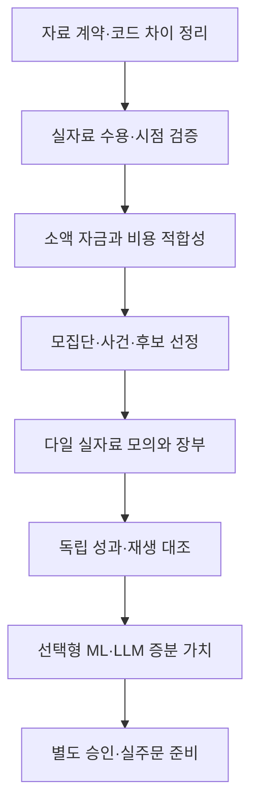

# 투자 기능 종합 재검토와 개선 방향

기준일: 2026-09-17. 대상: 입력 운용금 약 500만 원 이하, 국내·미국 주식/ETF, 시장 탐색과 테마 집중 거래를 지향하는 현재 로컬 프로그램.

## 📋 전체 총평

**현재 프로그램은 엄격한 정책과 합성 모의 검증 기반을 갖춘 연구 도구다. 실제 자료로 시장 전체를 탐색하고, 비용을 뺀 투자 우위를 검증한 자동매매 제품은 아직 아니다.**

“기준은 완벽하고 연결만 하면 된다”는 평가는 적절하지 않다. 기준의 명확성, 코드가 기준대로 작동하는지, 기준이 시장에서 유리한지는 서로 다른 문제다. 현재 B/P 전략은 원본에서도 미검증 가설이다. 엄격한 진입·위험 제한이 수익을 보장하거나 손실 상한을 확정하지 않는다.

이번에 확인한 핵심 공백은 실제 자료·전체 모집단·후보 선정·공시/기업 실사·예측 분포·현실 비용/체결·다일 장부·독립 성과 검증이다. 지표나 AI 모델을 더 많이 붙이는 것은 이 공백을 대신하지 못한다. 일부는 정책에 이미 요구되어 있고, 일부는 구현 한계이며, 운영비 처리에는 구체적인 코드/명세 차이도 있다.

권고: 선택형 Codex 분석의 OS 격리 후속을 당장의 최우선에서 내리고, 아래 투자 기능 검증 경로를 먼저 갖춘다. 기존 격리·복구 미완료를 완료 처리하거나 실주문 안전요건을 없애자는 뜻은 아니다.

### 조사 방법과 해석 범위

- 로컬 정책·소스·관련 테스트 정의·기존 검증 문서를 정적으로 대조했다. 이번에 제품 테스트나 투자 성과 시험을 새로 실행한 것은 아니다.
- 외부는 공식 제품 문서·기관 API·운용사 자료·연구 원문 21개를 조사했다. 개발형 플랫폼, 개인용 자동화 도구, 장기 로보어드바이저를 구분했다.
- 업체 기능 설명은 해당 업체의 공개 주장이다. 서비스를 가입·유료 실행·실계좌 운용하여 독립 검증한 결과가 아니다. 요금제·국내 이용 자격·토스 호환성·전체 지원 기능은 미확인이다.
- `확인`은 읽은 코드/문서의 사실, `미검증`은 성과 증거 부재, `제안`은 아직 적용하지 않은 개선 방향이다. 아래 우선순위는 현재 잠금 상태의 사고 등급이 아니라 실자료 투자 검증을 위한 선후관계다.
- 기존 111/116 작업 완료율은 등록된 개발 작업의 완료 비율이었다. 전체 투자 제품의 실전 준비도 95.7%라는 뜻이 아니다.

재검토는 코드 리뷰·시장조사·Markdown 문서 스킬의 절차를 사용했다. 출처/주장/비교 기준을 분리한 것은 시장조사 스킬의 영향이다. 방법론 귀속: Kassis 외(2026), *Scientific Agent Skills*, v2. 이 논문은 본 프로그램의 투자 성능을 검증한 자료가 아니다.[^S-021]

## 🔎 상용·공개 플랫폼에서 실제로 가져올 장점

구매 추천이나 수익률 순위가 아닌 설계 비교다. Freqtrade는 암호자산 중심, Wealthfront는 장기 자산배분 중심의 인접 사례이므로 국내·미국 단기 주식 프로그램과 동급 제품으로 점수화하지 않는다.

| 비교 대상 | 공식 문서에서 확인한 장점 | 한계·주의 | 우리 프로그램에 적용할 점 |
| --- | --- | --- | --- |
| QuantConnect / LEAN | 시점별 후보 선정, 기업행동/종목 이력, 실운용과 같은 시작 조건의 재생 대조 | 특정 fundamental universe는 ETF 등 제외. 기본 시장충격 모형은 없지만 사용자 체결 모형으로 보완 가능 | 주식/ETF 모집단 분리, 당시 후보 보존, 같은 기간의 신호·체결·장부 대조 |
| Freqtrade / FreqAI | 미래참조·워밍업 민감도 검사, 이동 학습, 모델 노후화 통제 | 기본 백테스트는 낙관적 체결 가정이 있으며, 지속학습은 실험적 | 미래 자료 변경 불변성·재시작 일치 검사 확대, 재학습과 모델 교체 분리 |
| Alpaca Paper | 실제 호가 기반 모의 체결, 주문 상태/부분체결 사건, feed 구분 | 시장충격·지연에 따른 가격 슬리피지·대기열·일부 비용 등을 재현하지 못함. 잔량 대조 없는 모의 체결 | 브로커 paper도 실제 체결 증거로 간주하지 않고 비용·유동성 스트레스 적용 |
| Composer | 백테스트와 실거래의 자료/시각 차이, 슬리피지·구독비 설정을 명시 | 수정 종가 기반 과거 시험과 실제 시세 운용은 다름. 비용 설정에 따라 결과 변화 | 비용 설정과 자료 가정을 결과에 고정, 단순 기준 전략과 같은 조건에서 비교 |
| TrendSpider | 전략 사본 고정, 과거 신호 변경 감지 시 중지·알림 | 웹훅 성공과 실제 체결은 별개. 봇 중지가 포지션 청산은 아님 | 버전 고정·신호 일관성 감시·중지/청산 분리. 체결 불확실성은 기존처럼 보류 |
| Wealthfront Classic | 분산 ETF 배분, 현금 유입 활용, 문턱 기반 리밸런싱으로 회전율/비용 통제 | 단기 시장 탐색 전략과 목표가 다름. 미국 세금 최적화를 한국에 그대로 복사 불가 | 거래 횟수보다 비용 후 계좌성과를 중시. 저회전 대안은 별도 연구군으로만 비교 |

위 행의 사실 근거와 주장 ID: QuantConnect C-001~004[^S-001][^S-002][^S-003][^S-004], Freqtrade C-005~008[^S-005][^S-006][^S-007][^S-008], Alpaca C-009~011[^S-009][^S-010][^S-011], Composer C-012[^S-012], TrendSpider C-013[^S-013], Wealthfront C-014[^S-014].

이미 우리에게 있는 원본/버전 보존·부분체결·취소 중 체결·미래정보 차단은 유지할 강점이다. 다만 상용 문서의 기능을 모방했다거나 소프트웨어 시험이 많다는 이유로 더 높은 수익·안전성을 주장할 수 없다. 상용 도구의 모의매매 역시 실거래와 차이가 있다는 점이 중요한 비교 결과다.

## 🚨 Critical — 실자료 투자 검증 전 필수 보강

### F01. 전략의 우위가 아직 검증되지 않았다

확인: B(돌파)/P(추세 눌림 회복) 평가기는 있지만 BACKTEST 역시 합성 자료 경로다. 전략 문턱이 많다고 유효성이 입증되는 것은 아니다. 현재 예측 제공기는 누락 또는 TEST_ONLY 가정이다. [전략 평가기](../src/core/strategy.ts) 277행, [예측 제공기](../src/core/providers.ts) 18~39행, [정책](../outputs/AI_TRADING_POLICY_v2.3.json) 112~142행.

개선 제안: 원본 B/P와 위험 한도를 고정한 기준 실험을 먼저 한다. 새 지표·진입 조합·보유기간은 별도 가설/버전으로 연구하며 검증 중 원본을 바꾸지 않는다. 상승장에서의 시장 노출 효과와 종목 선정·진입·청산의 추가 가치를 분리한다.

완료 조건: 원본의 목표 이력·봉인 최종 구간·프로필별 OOS/전진 모의 조건을 만족하는 실제 자료 보고서. 비용 후 계좌성과·낙폭·꼬리 손실·무거래 기간·유효 표본 수를 함께 제시한다. 원본의 기간/거래 수 자체가 통계적 충분성을 보장하지는 않는다. 실패·표본 부족이면 거래 보류를 유지한다.

### F02. 실제 투자에 필요한 기대손익·하방 예측 분포가 없다

확인: 합성 기대손익과 q05는 시험용 R 배율이다. 현재 학습 모듈의 예측 오차 개선은 경제성 심사에 필요한 실제 예측 분포 검증과 다르다. [제공기](../src/core/providers.ts) 23행, [합성 프로필](../profiles/synthetic-v1.json) 33행, [학습 보고](../src/core/learning.ts) 137행.

위험: 실제 시세만 넣고 시험용 상수를 그대로 사용하면 근거 없는 경제성 승인이 된다. 현재 TEST_ONLY/누락 보류 경계는 이를 막는 올바른 제한이다.

개선 제안: 예측 대상의 보유기간·통화·청산정책·비용 포함 여부를 고정한다. 단순 기준 모델부터 조건부 순손익과 하방 분위수를 검증한다. q05는 하위 5% 손익 경계이지 그 아래 손실 평균이나 최대 손실이 아니다. 꼬리 손실은 별도 스트레스로 본다.

완료 조건: OOS 평균 오차와 분위수 교정, 장세/상품별 오차, 외삽·자료 부족 보류, 모델 버전/적용시각 검증. 경제성 검증되지 않은 AI 자신감 점수는 대체 입력으로 인정하지 않는다.

### F03. 실제 시세 수집과 과거 시점 자료가 부족하다

확인: 실제 경로는 SOXL/SOXX REST 단발 시세 점검이며 전략 미평가·주문 0이다. 새 수신 변환도 MOCK 계약이다. 오늘의 ACTIVE 종목 목록은 당시 상장폐지까지 포함한 과거 전체 모집단이 아니다. [시세 클라이언트](../src/server/toss-market-data.ts) 7·270행, [사전점검](../src/server/market-paper-check.ts) 90행, [목록 클라이언트](../src/server/toss-catalog-client.ts) 89·243행.

개선 제안: 공급원/필드별 이용 권리·요금·보관·AI 입력 가능 범위와 실제 자료 계약을 먼저 확정한다. 영속 종목 ID, 거래소·통화·주식 종류, 상장/폐지·티커 변경·분할·배당, 원시/수정 가격 용도를 구분한다. 발표시각/공급자시각/수신시각/실제 이용가능시각/정정 유효시각을 나눈다.

완료 조건: 허용된 실제 수신 표본의 원문 버전·해시·시각·누락이 보존되고, 지연/정정/휴장/재시작/스키마 변경을 처리한다. 지금 내려받은 과거 자료를 과거에 이미 알았다고 소급하지 않는다. 당시 가용성 증거가 없는 기간은 미확인으로 남긴다.

### F04. 전체 시장의 실제 후보 순위와 자금 경쟁이 연결되지 않았다

확인: 정책에는 거래대금 상위 감시→RVOL/스프레드 후보→경제성 순위가 있다. 현재 목록은 메타데이터 분류이고, 포트폴리오는 사용자가 정한 시험 순서다. [가이드](../outputs/AI_TRADING_GUIDE_v2.3.md) 228행, [목록](../src/core/catalog.ts) 211행, [포트폴리오](../src/core/portfolio-program.ts) 206~214행.

개선 제안: 전체 지원 모집단에서 저비용 기본 필터를 적용하고, 기존 후보 수 제한 안에서 정밀 조사한다. 분석하지 못한 종목, 자료 부족, 전략 불충족, 동점 처리, 자금/슬롯 경쟁 탈락도 기록한다. 브로커 지원 전체와 거래소 전체를 같은 범위라고 표시하지 않는다.

완료 조건: 임의 과거 시점의 모집단·후보·순서·탈락 이유·자금 예약이 재현되고, 당시 사라진 종목도 가능한 범위에서 포함된다. 손으로 고른 성공 종목 재생만으로 전체 시장 성과를 주장하지 않는다.

### F05. 뉴스·공시·테마 기업 실사가 실제 판단에 연결되지 않았다

확인: 시점/정정/반증 기준은 명세에 있으나 기업·ETF 조사 카드는 빈 근거의 예시이며 사건 일정도 합성이다. [조사 제공기](../src/core/providers.ts) 74·102·132행, [합성 사건](../profiles/synthetic-v1.json) 54행, [테마 정책](../outputs/THEME_RESEARCH_POLICY_v1.3.json) 51·154행.

개선 제안:

- 공시·시장조치·기업 IR·기사의 역할을 분리하고 사건 ID/원문/대상 기업/발표 및 가용시각/정정·철회 관계를 저장한다. 같은 보도자료를 옮긴 기사 여러 개를 독립 근거로 세지 않는다.
- `수집 불가`, `검색했으나 관련 사건 없음`, `미지원`을 구별한다. 공급 장애를 “악재 없음”으로 처리하지 않는다.
- 회사는 실제 사업·테마 매출 노출·수익성/현금흐름·재무부담·희석·고객 집중·밸류에이션과 반증을 조사한다. 장기 우량기업 평가가 단기 진입을 우회하지 않는다.
- 호재의 방향, 새 정보인지, 시장 예상 대비 차이, 가격 반영 여부는 별도 연구 변수다. 당시 컨센서스 자료가 없으면 예상 대비 점수를 만들어내지 않는다.
- 원본의 매 세션 전 출처 확인·주간 구성 검토·월간/만료/중대 사건 시 전체 검토 주기를 유지한다. 공급자별 수집 일정·비용과 해당 주기의 충족 가능성을 확정한다.

완료 조건: 실제 중복/오래된 기사 재노출/공시 정정/철회/기업 오매핑/지연 사건을 재생한다. 기업·ETF 후보 유지·퇴출의 근거와 만료 상태를 추적하고 자료 부재 시 판단을 보류한다.

### F06. 운영비의 경제성 연결과 위험일 계산에 코드/명세 차이가 있다

확인: `costFor()`는 합성 `fixedOperatingKrw`만 총비용에 더한다. `guards()`에서 계산한 `ops`는 null 검사에만 사용되고 후보 비용으로 전달되지 않는다. 원본의 직전 완료 20위험일 대신 `20 * 86400000`을 쓴다. [위험 계산](../src/core/risk.ts) 21~34·268~278행, [원본 비용 정의](../outputs/AI_TRADING_GUIDE_v2.3.md) 322·447행.

영향: 운영비가 0이 아닌 후속 연결에서 기대 순이익을 과대평가할 위험이 있다. 최근 20×24시간은 현재 미완료 위험일을 포함하고 첫 경계 위험일 일부를 잘라내므로 직전 완료 20위험일과 다르다. 휴일 포함 자체를 오류라고 단정하는 것은 아니다. 현재 합성 비용 0·실주문 잠금 상태에서 실제 손실이 발생했다는 뜻은 아니다. 이번 발견은 정적 대조이며 새 실패 시험을 실행하지 않았다.

개선 제안: 원본 정의대로 완료 위험일 달력·발생 비용·완료 왕복 거래 수를 묶고, 추정 운영비를 수량/경제성 심사로 전달한다. 거래비와 운영비를 구분하며 추정 배분과 장부의 실제 비용 인식을 이중 차감하지 않는다.

완료 조건: 주말/휴장·KR/US 위험일 경계·무거래일·거절 후보 분석비·월 경계·부분체결·나중 비용 확정 시험. 0이 아닌 비용을 넣었을 때 승인 결과와 사후 비용의 변화를 독립 대조한다. 수정은 별도 구현 작업이며 이번에 적용하지 않았다.

### F07. 실제 체결·호가·비용 모형이 교정되지 않았다

확인: 후속 호가/잔량, 부분체결·취소 경합을 다루지만 고정 합성 가정이다. 실측 대기열·지연·체결 우선순위·호가 소진에 대한 적격 프로필이 없다. [체결 모형](../src/core/simulator.ts) 318~336행, [합성 프로필](../profiles/synthetic-v1.json) 38~39행, [체결 요구사항](../outputs/AI_TRADING_GUIDE_v2.3.md) 607~616행.

개선 제안: 자료/시장/상품별 스프레드·지연을 관측하고 기준·불리·극단 가정의 결과를 함께 낸다. 호가 접촉을 무조건 체결로 보거나 손절가를 확정 손실 상한으로 취급하지 않는다. 갭·정지·가격 제한·취소 중 체결·장 종료 잔여를 포함한다. fee/tax/FX/운영비는 실제 적용 조건과 날짜를 가진 프로필로 분리한다.

완료 조건: 재현 가능한 호가·지연 자료에서 미체결/부분체결/슬리피지 민감도를 보이고, 유리한 가정만 선택하지 않는다. 체결가에 이미 들어간 스프레드를 다시 차감하지 않는다. 주문 없는 shadow 관측은 실제 대기열 우선순위를 완전히 입증하지 못하므로 그 한계도 남긴다.

### F08. 다일 계좌·결제·비정상 잔여 보유를 검증할 수 없다

확인: 종목별 단일 세션 제한과 tick 말미 합성 결제가 있다. 실제 결제일 장부가 아니다. [세션 제한](../src/core/portfolio-program.ts) 33~39행, [합성 결제](../src/server/portfolio-engine.ts) 311~313행, [현재 한계](PORTFOLIO_PAPER.md).

개선 제안: 다일 현금·미결제 채권채무·주문가능액·포지션·비용·입출금·FX·기업행동을 연결한다. 당일 청산 전략도 정지/장애로 다음 날 남을 수 있으므로 정상적인 스윙 전략 추가와 비정상 잔여 복구를 구분한다.

완료 조건: KR/US 휴장 차이·조기 종료·DST·장 종료 미체결·다음 날 재시작·분할/배당/단주·환율 변동에서 장부가 대조된다. 적용 결제/세금 규칙은 시장·계좌별 최신 계약으로 확인하고 임의 T+N 상수를 쓰지 않는다.

### F09. 독립 최종 시험과 실시간 모의↔재생 대조가 없다

확인: 시간순 학습·시험 노출 기록·단일 DB의 기간 재사용 차단은 있다. 최종 봉인 성과·전체 실험군 다중 비교 보정·실자료 계좌성과는 없다. [학습 등록](../src/server/learning-registry.ts) 306행, [검증 상태](../src/core/learning.ts) 137~171행, [원본 추가 검증](../outputs/AI_TRADING_GUIDE_v2.3.md) 793~795행.

개선 제안: 전략/특징/모델/위험도별 실험군과 비교 횟수를 선등록하고 실패도 남긴다. 학습·선택·최종 봉인 구간을 분리하며 겹치는 보유기간/종목/테마 의존성을 반영한다. 원본 5일 블록 부트스트랩 등 고정 방법도 의존 구조에 대한 민감도를 검토하되, 이번에 문턱이나 방법을 바꾸지 않는다. 다중 탐색의 선택편향 보정은 검토할 연구 방법이지 자동 합격 인증이 아니다.[^S-019]

완료 조건: 모든 후보 실험/실패를 보존한 OOS·봉인 시험과 실시간 모의 기록을 갖춘다. 동일 기간·자본·버전으로 재생해 모집단→자료→신호→주문→체결→장부 차이를 분류한다. 충분한 거래 수뿐 아니라 독립 위험일·국면 수와 신뢰구간을 보고한다.

## ⚠️ Warning — 투자 실용성과 학습 확장에 필요한 보강

### F10. 500만 원 이하에서 얼마나 거래 가능한지 모른다

확인: 현재 기준상 500만 원·LOW·PILOT의 회당 초기 위험은 1,250원, 개별 명목 한도는 125,000원이다. 소수점 매매가 꺼져 있어 1주가 한도를 넘으면 보류한다. 이는 산식/테스트 정의의 값이며 시장 성과가 아니다. [기존 시험](../tests/core.test.ts) 111~115행, [원본 표](../outputs/AI_TRADING_GUIDE_v2.3.md) 707행.

개선 제안: 50만/100만/300만/500만 원은 연구용 입력 시나리오로 두고, 위험도별 0주 비율·거래 가능 후보 수·비용/R·현금 대기·회전율을 실자료로 보여준다. 거래가 없다고 손절 폭을 억지로 줄이거나 위험 예산을 자동 확대하지 않는다.

완료 조건: 입력 금액별로 “현재 규칙에서 거래 가능/대부분 보류/평가 불가”를 구분한다. 원본의 현금 유지·저비용 대안 비교를 구현한다. 더 큰 자금을 넣도록 유도하는 기능이 아니다.

### F11. 테마·ETF·개별주 중복 위험을 실제로 계산하지 못한다

확인: 원본에 상관·테마 중복 규칙은 있으나 현재 열린 위험을 한 위험군으로 합산한다. 분산 모형이 아니라 보수적 임시 처리다. [위험 예산](../src/core/risk.ts) 106행, [테마 정책](../outputs/THEME_RESEARCH_POLICY_v1.3.json) 91행.

개선 제안: 통화/국가/업종/기초자산과 ETF 구성 비중·배율 노출을 표시한다. SOXL·SOXX·반도체 개별주 여러 개를 서로 독립된 분산으로 세지 않는다. 구성 자료가 없으면 현재 보수적 합산을 유지한다.

완료 조건: 구성 변화·레버리지 환산 노출·위기 시 동반 하락·상관 급등·자료 누락 스트레스를 통과한다. 평상시 상관만으로 위기 분산을 보장하지 않는다. 위험도 상/중/하는 같은 증거 품질 아래 노출을 바꾸는 것이며 높은 위험도가 높은 기대수익을 보증하지 않는다.

### F12. SOXL의 후보 허용과 상품 적격성을 구분해야 한다

확인: 별도 연구 범위에는 SOXL이 포함된다. 이를 임의 금지할 이유는 이번 감사에서 제시하지 않는다. 그러나 실제 예측·체결·비용·계좌 자격이 확인된 것은 아니다. [연구 범위](../profiles/research-scope-v1.json), [범위 적용](../src/core/research-scope.ts).

운용사 자료상 SOXL은 기초지수의 일일 +300%를 목표로 하며 하루 초과 누적수익의 단순 3배를 목표로 하는 상품이 아니다. 따라서 일반 ETF와 같은 보유기간/위험 모형을 무조건 적용하지 않는다.[^S-020]

개선 제안: 당시 기초지수·구성·배율·추적/괴리·보수·분할·호가/유동성·위기구간을 상품 프로필로 관리한다. SOXX와 비교할 때 원금뿐 아니라 실제 위험 노출도 맞춘다. SOXX 가격을 단순 3배 하여 SOXL 과거 자료를 만들어 검증하지 않는다.

완료 조건: 공식 상품자료·실제 자료와 상품별 OOS/체결 스트레스, 계좌별 최신 거래 자격 확인. 사용자의 “일부 단일종목 레버리지 제외” 선택을 보존하되, 현행 법규/예탁금 요건 전체를 이번에 확정했다는 뜻은 아니다.

### F13. 지표 추가보다 독립적인 정보인지 확인해야 한다

확인: 차트 B/P 구현은 존재한다. 학습 원천에서 독립 재계산하는 특징은 RVOL 하나이며 모든 지표를 학습한다고 볼 수 없다. [특징 계약](../src/core/paper-learning-convert.ts) 15행, [RVOL 검증](LEARNING_RVOL_SOURCE.md).

개선 제안: 기존 지표를 추세·모멘텀·변동성·유동성 역할별로 정리하고, 하나씩 제거한 비교와 계산 초기화/워밍업/봉 경계/수정주가/재시작 대조를 한다. RSI·MACD·여러 이동평균이 동시에 긍정이라고 독립 근거 여러 개로 세지 않는다. 하모닉·피보나치 등은 사후 패턴 선택 없이 기계적 정의가 가능하고 추가 OOS 가치가 있을 때만 별도 연구한다.

완료 조건: 미래 자료를 잘라내거나 바꿔도 과거 판단이 유지되고, 독립 계산 및 워밍업 민감도에서 신호 차이를 설명한다. 지표 추가의 비용 후 증분효과가 없으면 추가하지 않는다. 현재 기준이 최적이라는 결론은 내리지 않는다.

### F14. 학습 표본이 선택된 완료 거래에 치우친다

확인: ABSTAIN 판단은 보존하되 학습 정답을 만들지 않는다. 미청산·가정 거래는 확정 실적에서 제외한다. 이는 올바른 안전장치지만 승인·체결·청산된 거래만으로 전체 후보의 좋고 나쁨을 배울 수는 없다. [라벨 연결](../src/core/paper-learning-convert.ts) 45~64행, [학습 적격](../src/core/learning-data.ts) 66~98행.

개선 제안: 후보→승인→체결→청산→라벨 단계별 탈락률과 장세/종목 구성을 표시한다. 탈락 후보의 가정 결과는 독립된 shadow 연구로 두고 실현 손익/확정 학습 정답과 섞지 않는다. 미청산 결과는 청산·비용 확정 전까지 보류한다.

완료 조건: 실제 체결 성과, 미체결/미청산, 반사실 가정, 무거래일 비용을 별도로 보고한다. 규칙 변경이 만든 표본 변화와 모델 자체의 개선을 분리한다.

### F15. 재학습을 자동 개선으로 간주하면 안 된다

확인: 현재 ridge는 소규모 연구 모형이다. MAE/RMSE/편향 비교가 실제 순이익 개선·하방 교정·승격 증거는 아니다. 원본 기록 재계산·시험 노출 통제·자동 승격 금지는 유지할 장점이다. [학습 모형](../src/core/learning-model.ts), [학습 평가](../src/core/learning.ts) 12·85·137행.

개선 제안: 규칙 기준 모델 → 소수 특징의 후보 모델 → 동시 shadow 비교 → 독립 검증 → 사용자 승인 순서를 유지한다. 데이터/특징 분포 변화, 예측 교정 악화, 모델 나이·학습 종료/적용 시작/만료, 버전 복귀를 관리한다. 학습에 위험 한도·실주문 권한을 넘기지 않는다.

완료 조건: 같은 자금·후보·노출·비용·달력에서 ML/선택형 LLM의 증분 순성과를 평가한다. 자료·AI 추가 비용까지 빼고 개선이 확인되지 않으면 채택하지 않는다. 새로 학습되었다는 이유만으로 현행 모델을 자동 교체하지 않는다.

### F16. 거래별 R과 사용자 계좌 수익을 구분해야 한다

확인: 학습에는 합성 체결·수수료의 순 R이 연결되지만 계좌성과는 null이다. 운영비가 있으면 배분 미지원으로 보류한다. [비용 변환](../src/core/paper-learning-convert.ts) 166~179행, [계좌성과 상태](../src/core/learning.ts) 140행.

개선 제안: KRW/USD별 현금·미실현/실현 손익·미결제·입출금·환율 손익·발생 비용과 공통 통화의 계좌 가치 시계열을 만든다. 환율 덕분에 늘어난 원화 가치와 전략 손익을 구분한다. 투자 판단용 비용 후 성과와 실제 세무 신고 계산도 구분한다.

완료 조건: 장부 합계와 독립 계산을 대조하고, 거래 없는 날/운용 중지 중 비용/잔여 위험도 포함한다. 기준 대안은 같은 기간·통화·자본·비용·위험 노출로 비교하며 현금 수익률을 근거 없이 0 또는 특정 금리로 가정하지 않는다.

### F17. 연속 운영의 안전성이 투자 품질에도 필요하다

확인: 저장·재시작·단일 writer·UNKNOWN 차단은 합성 경로에 있다. 연속 실자료 수집·다일 자동 기록·실제 주문 상태 재대조는 별도 미완료다. [현재 실행 범위](../README.md), [다일 기록 제한](PAPER_LEARNING_BRIDGE.md).

개선 제안: 일정/시계 오차·PC 절전/재시작·통신 단절·누락/중복 사건·장 달력 변경에 대한 경보와 보류를 만든다. 중지, 신규 진입 중지, 프로그램 귀속 청산, 전체 청산은 권한과 결과를 분리한다. 주문 접수·취소 요청을 완료 체결 증거로 취급하지 않는다.

완료 조건: 실제 자료 읽기 전용 단계에서 끊김/재접속/저장 실패/다일 재개를 시험하고, 후속 실주문 단계는 별도 승인 후 브로커 대조까지 검증한다. 선택형 AI 격리 작업이 오래 걸린다는 이유로 주문/키 안전요건을 생략하지 않는다.

### F18. 기준의 보수성과 투자 효율을 함께 검증해야 한다

평가: B/P·15분봉·짧은 보유 등 현재 가설과 장기 기업 실사는 시간 범위가 다르다. “우량 기업을 찾아 계속 투자”가 장기 보유를 뜻한다면 현재 당일 전략의 필터를 그대로 복사하는 것만으로는 부족하다. 기존 원본의 주력 가설은 우선 그대로 검증한다.

개선 제안: 저회전/리밸런싱 대안은 별도 전략 연구군으로만 비교한다. 엄격한 필터가 거래를 줄이는 만큼 비용·놓친 기회·표본 감소를 함께 보고, 장세에 맞는 근거가 없으면 현금 대기를 정상 결과로 둔다. 새 평균회귀/공매도/파생 헤지를 이번 감사에서 자동 추가하지 않는다.

완료 조건: 전략의 목표·보유기간·대상·벤치마크를 분리하고, 기존 기준과 새 가설을 섞어 좋은 결과만 선택하지 않는다. 위험도별 적격성도 각각 검증한다. 한 위험도/상품군의 합격을 다른 군에 그대로 이전하지 않는다.

## 💰 소액 자금에서 먼저 계산할 경제성

아래는 업체 가격이나 예상 수익률이 아닌 가정 계산 C-022다. 월 비용이 일정하고 초기 원금이 일정하다고 가정한 `월 고정비 × 12 ÷ 원금`이며 거래비·세금·복리·입출금은 제외했다.

| 가정 월 고정비 | 연간 고정비 | 원금 500만 원 대비 | 원금 300만 원 대비 |
| --- | --- | --- | --- |
| 1만 원 | 12만 원 | 2.4% | 4.0% |
| 3만 원 | 36만 원 | 7.2% | 12.0% |
| 5만 원 | 60만 원 | 12.0% | 20.0% |

현행 원본은 증분 월 비용에 운용금 비례 한도와 1만 원 상한을 이미 둔다. 3만/5만 원 행은 비용 민감도를 보여주는 반례이지 허용 예산이나 한도 상향 제안이 아니다. 고정비를 만회하려면 그만큼의 추가 이익이 필요하며, 수수료·환전·불리한 체결은 별도다. 비례 비용 한도 때문에 300만 원에서 1만 원도 자동 허용되는 것은 아니다.

판단 화면에 먼저 필요한 것은 “예상 고수익” 표시보다 거래 가능한 정수 수량, 비용/위험 비율, 무거래 가능성, 총비용 후 성과의 불확실성이다. 이미 사용하는 도구라도 이번 운용 때문에 새로 늘어나는 비용과 사용량 제약은 별도로 확인한다.

## 🗂️ 토스·공시·거래소 자료의 역할 분담

| 자료 | 적합한 역할 | 그대로 맡길 수 없는 것 |
| --- | --- | --- |
| 토스 공식 API | 지원 종목 시세·호가·봉·참조정보·달력, 후속 승인 시 계좌/주문 상태 | 현재 프로그램에 없는 공시 원문·모든 과거 모집단·미국 실시간 기관 수급을 제공한다고 가정하기 |
| KRX 공개 Open API | 국내 종목·ETF 등 일별 통계/참조 자료와 보조 대조 | 해당 일별 서비스 목록을 저지연 실시간 호가/체결 피드와 동일시하기 |
| OpenDART | 국내 공시 접수·원문 식별·정정 관계의 공식 근거 | 공시검색의 날짜 필드만으로 분 단위 당시 가용시각을 확정하기 |
| SEC EDGAR | 미국 기업 공시 제출 이력·XBRL 자료의 공식 근거 | 공시 내용이 곧바로 단기 주가 상승 또는 실시간 기관 매수의 증거라고 보기 |
| 운용사/기업 공식 자료·허용된 뉴스 공급원 | ETF 구조/구성·기업 사업·IR·속보 보완 | 웹에서 읽을 수 있다는 이유로 대량 저장·재배포·AI 입력 권리를 추정하기 |

근거 C-015~018: 토스 REST 1.2.17은 시세·주문과 별도 웹소켓 규격을 구분하며 국내 수급의 적시성 차이를 명시한다. KRX 서비스 목록, DART 개발가이드, SEC API 설명은 서로 다른 자료 역할을 뒷받침한다.[^S-015][^S-016][^S-017][^S-018]

제안은 여러 공급원을 무조건 많이 연결하는 것이 아니라 필요한 필드마다 책임 공급원·대조 공급원·누락 처리를 정하는 것이다. 제공 범위·시점·이용 조건을 확인하기 전 실제 키 사용이나 새 수집을 시작하지 않는다. 이번에 API 키·계좌를 읽거나 시세/공시 데이터를 새로 수집한 것은 아니며 공개 문서만 조회했다.

## 💡 Suggestion & Refactored Code — 구현 전 개선 순서

이번 요청은 조사이므로 제품 코드 수정 대신 아래 작업 단위를 제안한다. 원본 정책·위험 수치·실주문 잠금은 그대로 유지했다.

| 단계 | 다음 산출물 | 종료·다음 단계 조건 |
| --- | --- | --- |
| A. 투자 요구사항/자료 계약 | 필드별 출처·시점·권리·요금·미지원 표, 실제 비용 코드 차이의 수정 명세 | 필요한 자료가 가능한지와 부족하면 보류할 경계 확정. 원본 문턱 임의 변경 없음 |
| B. 실자료 최소 수용 | 허용된 표본·연속 수집·정정/기업행동/달력 검사·고정 원천 묶음 | 실제와 합성 완전 분리, 당시 자료 재생, 조회 권리/비용 확인 |
| C. 소액 경제성·선정 | 비용 처리 수정/시험, 입력 금액별 정수 수량·비용 분석, 실제 후보 순위 | 기존 규칙으로 거래 가능한지 확인. 부족한 자금이나 자료를 자동 우회하지 않음 |
| D. 다일 실자료 모의 | 공용 판단·체결·결제·FX 장부, 사건/테마 갱신, 중단·재개 기록 | 일별 독립 장부 대조·미완료/누락 보존. 실주문 없이 수집/모의만 수행 |
| E. 성과 수용 | 고정 기준·ML/AI 제거 비교, OOS·봉인·실시간↔재생 차이 보고서 | 기존 수용 기준을 통과하는 충분한 근거. 실패·불확실은 HOLD |
| F. 선택형 AI/운용 준비 | 필요한 경우 AI 격리 후속·수동 승인·롤백·브로커 실행 계약 | 투자 증분 가치와 별도의 보안/주문 검증 및 사용자 승인 |

우선 A부터 시작하는 것이 적절하다. 과거 자료 확보가 지연되면 연구용 관측을 쌓을 수는 있지만, 기간을 채우기 위해 미래정보를 소급하거나 승인 문턱을 낮추지 않는다. ML/LLM이 유효하지 않아도 검증 가능한 규칙 기반 프로그램이 남도록 설계한다.

## ✅ 이번 조사에서 확인한 것과 확인하지 않은 것

확인: 핵심 코드·원본 기준·기존 문서의 정적 대조, 외부 공식 문서의 기능/한계, 비용 산식과 합성/실제 경계. 검증용 출처 원장·주장 원장·24행 공통 비교표·가정 비용 계산을 별도 보관한다.

- 출처 원장 (로컬 비공개 기록: `work/investment-review-20260917/sources.csv`): 정확한 URL·발행/조회일·적용 범위·제약. 날짜를 확인할 수 없으면 `not-stated`.
- 외부 주장 원장 (로컬 비공개 기록: `work/investment-review-20260917/claims.csv`): C-001~021과 웹 출처 연결. 가정 계산 C-022는 아래 계산 파일, 로컬 발견 F01~18은 각 절의 파일·줄 근거로 분리한다. 웹 URL 전용 검사기에 맞추려고 로컬 계산의 외부 출처를 만들어내지 않는다.
- 동일 항목 비교표 (로컬 비공개 기록: `work/investment-review-20260917/competitor-matrix.csv`): 6개 대상 × 4개 공통 항목. `unknown`은 이번 출처로 미확인이지 기능 부재가 아니다. 기능 점수/순위를 계산하지 않는다.
- 가정 계산 (로컬 비공개 기록: `work/investment-review-20260917/calculations.json`): 비용 산식·가정과 원금별 계산.

실제 실행 검사 결과와 원본 보존·문서 표시 결과는 [진행 기록 · 공개 요약](PROJECT_STATUS.md)의 이번 항목에 남긴다. 원장 검사는 형식과 참조 일관성을 확인하며 주장 내용의 진실이나 투자 효과를 자동 인증하지 않는다.

미검증: 실제 계좌/체결, 과거·실시간 시장 자료의 충분성/권리, 전략 수익성, 계좌별 현행 거래 자격·세금/수수료, 경쟁 제품 실제 운용·한국 이용 가능성·지원 SLA, 실제 OS 격리, 전체 코드/사용자 자료/Git 이력 보안 감사. 제품 회귀/E2E·투자 성과 시험은 이번 문서 조사에서 재실행하지 않았다. 새로운 수익성·최대 손실 보장은 없다.

## 📚 외부 출처

모두 2026-09-17 조회. `not-stated`는 절대 발행/수정일 미표시이며 검색엔진 수집일이나 상대 날짜를 발행일로 바꾸지 않았다. 아래 내용은 요약·출처 링크이고 원문 전체 복제본은 저장하지 않았다.

[^S-001]: S-001 / C-001. QuantConnect, [Fundamental Universes](https://www.quantconnect.com/docs/v2/writing-algorithms/universes/equity/fundamental-universes). 일별 선정·실자료 도착 시각·모집단 범위. 발행일 not-stated.
[^S-002]: S-002 / C-002. QuantConnect, [US Equity Security Master](https://www.quantconnect.com/docs/v2/writing-algorithms/datasets/quantconnect/us-equity-security-master). 기업행동·종목 이력. 발행일 not-stated.
[^S-003]: S-003 / C-003. QuantConnect, [Live Trading Reconciliation](https://www.quantconnect.com/docs/v2/writing-algorithms/live-trading/reconciliation). 자료/모형 차이와 한계. 발행일 not-stated.
[^S-004]: S-004 / C-004. QuantConnect, [Research Live Reconciliation](https://www.quantconnect.com/docs/v2/research-environment/meta-analysis/live-reconciliation). 동일 기간/자본 비교. 발행일 not-stated.
[^S-005]: S-005 / C-005. Freqtrade, [Backtesting](https://www.freqtrade.io/en/stable/backtesting/). 가정·결과 보관. 발행일 not-stated.
[^S-006]: S-006 / C-006. Freqtrade, [Lookahead Analysis](https://www.freqtrade.io/en/stable/lookahead-analysis/). 미래참조 검사·미발생 신호 한계. 발행일 not-stated.
[^S-007]: S-007 / C-007. Freqtrade, [Recursive Analysis](https://www.freqtrade.io/en/stable/recursive-analysis/). 초기 이력 길이별 지표 민감도. 발행일 not-stated.
[^S-008]: S-008 / C-008. Freqtrade, [Running FreqAI](https://www.freqtrade.io/en/stable/freqai-running/). 이동 학습·모델 유효기간·실험적 지속학습. 발행일 not-stated. 실제 적용 시 고정 버전 코드와 설정명을 다시 대조해야 한다.
[^S-009]: S-009 / C-009. Alpaca, [Paper Trading](https://docs.alpaca.markets/us/docs/paper-trading). 가상 체결·실거래와의 차이. 절대 발행일 not-stated.
[^S-010]: S-010 / C-010. Alpaca, [Market Data FAQ](https://docs.alpaca.markets/us/docs/market-data-faq). IEX/SIP 범위 차이. 절대 발행일 not-stated.
[^S-011]: S-011 / C-011. Alpaca, [Websocket Streaming](https://docs.alpaca.markets/us/docs/websocket-streaming). 주문/체결 사건·오류. 절대 발행일 not-stated.
[^S-012]: S-012 / C-012. Composer, [Backtest Basics](https://help.composer.trade/article/67-backtest-basics). 수정 2026-09-02.
[^S-013]: S-013 / C-013. TrendSpider, [Creating & Managing Strategy Bots](https://help.trendspider.com/kb/trading-bots/trading-bots). 문서 날짜 2026-03-17. 베타 시절 표현이 함께 있으므로 모든 상세 제약이 현 제품 전체에 적용된다고 확대하지 않는다.
[^S-014]: S-014 / C-014. Wealthfront, [Classic Portfolio Investment Methodology](https://research.wealthfront.com/whitepapers/investment-methodology/). 2026-03-09.
[^S-015]: S-015 / C-015. 토스증권, [REST OpenAPI](https://openapi.tossinvest.com/openapi-docs/latest/openapi.json). 조회 버전 1.2.17, 절대 발행일 not-stated. 별도 AsyncAPI 내용의 최신 재검증과 이용 조건/요금 확인은 남는다.
[^S-016]: S-016 / C-016. 한국거래소, [Open API 서비스 목록](https://openapi.krx.co.kr/contents/OPP/INFO/service/OPPINFO004.cmd). 발행일 not-stated. 실시간 계약 피드 전반을 검증한 자료가 아니다.
[^S-017]: S-017 / C-017. 금융감독원, [OpenDART 공시검색](https://opendart.fss.or.kr/guide/detail.do?apiGrpCd=DS001&apiId=2019001). 발행일 not-stated.
[^S-018]: S-018 / C-018. SEC, [EDGAR Application Programming Interfaces](https://www.sec.gov/search-filings/edgar-application-programming-interfaces). 게시 날짜 2024-06-06, 마지막 검토/갱신 표시 2025-04-08.
[^S-019]: S-019 / C-019. David H. Bailey, Marcos López de Prado, [The Deflated Sharpe Ratio](https://www.davidhbailey.com/dhbpapers/deflated-sharpe.pdf). 조회 원문 버전 2014-07-31. 선택편향·백테스트 과적합·비정규성 연구이며 이 프로그램의 성과 검증은 아니다.
[^S-020]: S-020 / C-020. Direxion, [Daily Semiconductor Bull and Bear 3X ETFs](https://www.direxion.com/product/daily-semiconductor-bull-bear-3x-etfs). 발행일 not-stated. 상품 목표·구조만 인용하며 현재 가격/수익률을 추천 근거로 쓰지 않는다.
[^S-021]: S-021 / C-021. Timothy Kassis, Vinayak Agarwal, Yuhuan He, Darshil Patel, Aubrey M. Brueckner (2026), [Scientific Agent Skills: A Library of Procedural Knowledge for Research Agents](https://arxiv.org/abs/2609.00065), v2 2026-09-02. 조사 절차 스킬의 방법론 귀속.
