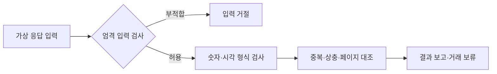

# 키움 모의 응답 형식 검증

_2026-09-21 · 로컬 개발용 어댑터 · 실제 수집·전략 평가·주문 없음_

---

## 📋 현재 제공하는 기능

직접 작성한 KR/US 분봉·최우선 호가 모형 응답을 받아 필드, 숫자, 현지 시각 문자열, 응답 오류, 중복/상충과 페이지 연결을 검사한다. 정상 입력도 `MOCK_FORMAT_PARSED_SEMANTICS_HOLD`이며 **실제 백테스트에 적격한 데이터로 승인하지 않는다**. UI와 기존 모의매매 엔진에 자동 연결하지 않는다.

[키움 전환 계획](investment-data-contract-v1/KIWOOM_SOURCE_PLAN.md)의 첫 오프라인 구현이다. [기존 수신 변환](TOSS_OFFLINE_INGEST.md)은 토스 전용 계약을 그대로 유지한다. 공통 ISO 시각/Decimal·해시와 관측 중복/상충 판정만 재사용하며, 토스의 봉 시각·가격 보정 의미를 키움으로 승계하지 않는다.



## 📚 고정한 공식 근거와 지원 범위

공식 저장소의 커밋 `953e5dbff123f437ab4d11a78a95191a685eb51f`, `kiwoom/_data/kiwoom_api_spec.json`을 2026-09-21 조회했다. 조회한 문서 바이트의 SHA-256은 `42a7b3912c9d9588c83bdc2db7779c8d2e038703a2b5562e54ef46ae905cba79`다. 이는 문서 스냅샷이지 서버 버전·현재 호환성을 보증하는 값이 아니다.[^1]

| TR | 이번 모형 지원 | 고정한 요청 범위 | 미지원/미확인 |
| --- | --- | --- | --- |
| `ka10080` | KR OHLCV 분봉 | KRX 6자리 코드·1분·`upd_stkpc_tp=0` | NXT/SOR, 다른 주기, 실제 수정주가 해석 |
| `usa06011` | US OHLCV 분봉 | NA/ND/NY·1분·가격수정/FX 적용값 0 | 실제 지원 종목·과거 범위·시각/거래량 단위 의미 |
| `ka10004` | KR 최우선 호가/잔량 | KRX 6자리 코드 | 10단계 전체 호가·정확한 원천 날짜/시각 |
| `usa20101` | US 최우선 호가/잔량 | NA/ND/NY·응답 종목/거래소 대조 | 전체 10단계·초 단위 신선도·시간대 |

KRX/NA/ND/NY와 필드/통화 매핑은 위 명세를 근거로 한 모형 계약이다.[^1] 나머지 TR, 주문/인증/환전/계좌 요청과 임의 URL·인증 헤더는 입력으로 받지 않는다. 이 모듈에는 네트워크 전송기가 없다. 공식 SDK·MCP·CLI를 설치하거나 그 소스를 복제/실행하지 않았으며, 모형 값도 공식 응답 예시를 복사하지 않고 자체 작성했다. 공식 저장소는 별도 이용 제한이 있는 라이선스이므로 공개 저장소라는 이유로 자유로운 재배포를 가정하지 않는다.[^2]

### 일부 의미를 보류하는 이유

- `ka10004`의 `bid_req_base_tm`은 설명의 날짜 형식과 예시의 시각 형식이 다르다. 수신일을 붙여 원천 시각을 만들지 않는다.[^1]
- `usa20101`의 호가 시각은 `HH:mm` 규격이다. 임의로 초를 채워 원본의 호가 2초 기준을 통과시키지 않는다.[^1]
- 분봉 `cntr_tm`에는 날짜/시간 형식이 있지만, 이 조회 근거만으로 시간대와 봉 시작/종료 의미를 확정하지 않았다. `eventAt=null`을 유지하며 가용시각 검사와 분리한다.[^1]
- 후속 [데이터 의미 확인](KIWOOM_DATA_SEMANTICS.md)에서 근거 없는00초 정렬 가정을 제거했다. 관측의 `sourceTimePrecision`은 원형의 `DAY`/`MINUTE`/`SECOND` 또는 잘못된 형식의 `null`이며 정확도·시간대·봉 완료를 뜻하지 않는다. 유효한 비영 초도 원형 보존만 하고 거래 보류를 유지한다.
- 부호 있는 가격의 절댓값은 이번 **숫자 크기 변환 시험**일 뿐이다. `PRICE_SIGN_INTERPRETATION_UNVERIFIED`, 가격 보정/당시 기업행동 보류를 유지한다. 실측 비용·틱·매매 규칙에 사용하지 않는다.
- US 분봉 거래량의 단위, 수정 응답의 비율 해석, 과거 보존 범위·누락 세션도 미확인이다. 문서상 HTTP 성공이나 모형 숫자 정상 여부로 해결되지 않는다.

## 🔧 실행 방법

프로젝트 루트의 PowerShell에서 실행한다. 기존 설치된 Node/npm 및 프로젝트 의존성이 필요하며 지원 버전과 설치법은 [루트 README](../README.md)를 따른다. 계좌·API 키·인터넷 연결은 이 모형 실행에 필요하지 않다.

```powershell
npm run build:engine
node --input-type=module -e "import {ingestMockKiwoom} from './dist/runtime/src/core/kiwoom-ingest.js'; import {kiwoomMockSample} from './dist/runtime/src/core/kiwoom-ingest-sample.js'; const r=ingestMockKiwoom(kiwoomMockSample()); console.log(JSON.stringify({status:r.status,counts:r.counts,realDataReady:r.realDataReady,liveEnabled:r.liveEnabled,networkRequests:r.networkRequests},null,2));"
```

기대 결과:

```json
{
  "status": "MOCK_FORMAT_PARSED_SEMANTICS_HOLD",
  "counts": { "captures": 4, "observations": 4, "duplicates": 0 },
  "realDataReady": false,
  "liveEnabled": false,
  "networkRequests": 0
}
```

이 명령은 고정 모형 결과만 표준 출력으로 보낸다. 기존 서버·DB·거래 상태를 변경하거나 자료를 수집/저장하지 않는다. 원래 앱의 실행 명령·프로필은 바뀌지 않는다.

### 입력과 출력 경계

[입력 스키마](../src/core/kiwoom-ingest-schema.ts)는 `OFFLINE_KIWOOM_INGEST_V1`, `MOCK_CONTRACT`, `MOCK_RESPONSE`, `KIWOOM_REST`, 고정 문서 커밋을 요구한다. 호출 식별자·요청/수신/가용시각·응답 TR·모형 연결 epoch·페이지 헤더를 명시한다. 응답 본문 필드는 런타임에 검사한다. 임의의 외부 객체를 그대로 내부 관측으로 신뢰하지 않는다.

- 전체 입력 4MiB, 총 본문 행 2,000개, 독립 캡처 50개, 계획 5개, 계획당 응답/예산 20개는 로컬 자원 상한이다. 공급자 호출량이나 투자 기준이 아니다.
- 요청의 불명 필드와 인증 키 이름은 입력 거절이다. 응답에서 사용하지 않는 필드는 결과에 복사하지 않고 원응답 해시만 남긴다. 공급자 오류 문구도 출력하지 않는다. 일반 문자열 안에 숨긴 모든 비밀을 탐지한다는 보장은 없다.
- 정상/오류 관측 모두 요청 문맥·수신/가용시각·응답 해시·판정 이유를 보존한다. `inputHash`, `reportHash`, 정책 해시를 결합한다. 해시는 외부 출처의 진위 증명이 아니다.
- `MOCK_PARSED`는 개별 형식 판정이다. `semanticHolds`와 `strategyReady=false`는 별도다. 어떤 정상 응답도 모의 주문·실주문·학습 승격을 허용하지 않는다.
- 표시만 변경해 실제 자료로 승격하는 기능은 없다. 다만 입력자가 실제 응답을 모형이라고 허위 표시했는지 자동 증명할 수는 없으므로 실제 자료를 이 시험 경로에 넣지 않는다.

## 🔍 오류·페이지·검증

| 결과/이유 | 의미 | 안전한 다음 행동 |
| --- | --- | --- |
| `KIWOOM_INPUT_INVALID` | 스키마/크기/ID/비밀 필드/허용 TR 불일치 | 모형 입력 수정. 키를 붙이거나 검사 완화하지 않음 |
| `HAS_BLOCKS` | HTTP/공급자/필드/수치/가용시각 등의 오류 | 캡처·행·페이지의 이유 확인 |
| `SOURCE_REVISION_UNVERIFIED` | 같은 논리 관측의 내용 상충 | 양쪽을 보류, 최신 값으로 임의 덮어쓰기 금지 |
| `CONTINUATION_UNKNOWN` | 종료/다음 페이지 근거 없음 | 수집 완료로 표시하지 않음 |
| `PAGE_BUDGET_EXHAUSTED` | 시험 예산 내 미완료 | 미사용 응답 수와 미완료 보존 |
| `RECONNECT_REQUIRES_NEW_PLAN` | 같은 계획 도중 연결 epoch 변경 | 기존 커서의 자동 복원 금지. 새 모형 계획도 실제 복구 증명은 아님 |
| `SOURCE_EXHAUSTED` | 모형 종료 헤더 확인 | 전체 기간/종목/거래 세션 확보 증명으로 해석하지 않음 |

페이지는 응답의 불투명 `next-key`를 다음 요청과 대조하고 반복·빈 계속 페이지·자료 진전 없음·시각 역전·예산 소진에서 멈춘다. 실제 대기·재시도·재접속·WebSocket sequence 복구는 구현하지 않았다. 실제 수신되지 않은 다음 모형 응답을 미리 소비하지 않는다.

시각 검사는 두 종류다. 로컬 ISO 시각은 `requestedAt <= receivedAt <= availableAt <= asOf`로 대조한다. 원천 현지 시각은 달력/시각 형식만 검사한다. 예를 들어 형태상 유효한 미래 현지 시각도 UTC로 추측 변환하지 않고 의미 보류로 남긴다. 모든 원천 미래 시각/봉 완료 여부를 판정했다고 보고하지 않는다.

검사 명령:

```powershell
npm run build:engine
node --test --test-concurrency=1 dist/runtime/tests/kiwoom-ingest.test.js
npm run verify:originals
```

[자동 검사](../tests/kiwoom-ingest.test.ts)는 정상 4TR, 가격/거래량/날짜·오류·미래 캡처, 중복/상충·입력 순서, KR/US 페이지·반복·빈 응답·예산·연결 변경·독립 캡처와 계획 간 상충, 비밀/주문/실자료 표시 거절을 다룬다. 정적 전이 의존성 검사도 수행하지만 외부 패키지 내부나 실제 OS 네트워크 격리까지 증명하지 않는다.

## ⚠️ 남은 확인과 다음 단계

이번 기능 완료는 형식 시험이지 백테스트 수익성·실제 G2 수용 완료가 아니다. 최초 실제 수집 `G1 HOLD`, 실제 표본 `G2 NOT_RUN`, 실제 주문 `HOLD`를 유지한다. 전체 자료 수용시험 34그룹을 이 단위 검사로 대체하지 않는다.

다음은 원천 시간대/봉 경계·가격 부호/보정·US 거래량 단위를 추가 공식 근거로 확정하고, 승인된 수집에 필요한 최소 권리/요금/범위 조건을 확인하는 단계다. 그 뒤 제한 수집을 별도 승인받아 실제 응답과 대조한다. 권한이 확인되기 전에도 다른 독립적인 오프라인 작업은 가능하다. 달력·기업행동·장기 분봉/호가·수수료·전략/학습 연결과 서버 보호주문은 여전히 후속이다.

현재의 추가 조사 결과와 아직 전송하지 않은 문의 초안은 [키움 데이터 의미·수집 조건 확인](KIWOOM_DATA_SEMANTICS.md)에 있다. 공식 자료에서 확인한 요청 옵션을 실제 표본 수용으로 간주하지 않는다.

## 🔗 공식 출처

[^1]: [키움 공식 API 명세 고정 커밋](https://github.com/Kiwoom-Securities/Kiwoom-REST-API/blob/953e5dbff123f437ab4d11a78a95191a685eb51f/kiwoom/_data/kiwoom_api_spec.json). 원본 코드를 배포하지 않고 API 필드 사실만 대조했다. 공개 포털 오류와 하위 문서 조회 실패 후 승인된 네트워크로 공식 공개 파일을 읽었으며 금융 데이터 API를 호출한 것은 아니다.
[^2]: [키움 공식 소프트웨어 라이선스](https://github.com/Kiwoom-Securities/Kiwoom-REST-API/blob/953e5dbff123f437ab4d11a78a95191a685eb51f/LICENSE.md). 소프트웨어/문서의 사용과 배포 제한은 데이터 이용권·사용자 계좌 조건과도 구별한다.
