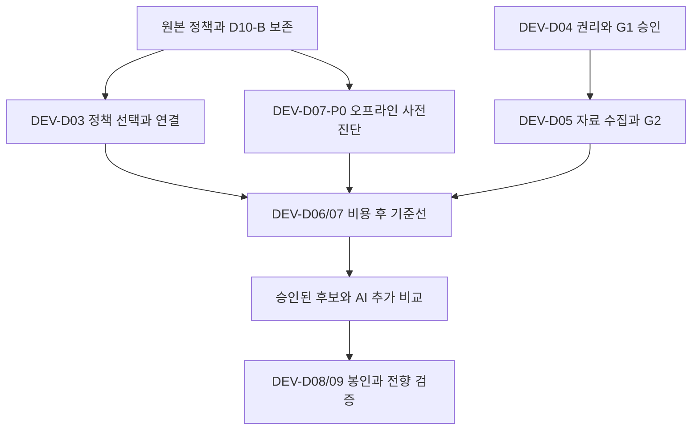

# 수익성 적대적 검토 판정과 실행 계획 보완

_2026-09-28 · 사용자 제공 제미나이 검토 9항목과 앞선 AI/장부 실행 명세의 대조 기록_

---

## 📋 범위와 결론

상태: **문서 반영 완료, 전략 변경·실험 실행·승격 승인 아님**. 프로젝트 목적은 견고한 장부 기반 AI 보조 자동매매이며 장부 자체의 무한 확장이 아니다. 사용자 제공 외부 의견은 검증 대상이지 실행 지시·정책 승인으로 승격하지 않는다.

기준은 [공통 정책 v2.3](../outputs/AI_TRADING_POLICY_v2.3.json), [B/P 명세](../outputs/TRADING_STRATEGY_SPEC_v1.0.json), [실행 가이드](DEVELOPMENT_EXECUTION_GUIDE_v1.md), 현재 코드다. 원문은 사용자가 제공한 9항목의 순서를 PRF-01~09로 유지해 요약했다. 외부 모델에 재전송하지 않았다. 현재 제품에는 실자료 성과·검증된 수익 예측이 없으며, 이번 정적 검토만으로 전략의 수익성이나 불가능성을 확정하지 않는다.

| ID | 쟁점 | 판정 | 연결 단계 |
| --- | --- | --- | --- |
| PRF-01 | 시장 상승 노출과 전략 효과 | 비교 설계 수용 | DEV-D07 |
| PRF-02 | B/P 공통 팩터 위험 | 조건부 수용·분류 정정 | DEV-D06/07 |
| PRF-03 | 90분·2R 청산 | 미검증 후보 유지 | DEV-D07 |
| PRF-04 | AND 필터·표본 부족 | 계측 수용·즉시 완화 반대 | DEV-D06/07 |
| PRF-05 | 소액·최소 1주 | 한계 수용·위험 하한 반대 | DEV-D03/07 |
| PRF-06 | 예측·q05 공백 | 공백 수용·대체안 조건부 | DEV-D07/09 |
| PRF-07 | 장중 AI 지연 | 비동기화 수용·시각 고정 반대 | DEV-D09 |
| PRF-08 | SOXL 별도 검증 | 상품 검증 수용·수학 정정 | DEV-D04/07 |
| PRF-09 | 상승장 편중 | 별도 스트레스 수용·봉인 변경 반대 | DEV-D07/08 |

이 문서의 ‘수용’은 검증 요구를 가이드에 반영한다는 뜻이다. 베타 상한, 추적 손절, 점수제, 위험 예산 하한, 경험적 예측 대체, 교차 ETF 신호의 운영 적용을 승인하지 않는다.

## 🔍 9개 지적의 근거와 반증 실험

### PRF-01 시장 상승 노출을 전략 고유 성과로 오인할 가능성

- **분류:** 타당한 미검증 가설. 수익이 전부 우연한 베타라는 주장도 아직 입증되지 않았다.
- **근거:** [전략 평가기](../src/core/strategy.ts)의 `COMMON_DAILY`, `COMMON_BENCHMARK`는 SMA60과 시장 VWAP 조건을 검사한다. 상승 추세 노출을 의도적으로 선택한 전략이다.
- **반영:** 동일 계좌·기간의 현금/단순 보유 비교, 동일 신호 시점의 벤치마크 대체매매 비교, 시장/섹터 노출 진단을 나누어 보고한다. 벤치마크 선택은 시장·섹터별 사전 등록이며 모든 국내 종목에 QQQ를 일괄 적용하지 않는다.
- **실험:** 두 모의 계좌에 같은 초기 자금·통화·동시 보유·위험 제약을 적용한다. 대체 ETF는 자체 가격·호가·비용·정수 수량·자체 ATR로 같은 형태의 청산 규칙을 계산한다. 원종목 손절 가격을 복사하지 않는다. 같은 명목금액 비교와 같은 계획 위험 비교는 별도 결과다. 미체결/0주/남는 현금/보류도 남긴다.
- **판정:** 신호 시점 대체 비교는 종목 선택 효과의 진단이지 타이밍 효과 전체나 인과적 알파의 증명은 아니다. 계좌 일별 순수익률의 베타 조정 진단도 관측 빈도·추정 구간·표준오차·시장/섹터 요인을 명시한다. 36개월 전체를 OOS라 부르지 않으며 기존 순차 분할과 마지막 6개월 봉인을 유지한다.

### PRF-02 다종목·다전략의 공통 팩터 위험

- **분류:** 미래 표준 단계의 위험 가설·진단 공백. 제시된 조건만으로 현재 정책의 ‘확정 모순’은 아니다.
- **근거:** [원본 정책](../outputs/AI_TRADING_POLICY_v2.3.json)의 `pilot_max_positions=1`, `standard_max_positions=2`와 [위험 검사](../src/core/risk.ts)의 `POSITION_LIMIT`을 구분해야 한다. 40% 보유 한도·0.25% 그룹 위험은 표준 원값이며 위험도/PILOT 배율이 적용된다. 현재 `remainingRiskForExposure`는 전체 열린 위험 R을 그룹 잔여에서도 차감하는 보수적 경로다. 정교한 동적 베타 모델이 구현됐다는 뜻은 아니다.
- **반영:** PILOT의 초과 동시 진입 거절과, 표준 단계의 동시·잔여 주문·섹터/팩터 집중을 각각 검사한다. 베타는 관측 구간·벤치마크·통화·결측/불안정 상태와 함께 진단한다. 현재 노출·손실 한도를 대체하지 않는다.
- **실험:** B 단독/P 단독/B+P를 같은 자금·동일 시계·원래 수량/중지 정책에서 재생한다. 동시 갭·스프레드 확대·거래정지·청산 지연을 공동 경로에 주입하고 MDD, 실제 손실, 잔여 노출, 중지 초과를 비교한다. 연구용 베타 상한 후보를 더할 경우 별도 사전 등록·정책 승인 대상으로 둔다.
- **정정:** 개별 q05의 합은 포트폴리오 q05와 일반적으로 같지 않다. 실제 경로별 손익은 가산되지만 분위수는 공동분포에 의존하므로 ‘비선형 초과가 반드시 발생’한다고 전제하지 않는다. 당일 최종 2% 하락 여부는 사후 평가층에만 쓰고 장중 진입 입력에 누출하지 않는다.

### PRF-03 고정 청산과 추적 청산

- **분류:** 미검증 전략 변경 가설. 1.5R에서 반락할 수 있다는 사례만으로 추적 손절의 우월성이 성립하지 않는다.
- **근거:** [공통 청산 정책](../outputs/AI_TRADING_POLICY_v2.3.json)의 90분·2R와 [모의 체결기](../src/core/simulator.ts)의 청산 경로를 기준선으로 보존한다.
- **실험:** 같은 후보 진입의 청산 효과를 분리하는 연구와, 청산 시각 변화로 후속 진입·현금·위험이 달라지는 전체 계좌 재생을 나눈다. 후보는 EMA/ATR/시간 기반 중 사전 등록한 하나씩 비교한다. 갱신은 완료 봉 이후 가능한 시점에만 반영하고 손절을 뒤로 느슨하게 하지 않는다. 같은 봉 내 고저 순서를 알 수 없으면 유리한 체결 순서를 추측하지 않는다.
- **판정:** PF뿐 아니라 비용 후 계좌 손익·MDD·회전율·보유 시간·꼬리손실을 비교한다. 제안된 ‘3개월 봉인’은 기존 마지막 6개월 최종 시험을 대체하지 않는다. 연구 선택 구간에서 후보를 정하고 최종 봉인은 반복 탐색에 쓰지 않는다. 기존 전략의 청산 수치는 이번에 바꾸지 않는다.

### PRF-04 엄격한 필터와 표본 부족

- **분류:** 빈도/커버리지 미검증 가설. AND 조건이라는 이유만으로 ‘확정 모순’은 아니다.
- **근거:** [전략 평가기](../src/core/strategy.ts)는 `trace`에 개별 조건을 남기고 마지막에 조건들의 동시 충족을 요구한다. 조건은 독립이 아니므로 통과율이 반드시 기하급수로 줄어든다고 단정할 수 없다. [테마 가이드](../outputs/THEME_RESEARCH_GUIDE_v1.3.md)의 봉당 AI 5개는 분석 예산이지 정량 신호가 최대 5개라는 뜻은 아니다.
- **먼저 할 일:** 시장/세션/종목·완료 봉 모집단에서 자료 적격→공통 조건→B/P→가격/거리→수량/비용→예측/경제성→승인→체결의 분모를 추적한다. 단계별 순차 탈락, 모든 실패 사유, 평가하지 못한 조건을 분리한다. 먼저 실패한 조건만 세면 필터 순서에 의존하므로 단일 원인으로 해석하지 않는다.
- **실험:** 안전·권리·시점·유동성·위험 하드 가드는 유지한다. 알파 조건의 제거 실험이나 점수제는 승인된 격리 연구에서 한 변경씩 비교한다. 같은 자료로 후보를 무제한 탐색하지 않는다. 신호 일수·완료 거래·독립 거래일·집중도·순손익·거래당 비용을 함께 측정한다.
- **판정:** 무거래는 실패가 아닐 수 있다. 200건을 못 채우면 승격 미충족이며 기준을 완화해 채우지 않는다. 200건 달성도 검증 충분성의 보장은 아니다.

### PRF-05 500만 원·LOW/PILOT의 0주 문제

- **분류:** 일부 종목의 경제적 부적합 가능성은 수용. 최소 1주를 위해 위험 예산에 하한을 두자는 해법은 반대한다.
- **산술:** 다른 축소/잔여 제약이 없는 예에서 `5,000,000 × 20/10,000 × 1/4 × 1/2 = 1,250원`이다. 가정 환율 1,300원, 1주 손절거리 1달러라면 가격 위험만 1,300원이므로 비용 전에도 탈락한다. 이는 실제 환율·요율의 확인 결과가 아니다.
- **반례:** [기존 구현 프롬프트](../outputs/AI_TRADING_IMPLEMENTATION_PROMPT_v1.0.md)의 합성 예처럼 1주 가격 위험 1,000원+비용 150원은 위험 한도 안이다. 고정비 200원을 추가하면 1,350원으로 탈락한다. 전자는 위험 조건만 충족할 뿐 전체 주문 승인이 아니다. 따라서 모든 종목에서 매매가 불가능하다는 결론도 성립하지 않는다.
- **근거:** [수량 계산](../src/core/cost-aware-sizing.ts)과 [기존 시험](../tests/cost-aware-sizing.test.ts)의 `SIZE-02`, `SIZE-10`은 최소 수량·비용 경계를 다룬다. 이번에는 그 시험 코드를 읽었으며 제품 시험을 재실행하지 않았다.
- **반영:** 시장/상품/가격/자금/비용 프로필별 0주 사유와 ‘1주가 요구하는 위험’을 진단한다. 기존 USD 현금을 매매할 때마다 환전한다고 가정하지 않고 실제 과금 단위를 확인한다. 감당하지 못하면 ABSTAIN을 유지한다. 소수점 매매·위험도 상향·자금 증액도 자동 대안으로 켜지 않는다.

### PRF-06 기대값·q05 예측의 구현 공백

- **분류:** 실자료로 보정된 예측 제공기의 부재는 확인된다. 현재 ridge가 잘못된 q05를 주문에 통과시킨다는 설명은 현재 코드와 다르다.
- **근거:** [제공기](../src/core/providers.ts)의 `MissingForecast`는 null, `SyntheticForecast`는 명시 TEST_ONLY의 고정 합성 R배수다. [승인기](../src/core/approval.ts)는 프로필 부재를 거절 사유로 남긴다. [연구 평가기](../src/core/learning.ts)는 ridge 예측의 `netPnlQ05:null`, `calibrated:false`, `orderAuthorized:false`를 유지한다. `empiricalNetQ05R`는 관측 라벨 분포 요약이지 예측 꼬리/계좌 성과가 아니다.
- **정정:** 선형 평균 모형이라는 이유만으로 모든 꼬리 추정이 불가능한 것은 아니지만, 평균 회귀 출력만으로 조건부 q05가 검증되지는 않는다. q05는 최악 손실 보장이 아니라 하위 분위수다.
- **실험:** 과거 자료 경험분포는 연구용 비교 후보로 허용하되 자동 fallback으로 연결하지 않는다. 일별 한 관측씩 60개라면 5% 꼬리는 약 3개 수준이다. 60거래일에 여러 거래가 있어도 같은 날/국면의 의존성이 사라지는 것은 아니다. 기간·표본/거래일·국면·통화·수량·보유 시간·체결/비용 정의를 맞춘 뒤 OOS 초과 빈도와 초과 손실 크기, 불확실성·스트레스를 평가한다.
- **판정:** 양수 슬리피지 비용의 불리한 꼬리는 상위 쪽이고, 순손익의 손실 꼬리는 하위 쪽이다. 이 부호를 혼동하거나 개별 분위수들을 더해 거래 q05를 만들지 않는다. 꼬리자료 부족이면 UNKNOWN/승격 보류다. 임의 60일 프록시로 기존 경제성 게이트를 통과시키지 않는다.

### PRF-07 뉴스·LLM 지연

- **분류:** 비동기 분석과 보호 경로 독립은 수용. 장전 배치만이 유일한 정답이라는 제한은 채택하지 않는다.
- **근거:** [분석 모형 안내](CODEX_ANALYSIS_MOCK.md)와 [실제 연결 계획](CODEX_ANALYSIS_PLAN.md)은 현재 모형과 향후 외부 연결을 구분한다. 현재 장중 LLM 지연이나 HFT 대비 추격 손실을 실측한 것은 아니다.
- **반영:** 장전 조사 및 비동기 갱신 결과를 원문·가용시각·버전·만료와 묶어 참조한다. 장중 중요한 공시/거래정지 감시를 장전 배치로 대체하지 않는다. 필수 자료가 없으면 AI OFF라는 이름으로 그 안전 검사를 생략하지 않는다. LLM 지연·실패가 보호/취소/장부 처리를 막지 않도록 한다.
- **실험:** Q/사전 계산 AI 참조/격리된 지연 개입 연구를 비교하되 정책 변경 후보는 별도 승인한다. 뉴스 수신, 분석 완료, 신호, 재검증, 송신, 체결 시점을 분리한다. AI 비용·결측·만료·timeout·호가 변화·미체결을 포함하고, 30초 신호/2초 호가 기준은 늘리지 않는다. 실제 읽기 RTT를 주문 지연으로 간주하지 않는다.

### PRF-08 SOXL의 경로 의존성과 상품별 검증

- **분류:** 별도 상품 검증 필요성은 수용. ‘ATR 공통 배수면 무조건 손절’과 ‘본질적으로 항상 음의 복리’라는 단정은 반박한다.
- **공식 근거:** SOXL은 NYSE Semiconductor Index의 일일 +300%를 목표로 한다. SOXX도 이 지수를 추적하는 별도 ETF이며 SOXL의 기초지수 그 자체는 아니다. 상품/지수 구성과 변경 시점은 실험 기간별로 확인해야 한다.[^1][^2]
- **수학:** SOXL 자체 ATR은 그 가격 변동을 반영한다. 동일한 ATR 배수만으로 손절이 지나치게 좁다고 단정할 수 없고, 넓히면 같은 위험 예산에서 수량이 줄거나 0이 될 수 있다. 비용을 무시한 일별 +10%, +10% 예에서 3배 재설정 상품은 +69%, 지수 누적 +21%의 3배는 +63%다. 복리 차이는 경로에 의존하며 늘 음수인 고정 감가가 아니다. 운용사 공시도 보유기간·변동성에 따른 차이를 설명한다.[^3]
- **실험:** 기준은 실제 SOXL 가격/호가/기업행동에 원본 B/P를 적용한 연구다. SOXX 신호→SOXL 체결, 상품별 계수는 각각 별도 후보로 두고 신호 시점 동기화·SOXL 자체 체결/손절/수량 위험을 재검증한다. 신호 ETF의 가격 손절을 체결 ETF에 그대로 복사하지 않는다.
- **판정:** 실 ETF 가격에 일률적 시간 감가를 또 빼지 않는다. SOXL은 계속 조사 후보로 보존하며 허용·금지나 확대 손절을 자동 승인하지 않는다.

### PRF-09 국면 편중과 봉인 표본

- **분류:** 하락·횡보·충격 검증 확대는 수용. 최종 봉인을 무작위로 섞어 하락장 30%를 강제하자는 방식은 반대한다.
- **근거:** 기존 36개월/마지막 6개월/12·3·3 순차 검증은 보존한다. 시계열에서는 미래 학습·과거 평가가 섞이지 않게 순서를 지켜야 한다.[^4]
- **실험:** 자연적인 시계열 OOS/최종 봉인과 별도로, 사전 정의한 연속 스트레스 구간을 준비한다. 각 구간에 준비 이력·당시 유니버스/기업행동·시점별 자료를 붙이고 원래 시간·현금·중지 상태를 재생한다. 비연속 날짜를 이어 붙여 실제 운용 곡선처럼 표시하지 않는다. 미래 위기 자료로 과거 위기 예측을 학습한 결과는 OOS가 아니라 시나리오 연구다.
- **판정:** 10년 자료, VIX 25, 하락장 30%는 제안일 뿐 새 필수 수치가 아니다. 가용권리·해상도·분모를 확인하며 스트레스에서 관측한 빈도를 자연 발생 확률로 해석하지 않는다. 5% 낙폭/2연속 손실 중지는 손실 상한 보장이 아니다. 신규 위험 차단, 중지 이후 잔여 노출, 갭·청산 지연으로 초과한 손실을 각각 보고한다.

## 🔐 AI·장부의 권한과 인수 경계

| 영역 | 허용 역할 | 금지 경계 |
| --- | --- | --- |
| 런타임 AI | 비동기 조사·후보/분석 제안 | 주문 권한·금융 증거 생성·정책 자동 변경 |
| 결정론적 검사 | 출처·시점·버전·정책·위험 검사 | 승인 해시만으로 외부 사실 인증 |
| 주문/장부 코어 | 검증된 사건의 원자 기록·정확한 금액 | AI 대기·원본 덮어쓰기·묵시적 차액 상쇄 |
| 사람 | 범위·정책·모델 승격·재개 승인 | 불변식·증거 검증 우회 |

이것은 역할 경계이며 ‘Fast/Slow’ 속도 보장은 아니다. 개발 에이전트가 승인된 코어 코드를 수정할 수 있는 권한과 런타임 AI 권한도 다르다. 승인된 범위 내 정상 자동매매에 건별 수동 승인을 새로 강제하지 않는다.

- 금액은 기존 정밀도·문자열 계약·명시 반올림 정책을 지킨다. BigInt/Decimal128을 이름만 보고 교환하거나 연구 지표의 `Number`까지 모두 금지하는 무관한 개편을 하지 않는다.
- 원본 사건/마감 해시는 불변이지만 동일 트랜잭션의 검증된 현재 잔액 투영 갱신은 허용된다. 잘못된 입력은 금융 변경 없이 거절/롤백한다. 권한을 잃은 writer가 새 HOLD 사건을 쓰는 우회도 금지한다.
- 정상 중복 영수증 복구와 새 명령의 expectedState 검사를 구분한다. 복구 순서를 무조건 뒤집지 않는다.
- 지연 비용·환급은 ‘관측 기록’과 ‘금융 반영’을 분리한다. 원본 ID 참조만으로 자동 반영하지 않는다. [OC-U05/U07](COST_SETTLEMENT_ADJUSTMENT_CONTRACT.md)의 허용 사유·원천 증거·금액/통화·기간 귀속·보고/라벨 버전·승인은 여전히 미결정이다.
- 모든 경우를 HOLD하는 것만으로 DEV-D03을 완료할 수 없다. 승인된 정상 경로에서 엔진/공통 현금/보고/학습 입력이 같은 사건·비용을 재현하고, 음성 경로에서 중복·잘못된 반영이 차단되어야 한다. 정상 합성 학습 입력 검사도 모델의 거래 승격은 아니다.

## 🎯 실행 우선순위와 범위 제한

기존 10단계·40개 인수 조건을 삭제하거나 새 체크로 이중 합산하지 않는다. 아래는 기존 단계 내부의 다음 실행 순서와 완료 증거다. 장부 연결과 읽기 진단·연구 설계는 병행 가능하지만 실자료 비용 후 성과 인수에는 필요한 비용 통합이 선행되어야 한다.

| 순서 | 기존 단계 내 작업 | 인수 증거 |
| --- | --- | --- |
| 1 | DEV-D07-P0 사전진단 | 기존 trace·수량·비용·예측 부재의 분모/사유, 합성 정상/탈락/결측 사례; 수익 추정 없음 |
| 병행 | DEV-D03 연결 범위 확정 | D03-03/04별 정상/음성/복구 증거, OC-U05/U07 등 결정표, 미지원 별도 기록 |
| 2 | DEV-D04/05 자료 자격 | 필요한 필드/기간·권리/요금 확인, 승인된 제한 수집, 목적별 G2 |
| 3 | DEV-D06/07 원본 기준선 | 소액 실행 가능성·필터 커버리지·기준 비교·공동 스트레스; 손익 통합 근거 |
| 4 | DEV-D07/09 후보 비교 | 한 번에 하나의 사전 등록 변경, 비용 후 증분 효과·불확실성·실패/보류 포함 |
| 5 | DEV-D07/08/09 인수 | 기존 OOS/봉인/장기 모의 조건, AI 전향 관측, 실패 시 승격 없음 |

P0는 사용자 후속 요청 시 시행할 **문서상 다음 제안**이며 이번에는 구현하지 않는다. 새 장부 기능이나 실전용 q05 모델을 선행 과제로 계속 추가하지 않는다. 정상 연결에 반드시 필요한 수정과 향후 기능을 분리한다. 부분 인수 범위를 선택해도 USD/혼합통화·정정 등 기존 미완료 항목을 삭제하거나 전체 완료로 바꾸지 않는다.

후보 공통 사전 등록 항목은 목적/가설, 변경 한 가지, 기준선, 시장/상품/통화·자금/위험도·기간, 자료/가용시각/비용/코드 해시, 비교 분모, 미체결/보류, 실험 횟수, 주평가·부평가, 실패/표본부족 기준이다. 원본 승격 기준은 그대로다. 새로운 증분효과 합격 수치는 결과를 보기 전에 승인하며 이번에 임의 숫자를 넣지 않는다.

AI A/B는 동일 출발 자금·시장 시계·자료 적격성·위험/비용 계약을 공유하는 별도 모의 계좌다. 신호만 같은 시각인 거래별 비교는 보조 분석으로 표시한다. AI 비용과 지연/실패를 포함하고, 무거래·자료 없음·HOLD를 분모에서 지우지 않는다. ‘잘못된 진입/놓친 거래’는 사전 고정 후보 모집단·보유기간·체결 가정·비용 후 라벨 정의가 있을 때만 계산하며 사후 상승한 모든 종목을 놓친 거래로 세지 않는다. 보류 거래의 가상 결과는 반사실 추정이지 실제 체결 손익이 아니다.

## 🧪 이번 문서 작업의 검증과 한계

코드·정책·기존 시험의 정적 대조, 독립 합성 산술, 원본 해시, 문서 링크/인수 체크 보존, 로컬 표시를 검사한다. 실행 결과와 실패/제약은 [PROGRESS · 공개 요약](PROJECT_STATUS.md)의 이번 문서 보완 기록에 남긴다. 이번에 제품 회귀·실자료 백테스트·60일 관측·36개월 OOS·LLM 연결·실주문·독립 에이전트 검토를 했다고 주장하지 않는다.

이 문서의 실험들은 앞으로의 검증 계획이다. 수익 개선·손실 제한의 실증 결과가 아니며, 전략 수정을 승인받거나 테스트 수를 채우기 위한 근거로 사용하지 않는다. 자료·시장·계좌 조건이 충족되지 않으면 UNKNOWN/미충족을 유지한다.

## 🔗 외부 근거

아래는 공개 공식 문서의 읽기 확인이며 시세 수집이나 API 인증이 아니다. 상품 목적·시계열 분할의 일반 근거에 한정하고 브로커 요율·지원·우리 전략 수익성의 증거로 확대하지 않는다. 확인일: 2026-09-28.

[^1]: Direxion. Daily Semiconductor Bull and Bear 3X ETFs. 일일 목표와 NYSE Semiconductor Index. https://www.direxion.com/product/daily-semiconductor-bull-bear-3x-etfs
[^2]: iShares. iShares Semiconductor ETF (SOXX). Benchmark Index 항목. https://www.ishares.com/us/products/239705/ishares-phlx-semiconductor-etf
[^3]: Direxion, SEC EDGAR 게시 요약 투자설명서. Effects of Compounding and Market Volatility Risk. https://www.sec.gov/Archives/edgar/data/1424958/000119312526078540/d50601d497k.htm
[^4]: scikit-learn 공식 문서. TimeSeriesSplit. 미래 자료 학습/과거 평가를 피하는 시계열 분할. 라이브러리 설치·도입 지시가 아니다. https://scikit-learn.org/stable/modules/generated/sklearn.model_selection.TimeSeriesSplit.html
