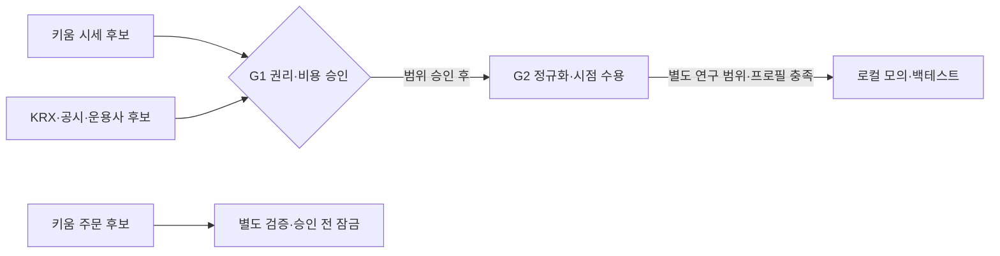

# 키움 전환과 투자 자료 공급원 결정 기록

_2026-09-21 · 설계 결정 및 공식 문서 대조 · 실제 연결 승인 아님_

후속 구현: [키움 모의 응답 형식 검증](../KIWOOM_OFFLINE_INGEST.md)에 4개 읽기 TR의 오프라인 모형 변환과 페이지 검사를 추가했다. 아래 설계 작성 당시 상태는 보존한다. 실제 연결이나 시각/가격 의미 검증, G1/G2·주문 승인 완료는 아니다.

---

## 🎯 결정과 적용 범위

키움 REST API를 국내·미국 시세와 향후 주문 연결의 **우선 검증 후보**로 삼는다. KRX는 국내 일별 자료의 보완·대조, DART/SEC는 공시·재무, 운용사는 ETF 구조 확인에 배치한다. 한 공급자가 모든 자료를 제공한다고 가정하지 않는다. 키움 주문 기능이 원본 안전 기준을 충족하지 못하면 실거래를 보류하고 다른 브로커를 별도 평가한다.

이번 산출물은 대조표와 후속 구현 조건이다. 키움 어댑터·수집기·실주문 기능은 구현하지 않았다. API 키, 계좌, 시세/공시 데이터 API, 유료 서비스, 사용자 서버·DB에는 접근하지 않았다. 공개 안내 조회와 로컬 문서 검증만 수행한다.

[기존 계약](README.md)의 D01–D22와 [수용시험](ACCEPTANCE_PLAN.md)을 그대로 연결한다. [공통 정책](../../outputs/AI_TRADING_POLICY_v2.3.json), [B/P 전략](../../outputs/TRADING_STRATEGY_SPEC_v1.0.json), [테마 정책](../../outputs/THEME_RESEARCH_POLICY_v1.3.json), [후속 연구 범위](../../profiles/research-scope-v1.json)는 변경하지 않는다. 토스 전용 부록도 역사적 기준으로 보존하되 키움에 자동 적용하지 않는다.

### 대안과 선택 이유

| 선택지 | 장점 | 한계와 이번 결정 |
| --- | --- | --- |
| 토스만 유지 | 기존 단발 조회·모형 변환 코드를 활용 가능 | 기존 저장/비용 미확인이 키움 전환으로 해결되는 것은 아님. 코드는 보존하고 주 연결 후보만 변경 |
| 키움만 사용 | 시세·향후 계좌/주문 연결의 공급자 수를 줄일 가능성 | 장기 분봉·과거 호가·공시·기업행동 완전성은 미확인. 모든 자료를 대체하는 안은 채택하지 않음 |
| 키움 중심, 용도별 자료 보완 | 자료별로 적합한 출처와 교차 검증을 선택 가능 | 시점·종목·거래소·권리 차이를 정규화해야 함. 이번에 채택한 설계 방향 |

위 장단점은 설계 판단이지 지연·안정성 우열의 실측 결과가 아니다. 현재 코드는 [토스 단발 사전점검](../../src/server/market-paper-check.ts), [토스 시세 접근](../../src/server/toss-market-data.ts)에 직접 의존하며, 교체 가능한 전체 브로커 계층이 완성된 상태가 아니다.

## 🌐 공식 확인 사항과 비용 경계

`문서 확인`은 공개 기능 안내, `설계`는 구현 요구, `미확인`은 추가 증거가 필요한 상태다. 아래 사실의 조회일은 2026-09-21이며 공급자의 개정일·SLA가 아니다.

| 출처 | 문서 확인 | 확정하지 못한 것 |
| --- | --- | --- |
| 키움 REST 소개 | 국내·미국 주식, 비 OCX·멀티 OS, HTS와 같은 매매 수수료 적용 안내[^K-01] | 사용자 적용 수수료·시세/조회/저장 비용, 모든 상품 지원·계좌 자격, 장기 이력 |
| 키움 이용안내 | 실전/모의 키 구분, 허용 IP 인증, OAuth 토큰 유효기간 24시간[^K-02] | 우리 인증·재연결 성공, 키의 조회 전용 권한 제공 여부 |
| 키움 API 가이드 | KR/US 시세·차트·계좌·주문 항목이 존재[^K-03] | 각 TR 필드·정정 의미·분봉 범위·서버 보호주문 충족 여부 |
| 키움 모의투자 | 별도 신청·무료 안내. KR 주문/계좌는 KRX만, NXT 시세는 제공 가능. US는 NYSE/NASDAQ/AMEX 및 무료 실시간 시세 안내[^K-04] | 실전과 같은 체결·지연·세금·수수료를 재현한다는 증명 |
| KRX 공개 API | 국내 주식/ETF/지수 일별 자료와 기본정보, 서비스별 제공 시작일 안내[^R-01] | 장중 호가·1분봉 전 기간, 당시 상장/폐지 모집단 완전성, 미국 종목 자료 |
| DART / SEC | DART 공시 검색, SEC 제출 이력·XBRL 조회 안내[^D-01][^E-01] | 통합 뉴스·예정 실적/거시 일정 전체, 당시 이용 가능했던 정보의 완전성 |
| Direxion / iShares | SOXL 일일 레버리지 목표, SOXX 상품·구성 자료[^F-01][^F-02] | 과거 구성/파생노출 전 기간, 자동 수집·보관·학습 권리 |

매매 수수료 안내나 모의서비스 무료라는 사실로 실전 시세 수신·로컬 장기 보관·AI 전송까지 무료/허용이라고 판단하지 않는다. KRX 공개 API와 별도 시세 분배 계약도 구분한다. 기존 출처의 목적별 권리·요금·호출 조건은 [공급원 원장](SOURCE_REGISTER.md)을 따른다. 이 문서는 기존 `S-001`–`S-015`와 `sources.json`을 덮어쓰지 않는 후속 결정 기록이다.

## 📊 D01–D22 공급원 대조표

각 행의 공급자는 **후보**이며 자료 수용 완료를 뜻하지 않는다. `필수`는 해당 거래 경로, `조건부`는 해당 기능·시장·상품을 활성화한 경우의 요구다. 내부 파생도 원천 자료의 권리·시점 검사를 통과해야 한다. 수용 ID의 전체 절차는 [수용시험 계획](ACCEPTANCE_PLAN.md)에 있고 이번에는 실행하지 않았다.

| ID | 필요 자료·범위 | 우선 공급/처리 후보 | 미확인 또는 보완할 증거 | 기존 수용 ID |
| --- | --- | --- | --- | --- |
| D01 | 출처·권리·시점 / 필수 | 각 공급자 조건 + 로컬 관측 기록 | 목적별 저장/요금, 원천·수신·가용·정정시각과 시각 정밀도 | `AT-D01` |
| D02 | 종목 식별·당시 모집단 / 필수 | 키움 KR/US 목록, KR은 KRX 대조 | 식별자 변경·복수상장·폐지·당시 목록. 현재 목록으로 과거 모집단 대체 금지 | `AT-D02` |
| D03 | 상품·자격·tick/lot / 필수 | 키움 상품 정보 후보 + 거래소/운용사 근거 | 종목/가격대/효력시점별 단위, 실제 계좌 자격은 별도 승인 후 확인 | `AT-D03` |
| D04 | MARKET_SCAN 선정 / 필수 | D02/D06/D08/D09 내부 파생 | 전체 분모·탈락 이력·20일 거래대금 중앙값. 브로커 당일 인기순위로 대체 금지 | `AT-D04` |
| D05 | 달력·세션·위험일·시계 / 필수 | 공식 시장 달력 + 브로커 세션 후보 + 로컬 시계 | KR 거래소별 세션, US DST/조기종료, 동기화 오차. 완전 공급 계약 미정 | `AT-D05` |
| D06 | 원천 봉·장기 이력·거래대금 / 필수 | 키움 차트 후보, KR 일별은 KRX 보완 | 1분봉 보존 범위·페이지·120세션·장기 연구 기간·정정. 가격/거래량 조정 의미 검증 | `AT-D06` |
| D07 | 시장·업종 벤치마크 / 필수·일부 조건부 | KR KRX/키움, US 키움·허용 데이터 후보 | 정확한 심볼/지수·세션·과거 범위·기준 변경. 후보 자신의 가격으로 대체 금지 | `AT-D07` |
| D08 | B/P 지표·정밀도 / 필수 | 수용된 D06/D07에서 기존 공식으로 계산 | 완료 1분→15분, RVOL 과거 20 비교세션 같은 봉 위치·seed·정밀도 | `AT-D08` |
| D09 | 호가·체결 유동성 / 필수 | 키움 실시간·조회 후보 | 시장/거래소별 호가 원천·시각·잔량·sequence·누락·회복. 과거 호가는 별도 확보 | `AT-D09` |
| D10 | 기업행동 / 필수 | 공식 공시/운용사 + 키움/KRX 제공 범위 대조 | 분할/역분할·배당·합병·폐지·정정 효력 및 당시 가용시각. 통합 공급 계약 미정 | `AT-D10` |
| D11 | 예정 이벤트·실적·거래정지 / 필수 | 공식 거래소/기관 일정·공시 + 브로커 상태 후보 | 정확한 시각·예정/발생 구별·수정·취소. DART/SEC만으로 전부 충족 안 됨 | `AT-D11` |
| D12 | 뉴스·공시 안전 수집 건강 / 필수 | DART/SEC + 허용 뉴스/시장조치 공급자 후보 | 통합 뉴스 공급자 미정. 정상 0건과 수집 실패 구별, 최근 성공 300초 | `AT-D12` |
| D13 | 뉴스 의미·LLM 분석 / 조건부 | 수용된 공시/뉴스 + 승인된 분석 모듈 | 외부 전송 별도 권리, 근거·정정·프롬프트 공격 검사. 자동 진입 권한 없음 | `AT-D13` |
| D14 | 투자자별·기관 수급 / 조건부 | KR 키움 기관/외국인 항목 후보, KRX 보완 검토 | KR 잠정/확정·단위·지연. US 동등 자료 미선정; 보유 공시를 실시간 매매로 해석 금지 | `AT-D14` |
| D15 | 기업 실사 / 테마 회사 조건부 | KR DART, US SEC·회사 공식 자료 | 재무 항목별 API, 회계단위·정정 vintage·사업자료·컨센서스 공백 | `AT-D15` |
| D16 | ETF 구조·구성·공정가치 / ETF 필수 | 운용사 우선, 키움 시세·KR KRX 보완 | 당시 구성·기초지수·파생노출·NAV/iNAV 적용시간·실계좌 가능 여부 | `AT-D16` |
| D17 | 테마·집중목록 / 모드 조건부 | D15/D16 + 승인된 테마 정의에서 내부 파생 | 상세 선정 프로필은 미정 유지. 공급자 테마/인기순위가 원본 선정식은 아님 | `AT-D17` |
| D18 | 상관·중복·경제 위험군 / 필수 | D02/D06/D16/D17 내부 파생 | 과거 구성·업종·파생노출 공백은 기존 보수 군 처리. 테마별 위험 예산 복제 금지 | `AT-D18` |
| D19 | FX·통화 지갑·계좌 / 필수·계좌 후속 | 키움 계좌/환전 후보, 로컬 KRW/USD 장부 | 표시환율과 실제 환전비 구별, 정산·주문가능 현금·예약·KR/US 공통 위험일 | `AT-D19` |
| D20 | 비용·예측·경제성·체결 / 필수 | 계좌별 공식 요율/정산 + 관측 호가 + 내부 모형 | 실제 세금/FX/최소비용·미체결·지연, 운영비/학습 자동 연결 미완료 | `AT-D20` |
| D21 | 주문·체결·보호·위험 / 실거래 필수 | 별도 키움 실행 어댑터 후보 | 아래 E01–E08 전부 검증 필요. 조회 성공으로 주문 승인 안 됨 | `AT-D21` |
| D22 | 판단·체결 라벨·실험 / 연구·승격 조건부 | 기존 로컬 기록/학습 경로 + 수용 자료 | 실제 자료와 비용 라벨·시점·버전 연결, 밀봉 검증·자동 승격 차단 | `AT-D22` |

DART 검색의 `rcept_dt`는 날짜 정밀도이므로 장중 발표시각을 만들어 넣지 않는다.[^D-01] SEC의 현재 집계 재무값도 제출·정정 버전과 가용시각을 대조해야 당시 시점 연구에 사용할 수 있다.[^E-01] 이 표의 API 항목 존재 근거는 앞 표이며, 구체적인 TR·응답 적합성은 모두 후속 검증 대상이다.

## ⚙️ 데이터 연결과 전체 시장 탐색 설계

아래는 **후속 목표 구조**이지 현재 실행 구조가 아니다. 공용 정규화 경계와 자료 버전을 재사용하고, 공급자별 필드 해석은 어댑터에 둔다. 이익을 낼 전략 검증과 안전한 주문 검증은 별개다.

### 구독·호출 한도와 봉 마감

공식 소개의 유량 한도는 설정 근거의 출발점이다. 계좌/토큰당 1세션·실시간 200종목, KR 주문/조회 각각 초당 5회, US 일반 주문/조회/환전 10/5/1회와 한국시간 09–10시 3/3/1회가 안내된다. US 추가 한도는 대분류 50회/초·차트 20회/초·종목리스트 5회/분이며 모의는 TR당 초당 1회다.[^K-01] 한도 간 적용 관계·구독 해제 확인·메시지 종류별 계산은 세부 명세/응답으로 다시 확인한다. 이 수치는 보장 처리량이나 우리가 사용할 예산이 아니다.

설계 요구:

1. 전체 시장은 승인된 종목 목록과 완료 일별 자료를 배치/캐시로 탐색한다. 원본의 최근 완료 20일 거래대금 중앙값 상위 최대 100개/시장과 후보 RVOL 내림차순·스프레드 오름차순·고정 ID 순, AI 최대 5개를 보존한다. 공급자의 당일 순위 조회만으로 전 시장 검토 완료라 하지 않는다.
2. 정밀 호가는 확정 후보·보유/미확정 주문·벤치마크 등 필요한 집합만 예약한다. KR 100 + US 100 외에도 자리가 필요할 수 있다. 수용량 초과 시 선정 순위를 임의 바꾸지 말고 영향 후보를 `DATA_CAPACITY_HOLD`로 기록한다. 여러 키/세션으로 공급자 한도를 우회하지 않는다.
3. 조회 스케줄러는 환경·계좌·시장·TR/그룹별 한도를 함께 적용하고, 승인 예산 안에서 더 엄격한 상한을 따른다. 재시도 상한·제한 응답·재연결·구독 ACK를 기록한다. 미래 주문 경로에는 별도 예약량을 두어 수집이 취소/대조를 굶기지 않게 검증한다.
4. 15분봉 마감 전부터 필요한 원천을 준비한다. 완료/누락/정정을 확인한 뒤 `available_at <= as_of`인 자료만 계산한다. 마감 후 30초 내 판정을 못 하면 그 신호는 건너뛴다. 늦게 도착한 완성 봉을 제시간에 알았던 것으로 소급하지 않는다.
5. 재연결 후 누락 구간·시계·보유/주문 상태를 대조한다. 데이터 공급자를 바꾸면 출처/가격기준/시각 의미를 새 버전에 고정한다. 한 봉 중간에 서로 다른 공급자 값을 조용히 섞지 않는다.

KRX와 NXT 시세/체결을 같은 시장 자료로 무조건 합치지 않는다. 특히 키움 모의의 NXT 시세 수신 가능과 NXT 모의 주문 불가는 별개다.[^K-04] 국내/미국 각각 실제 시세 지연, 조회 왕복시간, 주문 접수/체결/취소 지연을 분리 측정한다. 미국이라는 이유로 원본 TTL을 임의로 3~4배 늘리지 않는다.

원본 시간 기준은 신호 유효 30초, 호가 최대 나이 2초, 계좌 스냅샷 5초, FX 60초, 뉴스 최근 수집 성공 300초, 최대 시계 오차 500ms다. 시계 오차 500ms는 합성 주문 지연 500ms와 다른 값이다. 정확한 적용 대상·경계 비교는 원본 정책을 따른다.

## 🔐 키움 주문 기능 수용 대조표

아래 `미확인`은 미지원이라는 단정도, 지원된다는 추정도 아니다. `MarketDataProvider`와 `ExecutionBroker`는 향후 책임 구분 이름이며 현재 완성된 인터페이스라고 주장하지 않는다. 읽기 전용 수집의 성공은 E01–E08의 통과가 아니다.

| ID | 반드시 증명할 것 | 현재 근거/상태 | 실패 또는 미확인 시 |
| --- | --- | --- | --- |
| E01 | 환경·시장·계좌·상품 자격과 수수료 식별 | 실전/모의 키 구분은 문서 확인. 우리 계좌·종목은 미확인 | 해당 실거래 진입 보류 |
| E02 | 지정가·수량/가격 단위·유효기간·세션 | KR/US 주문 항목만 확인; TR별 지원/제약 미확인 | 토스 주문 필드 복사·임의 시장가 대체 금지 |
| E03 | 단일 주문 실행자·fencing·의도 영속화·재시작 멱등 | 키움 접수 ID/조회로 미확정 의도를 대조하는 경로 미검증 | timeout을 거절로 간주해 재주문/예약 해제 금지 |
| E04 | 부분체결·취소/정정 경합·최종 잔여 확정 | 신규 ID·수량 의미·최종 상태 판별 미확인 | `CANCEL_UNKNOWN` 유지. 취소 최종 상태·잔여 확정 전 재진입/청산 대체주문/정정 재발주 금지, 정정 ID 연결 보존 |
| E05 | 원본 기준에 맞는 서버 측 보호주문 | 지원 여부·장애 중 유효성·부분체결 보호 미확인 | 초기 실거래 불가. OCO라는 명칭만으로 통과 금지 |
| E06 | 체결/주문 이벤트 누락·중복·역순과 REST 대조 | sequence·재구독 복원·확정 수량 재구성 미검증 | 신규 차단, 보호 임의 취소 금지 |
| E07 | 현금·예약·FX·장부·사용자 수동거래 분리 | 계좌/환전 항목 존재만 확인 | 통화 지갑/전략 소유권 불일치 보류 |
| E08 | 지연·중단·복구·실제 OS/비밀 격리 | 합성/부분 모형 검증만 존재, 실제 연결 미검증 | 배포/실주문 승인 보류 |

원본의 잔여 미체결 10초 취소 요청, 보호 확인 5초, 재연결 후 60초 안정 조건을 바꾸지 않는다. 이는 실현 보장이 아니다. 보호 확인 실패나 취소 미확정은 상태·알림·보수적 중단 경로로 처리해야 하며 지연을 숨기기 위해 임의 연장하지 않는다. 모든 재개 조건 충족 없이 60초 경과만으로 재개하지 않는다.

자동으로 다른 증권사 계좌에 주문을 넘기는 장애 대체는 이번 설계에 포함하지 않는다. 데이터 교체와 주문 계좌 전환은 다르며, 후자는 자금·보유·미확정 주문의 재대조와 별도 승인이 필요하다.

## 💰 경제성·SOXL·AI 검증에서 보존할 기준

- 원본 월 추가 운영비 상한은 `min(A × 0.002, 10,000원)`이다. A=500만원이면 월 1만원이며 신규 유료 서비스 구매 승인이 아니다. 고정비와 거래 수수료·세금·스프레드·슬리피지·환전비를 구분하고 알려지지 않은 비용을 0원으로 채우지 않는다. 세부 인식은 [운영비 명세](OPERATING_COST_SPEC.md)를 따른다.
- 수량 `q`, 1주당 틱 `δ`, 진입가격 `P`라면 한 틱 금액은 `qδ`, 체결대금 대비 비율은 `δ/P`다. 125,000원이 모든 거래의 고정 한도라고 가정하지 않는다. 실제 가능한 정수 수량·최소수수료·환전·분산 한도를 함께 평가한다. 새 틱 비율 하드 리밋은 검증·승인 없이 원본에 추가하지 않는다.
- 500ms/불리한 2틱 같은 [합성 스트레스](../EXECUTION_STRESS.md)는 실제 지연 추정치가 아니다. [근거 진단](../EXECUTION_CALIBRATION_DIAGNOSTIC.md)의 조회 응답시간을 주문 지연으로 보고하지 않는다. 소량 실자료로 비용·미체결 민감도를 먼저 확인하고 장기 자료 구매 전에 경제성을 재평가한다.
- SOXL/SOXX는 연구 후보로 유지한다. SOXL은 일일 3배 목표 상품이지 장기 누적수익 3배 보장 상품이 아니다.[^F-01] 실제 SOXL 원시 가격과 당시 기업행동을 우선 사용한다. SOXX 수익률의 단순 3배로 대신하거나 실제 SOXL 가격에 고정 시간 감가를 다시 차감하지 않는다. 합성 일일 재설정 모형을 만들면 별도 연구 프로필로 분리한다.
- 뉴스/공시 안전 확인은 앞 단계의 필수 입력이다. LLM 분석 OFF가 안전 확인 OFF를 뜻하지 않는다. 뉴스만으로 자동 진입·무조건 청산하지 않으며, 당시 가용시각을 보존해 기준선 대비 추가 효과를 검증한다.
- 모델 학습·Codex 분석은 검증된 거래/비용 이력과 명시적 승인 범위에서만 확장한다. 모델 합의·큰 추론 수준은 수익성 증명이 아니며, 자동 정책 완화·자동 실거래 승격은 허용하지 않는다.

## 📋 승인 단계와 다음 구현

### 수집 전후 승인 분리

현재 신규 실제 자료 수집은 `G1 HOLD`, 실제 표본 수용은 `G2 NOT_RUN`, 실제 주문은 `HOLD`다. 키움으로 후보를 바꿨다고 토스에서 미확인인 저장 권리가 해결되거나 승계되는 것은 아니다.

| 단계 | 해제 증거 | 해제하지 않는 범위 |
| --- | --- | --- |
| G1 제한 수집 | 해당 공급자·환경의 수집/로컬 보관 허용 근거, 비용/조회 조건, 시장·종목·기간·호출·보관/삭제·예산에 대한 사용자 승인 | 아직 없는 표본의 G2를 선결조건으로 요구하지 않음. 실주문·AI 전송 허용 아님 |
| G2 자료 수용 | G1 범위 표본의 형식·종목·시각·정정·누락·coverage 검사와 격리/보류 결과 | 장기 백테스트·수익성·모의 주문·실주문 승인 아님 |
| 외부 AI/학습 | 사용하려는 자료·수신자·목적·보관/학습 조건에 맞는 별도 근거와 승인 | 미사용 AI 용도의 권리 미확인으로 승인된 로컬 수집까지 막지 않음 |
| 주문 환경 | E01–E08와 원본 투자 검증 충족, 대상 계좌/환경/한도의 명시 승인 | 로컬 모의, 브로커 모의, 소액 실거래를 서로의 승인으로 대체하지 않음 |

키움의 실전 미접속 시 자동해지 안내가 있더라도 이를 막기 위해 임의로 실전 인증을 실행하지 않는다.[^K-01]

### 다음 한 단계의 완료 조건

다음 구현은 **키움 자료 어댑터 계약과 모의 응답을 이용한 오프라인 수용시험**이다. 실자료 수집과 주문 모듈보다 먼저, 다음 결과를 갖춰야 한다.

1. 실제 확인한 읽기 TR의 버전·필드·단위·원천시각·통화·거래소·페이지 규격을 고정한다. 미확인 필드는 추정 매핑하지 않는다.
2. 기존 시점/품질 정규화 경계를 재사용하되 토스 전용 구조는 키움 구조와 분리한다. `MOCK`/`TEST_ONLY` 계약에 실자료 표시만 바꿔 넣는 경로는 만들지 않는다.
3. 키·계좌·네트워크 없이 정상/빈/누락/중복/상충/미래시각/페이지 반복/예산 소진/호가 오류/재연결 모형을 검사한다. 주문 TR 접근이 불가능한지 별도로 확인한다.
4. KR/US 지원 항목과 미지원·미확인을 보고한다. 원본 정책 해시, 기존 회귀, 사용자 자료 보존을 확인하고 G1은 승인 전까지 닫아 둔다.

### 이후 순서와 미완료 항목

| 순서 | 작업 | 다음으로 넘어갈 증거 |
| --- | --- | --- |
| 1 | 권리·비용/필수 TR 확인 + 오프라인 어댑터 시험 | 위 완료 조건. 실제 수집은 G1 별도 승인 |
| 2 | 주문 없는 소량 장중 수집·재생 | G2, 지연/누락/호가·비용 분리 보고. 수집만으로 주문 지연은 검증 불가 |
| 3 | 소액 경제성·체결 스트레스 보정 | 수량·비용·미체결 민감도, 실측 부족은 보수적 가정과 미검증으로 표시 |
| 4 | 전체 시장 선정 포함 장기 백테스트 | 당시 모집단·가용시각·기업행동·봉/호가 범위, 원본 표본/밀봉 기준 충족 |
| 5 | 같은 버전의 다일 모의·복구 검증 | 로컬 모의와 브로커 모의를 구별, 원본 기간/거래수와 E01–E08 증거 |
| 6 | 테마·AI의 추가 가치, 운영비/학습 통합 | 기준선 대비 비용 차감 효과·마감/소급/외화 계약, 자동 승격 없음 |
| 7 | OS 격리·배포/실행 안전 최종 검증 후 별도 실거래 승인 | 미확정 권리·상품 자격·서버 보호가 남으면 소액이어도 시작하지 않음 |

안전 수집·비밀 격리 설계는 뒤로 미루지 않는다. 위 7단계는 실제 OS 시험과 실주문 허가의 마지막 경계이며, 현재 남아 있는 운영비 자동 연결·기존 OS 검증 항목도 삭제하지 않는다. 자료 부족으로 백테스트 범위를 줄이면 이를 별도 탐색 연구로 표시하고 원본 통과 기준을 낮추지 않는다.

## 🔗 공식 근거

[^K-01]: [키움 REST 소개·상품·유량](https://openapi.kiwoom.com/intro). 2026-09-21 조회. 문서 한도이며 실제 성능/요금 확인이 아님.
[^K-02]: [키움 REST 이용안내](https://openapi.kiwoom.com/intro/serviceInfo). 2026-09-21 조회.
[^K-03]: [키움 API 가이드](https://openapi.kiwoom.com/guide/apiguide). 2026-09-21 조회. 메뉴와 공개 인증 규격 확인, 개별 주문/자료 TR 적격 판정 아님.
[^K-04]: [키움 모의투자 이용안내](https://openapi.kiwoom.com/intro/mockInvestInfo?dummyVal=0). 2026-09-21 조회.
[^R-01]: [KRX 공개 API 서비스 목록](https://openapi.krx.co.kr/contents/OPP/INFO/service/OPPINFO004.cmd). 2026-09-21 조회. 권리/별도 분배는 기존 공급원 원장 참조.
[^D-01]: [OpenDART 공시 검색 규격](https://opendart.fss.or.kr/guide/detail.do?apiGrpCd=DS001&apiId=2019001). 2026-09-21 조회. 재무 전체 필드 검증은 후속.
[^E-01]: [SEC EDGAR APIs](https://www.sec.gov/search-filings/edgar-application-programming-interfaces). 2026-09-21 조회.
[^F-01]: [Direxion SOXL 상품 안내](https://www.direxion.com/product/daily-semiconductor-bull-bear-3x-etfs?keyword=SOXL). 2026-09-21 조회.
[^F-02]: [iShares SOXX 상품 안내](https://www.ishares.com/us/products/239705/ishares-phlx-semiconductor-etf). 2026-09-21 조회.
