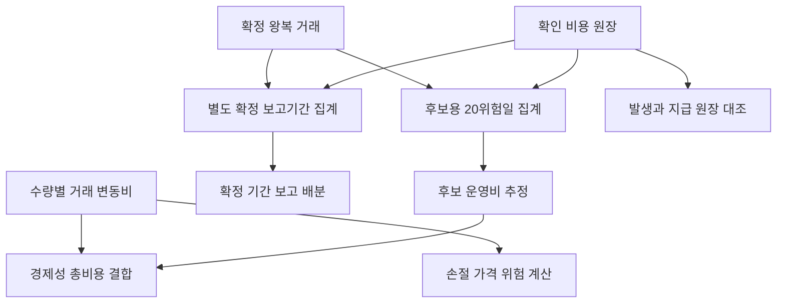

# 운영비 계산·인식·검증 계약 명세

_2026-09-17 · 자료/검증 계약 v1 · 원본 거래 정책 v2.3을 보존하는 후속 구현 설계_

---

## 📋 문서 상태와 적용 범위

이 문서는 **명세 전용**이다. 운영비 계산·원장·후보 승인·학습 연결의 후속 수정 경계와 수용시험을 정의하며, 여기 제안한 함수·스키마·마이그레이션은 제품에 구현되지 않았다. 문서 작성 승인으로 유료 의무 생성, 실제 자료 수집, API 키·계좌·주문 접근, 기존 DB 변경, OS 권한 변경 또는 실거래 활성화 권한이 생기지 않는다.

상위 범위는 [자료 계약 안내](README.md), 단계별 검증은 [수용 계획](ACCEPTANCE_PLAN.md)을 따른다. 실행 가능한 패치나 제품 명령은 제공하지 않는다. 아래 코드 위치는 2026-09-17 정적 대조 기준이며, 후속 구현 시 다시 확인해야 한다.

이 문서의 구분은 다음과 같다.

- `원본 확정`: 기존 가이드·정책에 이미 있는 요구사항. 새 정책 결정이 아니다.
- `확인된 차이`: 현재 소스의 정적 대조 결과. 제품 실패 시험을 새로 실행했다는 뜻이 아니다.
- `제안`: 후속 구현의 함수·필드·진단 경계. 현재 API나 승인된 정책값이 아니다.
- `UNRESOLVED`: 원본만으로 결정할 수 없어 별도 결정을 남긴 항목. 편의상 값이나 동작을 채우지 않는다.
- `미실행 설계 벡터`: 원본 산식에 따른 입력과 계산상 기대값. 테스트 통과 기록이 아니다.

## 📚 원본에 이미 확정된 요구사항

근거 문서는 [공통 가이드 v2.3](../../outputs/AI_TRADING_GUIDE_v2.3.md)와 [공통 정책 v2.3](../../outputs/AI_TRADING_POLICY_v2.3.json)이다. 기존 위험 비율·보유기간·진입 문턱·월 운영비 한도를 변경하지 않는다.

| ID | 원본 요구 | 가이드 근거 행 |
| --- | --- | --- |
| OC-P01 | 통합 위험일은 KST 09:00 이상부터 다음 날 09:00 미만이며 KR/US 공통이다. | 52 |
| OC-P02 | 통합 위험월은 매월 1일 KST 09:00부터 다음 달 1일 09:00 미만이다. | 54 |
| OC-P03 | 후보 운영비는 같은 직전 완료 20위험일의 발생 운영비 O와 완료 왕복 거래 N으로 산정한다. | 322, 447 |
| OC-P04 | N이 양수면 후보용 추정은 `ceil(O/N)`이다. 확인된 미래 단가·추가 호출·비선형 증가분도 반영한다. | 449 |
| OC-P05 | N=0이면 승인된 남은 당일 운영비 예산 D가 필요하며 `max(O,D)`를 사용한다. D 불명확 시 보류한다. | 449 |
| OC-P06 | 하나의 진입 의도 전체 수량이 청산 확정된 뒤 N을 1 증가시킨다. 부분체결과 0체결 취소를 별도 완료 거래로 세지 않는다. 취소·미거래 후보의 발생 분석비는 O에 포함한다. | 447 |
| OC-P07 | `C_stop(q)`는 매수/손절 거래비·부과금·불리한 체결·FX 버퍼이며 운영비와 가격 위험을 혼동하지 않는다. | 256 |
| OC-P08 | 경제성 `C(q)`는 진입/청산 비용·체결 오차·환전 마찰·배분 운영비를 포함한다. | 209 |
| OC-P09 | 기간 보고 배분은 정수 몫과 나머지를 안정적인 완료 거래 ID 순서로 나눠 합계 O를 보존한다. N=0이면 O 전액을 미배분 비용으로 남긴다. | 451 |
| OC-P10 | 비용은 cost_event_id별 한 번 인식한다. 의무 확정 시 발생 비용으로 반영하고, 지급은 현금과 채무의 이동이며 비용을 다시 인식하지 않는다. | 455 |
| OC-P11 | 미래 비용 예약은 위험 버퍼 X에 반영하다가 발생 비용으로 E에 반영되면 해당 예약을 해제한다. | 439, 441 |
| OC-P12 | 증분 월 운영비 상한은 `min(0.002 × A, 10,000원)`이며 실제 지출 의무와 예약을 포함한다. 신규 분석 차단이 보유분 보호 종료를 뜻하지 않는다. | 236, 457 |

원본의 위험일은 **거래소 영업일이 아니다**. 주말이나 국내·미국 동시 휴장일을 제외해 20거래일 창으로 바꾸지 않는다. [달력 코드](../../src/core/calendar.ts) 9~24행의 UTC 날짜는 KST 09:00이 UTC 00:00이라는 현재 규칙과 일치하므로, UTC를 사용한다는 이유만으로 오류로 분류하지 않는다.

원 단위 허용액은 내림, 비용·위험 추정액은 올림한다는 원본 41행도 유지한다. 외화 청구의 원화 환산 계약은 이 원칙만으로 전부 정해지지 않으므로 뒤의 미결정 항목으로 분리한다.

## 🔍 현재 코드 차이와 영향 범위

### 완료 위험일 창과 후보 경제성 연결

[위험 계산](../../src/core/risk.ts) 268~278행은 현재 시각에서 `20 * 86400000`을 뺀 이동 구간으로 비용·청산을 선택한다. 이는 직전 완료 20위험일과 다르며 현재 미완료 위험일을 포함하고 첫 경계 위험일의 일부를 잘라낸다. 비용의 이용 가능 시각·분류·수집 완전성도 별도 입력으로 검증하지 않는다.

같은 함수에서 계산한 `ops`는 null 검사에만 쓰인다. `costFor()` 21~34행은 합성 `fixedOperatingKrw`를 총비용에 더하며 `ops`를 받지 않는다. [승인 계산](../../src/core/approval.ts) 68행 및 84~117행은 `size()`의 비용을 예측 입력과 경제성 심사에 전달하므로, 비영 운영비를 연결하려면 이 경로의 비용 근거도 함께 바뀌어야 한다.

현재 합성 프로필의 운영비는 0이다. 이 차이를 발견했다는 사실은 현재 실계좌 손실이나 실제 주문 오류를 확인했다는 뜻이 아니다. 기존 TEST_ONLY 경계와 실주문 잠금은 유지한다.

### 원장·예약·불변식

[CostEvent 형식](../../src/core/types.ts) 122~127행에는 `id, amount, at, paid`만 있다. 비용 종류·통화·의무 확정/이용 가능 시각·예약 연결을 표현하지 못한다. [원장](../../src/core/ledger.ts) 164행은 같은 ID의 다른 금액도 조용히 무시하고, 169~172행은 단일 `operationsReserved` 총액에서 비용 금액을 차감한다. 후속 실자료 연결에서는 어떤 예약이 발생 의무로 전환됐는지 증명할 경계가 필요하다.

같은 `ledger.costs`에 입출금·기업행동의 0원 표식도 들어간다. 근거는 [원장](../../src/core/ledger.ts) 154~159행 및 [기업행동](../../src/core/events.ts) 78~83·103~108행이다. 모든 항목을 운영비로 분류해서는 안 된다.

[포트폴리오 불변식](../../src/core/portfolio-invariants.ts) 94~116행의 예상 지갑은 초기 현금과 주문 대금·거래수수료로 재구성된다. 비영 운영비·입출금을 새로 지원한다면 독립 원장 항등식도 함께 확장해야 한다. 정상 비용 때문에 생긴 차이를 허용 오차나 검증 생략으로 숨기지 않는다.

### 청산과 학습

[모의 체결기](../../src/core/simulator.ts) 171~194행은 프로그램 귀속 수량 0과 관련 주문의 최종 상태를 확인한 후 `closedAt`을 기록한다. 현재 순손익·연속 손실은 매매차익에서 매수/매도 수수료를 뺀 값으로 즉시 판정한다. 나중에 확정될 운영비 배분을 이 값에 적용하는 세부 절차는 미결정이다.

[학습 변환](../../src/core/paper-learning-convert.ts) 166~167행은 비용 목록이 있거나 시험 운영비가 비영이면 `OPERATING_COST_ALLOCATION_UNSUPPORTED`로 보류한다. 179~184행의 `operation: "0"`은 합성 무운영비 조건 안의 성공 경로다. 이 제한을 삭제하거나 추정 운영비를 확정 학습 정답으로 복사하는 것으로 수정 완료를 주장하지 않는다.

[학습 내보내기 스키마](../../src/core/paper-learning-schema.ts) 130~152행은 V1 형식이며, [독립 대조](../../src/core/paper-learning-verify.ts) 212~218행은 거래수수료 차감 청산 손익만 검사한다. 운영비 배분 근거·확정/이용 가능 시각을 담은 새 버전이 검증되기 전까지 기존 보류를 유지한다.

## 🔗 계산 경계와 호출자 대응

운영비는 하나의 값처럼 보여도 서로 다른 목적의 다섯 기록이다. 후보 기대값을 위한 추정, 실제 발생 의무, 그 의무의 지급, 아직 발생하지 않은 지출 예약, 확정 기간 보고서 배분을 구분한다. 아래 도식은 제안 경계이며 실행 기능이 아니다.

`C_stop(q)`에 후보 운영비를 더하지 않는다. O/N 추정이나 보고 배분을 새 비용 발생 이벤트로 만들지 않는다. 이미 발생한 비용은 E에, 아직 발생하지 않은 확인 지출 예약은 X에 반영하되 같은 의무를 양쪽에 중복 유지하지 않는다.

후보 추정의 직전 완료20위험일과 확정 보고서의 배분 기간은 자동으로 같은 기간이 아니다. 각 목적의 기간 ID·경계·비용·완료 거래 집합을 명시하고, 같은 기간 안에서 O와 N을 집계한다. 보고 기간 확정 절차와 연속손실 반영은 OC-U06의 미결정으로 남긴다.

| 현재 호출자 | 현재 목적 | 후속 수정 경계 |
| --- | --- | --- |
| [risk.ts](../../src/core/risk.ts) 180행 | 수량별 비용/위험 심사 | 거래 변동비와 경제성 총비용 분리 |
| [approval.ts](../../src/core/approval.ts) 187행 | 매수 현금 예약 | 거래통화 진입비용만 예약; 배분 추정 재차감 금지 |
| [simulator.ts](../../src/core/simulator.ts) 130행 | 부분체결 후 잔여 예약 | 매 부분체결에 고정 운영비 반복 예약 금지 |
| [portfolio-engine.ts](../../src/server/portfolio-engine.ts) 251행 | FX 변경 후 예약 위험 재평가 | 기존 인식 운영비의 재가산 금지 |
| [portfolio-invariants.ts](../../src/core/portfolio-invariants.ts) 32행 | 예약 독립 대조 | 거래비/손절위험 계약 유지 |
| [submission.ts](../../src/core/submission.ts) 45~69행 | 접수 직전 재심사 | 비용 근거 변경 시 승인 무효화; 원본 신호 기한 유지 |

승인 시 `guards()`와 `size()`를 호출하는 [approval.ts](../../src/core/approval.ts) 35·68행도 같은 증거 스냅샷을 사용해야 한다. 접수 직전에는 자기 주문 예약을 중복 차감하지 않는 기존 `withoutSelf` 처리와 비용 재대조를 함께 유지한다. 신호가 만료됐다면 새 비용 자료를 받았다는 이유로 기한을 연장하지 않는다.

## ⚙️ 제안 함수·입력·실패 계약

아래 이름과 필드는 **설계 제안**이며 현재 존재하는 공개 API나 확정 DB 스키마가 아니다. 후속 구현에서 원본 산식과 승인된 미결정 사항을 표현하도록 버전·이름을 확정한다.

### 함수 경계

| 후보 함수 | 책임 | 출력/실패 경계 |
| --- | --- | --- |
| `completedRiskWindow(asOf, calendarVersion)` | 직전 완료 20위험일 산정 | 시작 포함/종료 제외, 위험일 ID, 현재 위험월. 시각/달력 오류는 보류 |
| `buildOperatingEvidence(window, asOf, costs, closures, coverage)` | 동일 창의 O와 N 재구성 | 포함/제외 ID·사유, 합계, 거래 수, 완전성, 해시. 미래/충돌/미분류는 보류 |
| `estimateCandidateOperating(evidence, approvedDailyBudget, increaseEvidence)` | 원본 O/N 또는 N=0 경로 | KRW 추정액·근거·가용시각. D 미확인 및 미결정 분기는 보류 |
| `calculateTradingCosts(quantity, prices, fx, profile)` | 진입비·손절 거래비 계산 | 거래통화 진입비, KRW 손절비; 후보 운영비를 받지 않음 |
| `composeEconomicCost(tradingCosts, operatingEstimate)` | 경제성 C(q) 조립 | 원본 단위/올림에 따른 총비용과 구성·근거 해시 |
| `checkOperatingBudget(asOf, costs, obligations, reservations, proposed)` | 기존 의무·예약과 새 지출 심사 | 월/일 잔여 한도, 중복 대조. 초과 시 신규 의무 거절 |
| `recognizeOperatingCost(event, reservationEvidence)` | 의무 발생·채무·예약 이전 | 같은 트랜잭션의 한 번 인식. ID 내용 충돌은 보류 |
| `payOperatingCost(payment, obligationEvidence)` | 지급과 채무 해소 | 현금/채무만 이동. 비용 재인식 금지 |
| `allocateReportOperating(periodEvidence, stableTradeIds)` | 확정 기간 배분 | 몫/나머지·미배분·정확 합계·버전. 원장 신규 비용 없음 |

수량별 거래비와 경제성 조립은 q=0을 가상의 완료 거래로 만들지 않는다. 기존 `estimateOperating()`와 `allocateOperating()`의 산식은 재사용 가능하지만, 현재 [ledger.ts](../../src/core/ledger.ts) 195~222행의 유틸리티만으로 기간 완전성·증거·예약·학습 누출을 검증한 것은 아니다.

### 제안 증거 필드

공통 자료는 정책/계약 버전, 조회 기준 `asOf`, 원천 해시, 기록 이용 가능 시각, 확정/미확정 상태를 가진다. 금액은 통화를 명시한 검증된 십진 표현을 사용한다. 허용 정밀도·상한을 새 임의 정책값으로 결정하지 않고 원본 및 승인된 비용/FX 프로필에 결합한다.

| 자료 | 후보 필드 | 반드시 구분할 내용 |
| --- | --- | --- |
| 비용 의무 | `costEventId`, `obligationId`, `costKind`, `currency`, `amount`, `obligationAt`, `availableAt`, `sourceHash`, `revision` | 운영비/거래비/비용 아님, 의무 시각/수신·가용시각 |
| 예약 | `reservationId`, `obligationId`, `amount`, `currency`, `approvedBudgetId`, `createdAt`, `convertedEventId`, `state` | 미발생 예약/인식 전환/해제, 중복 예약 |
| 지급 | `paymentId`, `obligationId`, `amount`, `currency`, `paidAt`, `availableAt`, `sourceHash` | 같은 의무의 발생과 실제 지급 |
| 완료 거래 | `tradeId`, `entryIntentId`, `positionId`, `owner`, `buyFilled`, `remainingQuantity`, `allOrdersTerminal`, `closedAt`, `availableAt`, `sourceHash` | 부분체결/최종 왕복, 프로그램/수동 귀속 |
| 기간 근거 | `startInclusive`, `endExclusive`, `riskDayIds`, `coverage`, `includedCostIds`, `completedTradeIds`, `O`, `N`, `evidenceHash` | 알려진 무사건/미수집/부분 기록 |
| 일 예산 | `approvedBudgetId`, `riskDayId`, `remainingAmountKrw`, `availableAt`, `version`, `includedObligations` | 알려진 0/미승인·미확인, 증가분 포함 여부 |
| 보고 배분 | `periodId`, `allocationVersion`, `sourceEvidenceHash`, `tradeAllocations`, `unallocatedKrw`, `finalizedAt`, `availableAt` | 추정/확정, 계좌 비용/거래별 설명 |

동일 ID·동일 내용의 재수신은 무효과여야 한다. 동일 ID에 금액·통화·귀속·시각이 다른 자료가 오면 이전 자료를 조용히 덮거나 무시하지 않는다. 정정/환불의 승인된 모델이 마련되기 전에는 충돌 보류로 남긴다. 임의 `NaN`, 무한대, 음수 O/N, 비정수 N, 알 수 없는 통화·분류·버전은 유효 값으로 계산하지 않는다.

### 실패·보류와 권한

제안 진단 범주는 `WINDOW_INVALID`, `COVERAGE_INCOMPLETE`, `COST_CLASSIFICATION_UNKNOWN`, `DUPLICATE_CONTENT_CONFLICT`, `DAILY_BUDGET_UNKNOWN`, `OBLIGATION_RESERVATION_MISMATCH`, `ALLOCATION_NOT_FINAL`, `LEGACY_UNCLASSIFIED`다. 이 이름은 제품에 아직 추가되지 않았으며 구체적인 코드/HTTP 상태를 발명하지 않는다.

미확인 비용을 0으로 대체하지 않는다. 비용 추정이 실패하면 해당 신규 후보의 경제성 심사를 보류하고, 알려진 의무가 예산을 초과하면 신규 분석/유료 의무를 만들지 않는다. 이를 청산·기존 보호 서비스 종료 명령으로 해석하지 않는다. 실제 지급·구독·사용량 소비·브로커 동작은 이 명세의 권한 범위 밖이다.

## 📊 미실행 설계 벡터 12개

아래 벡터는 **제품 테스트가 실행되지 않은 설계 자료**다. 날짜·금액은 원본 규칙을 검토하기 위한 예시이며 실제 비용·시세·계좌 결과가 아니다. 후속 구현에서는 공용 함수와 독립 기대값으로 검증하고, 실행 명령·환경·출력·실패를 별도로 기록해야 한다.

### 위험일·월 경계

| ID | 입력 | 계산상 기대값 |
| --- | --- | --- |
| OC-V01 / AT-C01 | `asOf=2026-09-17T08:59:59.999+09:00` | 현재 위험일 시작은 09-16 09:00 KST. 완료20위험일 창은 `[2026-08-27 09:00, 2026-09-16 09:00)` KST |
| OC-V02 / AT-C02 | `asOf=2026-09-17T09:00:00+09:00` | 창은 `[2026-08-28 09:00, 2026-09-17 09:00)` KST. 끝 경계 정각 이벤트 제외, 1ms 전 포함, 시작 경계 정각 포함 |
| OC-V03 / AT-C03 | OC-V02와 같은 날 11:00 KST | 창은 OC-V02와 동일. 시작을 08-28 11:00으로 바꾸거나 현재 미완료 위험일을 넣으면 실패. 주말/휴장일을 삭제하지 않음 |
| OC-V04 / AT-C04 | 10-01 08:59:59.999 / 09:00 KST | 위험월은 각각 `2026-09` / `2026-10`. UTC 날짜를 사용해도 이 결과와 같아야 함 |

이 벡터는 해당 창의 비용·완료 거래 원장과 가용성 증거가 충분하다는 조건이다. 프로그램을 최근 시작하여 이력이 부족한 경우를 알려진 0원으로 채우는 허가는 아니다.

### 추정·배분·완료 거래 수

| ID | 입력 | 계산상 기대값 |
| --- | --- | --- |
| OC-V05 / AT-C05 | O=10원, N=3, 안정적인 ID 순서 `a,b,c` | 후보 추정4원. 보고 배분 `a=4,b=3,c=3`, 합계10. 입력 배열 `c,a,b`도 같은 결과. 4×3=12를 원장에 비용 인식하면 실패 |
| OC-V06 / AT-C06 | N=0에서 `(O,D)=(10,25),(30,25),(0,0),(10,null)` | 추정은 각각25,30,0,보류. 알려진 승인 D=0과 미확인 null은 다름. 첫 사례의 보고 미배분은 O=10이며 D=25를 실제 비용으로 인식하지 않음 |
| OC-V07 / AT-C07 | 한 진입 의도 BUY2+BUY3, SELL1+SELL4, 모든 주문 최종 확정 | N=1. BUY3 후 잔여2 취소·SELL3 최종 청산도 N=1. BUY0 취소는 N=0이나 분석비7은 O에 포함. 수량0이어도 관련 UNKNOWN 주문이 남으면 완료가 아님 |
| OC-V08 / AT-C08 | 같은 비용 ID의 동일 50원 자료 두 번, 이어서 같은 ID의 51원 자료 | 동일 자료는 O/채무에50 한 번만 반영. 51원은 충돌 보류이며 기존50을 수정하지 않음. 정정 승인 계약 없이 자동 대체하지 않음 |

OC-V07의 청산은 `closedAt`만 존재하는 선언으로 인정하지 않는다. 체결 수량·주문 최종 상태·프로그램 귀속·진입 의도·대조 근거를 확인하며 청산 시각과 이용 가능 시각이 조회 기준 이후이면 과거 N에 포함하지 않는다.

### 원장·예약·경제성·한도

| ID | 입력 | 계산상 기대값 |
| --- | --- | --- |
| OC-V09 / AT-C09 | 현금1000, 미지급 운영비50 인식 후 지급 | 인식 후 현금1000/채무50/E950. 지급 후 현금950/채무0/E950. 지급 재수신은 변화 없음 |
| OC-V10 / AT-C10 | 예약 A50+B50에서 A 의무50 인식 | 예약B50만 남고 발생채무50. B까지 해제하거나 A를 두 번 비용 인식하면 실패. 후보 추정액을 손절 위험 예약에 가산하지 않음 |
| OC-V11 / AT-C11 | R0=100, gross=25, 거래비4, 운영비0 또는2; 나머지 가드와 q05는 동일하게 통과한다고 가정 | 운영비0이면 net21로 최소20 충족, gross25도 비용의2배 이상. 운영비2이면 총비용6/net19이므로 거절. 운영비 증가 때문에 C_stop이2 증가하면 실패 |
| OC-V12 / AT-C12 | A=300만원, 당월 발생5500+미발생 예약500 | 월 한도6000. 추가 의무0은 초과 아님. 신규 의무1이면6001로 신규 의무 생성 거절. 지급 여부와 무관하게 같은 발생 의무는 한 번. 이 차단이 보호 서비스 중단으로 이어지면 실패 |

후속 통합시험에서는 비용 근거가 승인과 접수 사이에 바뀌는 경우, DB 저장 실패 후 재처리, 서로 다른 후보의 동시 지출 예약도 추가해야 한다. 이 항목은 12개 벡터를 실행한 것으로 세거나 실제 계좌 적격성 증거로 사용하지 않는다.

## ⚠️ 미결정 항목 8개

아래 항목은 `UNRESOLVED` 상태다. 문서 승인만으로 어떤 선택지가 승인됐다고 간주하지 않는다. 결정이 필요한 입력은 보류하고, 근거·사용자 선택·적용 버전·변경 영향을 남겨야 한다.

1. **OC-U01 — 초기 부분 이력에서 N이 양수인 경우.** 원본은 직전 완료20위험일과 초기/N=0의 D 경로를 설명하지만, 20일보다 짧은 확인 이력에 완료 거래가 이미 있는 경우의 상세 전이를 확정하지 않는다. 일부 기간 평균 사용·D 경로·보류 중 무엇을 적용할지 결정이 필요하다. 빠진 기간을 O=0으로 생성하지 않는다.
2. **OC-U02 — 공유 구독의 증분 비용 귀속.** 기존 Codex/자료 구독, 무료 제공량, 사용량 한도, 프로그램 전용 추가 지출의 경계와 증거가 필요하다. 이미 가입했다는 이유로 모든 호출 비용·제약을 0으로 확정하지 않는다.
3. **OC-U03 — 외화 청구 운영비 환산.** 의무·지급·보고 배분 각각의 환율 시점·원천·반올림·차이 처리 계약이 필요하다. 현재 KRW 비용 필드에 임의 환율로 USD 청구를 넣지 않는다.
4. **OC-U04 — D와 미래 증가분의 중복.** N=0 경로의 승인된 남은 D에 추가 호출·단가 인상이 포함됐는지 구분해야 한다. 원본 449행의 증가분을 D 위에 무조건 다시 얹거나 무조건 생략하지 않는다.
5. **OC-U05 — 정정·환불·취소의 원장 버전.** 기존 비음수 발생 비용을 음수로 덮는 방식은 정의돼 있지 않다. 의무 정정/환불의 현재 원장·과거 기간 보고·학습 라벨 버전 처리가 필요하다.
6. **OC-U06 — 보고 배분 확정과 연속손실.** 원본 84행은 비용 차감 완료 거래의 연속 손실을 요구하지만 기간 O/N 배분은 나중에 확정될 수 있다. 현재 즉시 청산 판정과 운영비 확정 전/후 재판정·기존 중지 래치의 관계를 정해야 한다. 임의 소급 해제나 손익0 처리로 우회하지 않는다.
7. **OC-U07 — 늦은 비용/체결의 기간 귀속.** 발생 시각과 이용 가능 시각을 모두 보존하되 과거 기간 재작성·현재 위험 반영·과거 승인/학습 재현의 규칙을 확정해야 한다. 나중에 받은 비용을 과거에 알고 있었다고 만들지 않는다.
8. **OC-U08 — 비영 비용을 지원할 장부 범위.** 현재 1세션 포트폴리오의 비용/입출금 불변식·다일 대조를 어디까지 같은 구현 단위로 확장할지 확정해야 한다. 계산 함수만 교체하고 실제 비용 장부·재시작·보고까지 지원한다고 표시하지 않는다.

## 💾 레거시·학습·마이그레이션 경계

원본 정책·기존 합성 프로필·V1 스냅샷·사용자 DB를 수정하거나 새 의미로 재해석하지 않는다. 후속 구현은 버전이 고정된 새 실험/장부에서 시작하고 기존 결과를 원래의 TEST_ONLY/무운영비 범위로 재조회할 수 있게 해야 한다.

- 이전 CostEvent에서 종류·통화·의무/이용 가능 시각·예약 연결을 복원할 수 없으면 제안 상태 `LEGACY_UNCLASSIFIED`로 보류한다. 과거 필드를 추측해 자동 채우지 않는다.
- 새 비용 계약/근거 해시는 주문 승인·예측 입력·접수 재검사·재시작에 결합한다. 원본 정책 해시와 과거 승인 내용을 덮어쓰지 않는다.
- 과거 비용을 새로 발견해도 기존 승인 결과와 당시 이용 가능 근거를 보존한다. 어떤 현재 상태 조치가 필요한지는 OC-U05~07 결정 후 적용한다.
- 학습에는 승인 때의 운영비 **추정**이 아니라 검증된 확정 비용/배분 증거만 연결한다. 비용이 미확정이면 라벨을 보류하며 `operation=0` 강제 입력을 금지한다.
- 확정 배분의 `availableAt`이 학습 기준보다 뒤라면 당시 학습 정답으로 사용할 수 없다. 나중 정정으로 과거 학습을 소급 변경하지 않는다.
- 기존 `OPERATING_COST_ALLOCATION_UNSUPPORTED`는 새 스키마·독립 대조·기간 원장 검증을 완료하기 전까지 유지한다. 단순 조건 삭제는 지원 구현이 아니다.
- 보고 배분은 설명용 귀속이며 계좌 E에 비용을 다시 차감하지 않는다. 무거래일/중지 기간/미배분 비용도 계좌성과에서 삭제하지 않는다.

## 🎯 후속 구현 수용 조건과 현재 검증 상태

수용의 대상은 정책 보존, 20완료위험일 경계, ID별 원장 항등식, 변동비와 운영비 분리, 후보 승인/접수 일치, 정확한 보고 배분, 레거시 보류, 학습 가용시각의 일치다. 세부 연결은 [수용 계획](ACCEPTANCE_PLAN.md)에 기록한다.

이 명세 작성 당시 완료된 것은 소스/원본 정적 대조를 바탕으로 한 **명세 작성**이며 12개 설계 벡터는 미실행이었다. 이후 [운영비 오프라인 연결 1단계](OPERATING_COST_ESTIMATION_STAGE1.md)에 완료 위험일·합성 비용·승인/접수의 부분 구현을 별도로 기록했다. 제품의 실제 비용 처리·다일 장부·확정 학습 지원이나 12그룹 전체 완료를 뜻하지 않는다. 위 코드 행 번호와 현황 비교는 명세 작성 당시 기준이다.

2026-09-18 후속 [보조장부·시험 보고 배분 2단계](OPERATING_COST_SUBLEDGER_ALLOCATION_STAGE2.md)에서 별도 합성 KRW 장부의 의무·지급·예약 대조와 명시 시험기간 배분, 원자료 재검증형 가용시각 검사를 추가했다. 기존 엔진/학습·DB 통합과 OC-U01–08은 보류한다. 역사적 코드 비교와 원본 계약을 덮어쓰지 않는다.

후속 구현에는 미결정 항목의 처리 범위 확정과 별도 작업 승인이 필요하다. 실제 자료의 요금·보관·이용 권한이나 새 유료 의무는 이 명세가 승인하지 않는다. 실계좌·실주문·AI 토큰 소비·OS 격리 설정은 이번 명세 범위에서 수행하지 않는다.
